# Cosmos World Foundation Model Platform for Physical AI

!!! info "Information"
    - **Title:** Cosmos World Foundation Model Platform for Physical AI
    - **Venue:** arXiv 2025
    - **Paper:** [arXiv](https://arxiv.org/abs/2501.03575)
    - **Code:** [GitHub](https://github.com/nvidia-cosmos/cosmos-predict1)
    - **Homepage:** [NVIDIA Cosmos](https://www.nvidia.com/en-us/ai/cosmos/)
    - **Presenter:** 유지형
    - **Last updated:** 2026-08-02

## Summary

Cosmos는 Physical AI 개발자가 자신의 환경에 맞는 world model을 만들 수 있도록 데이터 큐레이션부터 tokenizer, 사전학습, 사후학습, 안전 장치까지를 하나로 묶은 플랫폼이다.

- World Foundation Model(WFM)을 "과거 관측 + 현재 행동 → 미래 관측"을 예측하는 조건부 미래 예측기로 정의하고, 이를 물리 세계의 digital twin으로 삼아 현실에서 위험하고 비싼 시행착오를 대체하자고 제안한다.
- 원본 약 2천만 시간의 영상에서 사전학습용 약 1억 개 클립을 만드는 큐레이션 파이프라인과, continuous·discrete 두 종류의 토큰을 내는 causal video tokenizer를 함께 공개한다.
- 같은 데이터와 같은 tokenizer 위에서 diffusion 기반 WFM(7B·14B)과 autoregressive 기반 WFM(4B·12B)을 나란히 학습해 직접 비교한다.
- 사전학습한 generalist를 camera control, robotic manipulation, autonomous driving 세 응용에 fine-tune해 specialist로 만들 수 있음을 보인다.
- 생성 품질뿐 아니라 3D consistency와 physics alignment를 따로 평가한다는 점이 일반적인 비디오 생성 논문과 다르다.
- 모든 모델을 open-source·open-weight로 공개했다.

## 1. Motivation — Physical AI는 데이터 스케일링이 어렵다

### 1.1 행동 데이터의 비용 문제

Physical AI는 sensor로 세계를 관측하고 actuator로 행동하면서 현실과 상호작용하는 시스템이다. 자율주행차와 로봇이 여기에 해당한다.

이런 시스템을 학습시키려면 관측과 행동이 번갈아 나오는 시퀀스 데이터가 필요한데, 이 데이터는 텍스트나 이미지처럼 인터넷에서 긁어올 수 없다. 실제 로봇을 실제 환경에서 움직여야 얻어진다. 특히 아직 학습되지 않은 탐색적 행동은 로봇 자신과 주변에 물리적 손상을 일으킬 수 있고 비용도 크다. LLM처럼 데이터를 키워서 성능을 끌어올리는 방식이 Physical AI에서는 그대로 통하지 않는다.

### 1.2 해법: World Foundation Model

논문의 해법은 World Foundation Model(WFM)이다. 현실을 흉내 내는 가상 세계를 모델로 만들어 두고 그 안에서 정책을 안전하게 학습하고 평가하자는 것이다. 여기서 관측은 video로, 행동은 action 벡터나 trajectory, 텍스트 같은 형태로 표현된다.

<figure markdown="span">
  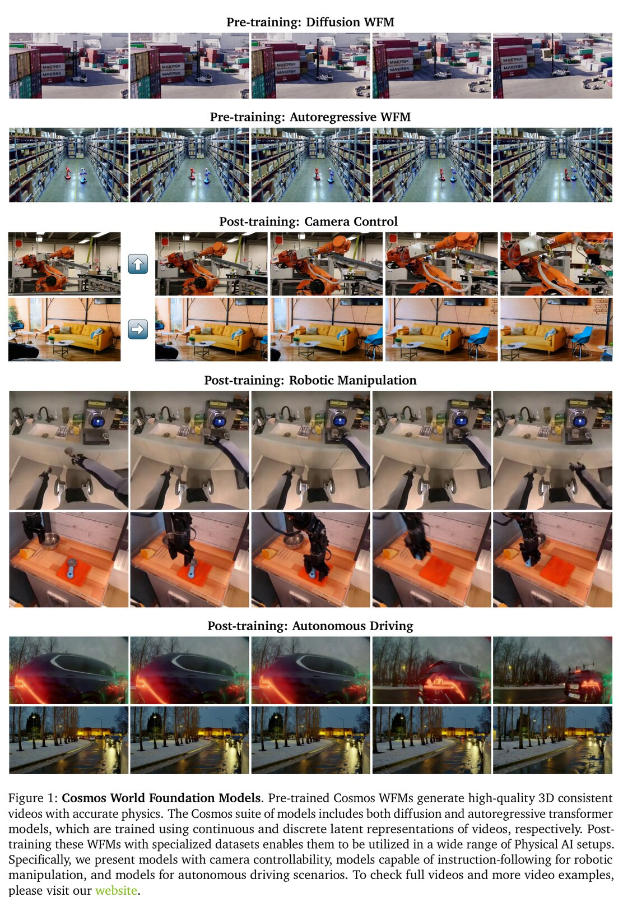{ width="620" }
  <figcaption>Figure 1</figcaption>
</figure>

### 1.3 WFM의 형식적 정의

<figure markdown="span">
  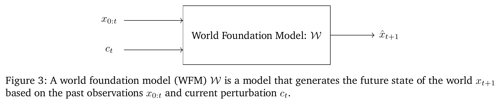{ width="820" }
  <figcaption>Figure 3</figcaption>
</figure>

시각 $0$부터 $t$까지의 관측 시퀀스(RGB 비디오)를 $x_{0:t}$, 현재 시점의 행동을 $c_t$라 하면 WFM $\mathcal{W}$는 다음과 같다.

$$
\mathcal{W} : (x_{0:t},\, c_t) \;\longmapsto\; \hat{x}_{t+1}
$$

WFM은 본질적으로 조건부 미래 예측기다. $c_t$ 자리에는 로봇의 관절 명령이 올 수도, 차량의 trajectory가 올 수도, 자연어 instruction이 올 수도 있다. 뒤에 나오는 diffusion / autoregressive, Text2World / Video2World는 모두 이 정의를 어떻게 구현하느냐의 차이다.

### 1.4 Pre-training → Post-training

<figure markdown="span">
  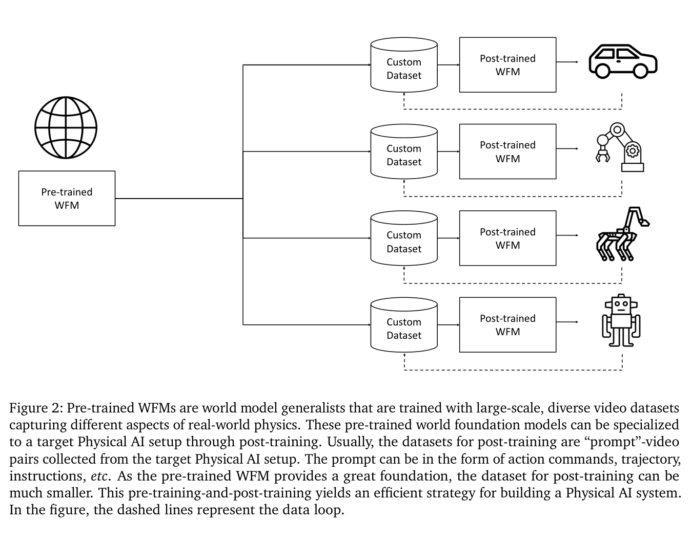{ width="620" }
  <figcaption>Figure 2</figcaption>
</figure>

Cosmos는 LLM과 같은 두 단계 패러다임을 따른다. Pre-trained WFM은 generalist로, 대규모·다양한 비디오를 학습해 현실 세계의 물리와 자연스러운 행동에 대한 일반 지식을 갖춘다. Post-trained WFM은 specialist로, 실제 적용할 target 환경의 prompt–video 쌍으로 fine-tune한다. 이때 prompt는 action command, trajectory, instruction 등이 된다.

### 1.5 플랫폼을 이루는 5개 모듈

<figure markdown="span">
  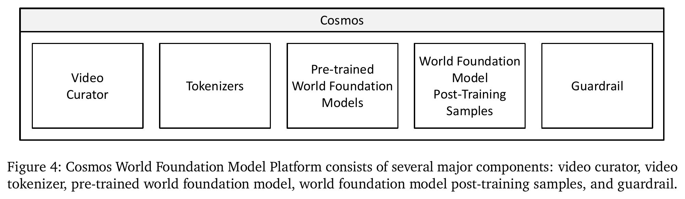{ width="880" }
  <figcaption>Figure 4</figcaption>
</figure>

1. Video curator — 원시 영상을 학습용 클립으로 가공
2. Video tokenizer — causal tokenizer로 비디오를 토큰으로 압축
3. WFM pre-training — diffusion과 autoregressive 두 방식
4. Post-training — camera, robotic, driving 응용
5. Guardrail — 입력·출력 안전 필터

아래에서도 이 순서로 살펴본다.

## 2. Data Curation

### 2.1 파이프라인과 규모

<figure markdown="span">
  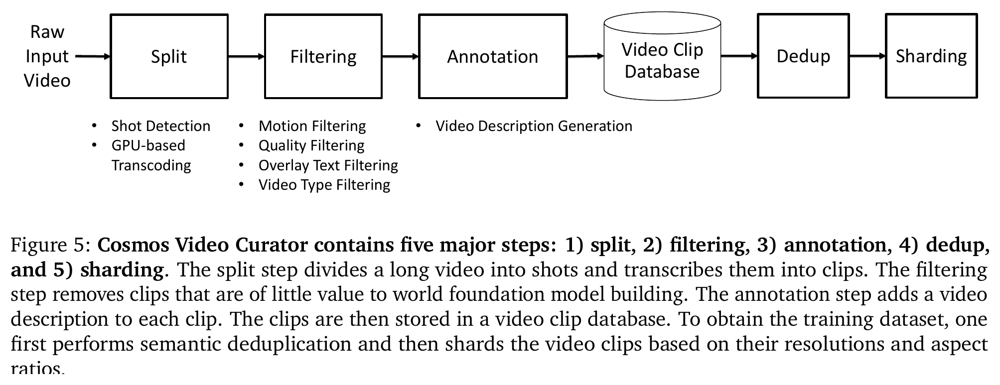{ width="880" }
  <figcaption>Figure 5</figcaption>
</figure>

큐레이션은 다섯 단계다. 긴 영상을 split하면서 transcoding하고, filtering으로 거른 다음, annotation으로 캡션을 붙이고, 이렇게 만든 Video Clip 데이터베이스에서 중복을 제거하는 dedup을 거쳐, 마지막으로 학습에 바로 쓸 수 있게 sharding한다. 전체 파이프라인은 Ray 기반 스트리밍으로 분산 처리된다.

규모를 보면 원본 약 2천만 시간 분량의 영상에서 출발해 사전학습용 약 1억 개 클립, fine-tuning용 약 1천만 개 클립을 만들어 낸다. 도메인은 아홉 개 카테고리로 구성된다.

| 카테고리 | 비중 | 카테고리 | 비중 |
|---|:--:|---|:--:|
| Nature dynamics | 20% | Hand motion & object manipulation | 16% |
| Spatial awareness & navigation | 16% | Driving | 11% |
| Human motion & activity | 10% | First person point-of-view | 8% |
| Dynamic camera movements | 8% | Synthetically rendered | 4% |
| Others | 7% | | |

### 2.2 Split & Filtering

<figure markdown="span">
  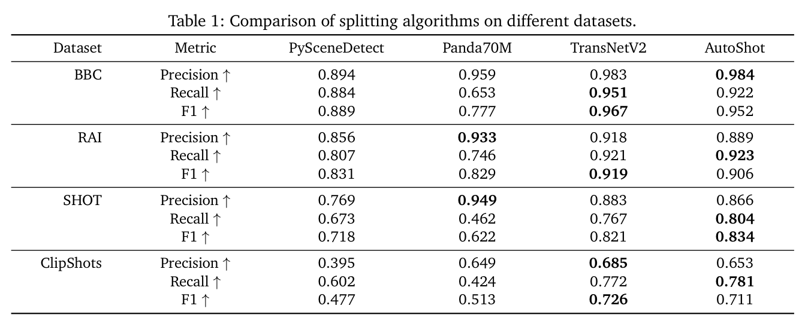{ width="620" }
  <figcaption>Table 1</figcaption>
</figure>

Split(shot detection)은 긴 영상을 장면 전환이 없는 shot 단위로 자르는 작업이다. 2초 미만은 버리고 60초를 넘으면 다시 나눈다. RAI, BBC, ClipShots, SHOT 벤치마크에서 heuristic 방식보다 학습 모델을 쓰는 쪽이 우수해 TransNetV2를 채택했다.

그다음 네 종류의 필터를 목적별로 적용한다.

- Motion 필터 — 정지나 손떨림처럼 못 쓰는 움직임을 제거하고, 동시에 카메라 모션을 태깅한다.
- Visual Quality 필터 — blur, 노이즈, 노출 불량 같은 저화질 클립을 거른다.
- Text Overlay 필터 — 후처리로 덧붙은 과도한 자막이나 텍스트가 있는 영상을 제거한다.
- Video Type 필터 — 콘텐츠 유형별로 학습 데이터 분포를 조정한다. 게임이나 애니메이션처럼 현실 물리와 다른 영상은 제외하고, 중요한 유형은 upsample한다.

### 2.3 Annotation · Dedup · Sharding

Annotation 단계에서는 각 클립에 일관된 상세 캡션을 생성한다. video captioning 모델 VILA-13B를 쓰며, 8프레임을 입력받아 평균 559자, 97단어 정도의 캡션을 만든다. alt-text에 의존하지 않고 영상에서 관측되는 사실 중심으로 묘사하게 한다.

Deduplication은 중복과 근접 중복을 제거해 분포 균형을 맞추고 암기를 방지한다. InternVideo2로 각 클립의 임베딩을 뽑고 k-means(k = 10,000)로 클러스터링해 약 30%를 제거했다.

Sharding은 trainer가 바로 학습에 쓸 수 있는 webdataset 형태로 해상도, 종횡비, 길이별로 패키징하는 단계다.

## 3. Cosmos Tokenizer

### 3.1 토크나이저의 역할

<figure markdown="span">
  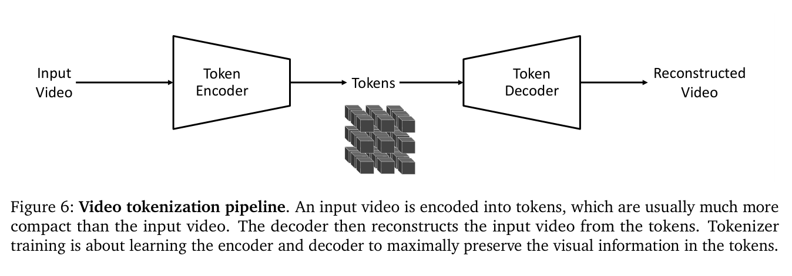{ width="620" }
  <figcaption>Figure 6</figcaption>
</figure>

토크나이저는 현대 대규모 모델의 기본 구성요소다. 이미지나 비디오 같은 원시 시각 데이터는 중복이 매우 많은데, 이를 압축된 semantic token으로 변환하는 역할을 한다. 이 잠재 공간은 unsupervised로 학습된다.

효과는 두 가지다. 대규모 transformer를 효율적으로 학습할 수 있게 해 주고, 제한된 자원에서도 추론을 가능하게 해 접근성을 넓힌다.

### 3.2 출력 토큰 두 종류

<figure markdown="span">
  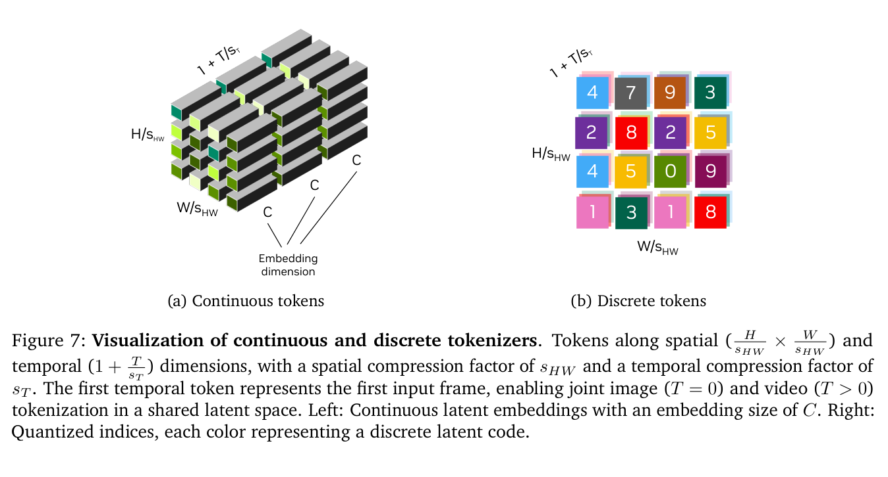{ width="560" }
  <figcaption>Figure 7</figcaption>
</figure>

| | Continuous Token | Discrete Token |
|---|---|---|
| 표현 | 연속 latent embedding | 양자화된 정수 index |
| 대상 모델 | latent diffusion (Stable Diffusion, VideoLDM) | autoregressive (GPT 방식) |
| 장점 | 표현이 정밀해 reconstruction 품질이 높음 | LLM·멀티모달과 통합이 쉬움 |
| 단점 | 이산 모델에 직접 쓸 수 없음 | 양자화 과정에서 정보 손실 |

토크나이저가 두 개인 것이 아니라, 하나의 토크나이저 설계가 용도에 따라 두 종류의 토큰을 낸다.

### 3.3 Architecture

전체 구조는 encoder–decoder다.

$$
\hat{x} = \mathcal{D}(\mathcal{E}(x))
$$

Encoder $\mathcal{E}$는 입력 비디오 $(1+T) \times H \times W \times 3$ 를 token $(1+T') \times H' \times W' \times C$ 로 압축한다. 공간 압축 인자는 $s_{HW} = H/H' = W/W'$, 시간 압축 인자는 $s_T = T/T'$ 이다. Decoder $\mathcal{D}$는 token으로부터 입력과 동일한 shape의 비디오를 재구성한다.

단일 통합 네트워크로 이미지와 비디오를 함께 처리하며, 핵심 설계는 두 가지다.

#### Temporal Causality

<figure markdown="span">
  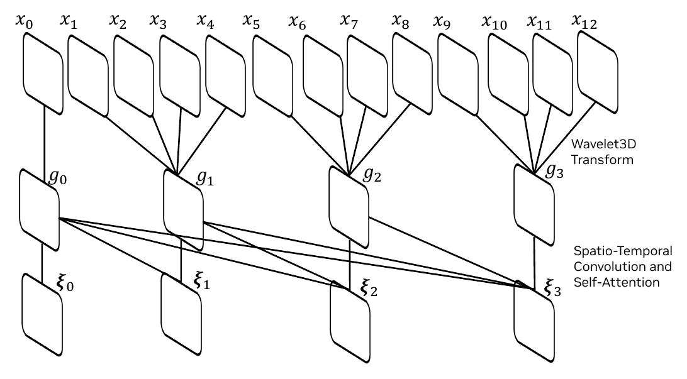{ width="620" }
  <figcaption>Figure 9(a)</figcaption>
</figure>

입력을 먼저 2-level wavelet transform으로 처리해 $x$, $y$, $t$ 축을 각각 $1/4$로 다운샘플한다. 그다음 프레임을 그룹으로 묶는데, 첫 프레임 $x_0$는 단독으로 $g_0$가 된다.

$$
\{x_0,\, x_{1:4},\, x_{5:8},\, \dots\} \;\rightarrow\; \{g_0,\, g_1,\, g_2,\, \dots\}
$$

첫 프레임을 따로 떼어 두기 때문에 시간 길이가 0인 이미지($T = 0$)도 같은 방식으로 처리할 수 있다. 이후 인코더 단계는 인과적으로 동작한다.

$$
\{g_0,\, g_{0:1},\, g_{0:2},\, \dots\} \;\rightarrow\; \{\xi_0,\, \xi_1,\, \xi_2,\, \dots\}
$$

각 $\xi_i$는 현재까지의 $g$만 참조하고 미래 프레임은 보지 않는다.

#### Encoder–Decoder 블록과 Latent

<figure markdown="span">
  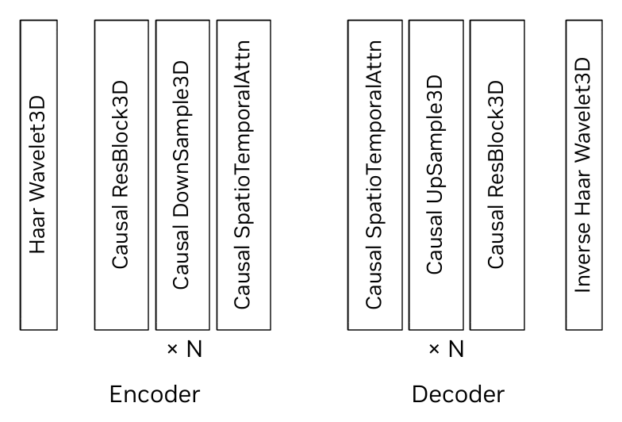{ width="440" }
  <figcaption>Figure 9(b)</figcaption>
</figure>

인코더는 residual block과 downsampling block이 번갈아 나오는 구조다.

- Factorized 3D conv — 3D 합성곱을 공간 $(1 \times k \times k)$ 과 시간 $(k \times 1 \times 1)$ 두 단계로 분리해 연산량과 파라미터를 줄인다.
- Left padding $k-1$ — 시간축 앞쪽에만 패딩을 줘서 각 시점이 과거만 참조하게 만든다.
- Causal self-attention — 어텐션 단계에서도 미래 정보가 새지 않도록 마스킹하며, 장거리 의존성을 담당한다.
- Swish 활성화와 LayerNorm — GroupNorm 대신 LayerNorm을 써서 값이 폭주하는 것을 막는다.
- Decoder — 인코더를 미러링해 downsample을 upsample로 바꾸고, 마지막에 inverse Haar wavelet으로 픽셀 공간을 복원한다.

Latent 설계는 두 갈래다. continuous 쪽은 vanilla AE로 latent dimension 16을 쓰고, discrete 쪽은 FSQ(Finite-Scalar-Quantization)로 6차원 latent를 $(8, 8, 8, 5, 5, 5)$ level로 양자화한다. 이는 $8 \times 8 \times 8 \times 5 \times 5 \times 5 = 64{,}000$ 의 vocabulary size에 해당한다.

### 3.4 Training Strategy

이미지와 비디오를 정해진 빈도로 번갈아 학습하는 joint training을 쓰고, decoder의 최종 출력만 supervise한다.

auxiliary loss는 쓰지 않는다. VAE 대신 vanilla AE를 쓰기 때문에 KL prior loss가 필요 없고, VQ-VAE 대신 FSQ를 쓰기 때문에 commitment loss도 필요 없다. latent space에 붙는 부가 손실 없이 재구성 품질에만 집중할 수 있다.

학습은 2단계다. Stage 1에서 L1 loss(픽셀 RGB 차이)와 perceptual loss(VGG-19 feature)를 쓰고, Stage 2에서 optical flow loss(시간적 매끄러움), gram-matrix loss(선명도), adversarial loss(고압축 fine-tune)를 추가한다.

압축률은 이미지가 $8\times8$, $16\times16$, 비디오가 $4\times8\times8$, $8\times8\times8$, $8\times16\times16$ 설정을 제공한다.

### 3.5 Results

<figure markdown="span">
  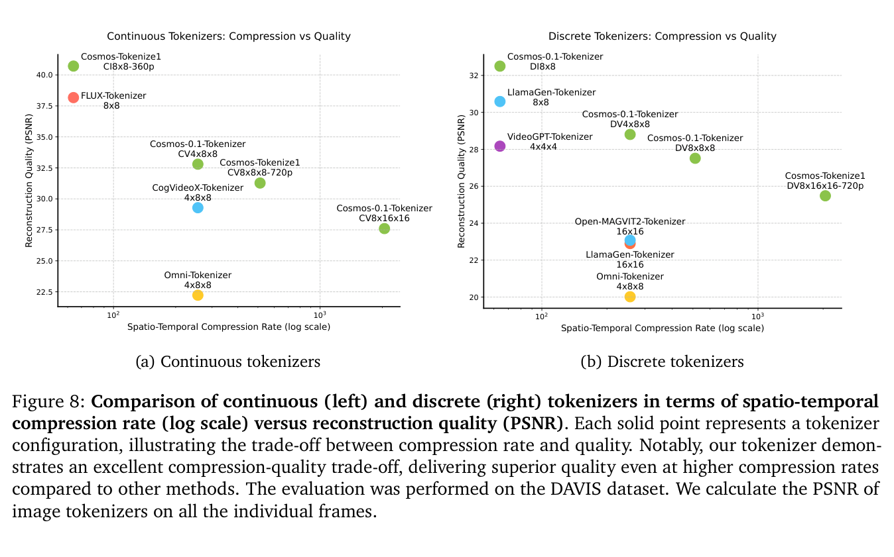{ width="600" }
  <figcaption>Figure 8</figcaption>
</figure>

<figure markdown="span">
  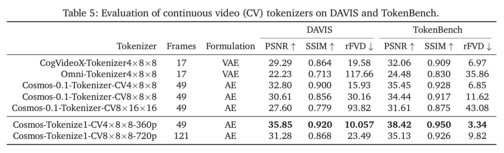{ width="680" }
  <figcaption>Table 5</figcaption>
</figure>

벤치마크는 MS-COCO 5k, ImageNet 50k, DAVIS 1080p, 그리고 논문에서 새로 구성한 TokenBench 500을 쓴다. TokenBench는 BDD100K, EgoExo-4D, BridgeData V2, Panda-70M에서 각 100개를 뽑아 앞 10초를 1080p로 자른 것이다. 지표는 PSNR과 SSIM이 높을수록 좋고, 이미지의 rFID와 비디오의 rFVD는 낮을수록 좋다.

- 비디오 $4\times8\times8$ 설정에서 DAVIS와 TokenBench 전 지표 SOTA를 달성했고, DAVIS 기준 PSNR이 약 4 dB 더 높다.
- 더 높은 압축률인 $8\times8\times8$, $8\times16\times16$ 에서도 기존 SOTA를 능가한다.
- 이미지도 $8\times8$ 에서 SOTA이며, 4배 더 압축한 $16\times16$ 이 기존 $8\times8$ 수준을 유지한다.

## 4. Pre-trained World Foundation Model

### 4.1 두 가지 생성 방식

Pre-trained WFM은 대규모 비디오로 학습한 generalist다. 논문은 두 가지 생성 방식으로 WFM을 구축하며, 둘 다 transformer 기반이다. 각 방식 모두 텍스트만 입력받는 Text2World를 base로 만든 뒤, 여기에 비디오 입력을 더한 Video2World로 확장한다.

| | Diffusion WFM | Autoregressive WFM |
|---|---|---|
| 입력 토큰 | Continuous (CV8×8×8) | Discrete (DV8×16×16) |
| 학습 목표 | denoising score matching | next-token prediction (NLL) |
| Base 모델 | 7B · 14B Text2World | 4B · 12B |
| Video2World | 7B · 14B | 5B · 13B (cross-attention 추가) |
| 텍스트 조건 | T5-XXL cross-attention | T5 cross-attention (instruction tuning에서 추가) |

### 4.2 Diffusion WFM

#### 손실 함수

완전한 노이즈 상태에서 출발해 텍스트 가이드에 따라 노이즈를 점차 제거하면서 비디오로 만들어 간다. 학습은 EDM(Karras et al., 2022) 방식을 따른다. noise level $\sigma$에서 denoiser $D_\theta$에 대한 denoising score matching loss는 다음과 같다.

$$
\mathcal{L}(D_\theta, \sigma) = \mathbb{E}_{x_0, n}\Big[\big\lVert D_\theta(x_0 + n;\, \sigma) - x_0 \big\rVert_2^2\Big]
$$

$x_0 \sim p_{\text{data}}$ 는 깨끗한 이미지나 비디오, $n \sim \mathcal{N}(0, \sigma^2 I)$ 는 i.i.d. Gaussian noise다. 전체 학습 loss는 noise level에 대한 가중 기댓값으로 정의된다.

$$
\mathcal{L}(D_\theta) = \mathbb{E}_{\sigma}\left[\frac{\lambda(\sigma)}{e^{u(\sigma)}}\,\mathcal{L}(D_\theta, \sigma) + u(\sigma)\right],
\qquad
\lambda(\sigma) = \frac{\sigma^2 + \sigma_{\text{data}}^2}{(\sigma \cdot \sigma_{\text{data}})^2}
$$

두 가중 항의 역할이 다르다. $\lambda(\sigma)$는 학습 초기에 모든 noise level이 동등하게 기여하도록 보장하는데, 학습이 진행되면 이 균형이 무너진다. 그래서 $u(\sigma)$를 도입해 각 noise level에서의 예측 난이도를 모델이 스스로 학습하게 한다. 간단한 MLP로 매개변수화하며, 모델이 불확실한 noise level일수록 $u(\sigma)$가 커지고 그만큼 loss 기여가 낮아진다. 동시에 $+u(\sigma)$ 항이 페널티로 작동해 불확실성이 무한정 커지는 것을 막는다.

#### Architecture

<figure markdown="span">
  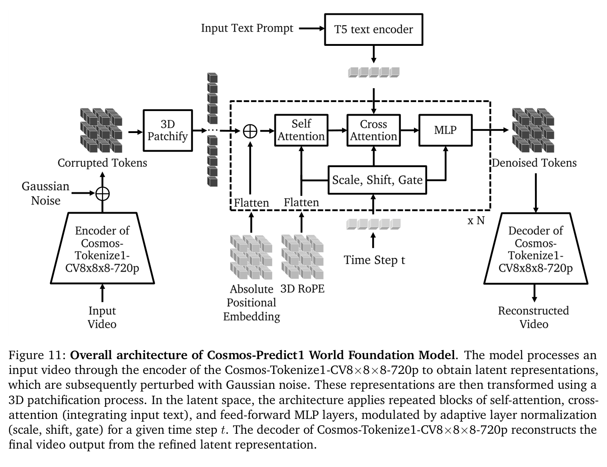{ width="620" }
  <figcaption>Figure 11</figcaption>
</figure>

1. Video Tokenization — Cosmos tokenizer 인코더로 비디오를 Continuous Token $(T' \times H' \times W' \times 16)$ 으로 압축해 transformer 연산량을 줄인다.
2. 3D Patchification — $(p_t, p_h, p_w) = (1, 2, 2)$ 로 비중첩 패치를 만들고 linear projection을 거쳐 $L \times D$ 토큰 시퀀스로 만든다.
3. Gaussian Noise Prediction — transformer block을 $N$번 반복한다.
4. Video Reconstruction — 노이즈가 제거된 토큰을 tokenizer 디코더로 다시 비디오 프레임으로 복원한다.

#### Gaussian Noise Prediction Block

<figure markdown="span">
  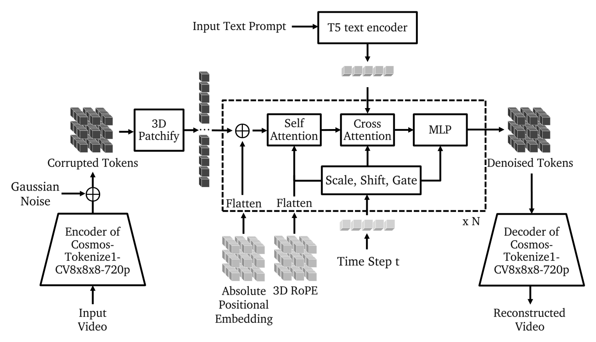{ width="520" }
  <figcaption>Figure 11</figcaption>
</figure>

- Absolute Positional Embedding — 학습 가능한 절대 위치 정보를 주입한다.
- AdaLN — 현재 노이즈 레벨로부터 scale, shift, gate 값을 생성해 블록 동작을 변조한다. 노이즈가 높을 때는 포괄적인 패턴을, 낮을 때는 세부적인 패턴을 분석하도록 유도한다.
- Self-Attention — RMS Norm과 FPS-aware 3D RoPE를 쓴다. 토큰 채널을 시간, 높이, 너비 3축으로 나누고 비디오의 FPS를 반영해 프레임 사이의 실제 시간 간격까지 위치 인코딩에 담는다.
- Cross-Attention — T5-XXL 텍스트 임베딩을 Key/Value로 써서 노이즈 패턴을 텍스트 가이드에 맞춰 해석한다.
- MLP — 각 토큰의 특징을 정제한다.

여기에 AdaLN-LoRA가 더해진다. AdaLN layer는 파라미터를 많이 차지하면서 FLOPs 기여는 적은데, 이 dense linear projection을 low-rank 근사로 분해해 11B에서 7B로 파라미터를 36% 줄이면서 모든 평가 지표에서 성능을 유지했다.

#### Training Strategy

1. Joint Image & Video Training — 이미지와 비디오 배치를 번갈아 학습하되, domain-specific normalization으로 두 분포 차이를 줄인다.
2. Noise Scaling for Video — 비디오 배치의 noise level을 프레임 수의 제곱근만큼 키운다. 비디오는 시간적 중복이 커서 gradient가 작고 수렴이 느린데, 이를 보정하기 위함이다.
3. Progressive Training — 저해상도·짧은 프레임에서 고해상도·긴 프레임으로 점진적으로 확대한다.
4. Multi-Aspect Training — 5개 종횡비 bucket(1:1, 3:4, 4:3, 9:16, 16:9)을 써서 원본 비율을 보존한다.
5. Text Conditioning — T5-XXL 임베딩을 512 길이로 zero-padding해 쓰고, classifier-free guidance로 텍스트 추종 능력을 강화한다.
6. Video2World Conditioning — 조건 프레임에는 약한 augmented noise를, 타겟 프레임에는 gaussian noise를 준다. 조건 프레임과 생성 프레임을 구분하는 binary mask를 채널 방향으로 concat하고, loss는 생성된 출력에만 적용한다. 학습 중 조건 프레임 수를 무작위로 바꿔 일반화를 높인다.

#### Prompt Upsampler

학습에 쓴 prompt는 VLM이 만든 길고 상세한 캡션인데 실제 사용자가 입력하는 prompt는 짧다. 이 분포 차이를 메우는 것이 prompt upsampler다.

Text2World용으로는 Mistral-NeMo-12B를 fine-tune한다. 학습용 긴 prompt와 그 비디오로부터 VLM이 짧은 캡션을 만드는 long-to-short 방식으로 쌍 데이터를 얻는데, 이렇게 하면 원본 학습 분포를 보존하면서 짧은 prompt와 긴 prompt 사이의 충실도도 확보된다. Video2World용으로는 Pixtral-12B를 추가 학습 없이 그대로 써서, 조건 프레임과 짧은 텍스트로부터 상세한 prompt를 생성한다.

### 4.3 Autoregressive WFM

#### 개요

과거 정보를 기반으로 미래 정보를 순차적으로 예측하며, causal하게 동작한다. 학습할 때는 condition인 과거 프레임과 ground-truth인 미래 프레임을 함께 입력하되, causal masking으로 미래를 차단하고 teacher forcing으로 이전 정답을 입력에 넣어 오차 누적을 방지한다. 손실은 next-token prediction의 NLL이다.

$$
\mathcal{L}_{\text{NLL}} = -\sum_{i} \log P(v_i \mid v_1, \dots, v_{i-1})
$$

Llama3 스타일 GPT 구조를 비디오 예측용으로 처음부터 학습하며, base 모델은 언어 이해 능력을 갖고 있지 않다.

#### Architecture

<figure markdown="span">
  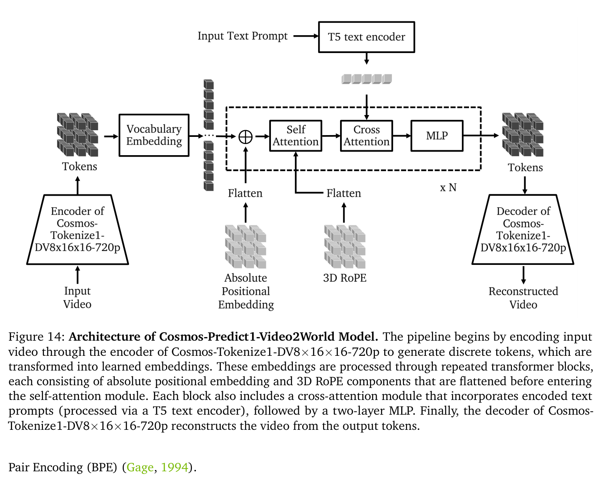{ width="560" }
  <figcaption>Figure 14</figcaption>
</figure>

1. Tokenization과 Vocabulary Embedding — tokenizer로 Discrete Token(FSQ 정수 6개)을 만들고, flatten한 뒤 64,000 크기의 vocabulary table을 거쳐 $L \times D$ 시퀀스로 만든다.
2. Positional Encoding — 상대 위치용으로 3D RoPE에 YaRN을 더해 학습 때보다 긴 시퀀스에서도 위치 인코딩이 무너지지 않게 하고, 절대 위치용으로 sinusoidal APE를 함께 쓴다.
3. Causal Feature Extraction — QK-Norm, causal-masked self-attention, cross-attention, MLP로 구성된 block이 $N$번 반복된다.
4. Sequential Prediction — linear로 64,000차원을 만들고 softmax로 다음 토큰을 뽑아 cross-entropy로 학습한다.

#### Training Strategy

텍스트 없이 비디오만으로 학습하는 text-free training부터 시작한다. Stage 1에서 조건 1프레임으로 미래 16프레임을 예측해 총 17프레임을 다루고, Stage 2에서 34프레임까지 확장해 물리적 흐름을 자율적으로 학습하게 한다.

그다음 instruction tuning 단계에서 cross-attention 모듈을 추가해 텍스트와 비디오의 상관관계를 학습한다. 이미지 데이터도 함께 써서 공간적 특성에 대한 이해를 강화한다.

#### Diffusion Decoder

<figure markdown="span">
  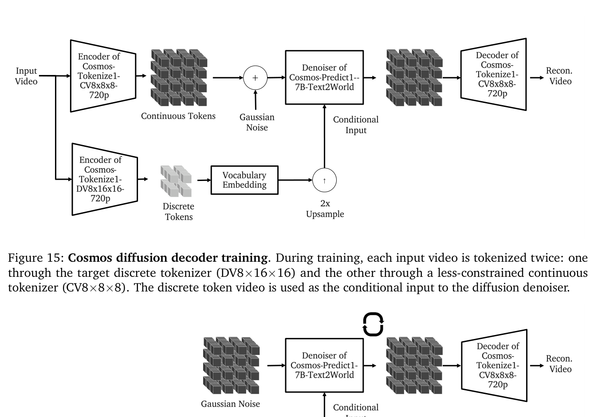{ width="620" }
  <figcaption>Figure 15</figcaption>
</figure>

Discrete Token은 비디오를 소수의 정수로 압축하기 때문에 복원할 때 정보 손실이 생겨 결과가 흐릿해진다. 이를 해결하는 것이 diffusion decoder로, diffusion 기반 Text2World(7B)를 fine-tune해 만든다.

학습할 때는 입력 비디오를 Continuous Token과 Discrete Token으로 동시에 만들고, Discrete Token을 조건 입력으로 줘서 노이즈가 섞인 Continuous Token의 노이즈를 제거하도록 한다. Discrete Token 쪽에는 노이즈를 주지 않으므로 denoiser는 조건 입력에 담긴 정보를 활용하는 법을 배우게 된다.

추론할 때는 autoregressive 모델이 Discrete Token을 예측하면 diffusion decoder가 이를 Continuous Token으로 바꾸고, 마지막으로 tokenizer 디코더가 RGB 프레임을 복원한다.

### 4.4 생성 결과

<figure markdown="span">
  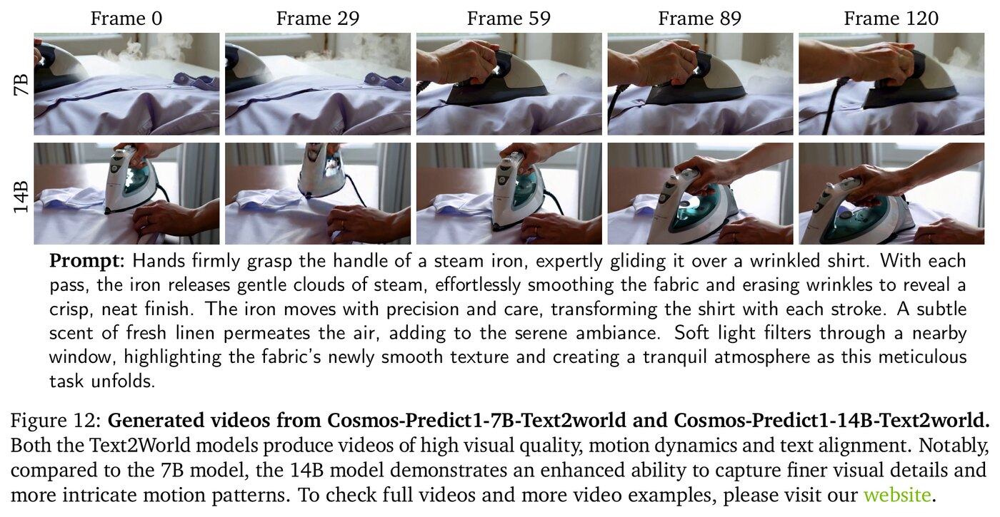{ width="720" }
  <figcaption>Figure 12</figcaption>
</figure>

<figure markdown="span">
  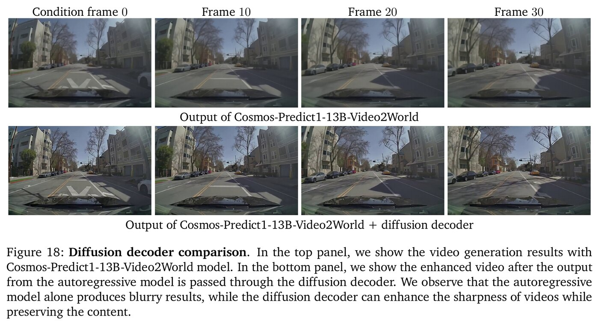{ width="720" }
  <figcaption>Figure 18</figcaption>
</figure>

Diffusion Text2World는 7B와 14B 모두 높은 시각 품질과 모션, 텍스트 정합성을 보이는데, 14B가 더 세밀한 디테일과 복잡한 모션을 생성한다. Autoregressive는 12B가 4B보다 선명도와 모션이 좋고, diffusion decoder가 흐린 출력을 내용은 보존하면서 선명하게 만들어 준다.

다만 autoregressive에는 한계가 있다. 이전 프레임에 없던 물체가 갑자기 등장하는 경우를 정확히 묘사하지 못한다. 과거 토큰만으로 다음을 예측하는 구조라 예고 없이 등장하는 대상은 예측할 근거가 없기 때문이다.

### 4.5 Evaluation ① — 3D Consistency

<figure markdown="span">
  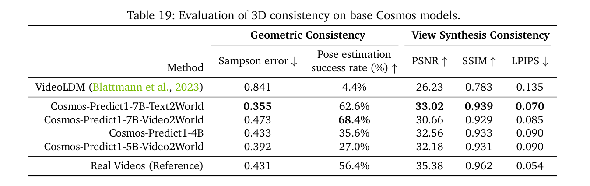{ width="660" }
  <figcaption>Table 19</figcaption>
</figure>

정적 장면인 RealEstate10K 500개를 쓰고 baseline은 VideoLDM이다. 두 축으로 측정한다.

Geometric consistency는 SuperPoint와 LightGlue로 프레임 간 특징을 매칭하고 RANSAC으로 fundamental matrix를 추정한 뒤 Sampson error를 계산한다. 이 값은 낮을수록 좋고, 함께 보는 camera pose 추정 성공률은 높을수록 좋다. View synthesis consistency는 8프레임을 holdout하고 3D Gaussian splatting으로 재구성해 PSNR, SSIM, LPIPS를 측정한다.

결과를 보면 Cosmos가 VideoLDM을 크게 앞서고 real video 수준에 근접한다. 7B Text2World의 Sampson error가 0.355, PSNR이 33.02이고, 7B Video2World의 pose 성공률은 68.4%로 real video의 56.4%보다도 높다.

### 4.6 Evaluation ② — Physics Alignment

<figure markdown="span">
  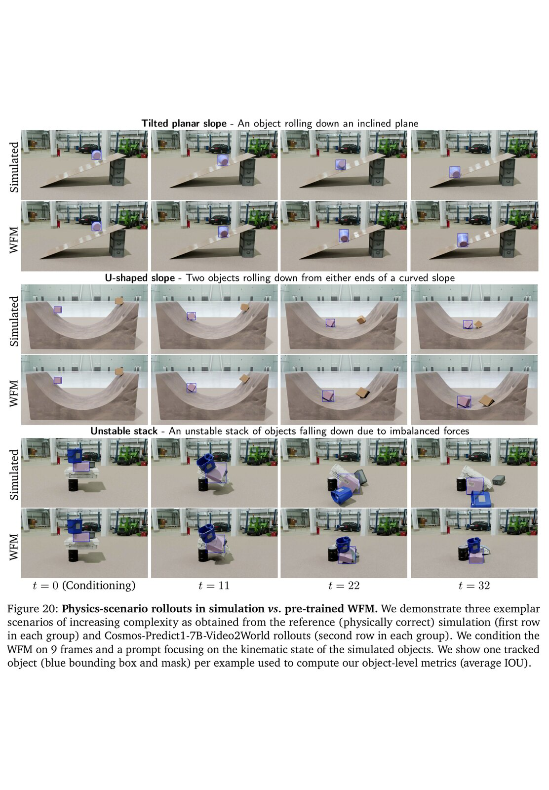{ width="620" }
  <figcaption>Figure 20</figcaption>
</figure>

과거 관측 프레임을 조건으로 준 뒤 미래를 예측하게 하고, 그 예측이 물리 법칙을 지키는지 평가한다. 데이터는 PhysX와 Isaac Sim으로 만든 8개 시나리오(낙하, 경사, U자 슬로프, 안정·불안정 스택, 도미노, 시소, 자이로) 800개를 1080p로 쓴다. 지표는 픽셀 단위의 PSNR과 SSIM, feature 단위의 DreamSim, object 단위로 SAMURAI 트래킹의 IoU를 33프레임에 대해 측정한다.

관찰 결과는 다음과 같다.

- 조건 프레임이 9개일 때가 1개일 때보다 좋다. 과거 맥락을 많이 줄수록 예측 물리가 정확해진다.
- 같은 9프레임 조건에서 픽셀 지표 기준으로는 diffusion이 autoregressive보다 낫다.
- 두 방식 공통으로 물체가 사라지는 object impermanence 문제와 중력 위반이 관찰된다.

## 5. Post-trained World Foundation Model

<figure markdown="span">
  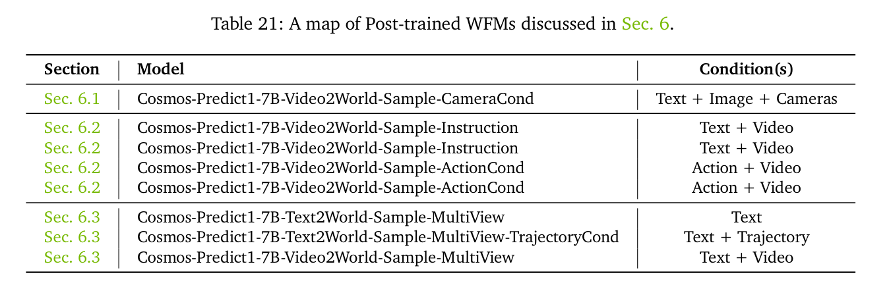{ width="700" }
  <figcaption>Table 21</figcaption>
</figure>

pre-trained WFM을 특정 Physical AI 환경에 fine-tune해 specialist를 만드는 단계다. 세 가지 응용을 dataset, fine-tuning, evaluation 순으로 살펴본다. 모델명에 붙은 `-Sample-`은 샘플 응용 사례라는 뜻으로, 실제 적용할 때는 사용자가 자기 데이터로 다시 학습해야 한다.

### 5.1 Camera Control

이미지와 카메라 pose 변화 정보를 받아 각 pose에 맞는 3D 공간을 비디오로 생성하는 과제다. Physical AI 학습 데이터를 만드는 토대가 된다.

데이터셋은 DL3DV-10K를 쓴다. 정적인 공간을 다양한 카메라 위치와 각도로 촬영한 데이터로, VLM으로 장소 묘사 텍스트를 만들고 클립당 256프레임을 샘플링한 뒤 GLOMAP으로 각 프레임의 카메라 pose를 계산한다. 데이터는 (256프레임, 텍스트, 256 pose)로 구성되며, 첫 프레임을 기준점 0으로 두고 이후는 상대 좌표로 표현한다.

Fine-tuning은 Video2World 기반으로 하며, 해상도 704×1280에 57프레임(첫 프레임 조건 + 56 타겟)이다. 카메라 pose는 Plücker embedding으로 주입한다.

$$
r = (d,\, m), \qquad m = c \times d
$$

$c$는 상대 좌표, $d$는 픽셀별 단위 방향 벡터다. 16채널 latent에 6채널 Plücker를 채널 방향으로 concat해 22채널로 만든다. 각 토큰이 어디에서 어느 방향을 보고 있는지를 나타내는 지문 역할을 한다.

<figure markdown="span">
  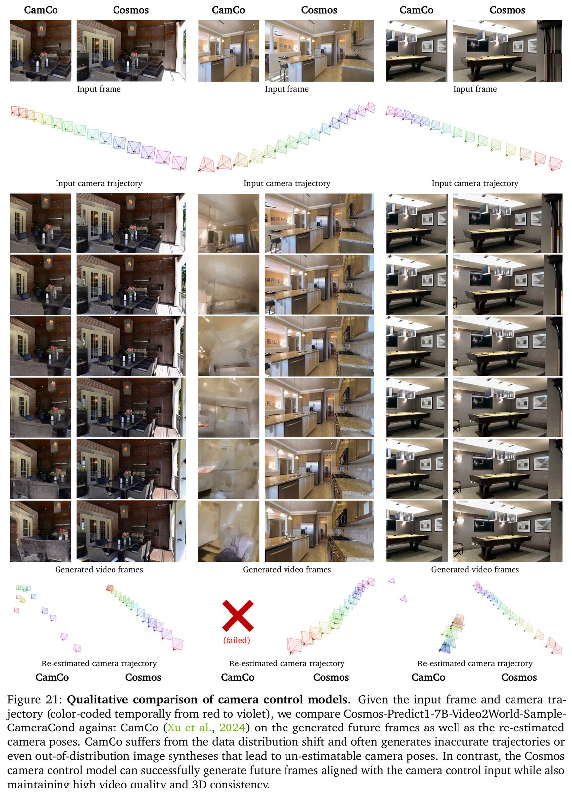{ width="560" }
  <figcaption>Figure 21</figcaption>
</figure>

<figure markdown="span">
  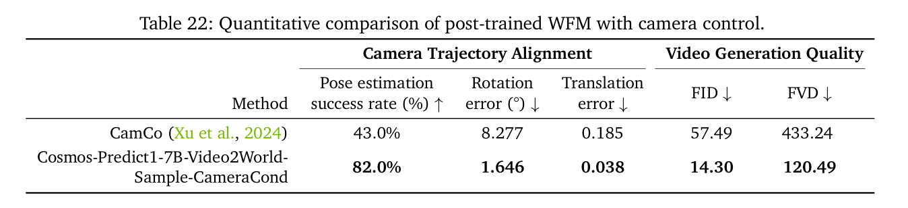{ width="640" }
  <figcaption>Table 22</figcaption>
</figure>

평가는 camera-controllable 생성의 SOTA인 CamCo를 baseline으로 두고, 공정한 비교를 위해 256×256, 14프레임으로 맞춘다. 테스트는 RealEstate10K 500개를 쓰는데, 학습에 쓴 DL3DV와는 다른 데이터다. 지표는 화질을 보는 FID·FVD와, SfM으로 생성 프레임의 pose를 재추정해 얻는 rotation·translation error다.

결과는 FID와 FVD가 약 4배 낮고, rotation과 translation 오차가 약 6배 우수하며, pose 추정 성공률도 82% 대 43%로 앞선다.

### 5.2 Robotic Manipulation

두 가지 활용 방식이 있다. instruction-based는 텍스트 지시를 입력받아 그 지시를 따르는 비디오를 예측하고, action-based는 7차원 벡터 $(\Delta x, \Delta y, \Delta z, \Delta\theta_r, \Delta\theta_p, \Delta\theta_y, \Delta\text{Gripper})$ 를 입력받아 다음 프레임을 예측한다.

데이터셋은 두 가지다. Cosmos-1X는 휴머노이드의 1인칭 시점으로 책 정리, 옷 개기, 청소 같은 지시 라벨이 있고, Bridge는 로봇팔의 3인칭 주방 동작이다.

Fine-tuning을 보면, instruction 방식은 이미 텍스트와 이미지를 처리하는 구조이기 때문에 구조 변경 없이 데이터만 교체하면 된다. 반면 action은 학습에 없던 새로운 modality라 구조를 바꿔야 한다. autoregressive에서는 text encoder를 action embedder MLP로 대체해 cross-attention 입력으로 쓰고, diffusion에서는 action을 MLP로 변환한 뒤 time step에 더해 AdaLN에 주입한다. 이 경우 action이 $N$개면 $N$번 추론한다.

<figure markdown="span">
  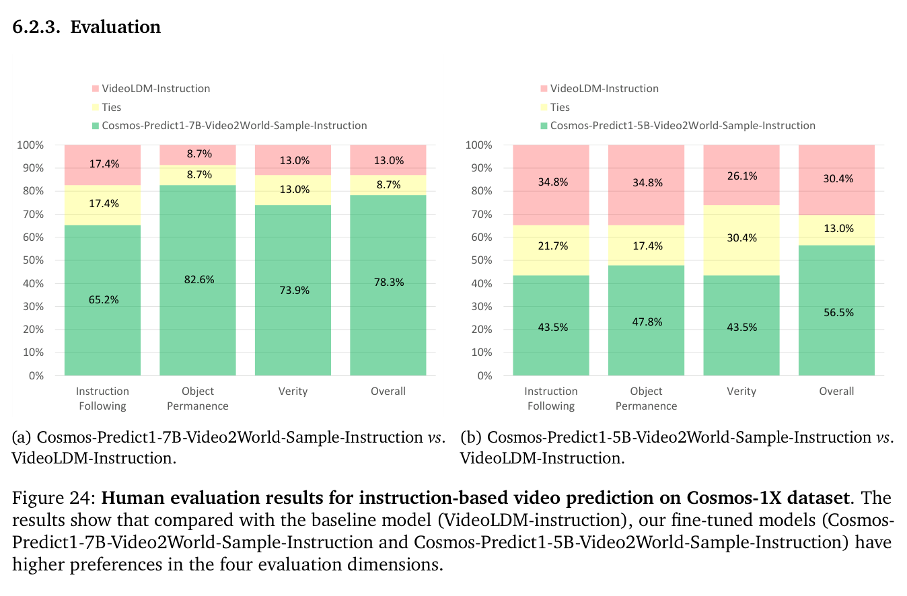{ width="620" }
  <figcaption>Figure 24</figcaption>
</figure>

<figure markdown="span">
  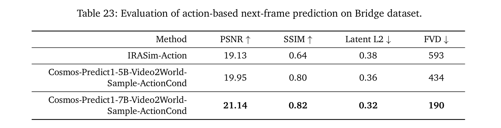{ width="640" }
  <figcaption>Table 23</figcaption>
</figure>

instruction 방식은 baseline을 VideoLDM으로 두고 23개 샘플에 대해 평가자 10명이 blind로 비교하는데, instruction following, object permanence, verity, overall 네 가지 기준을 본다. 결과는 diffusion이 압도적으로 우위이고 autoregressive는 VideoLDM과 비슷하거나 소폭 우위다. action 방식은 baseline을 IRASim으로 두고 100개 샘플에 대해 PSNR, SSIM, latent L2, FVD를 측정하는데 Cosmos 두 모델 모두 우위다.

논문은 그 이유를 continuous token을 쓰는 diffusion이 정보 밀도가 높아 생성 품질에서 유리하기 때문으로 설명한다.

### 5.3 Autonomous Driving

자율주행은 사각지대 없이 주변을 인지해야 하므로 6개 카메라 뷰를 동시에 처리하는 multi-view 모델이 필요하다.

데이터셋은 NVIDIA 내부의 RDS를 쓰는데, 6개 뷰 영상에 ego-motion(trajectory)과 뷰별 텍스트가 함께 있다.

Fine-tuning은 7B Text2World를 기반으로 세 가지를 만든다. MultiView는 텍스트로 6개 뷰를 생성하고, 여기에 trajectory condition을 더한 모델은 ego-motion에서 64개 3D point(초기 위치 $(0,0,0)$ 부터 0.1초 간격)를 뽑아 trajectory MLP를 거쳐 AdaLN에 주입한다. Video2World-MultiView는 6개 뷰 비디오를 조건으로 받아 미래 장면을 확장한다.

설계 측면에서는 global view embedding으로 뷰를 구분해 time step에 결합하고, self-attention은 6개 뷰 전체에 걸쳐 적용해 cross-view 일관성을 확보하며, cross-attention은 각 뷰의 텍스트에만 적용한다.

<figure markdown="span">
  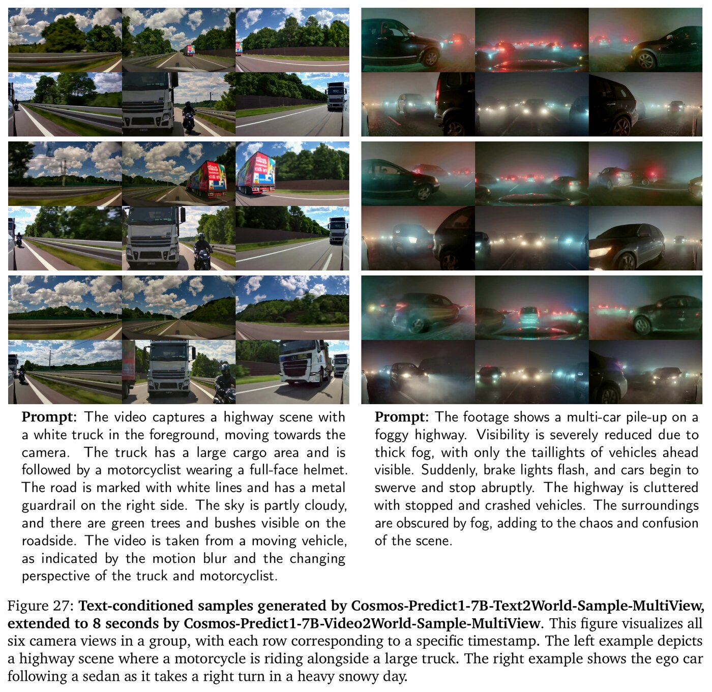{ width="620" }
  <figcaption>Figure 27</figcaption>
</figure>

<figure markdown="span">
  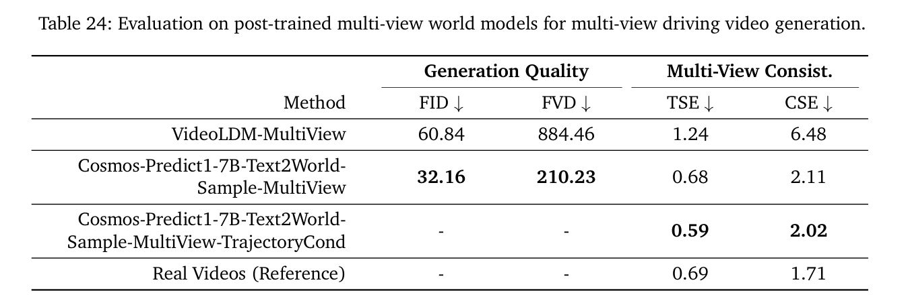{ width="660" }
  <figcaption>Table 24</figcaption>
</figure>

정성적으로는 6개 뷰를 일관되게 생성하고, 강변이나 산지 같은 OOD 상황에도 일반화되며, 좌회전·우회전·직진 같은 trajectory를 정확히 추종한다.

정량 평가는 네 가지를 본다. 생성 품질은 뷰별 평균 FID와 FVD를 1,000개 샘플로 측정해 VideoLDM을 크게 앞선다. Multi-view 일관성은 시간 일관성을 보는 TSE와 뷰 간 일관성을 보는 CSE로 측정하는데, 둘 다 Sampson error를 확장한 지표이며 800개 샘플(경로 4종에 각 200개)로 평가한다. Trajectory 일관성은 뷰 간 trajectory 일치를 보는 TAE와 입력 trajectory 추종을 보는 TFE로 측정해 real video에 근접한다. 마지막으로 object tracking은 YOLOv11x로 20개 샘플, 157개 객체에 대해 측정했는데 물리 오류가 0이었다.

## 6. Guardrails

<figure markdown="span">
  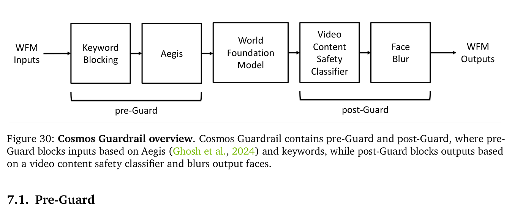{ width="820" }
  <figcaption>Figure 30</figcaption>
</figure>

Guardrail은 입력 텍스트를 거르는 Pre-Guard와 생성된 영상을 거르는 Post-Guard 두 단계로 나뉜다.

### 6.1 Pre-Guard

텍스트 도메인 guardrail로, 명백히 안전하지 않은 키워드를 잡는 blocklist 검사기와 의미적으로 복잡한 prompt를 처리하는 LLM 기반 guardrail로 구성된다.

**Keyword Blocking**은 유해한 단어를 하드코딩한 대규모 blocklist에 prompt를 키워드 검색해 1차로 거른다. 이때 입력 단어를 WordNetLemmatizer로 표제어화하는데, 영어 어휘 데이터베이스를 써서 변형형에서 원형을 뽑는 도구다(예: "abacii" → "abacus"). 표제어화한 단어를 blocklist와 비교해 하나라도 걸리면 prompt 전체를 거부한다.

**Aegis Guardrail**은 키워드만으로 잡히지 않는 prompt를 문맥까지 보고 판단한다. Llama-Guard를 NVIDIA의 Aegis Content Safety Dataset으로 fine-tune한 `Aegis-AI-Content-Safety-LlamaGuard-LLM-Defensive-1.0`을 사용한다. Aegis에는 defensive와 permissive 두 버전이 있는데, Cosmos는 허용 경계가 더 엄격한 defensive 버전을 쓴다. 폭력, 성적, 범죄 계획, 무기, 약물 남용, 자살, 아동 성적 학대 자료, 증오, 괴롭힘, 위협, 비속어 등의 범주에 해당하면 안전하지 않은 것으로 분류하고, 이 경우 영상을 생성하지 않고 오류 메시지를 표시한다.

### 6.2 Post-Guard

비전 도메인 guardrail로, 생성된 출력에 대한 안전성 필터와 얼굴 블러 필터로 구성된다.

**Video Content Safety Filter**는 프레임 단위 다중 클래스 분류기다. 각 프레임에서 SigLIP embedding을 뽑고 그 위에 단순한 MLP 분류기를 학습하며, 추론할 때는 모든 프레임에 이를 적용해 한 프레임이라도 unsafe면 영상 전체를 unsafe로 표시한다. 학습에서 관건은 안전한 콘텐츠를 unsafe로 표시하는 false positive와 그 반대인 false negative 사이의 균형이다. ground truth는 세 종류를 모은다. 데이터셋에서 대규모 영상을 샘플링해 VLM으로 클래스를 정하고, corner case와 표현이 적은 범주를 채우려고 WFM으로 합성 영상을 생성하며, 마지막으로 사람이 일부에 gold standard 레이블을 붙인다.

**Face Blur Filter**는 RetinaFace로 얼굴 영역을 검출해, 20×20 픽셀보다 큰 영역에 픽셀화를 적용한다. Physical AI 응용을 위해 전체 장면 구성은 보존하면서 얼굴만 가리는 방식이다.

### 6.3 Red Team

내부 공격 prompt 데이터셋의 표준 예시와 적대적 예시로 시스템을 능동적으로 조사하는 전담 red team을 운영한다. 생성된 영상은 전문 annotator가 Aegis의 분류 체계에 대응하는 유해성 범주별로 1~5점 척도로 분류하고, 안전하지 않은 콘텐츠가 검출되는 시작 프레임과 종료 프레임까지 명시한다. red team은 각 guardrail 구성요소를 표적 예시로 따로 조사해 약점과 edge case도 찾는다. 출판 시점까지 10,000개가 넘는 prompt-영상 쌍을 테스트하고 주석을 붙였다.

## 7. 결론

논문은 Cosmos WFM을 물리 세계의 범용 시뮬레이터를 향한 한 걸음으로 정리한다. 데이터 큐레이션, continuous·discrete 두 종류의 tokenizer, diffusion과 autoregressive 두 방식의 WFM, downstream fine-tuning까지를 하나의 플랫폼으로 묶었고, 이를 통해 pre-trained WFM이 3D world navigation, robotic manipulation, autonomous driving에 적응 가능함을 3D 일관성과 action 제어 측면에서 입증했다. 그리고 이 모든 것을 open-source, open-weight로 공개했다.

## 8. Discussion

### 8.1 논문의 장점

- 데이터 큐레이션부터 tokenizer, 사전학습, 사후학습, guardrail까지를 하나의 플랫폼으로 묶었다. 논문 하나가 재현 가능한 파이프라인 문서 역할을 한다.
- continuous와 discrete 두 토큰을 하나의 tokenizer 설계에서 뽑아내고, diffusion과 autoregressive를 같은 데이터·같은 tokenizer 토대 위에서 나란히 학습해 직접 비교했다. 두 방식을 한 논문에서 이렇게 비교한 사례는 드물다.
- tokenizer 자체가 독립적인 기여가 된다. 높은 압축률에서도 SOTA reconstruction을 유지하는데(DAVIS PSNR 약 +4 dB), tokenizer는 WFM의 학습·추론 비용을 직접 좌우한다.
- FID나 FVD 같은 생성 품질뿐 아니라 3D consistency와 physics alignment를 따로 측정한다. 그럴듯한 영상과 실제로 쓸 수 있는 world model을 구분하려는 시도로 보인다.
- autoregressive의 blur 문제를 diffusion decoder로 푸는 설계는 두 방식을 대립이 아니라 조합으로 본다는 점에서 실용적이다.
- camera control, robotic manipulation, autonomous driving 세 응용에서 post-training이 실제로 동작함을 보였다.
- open-source, open-weight 공개로 후속 연구의 진입 장벽을 크게 낮췄다.

### 8.2 논문의 한계

- world foundation model 개발은 여전히 초기 단계이고, 현재 모델은 물리 세계의 신뢰할 수 있는 시뮬레이터로서는 부족하다. object permanence의 부재, contact가 많은 동역학에서의 부정확성, instruction following의 비일관성이 관찰된다.
- 생성 영상의 사실성이 중력, 빛의 상호작용, 유체 역학 같은 근본적인 물리 원리의 준수를 항상 반영하지는 않는다.
- 평가도 과제로 남는다. 사람이 physical fidelity를 평가할 강건한 기준을 정의하기 어렵고, 개인의 편향과 배경 같은 주관적 요인에 영향을 받는다. 게다가 이런 평가가 다운스트림 Physical AI 작업에서 쓰는 metric과 반드시 부합하지도 않는다. 논문은 multi-modal LLM 기반 자동 평가기와 기존 물리 시뮬레이터 활용을 유망한 방향으로 제시한다.
- autoregressive와 diffusion 중에서는 현재 diffusion이 생성 품질에서 앞서지만, autoregressive는 LLM의 사전학습 가중치를 물려받을 수 있고 causal attention용 추론 최적화를 쓸 수 있어 잠재력이 남아 있다고 본다. 두 방식의 경계도 엄격하지 않아, hybrid 접근을 향후 연구로 남겨 두었다.

## 9. 마무리

| 모듈 | 역할 | 핵심 설계 |
|---|---|---|
| Video Curator | 원본 20M 시간 → 사전학습 100M 클립 | TransNetV2 shot detection, 4종 필터, VILA-13B 캡션, InternVideo2 + k-means dedup(−30%) |
| Video Tokenizer | 비디오 → 압축 토큰 | 2-level wavelet + causal 구조, AE(continuous, 16ch) / FSQ(discrete, 6정수 → 64K vocab) |
| Diffusion WFM | continuous token 위의 latent diffusion | 7B·14B, 3D patchify, AdaLN(+LoRA), FPS-aware 3D RoPE, T5-XXL cross-attn |
| Autoregressive WFM | discrete token의 next-token 예측 | 4B·12B (+5B·13B Video2World), 3D RoPE + YaRN, diffusion decoder로 선명화 |
| Post-training | generalist → specialist | camera(Plücker embedding), robot(7-DoF action), driving(6-view + trajectory) |
| Guardrail | 입력·출력 안전 | Pre-Guard(keyword + Aegis) / Post-Guard(SigLIP filter + face blur) |

행동 데이터를 현실에서 모으는 대신 현실을 충분히 잘 흉내 내는 세계를 먼저 만들어 두자는 것이 이 논문의 접근이다. Cosmos는 그 세계를 만드는 데 필요한 데이터와 tokenizer, 두 방식의 WFM, 그리고 자기 환경에 맞게 바꾸는 post-training 방법을 한꺼번에 공개했다.

## 참고문헌

- [Cosmos World Foundation Model Platform for Physical AI (arXiv)](https://arxiv.org/abs/2501.03575)
- [NVIDIA Cosmos (Homepage)](https://www.nvidia.com/en-us/ai/cosmos/)
- [cosmos-predict1 (GitHub)](https://github.com/nvidia-cosmos/cosmos-predict1)
- [Elucidating the Design Space of Diffusion-Based Generative Models, EDM (arXiv)](https://arxiv.org/abs/2206.00364)
- [Finite Scalar Quantization: VQ-VAE Made Simple, FSQ (arXiv)](https://arxiv.org/abs/2309.15505)
- [Scalable Diffusion Models with Transformers, DiT (arXiv)](https://arxiv.org/abs/2212.09748)
- [TransNet V2: An Effective Deep Network Architecture for Fast Shot Transition Detection (arXiv)](https://arxiv.org/abs/2008.04838)
