# Mastering Atari with Discrete World Models (DreamerV2)

!!! info "Information"
    - **Title:** Mastering Atari with Discrete World Models (DreamerV2)
    - **Venue:** ICLR 2021
    - **Paper:** [arXiv](https://arxiv.org/abs/2010.02193)
    - **Code:** [GitHub](https://github.com/danijar/dreamerv2) / [Project page](https://danijar.com/dreamerv2)
    - **Presenter:** [유정화](https://github.com/jeongHwarr)
    - **Video:** [YouTube](https://www.youtube.com/watch?v=AOqGhRWf0ws)
    - **Last updated:** 2026-10-03

## 0. Summary

**DreamerV2는 환경을 이산적인 잠재 공간으로 표현하고, 잠재 공간에서 상상한 궤적만으로 행동을 학습해, 단일 GPU로 Atari에서 human-level 성능에 도달한 첫 model-based RL agent다.** 실제 환경에서는 데이터만 모으고, 행동은 학습한 world model 안에서 상상한 궤적으로 배운다. 단일 V100 GPU에서 10일 동안 학습했으며 파라미터는 22M이다. Atari 55개 게임에서 IQN, Rainbow, C51, DQN 같은 model-free 알고리즘을 모든 집계 지표에서 앞섰다.

**문제: DreamerV1은 왜 Atari에서 약했나**

DreamerV1은 로봇 관절 각도처럼 연속 행동을 다루는 제어 과제에서는 좋은 성능을 냈다. 하지만 조이스틱 입력처럼 이산 행동을 다루는 Atari에서는 model-free 알고리즘을 넘지 못했다. 논문은 DreamerV1이 Atari에서 약했던 원인을 두 가지로 꼽는다.

- **Gaussian 잠재 변수:** 부드러운 변화는 잘 표현하지만, 방이 바뀌거나 적이 사라지는 불연속 변화는 표현하기 어렵다.
- **표준 KL loss:** 이미지 없이 다음 상태를 예측하는 prior가 충분히 학습되지 않는다. 부정확한 prior는 부정확한 상상으로, 부정확한 상상은 나쁜 정책으로 이어진다.

**해결: DreamerV2가 바꾼 두 가지**

1. **Categorical 잠재 변수**  
   잠재 상태를 32개 categorical 변수(각 32개 클래스)로 표현한다. 학습은 straight-through gradient로 한다.
2. **KL balancing**  
   KL loss를 prior 학습 항과 posterior 정규화 항으로 나누고, prior 쪽에 80%(α = 0.8)의 비중을 준다.

아키텍처 자체는 DreamerV1과 거의 같다. 주로 잠재 변수의 형태와 KL loss의 학습 방식을 바꿔 Atari에서 model-free를 넘어섰다.

**글의 구성**

- 1절: 왜 Atari에서 world model이 어려웠는지
- 2절: World Model, Actor, Critic이 어떻게 맞물려 학습하는지
- 3~5절: World Model이 무엇을 어떻게 배우는지 (RSSM, categorical latent, KL balancing)
- 6절: 상상 속에서 Actor와 Critic이 어떻게 학습하는지
- 7~9절: 실험 결과, ablation, 다른 연구와의 비교

---

## 1. 왜 Atari에서 world model이 어려웠나

**Model-based RL은 실제 경험을 아낄 수 있지만, 그러려면 정확한 환경 모델이 있어야 한다.** 이전 연구들은 Atari에서 충분히 정확한 환경 모델을 만들지 못해 model-free를 넘지 못했다. DreamerV2는 이미지 대신 작은 잠재 공간에서 시뮬레이션해 환경 모델의 예측 오류를 줄였다. 머릿속 연습이 실력으로 이어지려면 머릿속 세계가 실제와 닮아야 하는 것과 같다.

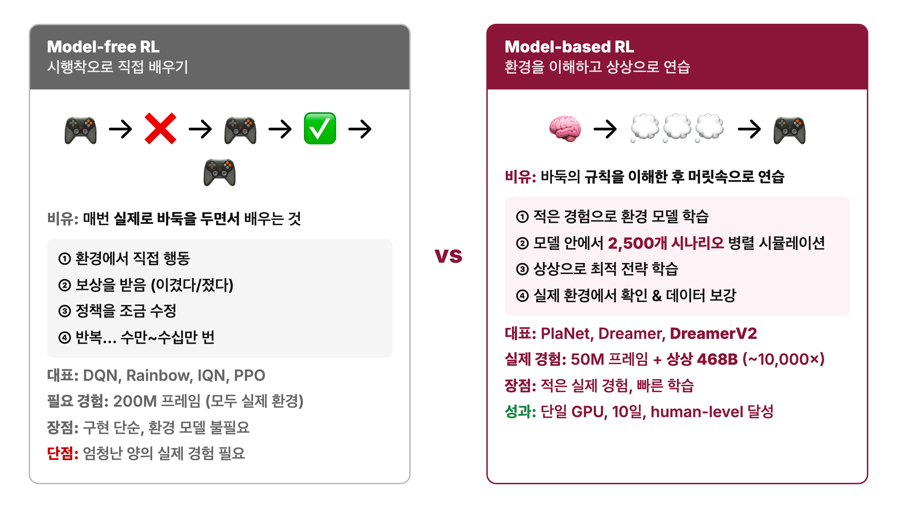

**Model-free RL은 실제 환경에서 직접 시행착오를 겪으며 배운다.** Agent는 행동하고 보상을 받을 때마다 정책을 바로 고친다. DQN, Rainbow, IQN, PPO가 model-free RL에 속한다. 구현이 단순하고 환경 모델도 필요 없지만, 실제 경험을 매우 많이 쌓아야 한다.

**Model-based RL은 환경 모델을 먼저 배우고, 학습한 환경 모델 안에서 연습한다.** DreamerV2는 실제 환경에서 50M 프레임을 경험하는 동안 world model 안에서 468B개의 compact state를 상상한다. 실제 경험의 약 10,000배에 해당하는 가상 경험을 학습에 쓰는 셈이다.

!!! example "비유: 바둑을 배우는 두 가지 방법"
    Model-free는 실제 대국을 거듭하며 "이 수를 두니 졌다"를 배우는 방식이다. Model-based는 규칙과 패턴을 익힌 뒤 머릿속으로 수를 읽으며 연습하는 방식이다.

문제는 Atari용 world model이 충분히 정확하지 않았다는 점이다. DreamerV2 이전의 시도에는 각각 한계가 있었다.

- **기존 world model:** 환경 dynamics를 충분히 정확하게 학습하지 못해 model-free보다 성능이 낮았다.
- **MuZero (2019):** 성능은 뛰어나지만 구현이 공개되지 않았고, GPU 한 대로 agent 하나를 학습하는 데 2개월 이상 걸린다.
- **SimPLe (2019):** 픽셀 공간에서 다음 프레임을 직접 예측해 장기 예측이 불안정했다.

DreamerV2는 이미지를 직접 예측하지 않고 작은 잠재 공간(latent space)에서 시뮬레이션한다. 예측할 차원이 작으면 각 step의 오류가 작아지고, 여러 step에 걸친 누적 오류도 줄어든다. 메모리도 적게 든다.

---

## 2. 전체 구조: World Model, Actor, Critic

**World Model이 환경을 흉내 내는 시뮬레이터가 되고, Actor와 Critic은 그 시뮬레이터 안에서만 행동을 배운다.** 실제 환경은 데이터를 모으는 데만 쓴다. 학습은 "시뮬레이터를 만드는 단계"와 "시뮬레이터 안에서 연습하는 단계"가 번갈아 도는 구조다.

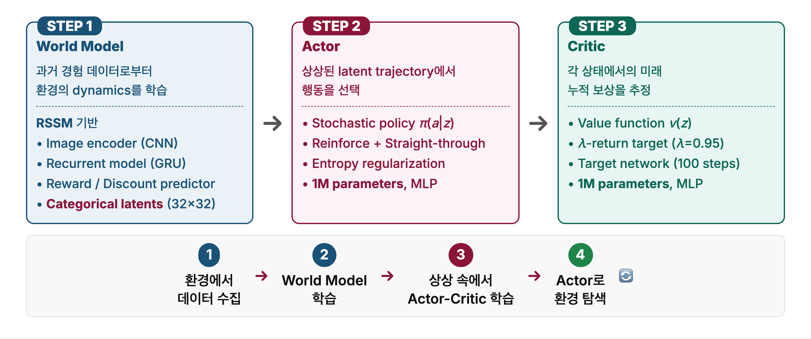

DreamerV2는 세 개의 신경망으로 이루어진다. 각 신경망이 맡는 질문은 다음과 같다.

- **World Model: "이 행동을 하면 어떻게 될까?"**  
  과거 경험에서 환경의 dynamics를 학습한다. PlaNet과 DreamerV1의 RSSM 구조를 쓰며, CNN 이미지 encoder, GRU recurrent model, reward predictor, discount predictor로 이루어진다. DreamerV2에서는 잠재 상태가 categorical이다.
- **Actor: "지금 어떤 행동을 해야 할까?"**  
  상상한 잠재 궤적에서 행동을 고르는 stochastic policy $\pi(a \mid z)$다. 1M 파라미터 MLP다.
- **Critic: "지금 상태는 얼마나 좋은가?"**  
  각 상태에서 앞으로 받을 누적 보상을 추정하는 value function $v(z)$다. λ-return을 학습 target으로 쓰고, target network는 100 step마다 갱신한다. 역시 1M 파라미터 MLP다.

### 학습은 두 단계가 번갈아 반복된다

**World Model을 먼저 학습하고, 학습한 World Model을 고정한 채 Actor와 Critic을 학습한다.** 두 단계 모두 실제 환경 없이 GPU 안에서 진행되므로 수천 개의 궤적을 동시에 돌릴 수 있다.

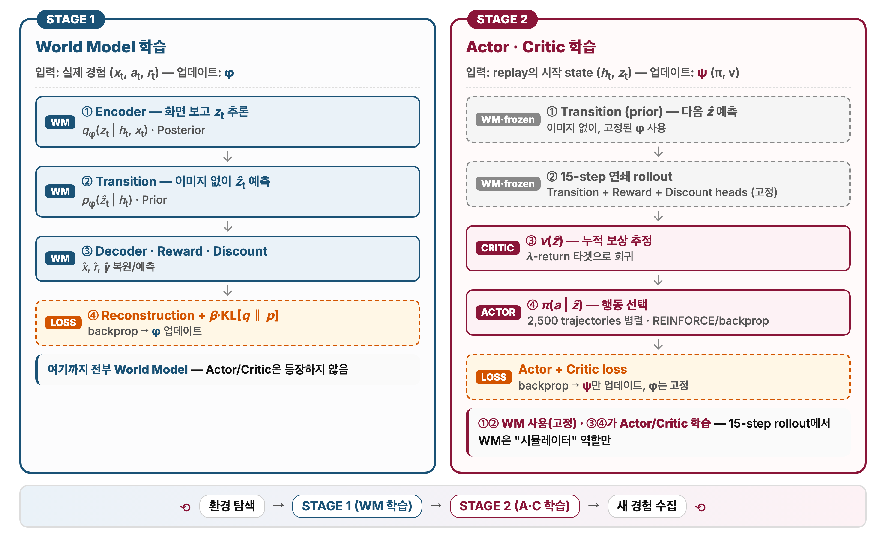

1. **환경 탐색**  
   현재 Actor가 실제 Atari 환경에서 플레이하며 이미지, 행동, 보상, 종료 여부를 replay buffer에 쌓는다. Replay buffer는 $2 \times 10^6$ 크기의 FIFO로 관리한다.
2. **Stage 1: World Model 학습**  
   Replay buffer에서 길이 50인 시퀀스를 batch 50개 단위로 샘플링해 RSSM을 학습한다. World Model 파라미터 $\phi$만 업데이트한다.
3. **Stage 2: Actor·Critic 학습**  
   Replay에서 얻은 상태 $(h_t, z_t)$를 시작점으로, World Model 안에서 15 step 궤적을 2,500개 병렬로 상상한다. 상상한 궤적으로 Actor와 Critic의 파라미터 $\psi$, $\xi$를 업데이트한다. Stage 2에서 World Model은 고정(frozen)되어 시뮬레이터 역할만 한다.
4. **반복**  
   개선된 Actor로 다시 환경을 탐색한다.

---

## 3. World Model: RSSM

**RSSM(Recurrent State-Space Model)은 게임 화면을 작은 상태 $(h_t, z_t)$로 요약하고, 이미지를 보지 않고도 다음 상태를 예측하도록 학습하는 World Model의 핵심 구조다.** 직관적으로 $h_t$는 지금까지의 줄거리, $z_t$는 지금 장면의 요약이다. RSSM은 PlaNet에서 도입되어 DreamerV1을 거쳐 DreamerV2까지 이어졌다. 상상 단계에는 이미지가 없으므로, 화면 없이 다음 상태를 짐작하는 능력(prior)이 상상의 품질을 결정한다. 그래서 RSSM은 이미지를 보고 만든 요약(posterior)과 이미지 없이 짐작한 요약(prior)을 모두 만든다.

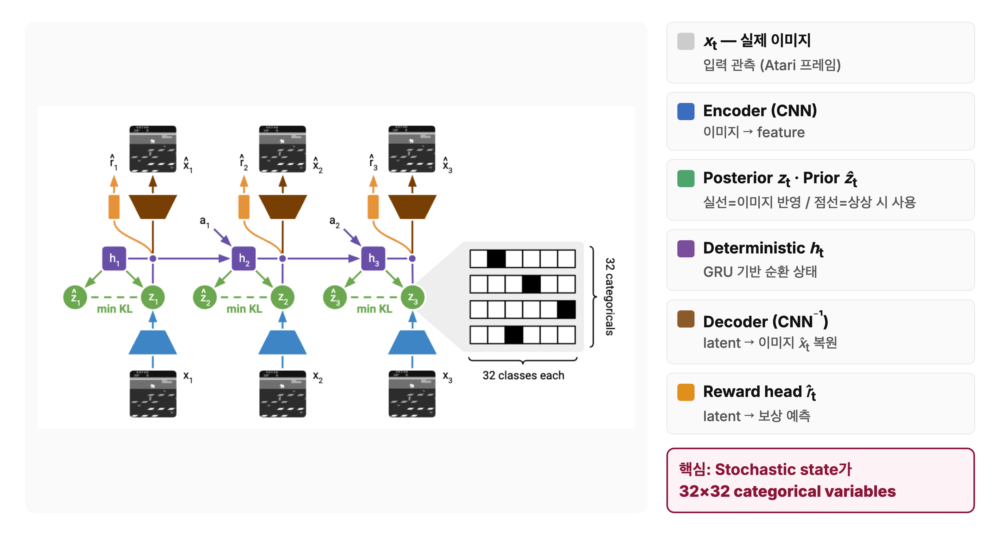

RSSM은 요약한 잠재 상태로 다음 상태뿐 아니라 보상과 종료 확률도 예측한다. 입력으로는 84×84 grayscale 이미지를 DreamerV1의 convolution 구조에 맞춰 64×64로 줄여서 쓴다.

### 상태는 "줄거리"와 "장면 요약" 두 부분으로 나뉜다

각 시점 $t$의 model state는 결정적 상태와 확률적 상태를 이어 붙인 표현이다.

- **결정적 상태 $h_t$ (deterministic state):** GRU가 만드는 recurrent state다. 지금까지 일어난 일을 요약한 "줄거리"에 해당한다.
- **확률적 상태 $z_t$ (stochastic state):** 현재 화면에서 적 위치, 체력, 아이템처럼 게임 진행에 필요한 정보만 뽑아 압축한 "장면 요약"이다. 요약 과정에 불확실성이 있어 확률 분포로 표현한다.

### Posterior와 prior: 화면을 보고 쓴 요약과 짐작한 요약

$z_t$는 이미지를 보고 만드는지에 따라 두 가지로 나뉜다.

- **Posterior $z_t$:** 현재 이미지 $x_t$와 $h_t$를 함께 보고 추론한 상태다.
- **Prior $\hat{z}_t$:** 이미지 없이 $h_t$만 보고 예측한 상태다.

**Posterior와 prior가 모두 필요한 이유는 상상할 때 실제 이미지가 없기 때문이다.** 학습 중에 두 분포의 KL divergence를 줄여 prior가 posterior에 가까워지면, 상상할 때는 prior만으로 미래를 전개할 수 있다.

!!! example "비유: RSSM은 스포츠 해설가"
    학습할 때 해설가는 화면을 보며 상황을 분석하고(representation model), 동시에 "현재 경기 상황에서는 다음 장면이 이렇게 전개될 것"이라고 예측한다(transition predictor). 예측이 빗나갈 때마다 예측을 고친다(KL loss). 상상할 때는 화면 없이 머릿속으로 해설하며, 상상 시나리오를 2,500개 동시에 전개한다.

### RSSM 구성요소 여섯 개

논문 Equation 1은 World Model을 여섯 구성요소로 정의한다. Recurrent model, representation model, transition predictor는 상태를 다음 시점으로 넘기는 RSSM 코어다. Image, reward, discount predictor는 잠재 상태로 관측, 보상, 종료를 예측한다.

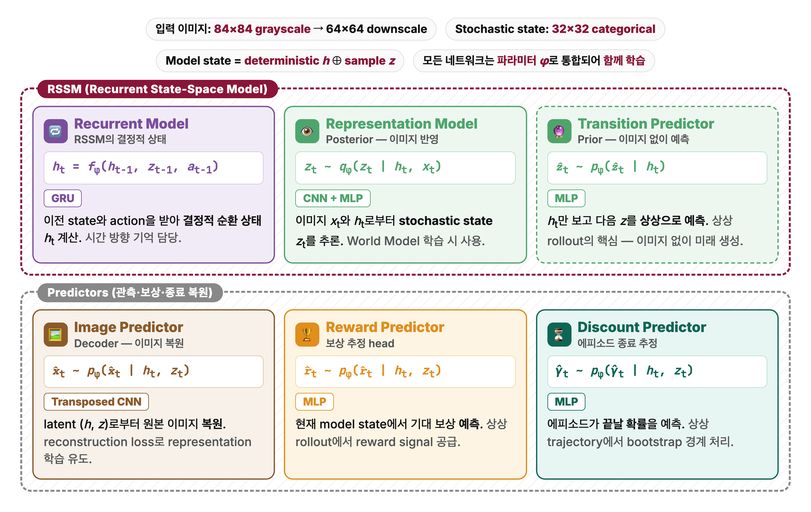

$$
\begin{aligned}
&\text{Recurrent model:} && h_t = f_\phi(h_{t-1}, z_{t-1}, a_{t-1}) \\
&\text{Representation model:} && z_t \sim q_\phi(z_t \mid h_t, x_t) \\
&\text{Transition predictor:} && \hat{z}_t \sim p_\phi(\hat{z}_t \mid h_t) \\
&\text{Image predictor:} && \hat{x}_t \sim p_\phi(\hat{x}_t \mid h_t, z_t) \\
&\text{Reward predictor:} && \hat{r}_t \sim p_\phi(\hat{r}_t \mid h_t, z_t) \\
&\text{Discount predictor:} && \hat{\gamma}_t \sim p_\phi(\hat{\gamma}_t \mid h_t, z_t)
\end{aligned}
$$

| 구성요소 | 구현 | 역할 |
|:---|:---|:---|
| Recurrent model | GRU | 이전 상태와 행동으로 $h_t$를 계산한다. 시간 방향의 기억을 맡는다. |
| Representation model | CNN + MLP | 이미지 $x_t$와 $h_t$로 posterior $z_t$를 추론한다. World Model 학습 때만 쓴다. |
| Transition predictor | MLP | $h_t$만으로 prior $\hat{z}_t$를 예측한다. 상상 rollout은 transition predictor로 미래 상태를 만든다. |
| Image predictor | Transposed CNN | $(h_t, z_t)$로 이미지를 복원한다. Reconstruction loss로 표현 학습을 이끈다. |
| Reward predictor | MLP | 현재 model state의 기대 보상을 예측한다. 상상 궤적에 보상 신호를 공급한다. |
| Discount predictor | MLP | 에피소드가 계속될 확률을 예측한다. 상상 궤적에서 종료 가능성을 반영한다. |

모든 구성요소는 ELU 활성화 함수를 쓰고, World Model 전체는 약 20M 파라미터다.

---

## 4. Categorical latent: 불연속 변화를 표현하는 잠재 변수

**게임 상태는 "방이 바뀐다", "적이 사라진다"처럼 뚝뚝 끊기며 변하지만, Gaussian 잠재 변수는 불연속 변화를 부드러운 값으로만 표현할 수 있다.** DreamerV2는 잠재 상태를 여러 선택지의 조합(categorical)으로 바꿔 불연속 변화를 그대로 담는다. 직관적으로는 값을 조절하는 슬라이더 대신 위치를 고르는 스위치판을 쓰는 셈이다. 이산 샘플은 미분할 수 없으므로 straight-through gradient로 학습한다.

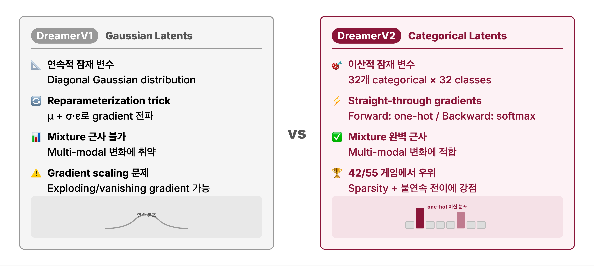

### Gaussian latent의 두 가지 약점

DreamerV1은 $z$를 diagonal Gaussian으로 모델링한다. 각 차원을 독립으로 보고 공분산 행렬의 대각선 값만 학습하므로 효율적이지만, 두 가지 약점이 있다.

- **여러 가능성을 동시에 표현하지 못한다.** 봉우리가 하나뿐이라 "적이 있다"와 "적이 없다"처럼 질적으로 다른 두 상태를 함께 표현할 수 없다. 억지로 표현하면 두 상태 사이의 애매한 값을 출력한다.
- **Gradient 크기가 불안정해질 수 있다.** Reparameterization trick은 샘플을 $z = \mu + \sigma \cdot \epsilon$으로 분해해 미분 가능하게 만든다. $\sigma$에 대한 gradient는 $\frac{\partial \mathcal{L}}{\partial \sigma} = \frac{\partial \mathcal{L}}{\partial z} \cdot \epsilon$이 되어 $\epsilon$이 곱해진다. $\epsilon$이 곱해지는 효과가 50-step 시퀀스에 걸쳐 누적되면 exploding/vanishing gradient가 생길 수 있다.

### Categorical latent: 여러 선택지를 그대로 담는다

DreamerV2는 32개의 독립적인 categorical 분포에서 각각 32개 클래스 중 하나를 one-hot으로 뽑는다. 32개 one-hot 벡터를 이어 붙이면 1,024차원 중 정확히 32개만 1인 sparse binary vector가 된다.

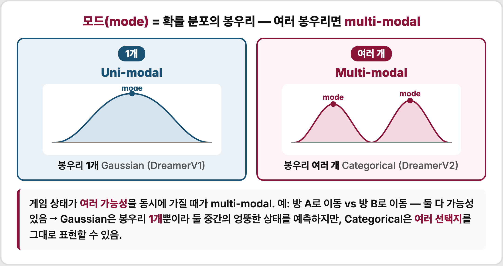

**Categorical 분포의 mixture는 다시 categorical로 표현할 수 있어, 가능성이 여러 개인 상황을 있는 그대로 담는다.** 예를 들어 "방 A로 이동"과 "방 B로 이동"이 모두 가능한 상황에서 categorical은 두 선택지에 각각 확률을 준다. 반면 Gaussian은 두 방 사이의 엉뚱한 상태를 예측한다.

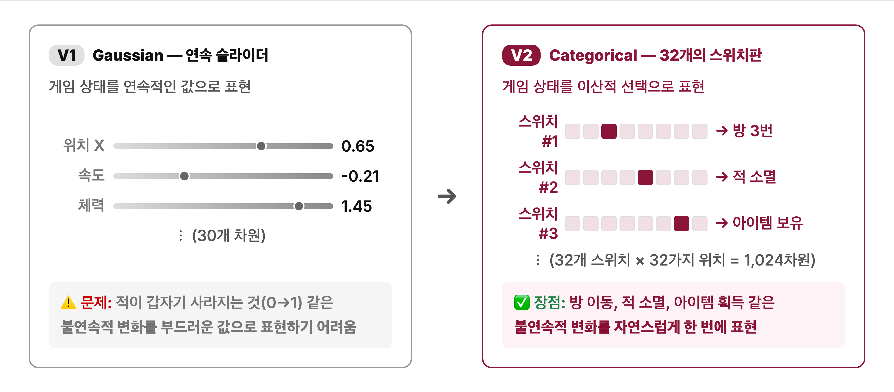

!!! example "비유: 슬라이더 대신 스위치판"
    Gaussian latent는 "위치 X = 0.65, 속도 = −0.21"처럼 값을 조절하는 연속 슬라이더다. Categorical latent는 32개의 스위치판이다. 스위치마다 32가지 위치 중 하나를 고르고, 각 스위치는 독립적으로 움직인다.

    예를 들어 1번 스위치가 방 번호를, 2번 스위치가 적의 상태를, 3번 스위치가 아이템 보유 여부를 맡으면 "방 3번이면서 적이 사라졌고 아이템을 가진 상태"를 한 번에 표현할 수 있다. 다만 각 스위치가 실제로 어떤 의미를 맡는지는 학습으로 정해지며, 위 예시는 이해를 돕기 위한 가정이다.

**효과는 ablation으로 확인된다.** Categorical을 Gaussian으로 바꾸면 Clipped Record Mean이 0.25에서 0.19로 떨어진다. 게임별로는 55개 중 42개에서 categorical이 더 좋았다.

### Straight-through gradient: 이산 샘플로 학습하는 방법

**Straight-through gradient는 forward에서는 이산 샘플을 그대로 쓰고, backward에서는 softmax 확률로 미분한 것처럼 gradient를 흘리는 방법이다.** 덕분에 출력값을 이산적으로 유지하면서도 일반 역전파로 학습할 수 있다.

이산 샘플은 gradient가 흐르지 않는다는 한계가 있다. 샘플링이나 argmax는 계단 함수 형태라, logit을 조금 바꿔도 one-hot 출력은 대부분 바뀌지 않아 gradient가 0이 된다. 경계에서는 다른 카테고리로 건너뛰어 미분이 정의되지 않는다.

DreamerV2는 Bengio et al. (2013)의 straight-through gradient로 이산 샘플에 gradient가 흐르지 않는 문제를 푼다.

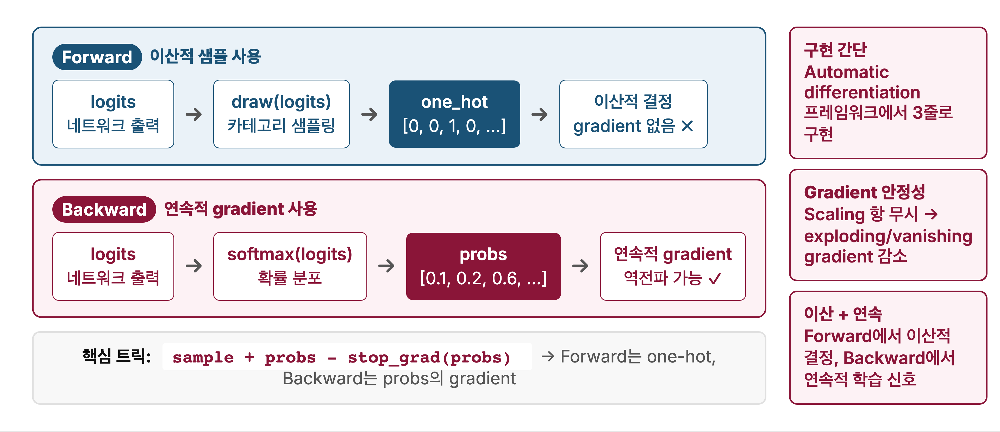

논문 Algorithm 1의 구현은 세 줄이다.

```python
sample = one_hot(draw(logits))              # 카테고리 하나를 샘플링해 one-hot으로 변환
probs  = softmax(logits)                    # 연속 확률 분포
sample = sample + probs - stop_grad(probs)  # 값은 sample, gradient는 probs
```

`draw`는 확률 분포에서 카테고리 하나를 꺼내는 샘플링 함수다. `stop_grad`는 입력값은 통과시키고 gradient만 막는다. **마지막 줄은 "값은 sample처럼, 기울기는 probs처럼" 동작한다.**

- **Forward:** `stop_grad(probs)`의 값은 `probs`와 같으므로 $\text{sample} + \text{probs} - \text{probs} = \text{sample}$이다. 출력은 원래의 one-hot 벡터다.
- **Backward:** `sample`은 이산 연산의 결과라 gradient가 0이고, `stop_grad(probs)`는 gradient가 차단된다. 남는 것은 `probs`의 gradient뿐이다.

`probs`만 쓰면 forward에서 이산 결정이 나오지 않고, `sample`만 쓰면 backward에서 gradient가 0이라 학습할 수 없다. 세 번째 줄은 이산 출력과 gradient 전달이라는 두 요구를 함께 만족시킨다.

**Straight-through는 gradient에 scaling 항이 붙지 않는다는 장점도 있다.** Reparameterization과 달리 $\epsilon$ 같은 값이 곱해지지 않아, 논문은 exploding/vanishing gradient를 줄일 수 있다고 본다. 구현도 자동 미분 프레임워크에서 `stop_grad` 하나로 끝나므로, temperature 조정이 필요한 Gumbel-Softmax보다 간단하다.

---

## 5. World Model 학습: Loss와 KL balancing

**World Model은 화면, 보상, 종료를 복원하면서 잠재 표현을 배우고, KL loss로 prior가 posterior를 따라가게 만든다.** DreamerV2는 KL loss의 학습 비중을 prior 쪽에 더 크게 둔다(KL balancing). 상상할 때는 prior만 쓰므로, 학습할 때 prior를 집중적으로 가르치는 것이다.

### Loss는 네 가지 목표를 동시에 학습한다

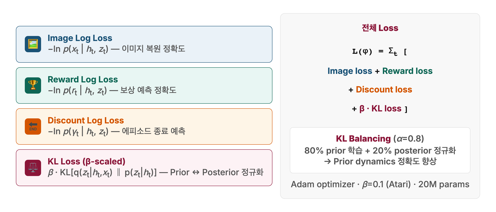

$$
\mathcal{L}(\phi) = \mathbb{E}_{q_\phi}\Big[\sum_{t=1}^{T}
\underbrace{-\ln p_\phi(x_t \mid h_t,z_t)}_{\text{image}}
\underbrace{-\ln p_\phi(r_t \mid h_t,z_t)}_{\text{reward}}
\underbrace{-\ln p_\phi(\gamma_t \mid h_t,z_t)}_{\text{discount}}
+\underbrace{\beta\,\mathrm{KL}\big[q_\phi(z_t \mid h_t,x_t)\,\big\|\,p_\phi(z_t \mid h_t)\big]}_{\text{KL}}\Big]
$$

앞의 세 항은 "잠재 상태에 필요한 정보가 담겼는가"를, 마지막 KL 항은 "이미지 없이도 잠재 상태를 맞힐 수 있는가"를 학습한다.

- **Image loss: 잠재 상태로 화면을 복원할 수 있는가?** 복원하지 못하면 잠재 표현에 정보가 부족한 것이다. Ablation에서 image gradient를 막으면 성능이 0.25에서 0.01로 떨어진다. 네 항 중 표현 학습에 가장 크게 기여한다.
- **Reward loss: 현재 잠재 상태에서 보상을 얼마나 받는가?** Actor가 좋은 상태와 나쁜 상태를 구분하려면 보상 예측이 필요하다.
- **Discount loss: 에피소드가 곧 끝나는가?** 상상 중 actor·critic loss를 예측한 discount로 가중해 종료 가능성을 부드럽게 반영한다.
- **KL loss: 이미지를 보지 않고도 posterior를 맞힐 수 있는가?** KL loss가 잘 학습되어야 상상이 정확해진다.

$\beta$는 KL loss의 크기로, Atari에서는 0.1, continuous control에서는 1.0을 쓴다. Image predictor는 unit variance Gaussian의 평균을, reward predictor는 univariate Gaussian을, discount predictor는 Bernoulli 분포를 출력한다. Optimizer는 Adam이고 learning rate는 $2 \times 10^{-4}$다.

!!! warning "오해 주의: Discount predictor는 성공과 실패를 구분하지 않는다"
    Discount predictor는 "에피소드가 끝나는가"만 예측한다. 게임 오버, 스테이지 클리어, 최대 step 도달은 모두 같은 종료로 취급한다. 성공인지 실패인지는 reward predictor가 맡는다.

    학습 target은 실제 환경 경험에서 만든다. 에피소드가 진행 중인 step에는 discount factor인 $\gamma = 0.999$를, 종료 step에는 0을 붙인다. Discount predictor는 Bernoulli likelihood로 이 target을 맞추도록 학습된다. Atari에서는 목숨 하나를 잃어도 에피소드가 끝나지 않으므로 종료로 보지 않는다.

    두 predictor를 함께 써야 Actor가 "보상을 받고 끝나는 경로"와 "보상 없이 끝나는 경로"를 가려낼 수 있다.

### KL balancing: prior를 더 빨리 학습시키기

**KL balancing은 KL loss를 두 방향으로 나누고, prior 학습에 80%, posterior 정규화에 20%의 비중을 두는 방법이다.** 직관적으로 prior는 posterior를 강하게 따라가고, posterior는 prior와 약하게만 타협한다. 표준 KL은 prior와 posterior를 같은 비중으로 서로 끌어당기므로, posterior가 아직 부정확한 prior 쪽으로 끌려가 이미지에서 얻은 정보를 잃는다. KL balancing은 posterior의 정보 손실을 막는다.

Prior 학습은 이미지 없이 다음 상태를 맞혀야 하므로 본질적으로 어렵고, 학습 초기의 prior는 부정확하다. 표준 KL loss는 prior를 posterior 쪽으로 끌어당기는 동시에 posterior도 prior 쪽으로 정규화한다. 표준 KL loss 때문에 posterior는 이미지에서 얻은 정보를 버리고 부정확한 prior를 흉내 내게 된다.

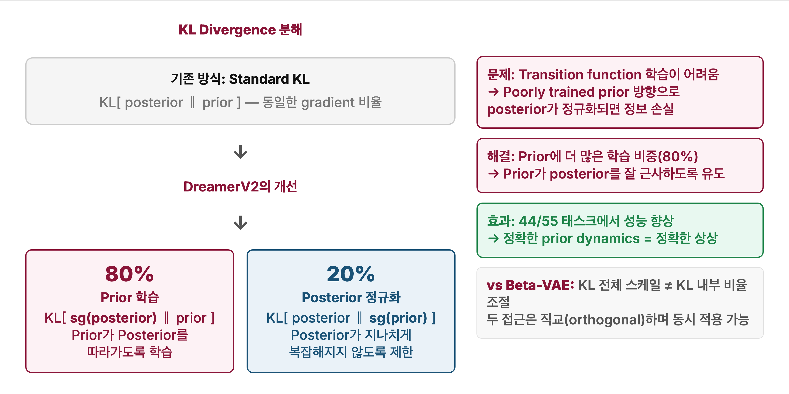

KL balancing의 두 방향과 가중치를 논문 Algorithm 2의 수식으로 쓰면 다음과 같다.

$$
\mathcal{L}_{\mathrm{KL}} = \alpha \cdot \mathrm{KL}\big[\mathrm{sg}(q) \,\|\, p\big] + (1-\alpha) \cdot \mathrm{KL}\big[q \,\|\, \mathrm{sg}(p)\big], \qquad \alpha = 0.8
$$

수식에서 $q = q_\phi(z_t \mid h_t, x_t)$는 posterior, $p = p_\phi(z_t \mid h_t)$는 prior, $\mathrm{sg}(\cdot)$는 stop gradient다.

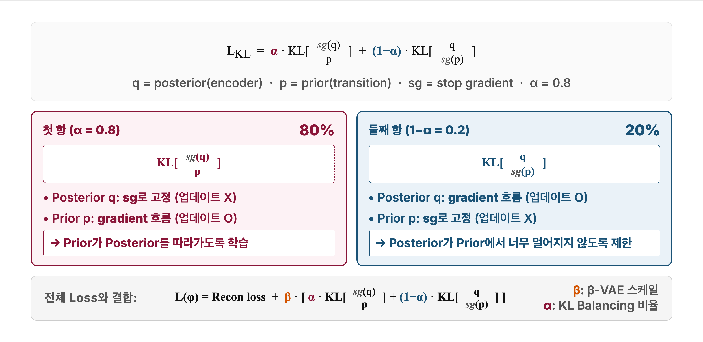

- **첫째 항 (가중치 0.8): prior를 학습한다.** Posterior는 stop gradient로 고정하고 prior만 업데이트해, prior가 posterior를 따라가게 만든다.
- **둘째 항 (가중치 0.2): posterior를 약하게 정규화한다.** Prior는 고정하고 posterior만 업데이트해, posterior가 prior에서 너무 멀어지지 않도록 제한한다.

두 항의 값은 같은 KL이지만 gradient가 흐르는 방향은 다르다. 결과적으로 prior는 posterior보다 4배 큰 비중으로 학습해 빠르게 posterior를 따라잡는다. Posterior는 약하게만 정규화되어 이미지 정보를 유지한다.

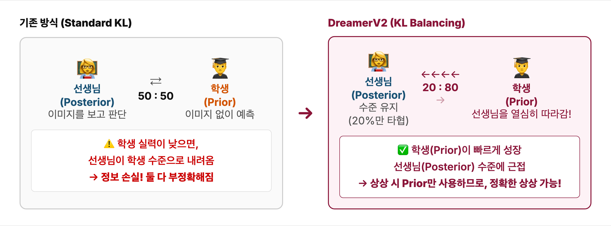

!!! example "비유: 선생님(posterior)과 학생(prior)"
    표준 KL에서는 선생님과 학생이 50:50으로 타협한다. 학생의 실력이 낮으면 선생님도 학생 수준으로 내려온다. KL balancing에서는 학생이 선생님을 80% 비중으로 따라가고 선생님은 20%만 타협한다. 상상할 때는 학생(prior)만 쓰므로 학생이 정확해야 상상도 정확해진다.

**KL balancing은 β-VAE의 $\beta$와 역할이 달라 함께 쓸 수 있다.** $\beta$는 KL 항 전체와 reconstruction loss 사이의 균형을 조절하고, $\alpha$는 KL 항 내부에서 prior와 posterior의 학습 비율을 조절한다.

$$
\mathcal{L}(\phi) = \text{Reconstruction} + \beta \cdot \Big[\alpha \cdot \mathrm{KL}\big[\mathrm{sg}(q) \,\|\, p\big] + (1-\alpha) \cdot \mathrm{KL}\big[q \,\|\, \mathrm{sg}(p)\big]\Big]
$$

**효과도 ablation으로 확인된다.** KL balancing을 빼면 Clipped Record Mean이 0.25에서 0.16으로 떨어진다. 55개 게임 중 44개에서 KL balancing이 표준 KL보다 좋았다.

---

## 6. Behavior Learning: 상상 속에서 Actor와 Critic 학습

**World Model을 고정해 시뮬레이터로 쓰고, 15 step짜리 상상 궤적 2,500개 위에서 Actor와 Critic을 학습한다.** Critic은 각 상태의 가치를 예측하고, Actor는 Critic이 예측한 가치를 높이는 행동을 배운다. 실제 환경은 한 번도 거치지 않는다. 직관적으로는 실제 경기 없이 머릿속 시뮬레이션만으로 전술을 연습하는 단계다.

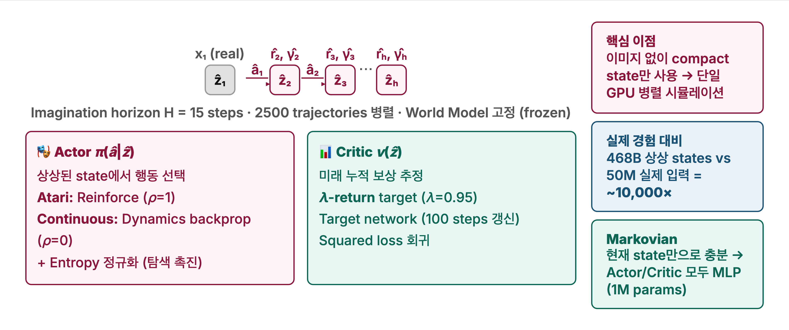

### Imagination MDP: World Model을 시뮬레이터로 쓰기

**Imagination MDP는 MDP의 네 요소(state, transition, reward, discount)를 모두 World Model로 만든 가상 환경이다.** 실제 환경과 상호작용하지 않고 World Model 안에서 완전한 MDP를 실행하므로 학습 효율이 크게 오른다.

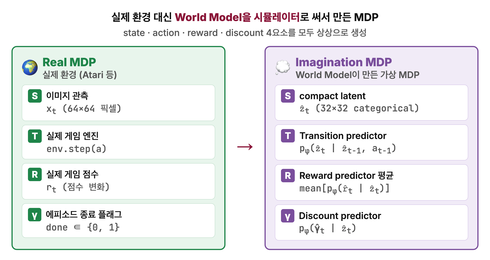

| 요소 | Real MDP | Imagination MDP |
|:---|:---|:---|
| State | 64×64 이미지 $x_t$ | Compact latent $\hat{z}_t$ (32×32 categorical) |
| Transition | 게임 엔진 | Transition predictor |
| Reward | 실제 점수 변화 | Reward predictor의 평균 |
| Discount | 종료 플래그 | Discount predictor의 출력 |

### 상상 궤적: 같은 시작점에서 2,500개를 병렬로

**실제 데이터에서 출발해, 이후는 이미지 없이 prior만으로 15 step을 전개한다.** 상상 궤적 2,500개를 한 batch로 동시에 만든다.

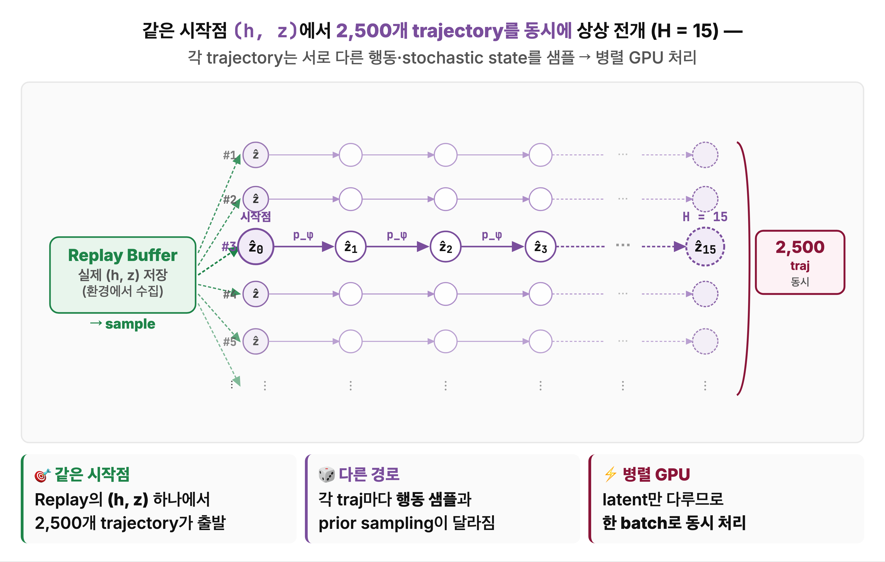

1. **시작점 샘플링**  
   Replay buffer에서 World Model 학습 중 계산한 posterior 상태 $(h, z)$를 가져와 시작점으로 삼는다.
2. **상상 전개**  
   Actor로 행동을 샘플링하고, transition predictor로 다음 상태를 예측하는 과정을 15번 반복해 $\hat{z}_1, \dots, \hat{z}_{15}$를 만든다. 상상을 전개하는 동안 이미지는 한 번도 쓰지 않는다.
3. **병렬 처리**  
   궤적 2,500개를 동시에 만든다. 한 iteration에 2,500 × 15 = 37,500개의 상상 상태가 생긴다.

궤적마다 행동과 prior 샘플이 달라 서로 다른 미래가 펼쳐진다. 잠재 상태는 Markovian이므로 Actor와 Critic은 현재 상태 $\hat{z}_t$ 하나만 입력으로 받는다. Actor와 Critic의 gradient는 World Model 파라미터 $\phi$로 전달되지 않는다.

### Critic: λ-return을 target으로 회귀

**λ-return은 여러 길이의 가치 추정을 섞어 bias와 variance 사이에서 균형을 잡는 target이다.** 직관적으로 미래 보상을 짧게 보면 Critic의 오차를 그대로 물려받고(bias↑), 길게 보면 상상의 잡음이 쌓인다(variance↑). 따라서 미래 보상을 몇 step까지 직접 더할지에 따라 가치 추정의 bias와 variance가 바뀐다.

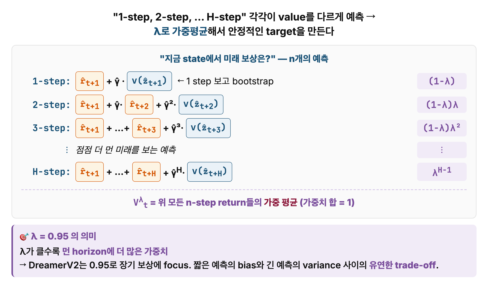

n-step return은 "n step까지는 보상을 직접 더하고, n step 이후의 가치는 Critic에게 맡긴다"는 추정이다. n에 따라 성격이 달라진다.

- **1-step:** 다음 한 step의 보상만 보고 나머지는 Critic 추정값으로 대체한다. 계산은 빠르지만, Critic이 부정확하면 Critic의 오차를 그대로 물려받아 bias가 크다.
- **n-step:** 보상을 여러 step 더 쌓은 뒤 Critic에 넘긴다. Critic 의존도가 줄어 bias는 작아지지만, 상상 rollout의 잡음이 쌓여 variance가 커진다.
- **H-step (H = 15):** 15 step 보상을 모두 더하고 마지막에만 Critic을 부른다. Monte Carlo 추정에 가까워 bias는 가장 작고 variance는 가장 크다.

λ-return은 여러 n-step return의 가중 평균이다. 가중치는 $(1-\lambda), (1-\lambda)\lambda, (1-\lambda)\lambda^2, \dots$이고 합은 1이다. n이 커질수록 가중치는 λ배씩 줄어들지만, DreamerV2가 쓰는 λ = 0.95에서는 감소가 완만해 먼 horizon의 return에도 큰 비중이 남는다. 논문은 λ = 0.95를 짧은 horizon보다 긴 horizon target에 더 집중하기 위해 골랐다고 설명한다. 대부분의 프레임에서 보상이 0인 Atari에서는 여러 step을 묶어야 "선택한 행동이 결국 점수로 이어졌다"는 신호가 살아난다.

긴 target을 쓸 수 있는 것은 상상 덕분이다. Imagination MDP에서는 현재 Actor로 on-policy 궤적을 언제든 새로 만들 수 있다. Model-free RL은 이전 정책으로 수집한 데이터를 쓰므로 여러 step을 묶는 target을 안전하게 쓰기 어렵다.

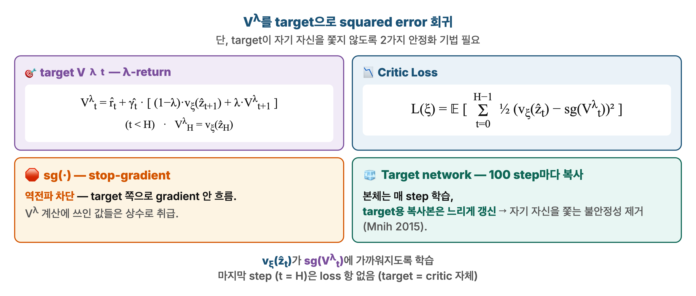

λ-return은 논문 Equation 4처럼 재귀적으로 계산한다.

$$
V_t^\lambda = \hat{r}_t + \hat{\gamma}_t
\begin{cases}
(1-\lambda)\,v_\xi(\hat{z}_{t+1}) + \lambda\,V_{t+1}^\lambda & \text{if } t < H \\
v_\xi(\hat{z}_H) & \text{if } t = H
\end{cases}
$$

매 시점에서 "현재 시점에서 끊고 Critic 추정값을 쓸지"와 "한 step 더 가서 같은 계산을 반복할지"를 $(1-\lambda) : \lambda$ 비율로 섞는다. λ-return 재귀식을 펼치면 앞에서 설명한 기하급수 가중 평균이 자동으로 만들어진다.

Critic loss는 λ-return을 target으로 하는 squared error 회귀다.

$$
\mathcal{L}(\xi) = \mathbb{E}_{p_\phi, p_\psi}\Big[\sum_{t=1}^{H-1} \tfrac{1}{2}\big(v_\xi(\hat{z}_t) - \mathrm{sg}(V_t^\lambda)\big)^2\Big]
$$

$v_\xi(\hat{z}_t)$는 Critic 신경망의 예측값이고, $V_t^\lambda$는 정답 역할을 하는 target이다.

문제는 target이 Critic 자신의 출력으로 계산된다는 점이다. Critic이 바뀌면 target도 함께 움직여 수렴하기 어려워진다. target이 움직이는 문제를 막는 장치는 두 가지다.

- **Stop gradient:** Target을 $\mathrm{sg}(\cdot)$로 감싸 고정된 숫자로 취급한다. Gradient는 Critic 예측값 쪽으로만 흐른다.
- **Target network:** Critic의 복사본을 두고 100 gradient step마다 한 번씩 갱신해 target 계산에 쓴다. DQN(Mnih et al., 2015)에서 쓰인 방법이다.

### Actor: REINFORCE와 dynamics backprop

**Actor의 gradient를 구하는 방법은 두 가지이고, 장단점이 정반대다.** REINFORCE는 평균적으로 정확하지만 크게 흔들리고, dynamics backprop은 안정적이지만 한쪽으로 치우친다. DreamerV2는 도메인에 맞춰 하나를 고른다. Atari에서는 REINFORCE다.

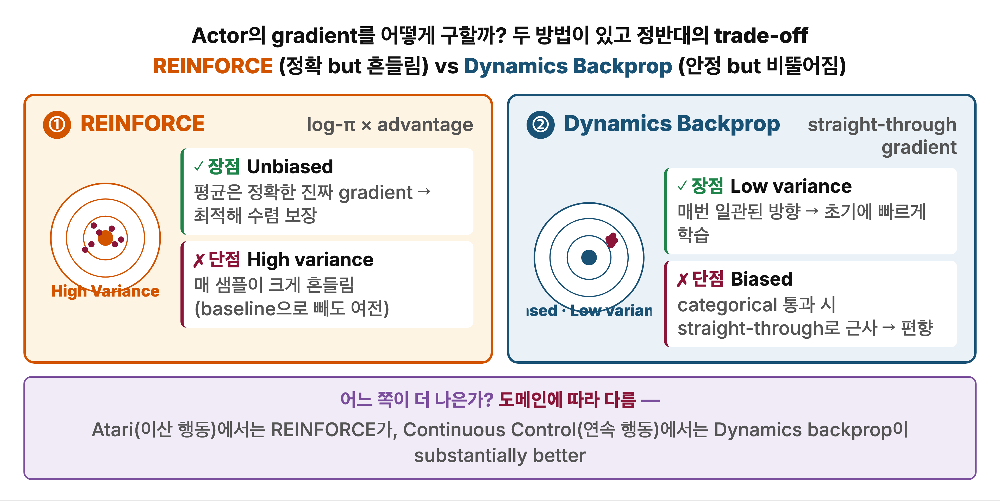

**REINFORCE는 결과가 좋았던 행동의 확률을 올린다.** 행동의 log 확률에 advantage $V_t^\lambda - v_\xi(\hat{z}_t)$를 곱하는데, advantage는 그 행동의 결과가 평균보다 얼마나 좋았는지를 나타낸다. Advantage가 양수인 행동은 확률을 올리고 음수인 행동은 확률을 내린다. Advantage는 Critic 값에서 나오므로 stop gradient로 상수 취급한다. Gradient의 기댓값이 정확하다는 장점(unbiased)이 있지만, 샘플마다 추정이 크게 흔들린다(high variance).

**Dynamics backpropagation은 λ-return을 Actor 파라미터로 직접 미분한다.** $V_t^\lambda$를 샘플링된 행동과 상태를 거쳐 Actor까지 역전파한다. 이산 행동과 categorical 상태를 통과해야 하므로 straight-through gradient로 근사한다. 방향이 일관되어 초기 학습이 빠르지만(low variance), 근사 때문에 편향이 생긴다(biased).

논문 실험에서는 Atari에서 REINFORCE가, continuous control에서 dynamics backprop이 확실히 더 좋았다. 발표에서는 이산 행동의 straight-through 근사에 생기는 편향 때문에 dynamics backprop이 잘못된 방향을 잡기 쉽다고 해석했다. 반면 연속 행동은 reparameterization으로 매끄럽게 미분할 수 있어 dynamics backprop의 low variance가 장점이 된다.

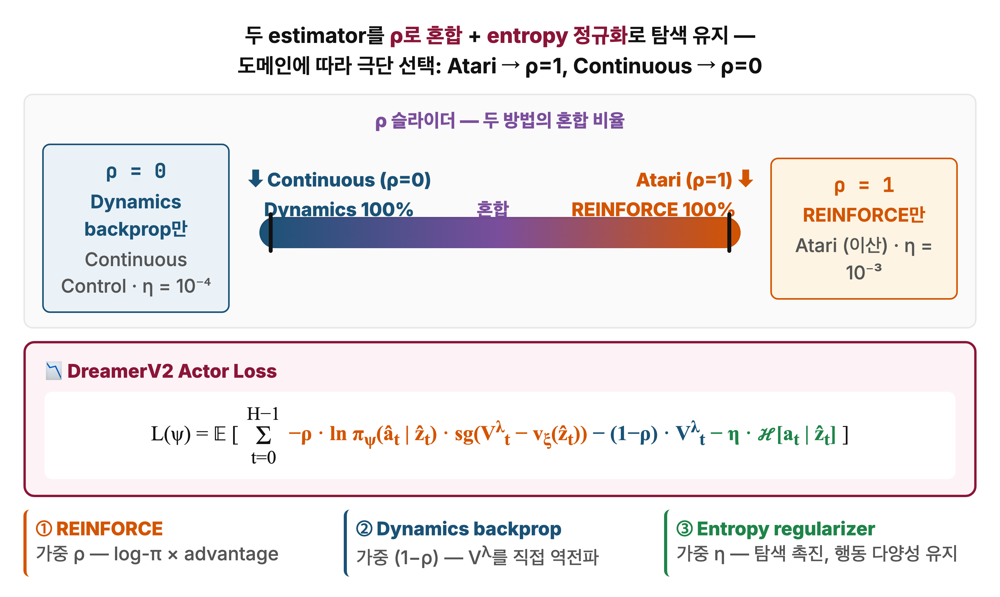

DreamerV2의 Actor loss는 REINFORCE와 dynamics backprop을 $\rho$로 섞고 entropy 정규화를 더한다.

$$
\mathcal{L}(\psi) = \mathbb{E}_{p_\phi, p_\psi}\Big[\sum_{t=1}^{H-1}
\underbrace{-\rho \ln p_\psi(\hat{a}_t \mid \hat{z}_t)\,\mathrm{sg}\big(V_t^\lambda - v_\xi(\hat{z}_t)\big)}_{\text{REINFORCE}}
\underbrace{-(1-\rho)\,V_t^\lambda}_{\text{dynamics backprop}}
\underbrace{-\eta\,\mathrm{H}[a_t \mid \hat{z}_t]}_{\text{entropy}}\Big]
$$

- **Atari (이산 행동):** $\rho = 1$, $\eta = 10^{-3}$
- **Continuous control (연속 행동):** $\rho = 0$, $\eta = 10^{-4}$

논문은 $\rho$를 학습 중에 바꾸지 않고 도메인에 따라 양 끝 값으로 고정했다.

**Entropy는 확률 분포가 얼마나 고르게 퍼져 있는지를 나타내며, entropy 항은 Actor가 너무 일찍 한 행동에 확신하지 않도록 막는다.** 직관적으로 Actor가 한 행동만 고집하지 않고 여러 행동을 꾸준히 시도하게 한다. Loss에 $-\eta\,\mathrm{H}$를 더하면 policy가 한 행동을 지나치게 확신할 때 손해를 본다. 초반에 덜 시도한 행동이 실제로는 더 좋은데도 다시 선택되지 않는 현상을 섣부른 수렴(premature convergence)이라고 하며, entropy 항은 섣부른 수렴을 막는다. 발표에서는 Atari에서 $\eta$가 더 큰 이유를 categorical 분포의 특성에서 찾았다. 한 행동에 확률이 몰리면 다른 행동의 확률이 0 근처로 떨어져 회복하기 어렵다는 해석이다.

### 상상의 규모

**실제 입력의 약 10,000배를 상상한다.** 200M environment step(action repeat 4이므로 실제 입력 프레임은 50M) 동안 DreamerV2는 World Model 안에서 468B개의 compact state를 상상한다. 이미지 없이 작은 벡터만 다루므로 468B개 규모의 상상을 단일 GPU에서 처리할 수 있다.

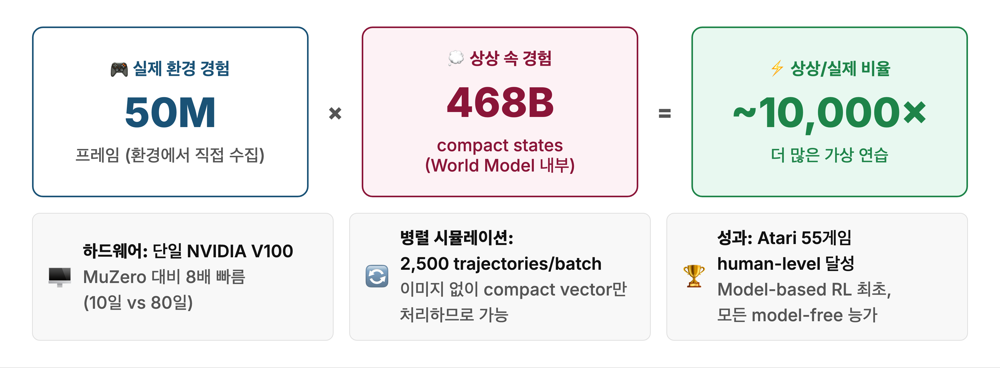

---

## 7. 실험 결과: Atari 200M 벤치마크

**단일 GPU에서 10일 학습으로 Atari 55개 게임에서 model-free 알고리즘 네 개를 모든 지표에서 앞섰다.** 다만 집계 방식에 따라 순위가 바뀔 수 있어, 논문은 소수 게임에 휘둘리지 않는 Clipped Record Mean을 권장한다.

**실험 설정**

- Atari 55개 게임, Machado et al. (2018) 평가 프로토콜
- 200M environment step, action repeat 4, 에피소드당 최대 108,000 step(게임 시간 30분)
- Sticky actions(일정 확률로 이전 행동을 반복), full action space, life 정보 미사용
- World Model이 시간 정보를 통합하므로 frame stacking은 쓰지 않는다.
- 게임마다 agent를 따로 학습하며, 단일 V100 GPU와 단일 환경 인스턴스로 10일 안에 끝난다.

비교 대상은 IQN(distributional RL), Rainbow(DQN 개선 기법 일곱 가지 결합), C51(categorical distributional RL), DQN의 네 model-free 알고리즘이다. 비교 점수는 Dopamine framework에서 sticky actions로 학습한 결과다.

| Agent | Gamer Median | Gamer Mean | Record Mean | Clipped Record Mean |
|:---|:---:|:---:|:---:|:---:|
| **DreamerV2** | 2.15 | **11.33** | **0.44** | **0.28** |
| DreamerV2 (schedules) | **2.64** | 10.45 | 0.43 | **0.28** |
| IQN | 1.29 | 8.85 | 0.21 | 0.21 |
| Rainbow | 1.47 | 9.12 | 0.17 | 0.17 |
| C51 | 1.09 | 7.70 | 0.15 | 0.15 |
| DQN | 0.65 | 2.84 | 0.12 | 0.12 |

DreamerV2는 네 가지 지표 모두에서 비교 대상을 앞섰다. 논문이 권장하는 Clipped Record Mean에서는 0.28로 IQN(0.21)보다 30% 이상 높다. "DreamerV2 (schedules)"는 학습 중 actor entropy loss scale과 actor gradient mixing을 점차 바꾼(annealing) 버전으로, Gamer Median이 2.64로 더 높다.

### 점수를 집계하는 방식에 따라 순위가 바뀐다

**기존 지표는 소수 게임이나 0점 게임에 결과가 휘둘린다.** 논문은 기존 지표의 한계를 지적하고 Clipped Record Mean을 권장한다.

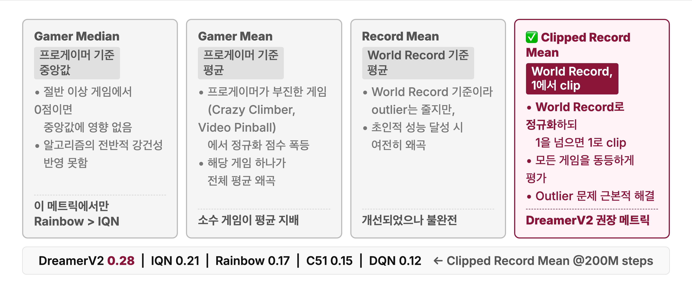

- **Gamer Median (프로게이머 점수 기준 중앙값):** 절반에 가까운 게임에서 0점을 받아도 중앙값은 변하지 않아 알고리즘의 전반적인 강건성을 반영하지 못한다. Gamer Median에서만 Rainbow(1.47)가 IQN(1.29)보다 높다.
- **Gamer Mean (프로게이머 점수 기준 평균):** 프로게이머 점수가 낮은 Crazy Climber, James Bond, Video Pinball 같은 게임에서 정규화 점수가 폭등해 소수 게임이 평균을 좌우한다.
- **Record Mean (세계 기록 기준 평균):** Toromanoff et al. (2019)이 제안했다. 이상치는 줄지만, 세계 기록을 넘는 게임이 여전히 평균을 좌우할 수 있다.
- **Clipped Record Mean:** 세계 기록으로 정규화한 뒤 1을 넘으면 1로 자른다. 기록을 넘는 성능은 평균에 더 기여하지 않으므로 모든 게임을 동등하게 반영한다.

---

## 8. Ablation: 무엇이 성능을 만들었나

**성능을 가장 크게 좌우한 것은 이미지 복원에서 오는 gradient다.** DreamerV2의 두 기여(categorical latent, KL balancing)도 각각 뚜렷하게 기여했다. 반면 보상 예측에서 오는 gradient는 거의 영향이 없었다. World Model은 보상보다 화면을 통해 환경을 배운다는 뜻이다.

논문 Table 2는 DreamerV2에서 구성요소를 하나씩 빼며 성능 변화를 측정한다. Table 1보다 약간 이전 버전으로 실험해 기준 성능이 0.25다.

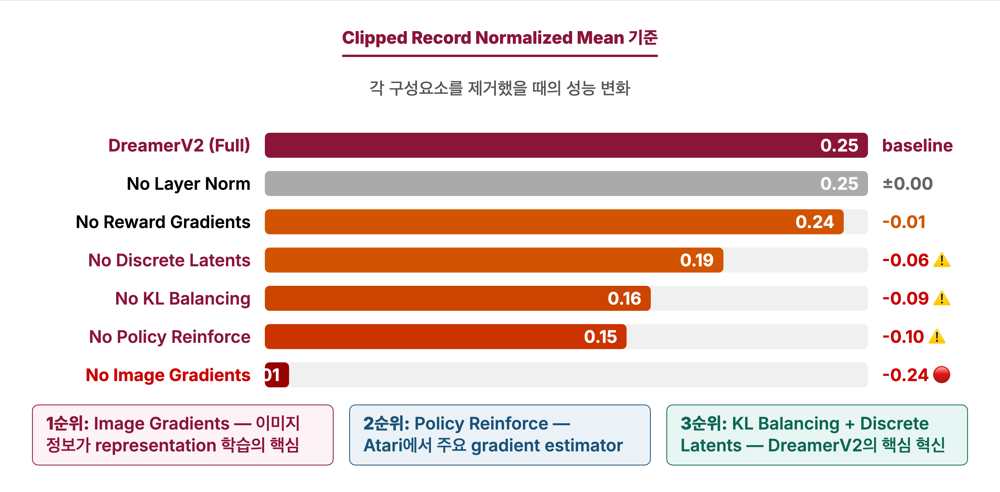

| 제거한 구성요소 | Clipped Record Mean | 해석 |
|:---|:---:|:---|
| (없음, DreamerV2) | 0.25 | 기준 |
| Layer norm | 0.25 | 영향 없음 |
| Reward gradients | 0.24 | 영향이 거의 없다 |
| Discrete latents | 0.19 | 42/55 게임에서 categorical이 우위 |
| KL balancing | 0.16 | 44/55 게임에서 KL balancing이 우위 |
| Policy REINFORCE | 0.15 | Atari에서는 REINFORCE가 주된 gradient estimator |
| Image gradients | 0.01 | 사실상 학습 불가 |

**Image gradient가 가장 중요하다.** Image gradient를 막으면 55개 중 51개 게임에서 성능이 떨어진다. World Model이 이미지 정보로 표현을 학습한다는 의미다. Image gradient의 역할을 보면 MuZero와의 차이가 드러난다. MuZero는 과제별 value gradient만으로 모델을 학습하지만, DreamerV2는 이미지에서 환경 전반의 표현을 학습한다.

**Reward gradient는 거의 영향이 없다.** Reward gradient를 막아도 0.25에서 0.24로 조금만 떨어지고, 일부 게임에서는 오히려 좋아졌다. 논문은 과거 보상 예측에 특화되지 않은 표현이 새로운 상황에 더 잘 일반화될 수 있다고 해석한다.

**REINFORCE를 빼면 크게 떨어진다.** Straight-through gradient만으로 Actor를 학습하면 0.15로 떨어진다. 이산 행동에서는 REINFORCE가 핵심이다.

### Categorical latent가 더 나은 이유에 대한 가설

논문은 categorical latent가 Gaussian보다 나은 이유를 검증된 결론이 아닌 가설로 제시한다.

- **Mixture 근사:** Categorical prior는 categorical의 mixture를 정확히 표현할 수 있지만, Gaussian prior는 Gaussian의 mixture를 맞출 수 없다. 화면이 여러 방향으로 바뀔 수 있는 상황에서 차이가 난다.
- **Sparsity:** 1,024차원 중 32개만 1인 sparse binary vector가 일반화에 유리할 수 있다.
- **Gradient 안정성:** Straight-through는 gradient scaling 항을 무시하므로 exploding/vanishing gradient를 줄일 수 있다.
- **Inductive bias:** 새 방 진입, 아이템 획득, 적 소멸처럼 게임에 많은 불연속 전이에 잘 맞는다.

---

## 9. Related Work와 확장

**DreamerV2는 환경 전체를 학습하는 world model로, MuZero보다 훨씬 적은 자원으로 학습한다.** DreamerV1에서 큰 구조 변경 없이 몇 가지 수정만으로 성능을 끌어올렸고, 같은 틀로 연속 제어와 탐색이 어려운 게임에도 적용된다.

### 다른 model-based RL과 비교

**DreamerV2는 비교한 알고리즘 가운데 유일하게 잠재 공간에서 transition을 학습하고 단일 GPU로 학습한다.** 파라미터는 22M으로 가장 적고, 학습 기간은 10일로 가장 짧다.

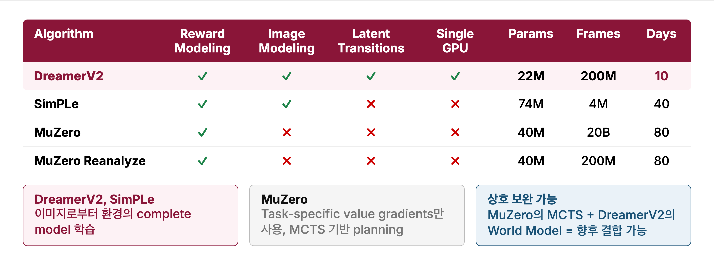

SimPLe는 이미지를 모델링하지만 latent transition이 없고, 4M 프레임의 데이터 효율 설정에서만 평가했다. MuZero는 이미지를 모델링하지 않고 20B 프레임에 80일이 걸린다.

### DreamerV2와 MuZero의 철학 차이

**DreamerV2는 "환경을 이해하겠다", MuZero는 "이기는 데 필요한 것만 배우겠다"에 가깝다.**

- **DreamerV2:** 이미지, 보상, dynamics를 모두 학습해 환경 전체의 모델을 만든다. 22M 파라미터, 단일 GPU, 10일이면 충분하고 코드가 공개되어 재현할 수 있다.
- **MuZero:** 이미지 복원 없이 보상과 value만으로 모델을 학습하고, MCTS(Monte-Carlo Tree Search)로 planning한다. 성능은 강력하지만 GPU 한 대로 2개월 이상 걸리고 구현이 공개되지 않았다.

DreamerV2의 World Model은 환경 자체를 학습하므로 transfer나 multi-task에 활용할 여지가 있다. MuZero의 모델은 과제별 정보만 학습한다. 논문은 DreamerV2와 MuZero의 접근이 서로 배타적이지 않아 MuZero의 planning 기법을 DreamerV2의 World Model에 적용할 수 있다고 본다. 또한 DreamerV2가 이미지를 추가 학습 신호로 쓰는 방식은 self-supervised 이미지 표현 학습(Chen et al., 2020; He et al., 2020; Grill et al., 2020)의 흐름과 비슷하다고 설명한다.

### DreamerV1에서 바뀐 것: 작은 수정, 큰 효과

**DreamerV2는 새로운 아키텍처가 아니다.** 성능을 크게 바꾼 것은 categorical latent와 KL balancing이고, 논문 Discussion도 두 기법을 성능 향상의 결정적 요인으로 꼽는다. 나머지 변경은 부수적이다.

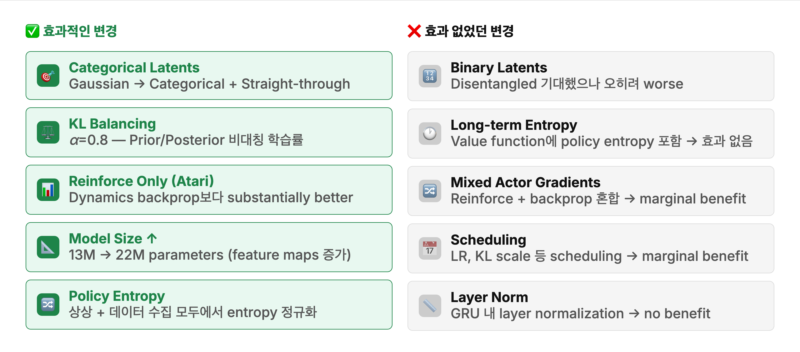

**효과가 있었던 변경**

- Categorical latent와 straight-through gradient
- KL balancing (α = 0.8)
- Atari에서 REINFORCE만 사용 (continuous control에서는 dynamics backprop)
- 모델 크기 13M → 22M
- 외부 action noise 대신 policy entropy 정규화

**효과가 없었던 변경**

- Binary latent: categorical보다 나빴다.
- Long-term entropy: value function에 policy entropy를 포함해도 효과가 없었다.
- Mixed actor gradient: REINFORCE와 dynamics backprop을 섞어도 이득이 미미했다.
- Scheduling: learning rate, KL scale 등을 학습 중에 바꿔도 이득이 미미했다.
- GRU의 layer normalization: 효과가 없었다.

모든 변경을 ablation하지 못한 이유는 비용이다. 변경 하나를 평가하려면 55개 게임 × 5 seed × 10일, 즉 60,000 GPU 시간 이상이 필요해 주요 설계 결정만 ablation했다.

### Continuous control과 hard exploration으로 확장

**같은 틀에서 설정 몇 가지만 바꾸면 연속 제어에도 적용된다.** Humanoid Walk(DeepMind Control Suite)에서는 21차원 연속 행동 공간을 가진 humanoid 로봇이 이미지 입력만 보고 일어서서 걷는 법을 배운다. 논문은 Humanoid Walk 결과를 픽셀 입력만으로 humanoid 환경을 해결한 첫 공개 결과라고 설명한다. 바꾼 설정은 다음과 같다.

- Actor 출력: categorical 분포 대신 truncated normal 분포
- Gradient: REINFORCE 대신 dynamics backprop ($\rho = 0$)
- 학습 가속을 위해 $\eta = 10^{-5}$, $\beta = 2$ 사용

**별도의 탐색 기법 없이도 탐색이 어려운 게임에서 경쟁력 있는 성능을 냈다.** Montezuma's Revenge는 보상이 드물고 탐색이 어려운 대표적인 게임이다. DreamerV2는 ICM(Intrinsic Curiosity Module; Pathak et al., 2017)과 비슷한 성능에 도달했다. Montezuma's Revenge 실험에서는 discount factor를 0.99로 낮춰 드문 보상에서 value 학습을 안정시켰다.

---

## 10. 정리

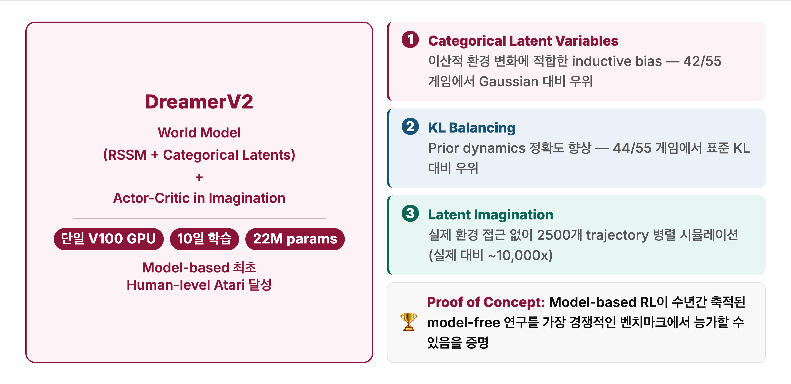

DreamerV2는 World Model(RSSM + categorical latent)과 상상 속 Actor-Critic으로 이루어진다. 핵심 기여는 세 가지다.

- **Categorical latent:** 이산적인 환경 변화에 맞는 inductive bias를 준다. 55개 게임 중 42개에서 Gaussian보다 좋았다.
- **KL balancing:** Prior dynamics를 더 정확하게 학습한다. 55개 게임 중 44개에서 표준 KL보다 좋았다.
- **Latent imagination:** 실제 환경 없이 2,500개 궤적을 병렬로 상상해 실제의 약 10,000배에 해당하는 가상 경험을 얻는다. DreamerV1에서 이어진 방식이다.

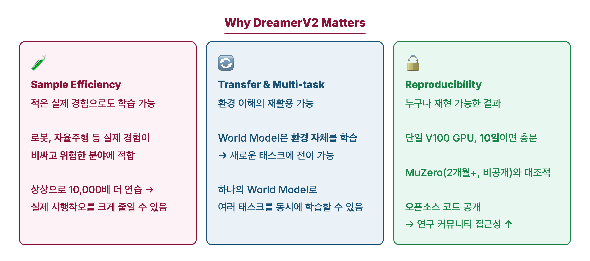

- **Sample efficiency:** 적은 실제 경험으로도 학습할 수 있어, 로봇이나 자율주행처럼 실제 경험이 비싸고 위험한 분야에 맞다.
- **Transfer와 multi-task:** World Model은 환경 자체를 학습하므로 새로운 과제로 옮겨 쓰거나 여러 과제를 함께 학습할 가능성이 있다.
- **Reproducibility:** 단일 V100 GPU, 10일이면 재현할 수 있고 코드도 공개되어 있다.

논문은 DreamerV2를 model-based RL이 가장 경쟁이 치열한 RL 벤치마크에서 model-free RL을 넘어설 수 있음을 보인 proof of concept로 규정한다. World model이 효율적인 transfer, multi-task learning, 실제 로봇에서의 sample-efficient learning, 불확실성 기반 탐색으로 이어질 수 있다는 전망으로 마무리한다.

---

## 11. Q&A

발표 후 질의응답에서 나온 질문과 답변을 정리했다. 각 답변의 첫 문단이 짧은 답이다.

??? question "λ-return 재귀식에서 두 항은 각각 무엇인가?"
    **짧은 답:** 첫째 항은 "현재 시점에서 멈추고 Critic 추정값을 쓴다", 둘째 항은 "한 step 더 가서 같은 계산을 반복한다"이다. 두 항을 고정 비율 $(1-\lambda) : \lambda$로 섞는다.

    $V_t^\lambda = \hat{r}_t + \hat{\gamma}_t \big[(1-\lambda)\,v_\xi(\hat{z}_{t+1}) + \lambda\,V_{t+1}^\lambda\big]$에서 대괄호 안이 다음 시점의 가치다. 다음 시점의 가치를 두 가지 추정값의 가중 평균으로 만든다.

    - $(1-\lambda)\,v_\xi(\hat{z}_{t+1})$: 다음 상태에 대한 Critic의 추정값이다.
    - $\lambda\,V_{t+1}^\lambda$: 다음 시점의 λ-return이다.

    $V_t^\lambda$를 계산하려면 $V_{t+1}^\lambda$가 필요하고, $V_{t+1}^\lambda$도 같은 식으로 계산한다. 상상 궤적이 끝나는 $t = H$에서는 Critic 추정값 $v_\xi(\hat{z}_H)$만 남으므로, $t = H$부터 거꾸로 계산하면 된다. 상상 궤적의 보상 $\hat{r}$, discount $\hat{\gamma}$, 상태 $\hat{z}$는 이미 모두 만들어져 있으므로 λ-return 계산을 위해 World Model을 다시 돌릴 필요는 없다.

    $\lambda$는 학습되는 값이 아니라 0.95로 고정한 하이퍼파라미터다. 그래서 두 항을 섞는 비율은 attention처럼 입력에 따라 달라지지 않고 항상 같다. λ-return 재귀식을 끝까지 펼치면 본문에서 설명한 n-step return의 기하급수 가중 평균이 된다.

??? question "상상할 때 prior만 쓴다면 posterior는 왜 필요한가?"
    **짧은 답:** Prior는 처음부터 예측을 잘하지 못하므로, 이미지를 보고 만든 posterior를 정답 삼아 학습해야 한다. 또 posterior는 잠재 표현 자체를 만들고 상상의 출발점이 된다.

    상상할 때 prior만 쓰는 것은 맞다. 그러나 이미지 없이 다음 상태를 예측하는 능력은 처음부터 주어지지 않는다. Prior를 학습하려면 "무엇에 가까워져야 하는가"라는 기준이 필요하며, 이미지를 보고 만든 posterior가 prior의 학습 기준이 된다.

    World Model 학습 단계에서 encoder는 화면을 보고 posterior를 추론하고, transition predictor는 화면 없이 prior를 예측한다. KL loss로 두 분포 사이의 거리를 줄이는 동안 prior는 posterior를 흉내 내는 능력을 얻는다. KL balancing은 KL loss로 학습하는 과정에서 prior 쪽 학습 비중을 키운 것이다.

    Posterior는 prior의 학습 기준 말고도 두 가지 역할을 더 한다.

    - **잠재 표현 자체를 만든다.** 이미지, 보상, discount 복원은 posterior model state $(h_t, z_t)$에서 한다. 논문이 RSSM을 sequential VAE로 해석하듯, posterior는 VAE의 encoder에 해당한다. 잠재 공간에 무엇을 담을지는 posterior를 거친 reconstruction loss로 정해진다. Ablation에서 image gradient를 막으면 성능이 0.01로 떨어지는 것도 reconstruction loss의 gradient가 잠재 표현에 닿지 못하기 때문이다.
    - **상상의 출발점이 된다.** 상상 궤적은 replay 데이터에서 계산한 posterior 상태에서 시작한다. 실제 관측을 반영한 상태에서 출발해야 상상이 실제 상황과 연결된다.

    즉 prior만 두면 관측으로 잠재 표현을 학습할 경로도, 상상을 시작할 실제 상태도 없다.

??? question "Straight-through 코드에서 `draw`는 무엇이고, backward에서는 어떻게 학습되나?"
    **짧은 답:** `draw`는 확률 분포에서 카테고리 하나를 뽑는 샘플링 함수다. Backward에서는 출력에 대한 gradient가 `probs`로 그대로 넘어가 softmax를 거쳐 `logits`까지 흐른다.

    `draw`는 주사위를 던져 나온 눈 하나를 고르는 것과 같다. 첫째 줄은 뽑은 카테고리를 one-hot 벡터로 바꾼다.

    셋째 줄 `sample + probs - stop_grad(probs)`에서 `stop_grad`는 forward에서는 값을 그대로 통과시키고 backward에서만 gradient를 막는다.

    - **Forward:** `probs`와 `stop_grad(probs)`의 값이 같아 서로 지워지고 `sample`만 남는다. 원하던 이산 샘플을 그대로 쓴다.
    - **Backward:** `stop_grad(probs)`는 gradient가 막히고, `sample`은 이산 연산의 결과라 처음부터 gradient가 없다. 남는 경로는 `probs` 하나다.

    구체적으로는 loss를 출력 `sample`로 미분한 gradient가 `probs`에 그대로 전달되고, softmax를 거쳐 `logits`까지 흐른다. 실제로는 이산 샘플을 썼지만, 역전파할 때는 출력이 softmax 확률이었던 것처럼 계산하는 셈이다. 이름의 "straight-through"도 gradient가 샘플링 단계를 그대로 통과한다는 뜻이다.

    Straight-through gradient는 실제 샘플링 연산의 미분이 아니라 근사이므로 편향(bias)이 있다. Actor 학습에서 straight-through 기반 dynamics backprop을 "low variance지만 biased"로 분류한 것도 이 때문이다.

**토론에서 나온 이야기**

- 이 논문에서 stop gradient를 여러 곳에 쓰는 점이 인상적이라는 의견이 나왔다. 참석자들은 BYOL 같은 self-supervised learning 논문과 V-JEPA 2에서도 stop gradient를 본 적이 있다고 언급했다.
- Categorical latent처럼 연속 표현 대신 이산 표현을 쓰는 아이디어에서 생성 모델의 VQ-VAE가 떠오른다는 의견이 있었다.
- RSSM은 PlaNet부터 이어진 구조라, Hafner의 논문을 연달아 읽으면 저자의 연구 흐름이 보인다는 이야기가 나왔다.

---

## 참고 자료

- Hafner et al., "Mastering Atari with Discrete World Models", ICLR 2021. [arXiv:2010.02193](https://arxiv.org/abs/2010.02193)
- 프로젝트 페이지: [danijar.com/dreamerv2](https://danijar.com/dreamerv2)
- 선행·후속 연구: [PlaNet (2019)](planet.md) → [Dreamer (2020)](dreamer.md) → DreamerV2 (2021) → [DreamerV3 (2023)](dreamer-v3.md)
