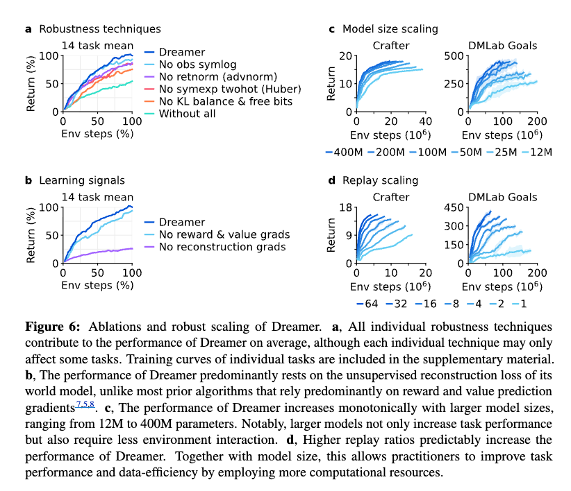

# Mastering Diverse Domains through World Models (DreamerV3)

!!! info "Information"
    - **Title:** Mastering Diverse Domains through World Models (DreamerV3)
    - **Venue:** ICLR 2023
    - **Paper:** [arXiv](https://arxiv.org/abs/2301.04104)
    - **Code:** [Hompage](https://danijar.com/project/dreamerv3/)
    - **Presenter:** [Juyeon Kim](https://github.com/JYeonKim)
    - **Last updated:** 2026-05-06

# [Paper Review] Mastering Diverse Domains through World Models

## 서론 (Introduction)

논문에서는 강화학습이 Go, Dota, 대형 언어 모델(large language model)의 개선 등에 쓰였지만, 실제로는 영역이 바뀌면 알고리즘 설정을 다시 맞추어야 한다는 문제가 크다고 설명한다. PPO는 널리 쓰이는 표준 알고리즘이지만, 연속 제어(continuous control), 이산 행동(discrete action), 희소 보상(sparse reward), 이미지 입력(image input), 공간 환경(spatial environment), 보드게임(board game) 등에서는 영역별 전문 알고리즘이 자주 사용된다.

논문의 문제의식은 **“새로운 과제마다 전문가가 알고리즘을 다시 튜닝해야 한다면 강화학습의 실제 적용이 어렵다”** 는 점이다. 이 문제를 해결하기 위해 논문은 고정 하이퍼파라미터로 여러 영역을 학습하는 DreamerV3를 제안한다.

실제로 Figure 1에서 Dreamer가 특정 영역 전용 알고리즘이 아니라 여러 영역에서 작동한다는 것을 보여준다. Atari, ProcGen, DMLab, Minecraft, Atari100k, Proprio Control, Visual Control, BSuite에서 Dreamer와 비교 알고리즘의 성능을 요약한 것을 볼 수 있는데, Dreamer가 고정 설정으로 PPO 및 다수 전문 알고리즘보다 높은 성능을 보인다.

Figure 2에서는 Control Suite, Atari, ProcGen, DMLab, Minecraft의 예시 화면을 볼 수 있다. 실험 영역이 굉장히 다양하다는 것을 확인할 수 있으며, Dreamer는 로봇 제어, 비디오게임, 3D 미로, Minecraft 같은 서로 다른 시각 구조를 가진 환경에서 평가되는 것 또한 확인할 수 있다.

## 학습 알고리즘 (Learning algorithm)

논문에서는 DreamerV3가 세 신경망으로 구성된다고 설명한다. 세계 모델(world model)은 가능한 행동의 결과를 예측하고, 비평가(critic)는 그 결과의 가치를 판단하며, 행위자(actor)는 가장 가치 있는 결과로 가는 행동을 선택한다. 세 구성 요소는 환경 상호작용 중 재생 경험(replayed experience)에서 동시에 학습된다.

### 전체 학습 파이프라인

논문에서는 Dreamer가 실제 환경에서 얻은 경험을 재생 버퍼(replay buffer)에 저장하고, 그 경험을 다시 꺼내 세계 모델을 학습한다고 설명한다. 세계 모델은 실제 관측을 잠재 상태(latent state)로 압축하고, 그 잠재 상태 안에서 미래를 예측한다. 그다음 행위자와 비평가는 실제 환경이 아니라 세계 모델이 예측한 상상 궤적(imagined trajectory) 위에서 학습한다.

쉽게 설명하면, 에이전트는 실제 환경에서 경험을 조금씩 모으고, 그 경험으로 머릿속 연습장을 만들고, 이후에는 그 연습장에서 여러 미래를 상상해 보고, 어떤 행동이 더 좋은지 배운다.

학습은 크게 네 단계로 볼 수 있다.

1. 환경에서 관측 $x_t$, 행동 $a_t$, 보상 $r_t$, 계속 여부 $c_t$를 수집한다.
2. 재생 버퍼에서 시퀀스 배치(sequence batch)를 꺼내 재귀 상태공간 모델(RSSM)을 학습한다.
3. 재생된 입력의 표현에서 시작해 세계 모델과 행위자가 상상 궤적을 만든다.
4. 비평가는 람다 반환(lambda-return)을 맞히고, 행위자는 정규화된 반환과 엔트로피 항을 이용해 행동 분포를 개선한다.

## 세계 모델 학습 (World model learning)

세계 모델은 감각 입력을 압축된 표현으로 바꾸고, 가능한 행동에 따른 미래 표현과 보상을 예측한다. 논문에서는 이를 재귀 상태공간 모델(Recurrent State-Space Model, RSSM)로 구현한다.

쉽게 설명하면, 세계 모델은 에이전트의 머릿속 시뮬레이터이다. 실제 환경에서 계속 시도하지 않아도 “이 행동을 하면 다음에 무엇이 보이고 어떤 보상을 받을까”를 상상한다.

인코더는 입력 $x_t$를 확률적 표현 $z_t$로 바꾸고, 순차 모델(sequence model)은 과거 상태와 행동 $a_{t-1}$로 순환 상태 $h_t$를 만든다. $h_t$와 $z_t$를 합친 모델 상태에서 입력, 보상, 에피소드 계속 여부를 예측한다.

논문에서 중요한 점은 세계 모델이 단순히 보상만 맞히는 것이 아니라 입력 재구성(reconstruction)도 함께 수행한다는 점이다. 이는 표현 $z_t$가 과제 보상에만 맞춘 좁은 정보가 아니라, 환경을 이해하는 데 필요한 풍부한 정보를 담도록 만든다. Figure 6의 학습 신호 제거 실험에서도 Dreamer가 보상·가치 그래디언트보다 비지도 재구성 목표(unsupervised reconstruction objective)에 크게 의존한다고 설명한다.

Figure 4에서는 DMLab 미로와 사족 보행 로봇에서 5개 문맥 이미지(context image)를 보고 45프레임 뒤까지 예측한 결과를 보여준다. 모델은 중간 실제 이미지를 보지 않고 주어진 행동 시퀀스만으로 미래 화면을 예측하는 것을 볼 수 있는데, 세계 모델이 단기 픽셀 복원만 하는 것이 아니라 긴 시간의 환경 구조를 학습한다는 점을 확인할 수 있다.

### 수식 1

$h_t=f_\phi(h_{t-1},z_{t-1},a_{t-1}),\ z_t\sim q_\phi(z_t|h_t,x_t),\ \hat z_t\sim p_\phi(\hat z_t|h_t),\ \hat r_t\sim p_\phi(\hat r_t|h_t,z_t),\ \hat c_t\sim p_\phi(\hat c_t|h_t,z_t),\ \hat x_t\sim p_\phi(\hat x_t|h_t,z_t)$

수식 1의 경우, RSSM의 RSSM의 순차 모델, 인코더, 동역학 예측기, 보상 예측기, 계속 예측기, 디코더를 정의한다. $h_t$는 순환 상태, $z_t$는 확률적 잠재 표현, $a_t$는 행동, $r_t$는 보상, $c_t$는 에피소드 계속 여부, $x_t$는 관측 입력을 의미한다. 모델 상태는 $h_t$와 $z_t$의 결합이며, 이 상태가 행위자와 비평가의 입력이 된다.  세계 모델이 어떤 정보를 기억하고 무엇을 예측하는지 명확히 위해서 사용된다.

### 수식 2

$L(\phi)=\mathbb{E}_{q_\phi}[\sum_{t=1}^{T}(\beta_{\mathrm{pred}}L_{\mathrm{pred}}(\phi)+\beta_{\mathrm{dyn}}L_{\mathrm{dyn}}(\phi)+\beta_{\mathrm{rep}}L_{\mathrm{rep}}(\phi))]$

해당 수식은 세계 모델 전체 손실을 정의한다. $L_{\mathrm{pred}}$는 예측 손실, $L_{\mathrm{dyn}}$은 동역학 손실, $L_{\mathrm{rep}}$은 표현 손실이다. 원문에서는 $\beta_{\mathrm{pred}}=1$, $\beta_{\mathrm{dyn}}=1$, $\beta_{\mathrm{rep}}=0.1$을 사용한다. 세계 모델 파라미터 $\phi$는 시퀀스 배치 전체에서 끝까지(end-to-end) 최적화되며, 입력 재구성, 미래 표현 예측, 예측 가능한 표현 학습을 동시에 하기 위해 해당 수식을 사용한다. 

### 수식 3

$L_{\mathrm{pred}}=-\ln p_\phi(x_t|z_t,h_t)-\ln p_\phi(r_t|z_t,h_t)-\ln p_\phi(c_t|z_t,h_t)$, $L_{\mathrm{dyn}}=\max(1,\mathrm{KL}[\mathrm{sg}(q_\phi(z_t|h_t,x_t))\Vert p_\phi(z_t|h_t)])$, $L_{\mathrm{rep}}=\max(1,\mathrm{KL}[q_\phi(z_t|h_t,x_t)\Vert \mathrm{sg}(p_\phi(z_t|h_t))])$

해당 수식은 예측 손실, 동역학 손실, 표현 손실의 구체적 형태를 정의한다. 예측 손실은 입력·보상·계속 여부를 맞히고, 동역학 손실은 예측 분포가 인코더 표현을 맞히게 하며, 표현 손실은 표현이 예측 가능해지게 한다. 표현이 입력 정보를 담으면서도 미래 예측에 적합하도록 균형을 맞추기 위해 사용한다. 정지 그래디언트(stop-gradient)와 자유 비트(free bits)를 사용하며, KL 손실은 1 nat 아래에서는 잘라 학습 부담을 줄인다.

논문에서는 이전 세계 모델이 환경의 시각 복잡도에 따라 표현 손실 스케일을 다르게 조정해야 했다고 설명한다. DreamerV3는 자유 비트와 작은 표현 손실을 함께 사용해 이 문제를 줄인다. 또한 벡터 관측에는 symlog 변환을 적용해 큰 입력값과 큰 재구성 그래디언트를 막는다.

또한 논문에서는 인코더와 동역학 예측기의 범주형 분포(categorical distribution)를 99% 신경망 출력과 1% 균일분포(uniform distribution)의 혼합으로 만든다고 설명한다. 이 기법은 1% 유니믹스(unimix)라고 볼 수 있으며, 분포가 완전히 결정적(deterministic)이 되어 KL 손실이 튀는 문제를 막기 위한 장치이다.

## 비평가 학습 (Critic learning)

비평가는 모델 상태 $s_t=\{h_t,z_t\}$에서 앞으로 얻을 반환(return)의 분포를 예측한다. 행위자와 비평가는 실제 환경에서 직접 긴 롤아웃을 하지 않고, 세계 모델이 만든 추상 궤적에서 학습한다.
쉽게 말하자면, 비평가는 “지금 이 상태가 앞으로 얼마나 좋은 결과로 이어질까”를 평가하는 채점자이다. 
세계 모델과 행위자는 재생 입력에서 시작해 상상 상태 $s_{1:T}$, 행동 $a_{1:T}$, 보상 $r_{1:T}$, 계속 여부 $c_{1:T}$를 만든다. 비평가는 람다 반환(lambda-return)을 목표로 학습한다.

### 수식 4

$a_t\sim\pi_\theta(a_t|s_t),\quad v_\psi(R_t|s_t)$

해당 수식은 행위자와 비평가의 기본 형태를 정의한다. $\pi_\theta$는 행동 분포, $v_\psi$는 반환 분포, $s_t$는 모델 상태를 의미한다. 정책 학습과 가치 학습이 같은 잠재 상태 위에서 이루어진다는 점을 보이기 위해 사용하며, 환경 상호작용 때는 앞보기 계획(lookahead planning)을 따로 하지 않고 행위자 네트워크에서 행동을 샘플링한다.

### 수식 5

$L(\psi)=-\sum_{t=1}^{T}\ln p_\psi(R_t^\lambda|s_t),\quad R_t^\lambda=r_t+\gamma c_t((1-\lambda)v_t+\lambda R_{t+1}^\lambda),\quad R_T^\lambda=v_T$

해당 수식은 비평가 손실과 부트스트랩 람다 반환을 정의한다. $\gamma=0.997$은 할인율, $c_t$는 계속 여부, $\lambda$는 직접 보상과 미래 가치 예측의 혼합 정도이다. 상상 지평보다 먼 미래 보상을 고려하기 위해 사용한다. 비평가는 반환을 정규분포가 아니라 지수 간격 bin 위의 범주형 분포(categorical distribution)로 예측한다.

논문에서는 비평가가 자신의 예측에 의존하는 목표를 회귀하므로 학습이 불안정할 수 있다고 설명한다. 이를 줄이기 위해 비평가를 자기 파라미터의 지수이동평균(EMA) 출력 쪽으로 정규화한다. 또한 학습 초기의 보상 예측기와 비평가 출력 가중치를 0으로 초기화해, 초기부터 큰 보상이나 큰 가치를 환각(hallucination)하지 않게 한다.

비평가는 상상 궤적뿐 아니라 재생 버퍼에서 샘플링한 실제 궤적에도 손실을 적용한다. 원문에서는 상상 궤적 손실 스케일을 $\beta_{\mathrm{val}}=1$, 재생 궤적 비평가 손실 스케일을 $\beta_{\mathrm{repval}}=0.3$으로 둔다. 이는 보상 예측이 어려운 환경에서 실제 보상 시퀀스가 가치 예측을 보조하도록 하기 위한 설정이다.

## 행위자 학습 (Actor learning)

행위자는 반환을 최대화하면서 엔트로피 정규화(entropy regularizer)를 통해 탐색한다. 논문에서는 보상 크기와 보상 빈도가 환경마다 다르므로, 고정 엔트로피 계수 $\eta=3\times10^{-4}$를 쓰려면 반환 스케일을 안정적으로 맞춰야 한다고 설명한다.

쉬운 설명: 보상이 자주 보이면 좋은 행동을 빠르게 반복하고, 보상이 드물면 더 많이 탐험해야 한다.

기술 설명: Dreamer는 반환을 5번째와 95번째 백분위수 차이로 정규화한다. 단, 희소 보상에서 작은 반환 차이를 과하게 키우지 않도록 분모에 $\max(1,S)$를 사용한다.

### 수식 6

$L(\theta)=-\sum_{t=1}^{T}\mathrm{sg}((R_t^\lambda-v_\psi(s_t))/\max(1,S))\log\pi_\theta(a_t|s_t)+\eta H[\pi_\theta(a_t|s_t)]$

해당 수식은 행위자 손실을 정의한다. $R_t^\lambda-v_\psi(s_t)$는 이점(advantage), $S$는 반환 범위, $H$는 행동 분포의 엔트로피이다. 여러 환경의 보상 크기가 달라도 같은 엔트로피 계수를 쓰기 위해 사용하며, 이산 행동과 연속 행동 모두에 강화(REINFORCE) 추정기를 사용한다.

### 수식 7

$S=\mathrm{EMA}(\mathrm{Per}(R_t^\lambda,95)-\mathrm{Per}(R_t^\lambda,5),0.99)$

해당 수식은  반환 정규화에 쓰는 스케일 $S$를 정의한단. 95번째 백분위수와 5번째 백분위수의 차이를 지수이동평균으로 부드럽게 만들며, 이상치(outlier)에 흔들리지 않는 반환 범위를 얻기 위해 사용된다. 희소 보상에서 표준편차 정규화가 보상을 과도하게 키우는 문제를 피한다.

## 강건한 예측 (Robust predictions)

논문에서는 입력 재구성, 보상 예측, 반환 예측의 목표값 스케일이 환경마다 크게 다르다고 설명한다. 큰 값을 제곱 손실로 직접 예측하면 발산할 수 있고, 절댓값 손실이나 Huber 손실은 학습을 정체시킬 수 있다. DreamerV3는 symlog, symexp, symexp twohot 손실을 사용한다.

이 부분은 DreamerV3의 “고정 하이퍼파라미터” 주장과 직접 연결된다. 환경마다 보상 크기와 관측 벡터 크기가 다르면 같은 손실 함수와 같은 학습률이 불안정할 수 있다. symlog와 symexp twohot은 목표값 크기가 달라도 그래디언트 크기가 과도하게 달라지지 않도록 만드는 장치이다.

### 수식 8

$L(\theta)=\frac{1}{2}(f(x,\theta)-\mathrm{symlog}(y))^2,\quad \hat y=\mathrm{symexp}(f(x,\theta))$

해당 수식으로 목표값을 symlog로 압축한 뒤 예측하고, 읽을 때 symexp로 복원한다. $f(x,\theta)$는 신경망 출력, $y$는 목표값, $\hat y$는 복원된 예측값이다. 큰 목표값이 그래디언트를 폭발시키는 문제를 줄이기 위해 사용된다. 실행 중 통계로 목표값을 정규화하지 않아 비정상성(non-stationarity)을 줄인다.

### 수식 9

$\mathrm{symlog}(x)=\mathrm{sign}(x)\ln(|x|+1),\quad \mathrm{symexp}(x)=\mathrm{sign}(x)(\exp(|x|)-1)$

해당 수식은 symlog와 symexp의 정의이다. 부호는 유지하고 크기만 로그 또는 지수 방식으로 변환한다. 보상과 반환은 음수와 양수를 모두 가질 수 있기 때문이다. 원점 근처에서는 거의 항등 함수처럼 작동해 작은 값 학습을 해치지 않는다.

### 수식 10

$\hat y=\mathrm{softmax}(f(x))^TB,\quad B=\mathrm{symexp}([-20,\ldots,+20])$

해당 수식은 신경망이 지수 간격 bin 위의 확률분포를 출력하고, 그 평균을 예측값으로 읽는 것을 의미한다. $B$는 bin 위치, softmax는 각 bin의 확률이다. 반환이나 보상처럼 확률적이고 스케일이 큰 목표를 안정적으로 예측하기 위해 사용하며, 확률 평균이 bin 사이에 있을 수 있으므로 연속값 예측이 가능하다.

### 수식 11

$L(\theta)=-\mathrm{twohot}(y)^T\log\mathrm{softmax}(f(x,\theta))$

twohot 목표에 대한 범주형 교차 엔트로피 손실을 나타낸다. twohot은 목표값에 가장 가까운 두 bin에 가중치를 나누어 주는 인코딩이다. 목표값 크기와 그래디언트 크기를 분리하기 위해 필요하다. 

## 결과 (Results)

논문에서는 Dreamer의 일반성을 8개 영역, 150개 이상의 과제에서 평가한다. 이 실험들은 연속 행동(continuous action)과 이산 행동(discrete action), 시각 입력(visual input)과 저차원 벡터 입력(low-dimensional vector input), 밀집 보상(dense reward)과 희소 보상(sparse reward), 서로 다른 보상 스케일(reward scale), 2D와 3D 세계, 절차적 생성(procedural generation)을 포함한다.

비교 대상은 두 종류이다. 첫째, 모든 영역에서 고정 하이퍼파라미터를 쓰는 강한 PPO 구현이다. 둘째, 각 벤치마크에 맞춰 설계되거나 튜닝된 전문 알고리즘이다. 논문에서는 Dreamer가 다양한 전문 알고리즘과 비교되며, 특히 PPO보다 모든 영역에서 크게 높은 성능을 보인다고 설명한다.

### 벤치마크 전체 요약 (Benchmarks)

각 벤치마크는 서로 다른 입력·행동·보상 구조를 갖는다. Dreamer의 핵심 주장은 세계 모델과 강건성 기법 덕분에 환경마다 하이퍼파라미터를 새로 맞추지 않아도 된다는 것이다.

Figure 5는 Iron Ingot, Iron Pickaxe, Diamond를 발견한 학습 에이전트 비율을 보여준다. 평균 반환만으로는 실제로 다이아몬드까지 도달했는지 알기 어렵기 때문에, 후반 아이템 발견 여부를 따로 보여주는데, 비교된 알고리즘들은 Iron Pickaxe까지는 어느 정도 진행하지만,  Dreamer만 다이아몬드를 발견했음을 볼 수 있다.

Figure 6에서는 강건성 기법 제거, 학습 신호 제거, 모델 크기 확장, 재생 비율(replay ratio) 확장을 비교한다. KL 목적, 반환 정규화(return normalization), symexp twohot 회귀, 관측 symlog가 평균 성능에 기여한다. 또한 재구성 손실(reconstruction loss)이 표현 학습에서 특히 중요하다고 논문에서는 설명한다. 모델 크기 확장과 재생 비율 확장 결과는 Crafter와 DMLab Goals 설정에서 분석된다. 따라서 “모든 가능한 환경에서 항상 같은 방식으로 증가한다”가 아니라, 논문이 실험한 설정에서 계산 자원을 늘리면 성능과 데이터 효율성이 예측 가능하게 증가한다는 의미로 해석해야 한다.

## Atari 결과 (Atari)

Atari 벤치마크는 57개 Atari 2600 게임으로 구성되고, 예산은 200M 프레임이다. 논문에서는 고정 행동(sticky action) 시뮬레이터 설정을 사용한다. 비교 대상은 PPO, Rainbow, IQN, MuZero 등이다.

논문에서는 Dreamer가 MuZero보다 적은 계산 자원으로 더 높은 집계 성능을 보인다고 설명한다. Table 6에서 Dreamer의 게이머 평균(gamer mean)은 3381%, 게이머 중앙값(gamer median)은 830%, 기록 평균 상한(record mean capped)은 38%이다. MuZero는 각각 3054%, 693%, 34%이고, PPO는 892%, 180%, 21%이다.

이 결과는 Dreamer가 이미지 입력과 이산 행동을 가진 오래된 게임 벤치마크에서도 강하다는 점을 보여준다. 다만 Table 6을 과제별로 보면 Dreamer가 모든 Atari 게임에서 항상 최고는 아니다. 예를 들어 MuZero가 더 높은 점수를 보이는 게임도 있으며, Dreamer의 주장은 개별 모든 게임의 압도적 승리가 아니라 전체 집계에서의 강한 일반 성능이다.

## ProcGen 결과 (ProcGen)

ProcGen은 16개 게임으로 구성되며, 무작위 레벨(randomized level)과 시각적 방해(visual distraction)를 통해 에이전트의 강건성과 일반화를 평가한다. 논문은 어려움 난이도(hard difficulty)와 무제한 레벨(unlimited level) 설정을 사용하고, 50M 프레임에서 비교한다.

Table 7에서 정규화 평균(normalized mean)은 Dreamer 66.01, PPG 64.89, 본 논문의 PPO 42.80, Original PPO 41.16이다. 논문에서는 Dreamer가 튜닝된 전문 알고리즘 PPG와 비슷하거나 약간 높은 평균 성능을 보이고, Rainbow와 PPO를 능가한다고 설명한다.

과제별로 보면 Dreamer가 Plunder, Starpilot, Heist, Jumper 등에서 강하지만, Bigfish나 Fruitbot처럼 PPG나 PPO가 더 높은 점수를 보이는 게임도 있다. 따라서 ProcGen 결과는 “Dreamer가 모든 게임을 압도한다”라기보다, 절차적 일반화 환경에서도 고정 설정으로 전문 알고리즘 수준의 평균 성능을 낸다는 의미가 크다.

## DMLab 결과 (DMLab)

DMLab은 30개 3D 과제로 구성되며, 공간 추론(spatial reasoning)과 시간 추론(temporal reasoning)을 요구한다. 논문은 100M 프레임에서 Dreamer를 평가하고, 일부 기준 알고리즘(baseline)은 1B 또는 10B 환경 스텝 결과도 함께 비교한다.

Table 8에서 인간 평균 상한(human mean capped)은 Dreamer 71.4%, PPO 35.9%, 100M IMPALA 31.0%, 1B IMPALA 66.3%, 10B IMPALA 85.1%, 10B R2D2+ 85.4%이다. 논문에서는 Dreamer가 100M 스텝만으로 1B 스텝 IMPALA보다 높은 집계 성능을 보인다고 설명한다.

이 결과는 Dreamer의 데이터 효율성(data efficiency)을 강조한다. 그러나 10B 스텝까지 훈련한 IMPALA나 R2D2+와 비교하면 Dreamer보다 높은 집계값도 존재한다. 따라서 이 결과의 핵심은 “최대 계산 예산에서 항상 최고”가 아니라, 적은 환경 상호작용으로 높은 성능을 얻는다는 점이다.

## Atari100k 결과 (Atari100k)

Atari100k는 26개 Atari 게임에서 400K 환경 스텝, 즉 행동 반복(action repeat)을 고려하면 100K 에이전트 스텝만 허용하는 데이터 효율성 벤치마크이다. 논문에서는 이를 약 2시간의 게임 시간에 해당한다고 설명한다.

Table 9에서 Dreamer의 게이머 평균은 125%, 게이머 중앙값은 49%이다. IRIS는 105%와 29%, TWM은 96%와 51%, SPR은 62%와 40%, SimPLe은 33%와 13%, PPO는 11%와 2%이다. 논문에서는 EfficientZero가 온라인 트리 탐색(online tree search), 우선순위 재생(prioritized replay), 하이퍼파라미터 스케줄링, 조기 레벨 리셋을 결합해 가장 높은 점수를 내지만, 평가 설정 차이 때문에 직접 비교가 어렵다고 설명한다.

보충 Table 10은 Atari100k 평가 프로토콜 차이를 따로 보여준다. Dreamer는 온라인 계획(online planning), 데이터 증강(data augmentation), 비균일 재생(non-uniform replay), 별도 하이퍼파라미터(separate hyperparameters), 해상도 증가(increased resolution), 생명 정보(life information), 조기 리셋(early reset)을 사용하지 않는 것으로 정리된다. 이 점은 Dreamer의 결과가 복잡한 벤치마크별 장치에 덜 의존한다는 논문 주장과 연결된다.

## 결론 (Conclusion)

논문에서는 DreamerV3가 고정 하이퍼파라미터로 150개 이상의 과제를 학습하는 일반 강화학습 알고리즘이라고 결론짓는다. 또한 Minecraft에서 사람 데이터 없이 다이아몬드를 얻은 결과를 중요한 이정표로 제시한다.

논문은 앞으로 인터넷 비디오에서 세계 지식을 배우거나, 여러 영역을 아우르는 하나의 세계 모델을 학습하는 방향을 제안한다. 이 관점에서 보면 DreamerV3의 핵심 메시지는 “좋은 세계 모델을 배우면, 에이전트는 실제 환경에서만 시행착오를 하는 대신 잠재 공간에서 미래를 상상하며 더 일반적인 의사결정을 배울 수 있다”는 것이다.

## 논문의 장점
- 하나의 고정 설정으로 8개 영역, 150개 이상의 과제를 평가한다.
- 세계 모델, 행위자, 비평가의 역할이 명확하고, 각 손실이 수식으로 제시된다.
- symlog, symexp twohot, KL balance, free bits, return normalization 같은 강건성 기법을 제거 실험으로 검증한다.
- Minecraft Diamond처럼 희소 보상과 긴 시간 지평이 결합된 어려운 과제에서 사람 데이터 없이 성과를 보인다.
- 하이퍼파라미터, 모델 크기, 벤치마크 프로토콜(benchmark protocol), 과제별 점수가 보충 자료에 자세히 제공된다.
- 모델 크기와 재생 비율(replay ratio)을 늘렸을 때 성능이 예측 가능하게 증가한다는 확장(scaling) 결과를 제시한다.

## 논문의 한계
- 논문에서는 하나의 알고리즘 설정을 여러 과제에 적용하지만, 하나의 세계 모델이 모든 영역을 동시에 학습한 것은 아니다.
- Minecraft에서 모든 Dreamer 실행이 학습 중 다이아몬드를 발견하지만, 에피소드 단위 다이아몬드 성공률은 100M 스텝에서 0.4%로 낮다.
- ProcGen은 계산 제약 때문에 시드(seed) 1개로 실행되므로 해당 결과의 통계적 안정성 해석에 주의가 필요하다.
- BSuite의 Exploration 범주에서는 Dreamer가 Boot DQN보다 약하다.
- Minecraft와 대형 모델 실험은 단일 A100 GPU 기준으로도 며칠 단위의 계산을 요구한다.
- 논문은 Dreamer가 강한 일반 알고리즘임을 보이지만, 모든 과제에서 모든 전문 알고리즘을 일관되게 압도한다고 말하지는 않는다.

## 최종 해석
이 논문은 세계 모델(world model)이 단순한 화면 예측기가 아니라, 일반 의사결정 에이전트가 다양한 환경에서 행동을 배우기 위한 중심 구조가 될 수 있음을 보여준다. DreamerV3는 환경을 압축해 이해하고, 그 안에서 미래를 상상하고, 상상된 결과를 비평가가 평가하며, 행위자가 더 나은 행동을 배우는 방식으로 작동한다.
