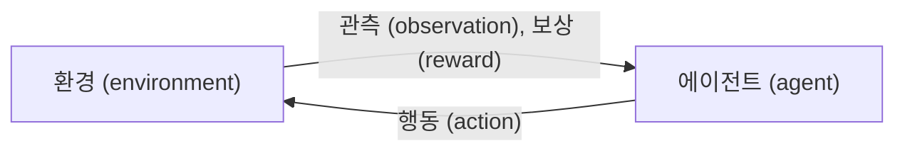
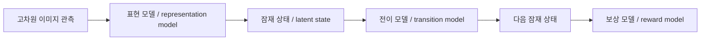
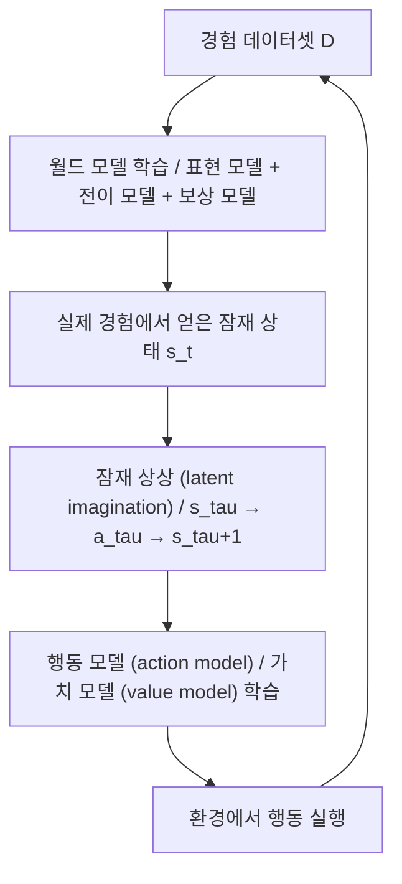
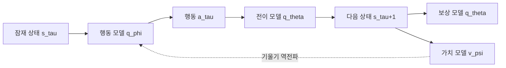
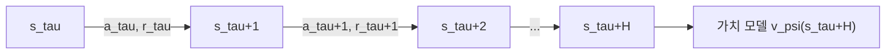

# Dream to Control: Learning Behaviors by Latent Imagination (Dreamer)

!!! info "Information"
    - **Title:** Dream to Control: Learning Behaviors by Latent Imagination (Dreamer)
    - **Venue:** ICLR 2020
    - **Paper:** [arXiv](https://arxiv.org/abs/1912.01603)
    - **Code:** [Homepage](https://dreamrl.github.io)
    - **Presenter:** [Juyeon Kim](https://github.com/JYeonKim)
    - **Last updated:** 2026-04-07

## Background

Dreamer는 강화학습(reinforcement learning), 월드 모델(world model), 잠재 공간(latent space), 부분 관측 마르코프 결정 과정(POMDP) 같은 개념이 한 번에 등장하는 논문이다. 처음 읽으면 용어가 많아 보이지만, 핵심 질문은 단순하다.

> **에이전트가 실제 환경에서 계속 부딪혀 보지 않고, 자기 머릿속에서 미래를 상상하며 더 똑똑하게 배울 수 있는가?**

Dreamer는 이 질문에 대해, **그렇다. 다만 픽셀 공간이 아니라 압축된 잠재 공간에서 상상해야 한다**고 답한다.

### 강화학습(reinforcement learning)이란 무엇인가

강화학습은 **행동을 해 보고, 그 결과로 받은 보상(reward)을 바탕으로 더 좋은 행동 규칙을 배우는 방법**이다. 게임으로 비유하면, 화면을 보고 버튼을 누르고, 점수를 얻으며, 점수를 많이 주는 플레이 방식을 익히는 과정과 같다.



강화학습의 기본 목표는 누적 보상의 기대값을 크게 만드는 것이다.

$$
\max \mathbb{E}\left[\sum_{t=1}^{T} r_t\right]
$$

여기서 $r_t$는 $t$시점의 보상이다. 에이전트는 당장 눈앞의 보상만이 아니라, 앞으로 계속 받을 보상까지 함께 고려해야 한다.

### 모델 프리(model-free)와 모델 기반(model-based)

| 구분 | 모델 프리(model-free) | 모델 기반(model-based) |
| --- | --- | --- |
| 무엇을 배우는가 | 정책(policy), 가치(value) | 정책과 함께 환경의 변화 규칙 |
| 장점 | 구조가 단순하다 | 적은 실제 데이터로도 배울 수 있다 |
| 단점 | 데이터가 많이 든다 | 환경 모델이 틀리면 잘못 배울 수 있다 |
| Dreamer와의 관계 | 해당하지 않는다 | Dreamer는 여기에 속한다 |

Dreamer는 **환경이 어떻게 변하는지 예측하는 월드 모델**을 먼저 배우고, 그 모델 안에서 정책을 학습한다.

### MDP와 POMDP

논문은 시각 제어(visual control)를 **부분 관측 마르코프 결정 과정(POMDP)** 으로 둔다. 이유는 에이전트가 환경의 실제 상태(state)를 직접 보지 못하고, 카메라 이미지 같은 관측(observation)만 보기 때문이다.

예를 들어, 로봇 팔의 사진 한 장만 보고는 그 팔이 지금 얼마나 빠르게 움직이는지 완전히 알기 어렵다. 그래서 **현재 관측만으로는 진짜 상태를 다 알 수 없는 상황**이 생긴다. 이것이 POMDP이다.

논문의 문제 설정은 다음과 같다.

$$
a_t \sim p(a_t \mid o_{\le t}, a_{<t})
$$

$$
o_t, r_t \sim p(o_t, r_t \mid o_{<t}, a_{<t})
$$

$$
\max \mathbb{E}_p\left[\sum_{t=1}^{T} r_t\right]
$$

여기서 $o_t$는 관측, $a_t$는 행동, $r_t$는 보상이다. 핵심은 **에이전트가 이미지 이력과 행동 이력을 바탕으로 미래 보상을 크게 만드는 행동을 골라야 한다**는 점이다.

### 월드 모델(world model)이란 무엇인가

월드 모델은 한마디로 **세상이 어떻게 변하는지에 대한 내부 시뮬레이터**이다. 사람으로 비유하면, “내가 지금 오른쪽으로 뛰면 공이 저쪽으로 갈 것 같다”라고 머릿속으로 미리 그려보는 능력과 비슷하다.

Dreamer의 월드 모델은 픽셀 전체를 그대로 다루지 않는다. 대신 이미지를 압축한 **잠재 상태(latent state)** 를 사용한다. 이렇게 하면 계산이 훨씬 가벼워지고, 수천 개의 미래 경로를 병렬로 상상할 수 있다.

### 왜 잠재 공간(latent space)이 중요한가

픽셀 공간(pixel space)에서 미래 이미지를 직접 예측하면 계산량이 크고 오차가 쉽게 커진다. Dreamer는 이미지를 작은 벡터로 바꾼 뒤 그 벡터 공간 안에서 미래를 예측한다. 이 작은 벡터 공간이 잠재 공간이다.



핵심은 다음과 같다.

1. 이미지를 잠재 상태로 압축한다.  
2. 잠재 상태에서 미래를 예측한다.  
3. 그 상상된 미래를 이용해 행동 규칙을 배운다.  

### Dreamer를 읽기 위한 핵심 용어

| 용어                          | 쉬운 뜻                                                               |
| --------------------------- | ------------------------------------------------------------------ |
| 정책(policy)                  | 어떤 상황에서 어떤 행동을 할지 정하는 규칙이다                                         |
| 가치(value)                   | 지금 상태가 미래까지 봤을 때 얼마나 좋은지 나타내는 점수다                                  |
| 액터(actor)                   | 행동을 고르는 모델이다                                                       |
| 크리틱(critic)                 | 상태의 가치를 평가하는 모델이다                                                  |
| 마르코프(Markov)                | 현재 상태만 알면 미래 예측에 필요한 과거 정보가 충분히 요약되었다는 뜻이다                         |
| 잠재 상태(latent state)         | 이미지를 압축해서 얻은, 학습된 내부 상태 벡터다                                        |
| 상상 지평(imagination horizon)  | 월드 모델이 몇 단계 앞까지 상상할지 정한 길이다                                        |
| 벨만 일관성(Bellman consistency) | 현재 가치가 ‘지금 보상 + 다음 상태의 가치’와 맞아야 한다는 원리다                            |
| 재매개변수화(reparameterization)  | 샘플링된 확률적 행동도 미분 가능한 형태로 바꾸어 학습하는 기법이다                              |
| ELBO                        | 생성 모델을 학습할 때 자주 쓰는 변분 하한(variational lower bound)이다                |
| RSSM                        | 순환 상태 공간 모델(recurrent state-space model)로, Dreamer의 핵심 잠재 동역학 모델이다 |

---

## Summary

Dreamer는 **이미지 입력만 보고 장기적인 행동(long-horizon behavior)을 학습하는 모델 기반 강화학습 에이전트**이다. 이 논문의 핵심은, 실제 환경에서 수없이 시행착오를 하는 대신, 학습된 월드 모델 안에서 잠재 상태를 따라 미래를 상상하고, 그 상상된 궤적을 이용해 정책과 가치를 함께 학습한다는 점이다.

이때 Dreamer는 단순히 짧은 미래 보상만 더하지 않는다. **상상 지평(imagination horizon) 너머의 보상까지 가치 모델(value model)로 추정**한다. 그래서 눈앞의 점수만 쫓는 근시안적 행동을 줄이고, 장기 보상을 노리는 행동을 배울 수 있다.

또한 Dreamer는 온라인 계획(online planning)처럼 매 순간 최적 행동을 새로 찾지 않고, **배운 행동 모델(action model)을 직접 실행**한다. 즉, PlaNet처럼 매번 계획을 세우는 방식보다 실행이 빠르면서도, 월드 모델을 통과하는 **해석적 기울기(analytic gradient)** 를 써서 정책을 효율적으로 학습한다.

실험에서는 DeepMind Control Suite의 20개 시각 제어 과제에서 Dreamer가 **데이터 효율성(data-efficiency), 계산 시간(computation time), 최종 성능(final performance)** 에서 기존 방법을 크게 앞선다. 특히 평균 점수는 5 × 10^6 환경 스텝만으로 823.39를 기록하며, 같은 논문에서 재실행한 PlaNet의 332.97을 크게 넘고, 10^8 스텝을 사용한 강한 모델 프리 기준선 D4PG의 786.32도 앞선다.

---

## Key Contributions

### 1. 잠재 상상(latent imagination)만으로 장기 행동을 학습한다

기존의 많은 모델 기반 강화학습은 짧은 상상 구간 안의 보상만 최적화하거나, 미분 없는 계획(derivative-free planning)에 의존했다. Dreamer는 **잠재 공간에서 상상된 궤적을 따라 가치 기울기(value gradient)를 뒤로 전파**하여 정책을 직접 학습한다. 이것이 이 논문의 가장 큰 공헌이다.

### 2. 유한한 상상 지평의 한계를 가치 모델로 넘는다

상상은 보통 $H$단계까지만 한다. 그런데 그 이후의 보상을 무시하면 장기 과제에서 쉽게 근시안적으로 된다. Dreamer는 **상태 가치(state value)를 함께 예측하여, 상상 지평 너머의 미래를 요약한다.** (Figure 4와 Figure 7에서 이 장치가 장기 과제에서 결정적으로 중요함을 보여줌)

### 3. 월드 모델의 미분 가능성을 실제로 활용한다

신경망 동역학(neural network dynamics)을 쓰면 모델 내부를 따라 미분이 흐를 수 있다. Dreamer는 이 장점을 살려 **행동, 상태, 보상, 가치 예측 전체를 하나의 미분 가능한 계산 그래프**로 묶는다. 그래서 무작위 후보 행동을 많이 던져보는 방식보다 더 직접적으로 정책을 업데이트한다.

### 4. 표현 학습(representation learning)과 행동 학습을 느슨하게 결합한다

Dreamer는 특정한 한 표현 학습만 강제하지 않는다. 논문은 **보상 예측(reward prediction), 픽셀 재구성(reconstruction), 대조 추정(contrastive estimation)** 세 가지를 비교한다. 이 구조 덕분에 나중에 더 좋은 표현 학습이 나오면 Dreamer 위에 그대로 얹기 쉽다.

### 5. 같은 하이퍼파라미터(hyperparameter)로 많은 과제를 푼다

논문은 연속 제어(continuous control) 20개 과제에 대해 같은 하이퍼파라미터를 사용한다. 이는 실험 결과가 특정 과제 튜닝에 크게 의존하지 않음을 보여주는 장점이다.

---

## Method

### 1. 전체 구조

Dreamer의 전체 흐름은 Figure 1, Figure 3, Algorithm 1로 요약된다.
 (../assets/dreamer/20260407000838.png)
 (../assets/dreamer/20260407000918.png)
 (../assets/dreamer/20260407000937.png)

이 구조를 간략히 시각화로 보이면 다음과 같다.



이 구조를 말로 풀면 다음과 같다.

1. 먼저 실제 환경에서 데이터를 모은다.  
2. 그 데이터로 월드 모델을 학습한다.  
3. 실제 데이터에서 출발한 잠재 상태로부터 미래를 상상한다.  
4. 상상된 미래 위에서 행동 모델과 가치 모델을 학습한다.  
5. 학습된 행동 모델을 실제 환경에서 실행하여 데이터를 더 모은다.  

이 다섯 단계가 계속 반복된다.

### 2. 문제 설정: 시각 제어를 POMDP로 본다

Dreamer는 이미지 기반 제어를 POMDP로 둔다. 현실의 진짜 상태는 직접 보이지 않고, 이미지와 보상만 들어오기 때문이다. 이는 월드 모델이 왜 필요한지 바로 보여준다. 현재 이미지 한 장만으로 부족한 정보를, **잠재 상태가 과거를 요약하여 보충**해야 하기 때문이다.

### 3. 잠재 동역학(latent dynamics) 모델

논문은 Dreamer의 월드 모델을 세 부분으로 나눈다.

$$
\text{Representation model: } p_\theta(s_t \mid s_{t-1}, a_{t-1}, o_t)
$$

$$
\text{Transition model: } q_\theta(s_t \mid s_{t-1}, a_{t-1})
$$

$$
\text{Reward model: } q_\theta(r_t \mid s_t)
$$

이 세 식은 각각 다음 뜻을 가진다.

- **표현 모델(representation model)** 은 현재 관측 $o_t$와 직전 잠재 상태 및 행동을 보고 현재 잠재 상태 $s_t$를 만든다.  
- **전이 모델(transition model)** 은 관측을 다시 보지 않고도, 현재 잠재 상태와 행동으로 다음 잠재 상태를 예측한다.  
- **보상 모델(reward model)** 은 잠재 상태가 얼마나 좋은지, 즉 보상이 얼마일지를 예측한다.  

논문은 현실에서 데이터를 생성하는 분포를 주로 $p$로, 상상을 가능하게 하는 근사 분포를 주로 $q$로 표기한다. Dreamer의 핵심은 **이미지 자체를 상상하지 않고 잠재 상태만 상상한다**는 점이다. 그래서 메모리를 적게 쓰고, 많은 미래 궤적을 빠르게 계산할 수 있다.

논문은 이 구조가 **비선형 칼만 필터(non-linear Kalman filter), 잠재 상태 공간 모델(latent state space model), 실수 상태를 갖는 HMM**과 닮았다고 설명한다. 쉬운 말로 하면, “현재까지 본 것을 요약한 내부 상태를 두고, 그 상태가 시간에 따라 어떻게 바뀌는지 배운다”는 뜻이다.

### 4. 상상 환경(imagination environment)

Dreamer는 잠재 상태가 마르코프적이라고 가정한다. 그래서 잠재 상태 위에서는 **완전 관측 MDP**처럼 다룰 수 있다. 논문은 실제 시간 $t$와 구별하기 위해, 상상 속 시간은 $\tau$로 적는다.

상상된 궤적은 실제 경험에서 얻은 잠재 상태 $s_t$에서 출발하여 다음 세 식을 반복한다.

$$
s_\tau \sim q_\theta(s_\tau \mid s_{\tau-1}, a_{\tau-1})
$$

$$
r_\tau \sim q_\theta(r_\tau \mid s_\tau)
$$

$$
a_\tau \sim q_\phi(a_\tau \mid s_\tau)
$$

여기서 중요한 점은, 상상이 아무 데서나 시작되는 것이 아니라 **실제 데이터에서 얻은 잠재 상태에서 시작한다**는 점이다. 즉, Dreamer는 현실과 완전히 동떨어진 허공 상상을 하지 않는다.

### 5. 행동 모델(action model)과 가치 모델(value model)

Dreamer는 액터-크리틱(actor-critic) 구조를 잠재 공간에서 학습한다.

$$
\text{Action model: } a_\tau \sim q_\phi(a_\tau \mid s_\tau)
$$

$$
\text{Value model: } v_\psi(s_\tau) \approx \mathbb{E}\left[\sum_{n=\tau}^{t+H} \gamma^{n-\tau} r_n \mid s_\tau\right]
$$

행동 모델은 “지금 이 잠재 상태라면 어떤 행동을 하는 것이 좋을까”를 출력한다. 가치 모델은 “지금 이 잠재 상태는 앞으로 얼마나 좋은 결과로 이어질까”를 출력한다.

행동 모델은 평균과 표준편차를 예측한 뒤, 이를 **$\tanh$로 변환한 가우시안 분포(Gaussian distribution)** 로 만든다.

$$
a_\tau = \tanh\left(\mu_\phi(s_\tau) + \sigma_\phi(s_\tau)\epsilon\right), \qquad \epsilon \sim \text{Normal}(0, I)
$$

이 식의 의미는 단순하다. 행동을 무작위로 하나 뽑되, 그 무작위성까지 포함해 **신경망 출력으로부터 미분 가능한 형태**로 만든다는 뜻이다. 이렇게 해야 가치가 높아지는 방향으로 정책을 학습할 수 있다.



### 6. 가치 추정(value estimation)

Dreamer의 중요한 아이디어는 **상상 지평 $H$까지만 직접 상상하고, 그 이후는 가치 모델로 이어 붙인다**는 점이다. 논문은 세 가지 가치 추정 방식을 설명한다.

#### (1) 단순 누적 보상 $V_R$

$$
V_R(s_\tau) \doteq \mathbb{E}_{q_\theta, q_\phi}\left(\sum_{n=\tau}^{t+H} r_n\right)
$$

이 방식은 상상 지평 안의 보상만 단순히 더한다. 계산은 쉽지만, 지평 밖의 보상은 완전히 무시한다. 논문은 이 방식을 **가치 모델이 없는 절제 실험(ablation)** 으로 쓴다.

#### (2) $k$-단계 부트스트랩 값 $V_N^k$

$$
V_N^k(s_\tau) \doteq \mathbb{E}_{q_\theta, q_\phi}\left(\sum_{n=\tau}^{h-1} \gamma^{n-\tau} r_n + \gamma^{h-\tau} v_\psi(s_h)\right), \quad h = \min(\tau + k, t + H)
$$

이 방식은 $k$단계까지는 상상한 보상을 더하고, 그 이후는 가치 모델 $v_\psi(s_h)$로 대신한다. 강화학습에서 자주 쓰는 **부트스트랩(bootstrap)** 아이디어이다.

#### (3) Dreamer가 실제로 쓰는 $V_\lambda$

$$
V_\lambda(s_\tau) \doteq (1-\lambda)\sum_{n=1}^{H-1}\lambda^{n-1} V_N^n(s_\tau) + \lambda^{H-1}V_N^H(s_\tau)
$$

$V_\lambda$는 여러 $k$값의 추정을 지수 가중 평균한 것이다. 짧게 부트스트랩하면 편향(bias)이 커지고, 너무 길게 상상하면 분산(variance)과 모델 오차가 커진다. Dreamer는 이 둘의 균형을 위해 $V_\lambda$를 쓴다.



이 그림이 의미하는 바는 간단하다. **앞부분은 직접 상상한 보상으로 계산하고, 끝부분은 가치 모델이 요약한다**는 것이다.

(../assets/dreamer/20260407001947.png)

Figure 4는 바로 이 가치 모델이 얼마나 중요한지를 보여준다. 가치 모델이 있으면 상상 지평 길이에 덜 민감해지고, 장기 과제를 더 잘 푼다.

### 7. 학습 목표(objective)

Dreamer는 먼저 상상된 궤적의 모든 상태에 대해 $V_\lambda(s_\tau)$를 계산한 뒤, 행동 모델과 가치 모델을 각각 업데이트한다.

#### 행동 모델 학습

$$
\max_{\phi}\; \mathbb{E}_{q_\theta, q_\phi}\left(\sum_{\tau=t}^{t+H} V_\lambda(s_\tau)\right)
$$

행동 모델은 가치가 높은 상태들로 이어지는 행동을 출력하도록 학습한다. 핵심은 이 목표를 **월드 모델을 통과하는 해석적 기울기**로 최적화한다는 점이다.

#### 가치 모델 학습

$$
\min_{\psi}\; \mathbb{E}_{q_\theta, q_\phi}\left(\sum_{\tau=t}^{t+H} \frac{1}{2}\left\lVert v_\psi(s_\tau) - V_\lambda(s_\tau)\right\rVert^2\right)
$$

가치 모델은 $V_\lambda$를 맞히도록 회귀(regression)한다. 논문은 일반적인 강화학습처럼 목표값 $V_\lambda$ 주변에서 **기울기를 멈춘다(stop-gradient)** 고 설명한다.

또한 조기 종료(early termination)가 있는 과제에서는, 월드 모델이 각 잠재 상태에서 **할인율(discount factor)** 도 예측한다. 그래서 상상된 미래가 중간에 끝날 가능성이 높을수록 뒤 시점의 항은 자동으로 약하게 반영된다.

### 8. Dreamer의 알고리즘(Algorithm 1)

논문의 Algorithm 1을 쉬운 말로 다시 쓰면 다음과 같다.

```text
1. 무작위 행동으로 초기 에피소드 S개를 모아 데이터셋 D를 만든다.
2. 파라미터 θ(월드 모델), φ(행동 모델), ψ(가치 모델)를 초기화한다.
3. 수렴할 때까지 반복한다.
   3-1. 데이터셋에서 시퀀스 배치를 뽑아 월드 모델을 학습한다.
   3-2. 그 시퀀스의 잠재 상태에서 미래 H단계를 상상한다.
   3-3. 상상된 궤적으로부터 보상과 가치 예측을 계산한다.
   3-4. V_lambda를 만들고, 이를 이용해 행동 모델과 가치 모델을 업데이트한다.
   3-5. 현재 행동 모델을 실제 환경에서 실행해 새로운 데이터를 모은다.
   3-6. 새 데이터를 다시 데이터셋 D에 추가한다.
```

핵심은 **월드 모델 학습 → 상상 속 행동 학습 → 실제 데이터 추가**가 계속 반복된다는 점이다.

### 9. 잠재 동역학 학습: 표현은 어떻게 배우는가

Dreamer의 행동 학습은 월드 모델이 좋아야 잘 된다. 논문은 세 가지 표현 학습 방식을 설명한다.

#### (1) 보상 예측(reward prediction)만으로 배우기

가장 단순한 방식은 미래 보상만 잘 맞히도록 잠재 상태를 배우는 것이다. 하지만 논문은 실제 실험에서 이 방식만으로는 충분하지 않았다고 보고한다.

#### (2) 픽셀 재구성(reconstruction)

PlaNet이 사용하던 방식이며, 실제 실험에서 가장 강했다.

월드 모델은 다음 네 가지 요소를 둔다.

$$
\text{Representation model: } p_\theta(s_t \mid s_{t-1}, a_{t-1}, o_t)
$$

$$
\text{Observation model: } q_\theta(o_t \mid s_t)
$$

$$
\text{Reward model: } q_\theta(r_t \mid s_t)
$$

$$
\text{Transition model: } q_\theta(s_t \mid s_{t-1}, a_{t-1})
$$

그리고 목적식은 다음과 같다.

$$
J_{\text{REC}} \doteq \mathbb{E}_p\left(\sum_t \left(J_O^t + J_R^t + J_D^t\right)\right) + \text{const}
$$

$$
J_O^t \doteq \ln q(o_t \mid s_t)
$$

$$
J_R^t \doteq \ln q(r_t \mid s_t)
$$

$$
J_D^t \doteq -\beta \,\text{KL}\Big(p(s_t \mid s_{t-1}, a_{t-1}, o_t)\; || \; q(s_t \mid s_{t-1}, a_{t-1})\Big)
$$

각 항의 의미는 다음과 같다.

- $J_O^t$는 잠재 상태가 현재 이미지를 잘 설명해야 함을 뜻한다.  
- $J_R^t$는 잠재 상태가 보상도 잘 설명해야 함을 뜻한다.  
- $J_D^t$는 현재 이미지를 너무 과하게 베끼지 말고, 전이 모델이 예측한 상태와 너무 멀어지지 말라는 규제항이다.  

논문은 전이 모델을 RSSM으로, 이미지 인코더를 CNN으로, 이미지 복원기를 전치 CNN(transposed CNN)으로 구현한다.

#### (3) 대조 추정(contrastive estimation)

픽셀을 직접 맞히는 대신, “이 이미지가 이 잠재 상태를 잘 설명하는가”를 학습하는 방식이다. 이때 관측 모델 대신 상태 모델을 둔다.

$$
\text{State model: } q_\theta(s_t \mid o_t)
$$

대조 목적식은 다음과 같다.

$$
J_{\text{NCE}} \doteq \mathbb{E}\left(\sum_t \left(J_S^t + J_R^t + J_D^t\right)\right)
$$

$$
J_S^t \doteq \ln q(s_t \mid o_t) - \ln \left(\sum_{o'} q(s_t \mid o')\right)
$$

쉽게 말하면, **현재 이미지가 현재 잠재 상태를 잘 가리키게 하되, 모든 이미지가 비슷한 잠재 상태로 무너져버리는 현상은 막는다**는 뜻이다.

논문 실험에서는 이 방식이 절반 정도 과제에서는 통했지만, 전체적으로는 재구성 방식보다 약했다.

## Results

### 1. 실험 설정

(../assets/dreamer/20260407003507.png)

논문은 DeepMind Control Suite의 시각 제어 20개 과제를 사용한다. Figure 2는 Cup, Acrobot, Hopper, Walker, Quadruped의 예시 이미지를 보여준다. 이 과제들은 접촉 동역학(contact dynamics), 희소 보상(sparse rewards), 많은 자유도(degrees of freedom), 3차원 장면을 포함한다.

실험 설정의 핵심은 다음과 같다.

- 입력 이미지는 64 × 64 × 3이다.  
- 행동 차원은 1에서 12 사이이다.  
- 보상은 0에서 1 사이이다.  
- 에피소드 길이는 1000스텝이다.  
- 초기 상태는 무작위화된다.  
- 모든 연속 제어 과제에서 같은 하이퍼파라미터를 쓴다.  
- action repeat는 고정된 $R = 2$이다.  

논문은 추가로, 이산 행동(discrete action)과 조기 종료(early termination)에 대해서도 Atari 일부 게임과 DeepMind Lab 일부 레벨에서 Dreamer를 실험한다.

### 3. 주요 정량 결과(Table G)

(../assets/dreamer/20260407003821.png)

논문 부록 G의 연속 제어 최종 점수는 다음과 같다. A3C는 proprio 입력, D4PG와 PlaNet, Dreamer는 pixel 입력을 사용한다. 또한 PlaNet 점수는 action repeat를 $R = 2$로 고정하여 다시 실행한 값이다.

이 표는 두 가지를 동시에 보여준다.

첫째, Dreamer가 **모든 과제에서 무조건 최고는 아니다**. 예를 들어 Finger Spin, Hopper Stand, Walker Stand 같은 과제에서는 D4PG가 더 높다. 이 점은 논문을 읽을 때 꼭 기억해야 한다. Dreamer는 “전 과제를 압도적으로 다 이긴 방법”이라기보다, **평균적으로 매우 강하고 특히 장기 과제에서 두드러진 방법**이다.

둘째, Dreamer의 진짜 장점은 **샘플 효율성(sample efficiency)** 이다. 논문 Figure 6의 핵심 문장은 다음과 같이 요약할 수 있다.

(../assets/dreamer/20260407003954.png)

- Dreamer: 평균 823, 5 × 10^6 환경 스텝  
- PlaNet: 평균 333, 5 × 10^6 환경 스텝  
- D4PG: 평균 786, 10^8 환경 스텝  

즉 Dreamer는 훨씬 적은 실제 환경 상호작용으로 강한 모델 프리 기준선을 앞선다.

### 4. Figure 4: 왜 가치 모델이 그렇게 중요한가

(../assets/dreamer/20260407004228.png)

Figure 4는 Dreamer를 세 가지와 비교한다.

1. **Dreamer ($V_\lambda$ 사용)**  
2. **No value ($V_R$만 사용)**  
3. **PlaNet ($V_R$를 쓰는 온라인 계획)**  

결과는 일관되다. 가치 모델이 없는 방법은 상상 지평에 크게 민감하다. 상상 길이가 짧으면 장기 보상을 놓치고, 길면 모델 오차가 쌓이기 쉽다. 반면 Dreamer는 **가치 모델이 지평 너머를 요약**하기 때문에, 상상 지평이 달라져도 성능이 상대적으로 안정적이다.

이 결과는 Dreamer의 핵심 주장이 단순한 아이디어가 아니라 실제 효과가 있음을 보여준다.

### 5. Figure 5: Dreamer의 월드 모델은 정말 미래를 예측하는가

(../assets/dreamer/20260407004724.png)

Figure 5는 두 개의 hold-out trajectory에 대해, 처음 5장의 실제 이미지만 보고 **행동 정보만으로 45스텝 앞까지 재구성한 결과**를 보여준다. 그림만 보면 완벽한 픽셀 수준 예언은 아니지만, 긴 시간 동안 물체의 위치와 움직임을 꽤 잘 따라간다.

이 그림의 메시지는 분명하다. Dreamer가 정책을 잠재 공간에서 배울 수 있는 이유는, 그 잠재 동역학이 **장기 구조를 어느 정도 보존하는 상상 환경**을 만들기 때문이다.

### 6. Figure 7과 Figure 10: 장기 과제에서 왜 Dreamer가 강한가

(../assets/dreamer/20260407004829.png)

Figure 7은 Acrobot Swingup, Hopper Hop, Pendulum Swingup, Quadruped Walk 같은 장기 신용 할당(long-horizon credit assignment) 문제가 필요한 과제에서 Dreamer가 특히 강함을 보여준다. 논문은 장기 보상을 연결해야 하는 이런 과제에서는 **상상 구간 안의 보상만 최적화하는 방법이 쉽게 실패**한다고 해석한다.

(../assets/dreamer/20260407004920.png)

Figure 10의 전체 학습 곡선을 보면 Dreamer는 20개 중 대부분에서 No value와 PlaNet을 앞선다. 논문은 horizon 20 설정에서 Dreamer가 20개 중 16개 과제에서 우세하고, 4개는 비긴다고 서술한다.

### 7. Figure 8과 Figure 11: 표현 학습이 성능을 좌우한다
(../assets/dreamer/20260407005034.png)

(../assets/dreamer/20260407005007.png)

Dreamer는 표현 학습을 분리해서 볼 수 있는 구조를 가진다. Figure 8과 Figure 11은 다음 순서를 보여준다.

1. **픽셀 재구성(reconstruction)** 이 대체로 가장 좋다.  
2. **대조 추정(contrastive)** 은 절반 정도 과제에서 경쟁력이 있다.  
3. **보상만 예측(reward only)** 하는 방식은 전반적으로 부족하다.  

이는 Dreamer가 “강력한 행동 학습 알고리즘”인 동시에, **좋은 월드 모델이 있어야 비로소 제힘을 낸다**는 뜻이다. 논문 결론도 미래 연구 방향으로 표현 학습 발전을 강조한다.

## Discussion

### 1. Dreamer의 강점

#### (1) 월드 모델을 ‘정책 학습’까지 밀어붙인다는 점이 강하다

기존 연구 중에는 월드 모델을 온라인 계획에만 쓰거나, 세계를 대충 예측만 하고 정책 학습은 따로 하는 경우가 많았다. Dreamer는 **월드 모델 내부에서 직접 액터-크리틱 학습을 수행**한다. 이것이 PlaNet과 가장 크게 갈리는 지점이다.

#### (2) 픽셀을 직접 상상하지 않고 잠재 상태를 상상한다

이는 계산량과 안정성 면에서 큰 장점이다. 픽셀 미래 예측은 무겁고 오차가 커지기 쉽다. Dreamer는 잠재 상태만 굴리기 때문에 **수천 개의 상상 궤적을 빠르게 병렬 처리**할 수 있다.

#### (3) 상상 지평의 짧음을 가치 모델로 보완한다

Dreamer의 가치 모델은 “지금 여기서 계속 잘하면 앞으로 얼마나 좋을까”를 요약하는 장치이다. 이 장치가 없으면 짧은 미래 안의 보상만 보게 되어 장기 과제에 약해진다. Figure 4와 Figure 7은 바로 이 부분을 실험적으로 뒷받침한다.

#### (4) 샘플 효율성과 계산 시간 모두 좋다

논문은 Dreamer가 PlaNet보다 평균 성능이 높고, D4PG보다 적은 환경 상호작용으로 더 높은 평균 점수를 냈다고 보고한다. 게다가 10^6 스텝당 약 3시간 학습으로 계산 시간 면에서도 유리하다고 설명한다.

### 2. Dreamer의 한계와 주의할 점

#### (1) 월드 모델이 틀리면 정책도 틀릴 수 있다

Dreamer는 모델 안에서 상상하며 학습하기 때문에, **월드 모델 오차(model error)**가 누적되면 잘못된 행동을 배울 위험이 있다. 논문은 잠재 공간, 짧은 상상, 가치 부트스트랩으로 이를 완화하지만, 이 문제가 완전히 사라진 것은 아니다.

#### (2) 표현 학습 품질에 크게 의존한다

Figure 8과 Figure 11이 보여주듯, 어떤 표현 학습 목적식을 쓰느냐에 따라 결과 차이가 크다. 즉 Dreamer의 성능은 순수하게 행동 학습 알고리즘만의 힘이 아니라, **좋은 잠재 표현을 얼마나 잘 얻느냐**에도 달려 있다.

#### (3) 모든 과제에서 절대 최강은 아니다

Table G를 보면 Dreamer가 평균은 최고지만, Finger Spin, Hopper Stand, Walker Stand 등 일부 과제에서는 D4PG가 더 높다. 따라서 Dreamer를 “항상 최고인 만능 방법”으로 이해하면 안 된다.

#### (4) 이산 제어에서는 아직 발전 여지가 크다

논문은 Atari와 DeepMind Lab 일부 과제에 대한 가능성을 보여주지만, 이 영역에서 당시 최고 수준의 성능을 전면적으로 주장하지는 않는다. 이는 Dreamer의 핵심 장점이 우선 **연속 제어와 시각 기반 장기 과제**에서 가장 분명하게 나타났다는 뜻이다.

### 3. World Models, PlaNet, Dreamer를 한 줄씩 비교하면

| 방법 | 월드 모델 사용 방식 | 행동 결정 방식 | Dreamer와의 차이 |
| --- | --- | --- | --- |
| World Models (2018) | 꿈속 환경을 만들고 컨트롤러를 학습한다 | 진화 전략(CMA-ES) | Dreamer는 가치 기울기를 이용해 정책을 직접 학습한다 |
| PlaNet (2018) | 잠재 동역학을 학습한다 | 매 시점 온라인 계획 | Dreamer는 계획을 매번 하지 않고 정책을 학습해 바로 실행한다 |
| Dreamer (2020) | 잠재 동역학 + 가치 모델 | 잠재 공간 액터-크리틱 | 장기 가치와 미분 가능한 상상을 함께 활용한다 |

이 표를 보면 Dreamer의 위치가 분명해진다. Dreamer는 **월드 모델 기반 계획(planning)**과 **정책 학습(policy learning)** 사이를 강하게 연결한 논문이다.

### 4. 이 논문이 왜 중요한가

Dreamer는 이후 DreamerV2, DreamerV3로 이어지는 계보의 시작점이다. 더 넓게 보면, 이 논문은 “월드 모델이 있으면 계획만 하는 것이 아니라, 정책 자체를 학습할 수도 있다”는 것을 설득력 있게 보여준 사례이다.

특히 이 논문의 메시지는 다음 한 문장으로 정리할 수 있다.

> **좋은 잠재 월드 모델이 있다면, 에이전트는 그 안에서 미래를 상상하고, 그 상상에서 바로 행동을 배울 수 있다.**
