# GAIA-1: A Generative World Model for Autonomous Driving

!!! info "Information"
    - **Title:** GAIA-1: A Generative World Model for Autonomous Driving
    - **Venue:** arXiv 2023
    - **Paper:** [arXiv](https://arxiv.org/abs/2309.17080)
    - **Homepage:** [Wayve](https://wayve.ai/thinking/scaling-gaia-1/)
    - **Presenter:** 이재호
    - **Last updated:** 2026-06-07

## 0. Summary

GAIA-1은 **자율주행 장면을 `video + text + action` token sequence로 바꾸고, GPT처럼 다음 image token을 예측한 뒤, diffusion decoder로 미래 주행 비디오를 생성하는 generative world model**이다.

직관적으로 정리하면 다음과 같다.

> **“내 차가 지금 이 장면에서 이렇게 움직이면, 앞으로 도로가 어떻게 변할까?”를 비디오로 상상하는 모델**

**핵심 방법론**

1. **Multimodal tokenization**  
   주행 video, text prompt, ego action을 Transformer가 다룰 수 있는 token sequence로 바꾼다.

2. **Autoregressive world model**  
   언어 모델이 다음 단어를 예측하듯, GAIA-1은 다음 image token을 예측한다.

3. **Video diffusion decoder**  
   예측된 image token을 사람이 볼 수 있는 high-quality future driving video로 복원한다.

**핵심 기여**

1. **자율주행 world modeling을 next-token prediction 문제로 재정의했다.**  
   world model을 reward/state 예측 중심의 latent model이 아니라, action/text-conditioned future video generation으로 확장했다.

2. **생성형 모델 기반 neural simulator의 가능성을 보여줬다.**  
   policy를 직접 학습하는 논문은 아니지만, 자율주행 모델 학습·검증에 쓸 수 있는 controllable future generator의 방향을 제시한다.

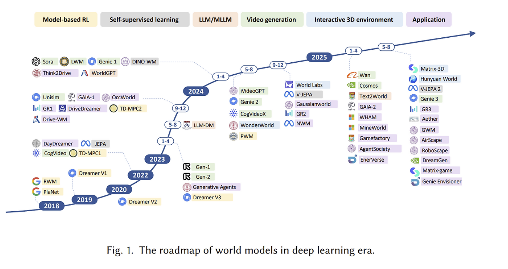
> 2023년 이후 world model 논의는 RL 내부의 latent dynamics model을 넘어, **application-level video generation world model**로 확장되고 있다. GAIA-1은 이 흐름에서 자율주행 video generation을 action/text-conditioned future prediction 문제로 연결한 사례다.  
> 출처: *Understanding World or Predicting Future? A Comprehensive Survey of World Models*


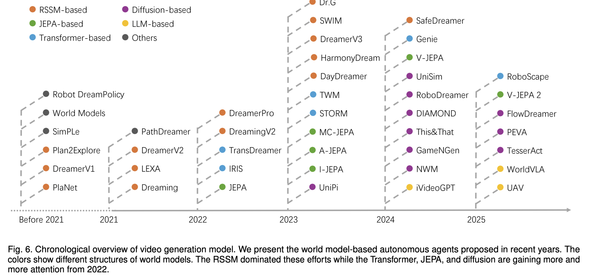

>최근에는 Dreamer 계열의 RSSM처럼 latent dynamics를 recurrent하게 예측하는 방식만이 아니라, **Transformer 기반 sequence modeling**과 **diffusion 기반 video generation**이 world model 연구에서 더 큰 관심을 얻고 있다. 이 변화는 Sora 같은 비디오 생성 모델을 world simulator 관점에서 해석하려는 논의와도 이어진다.  
출처: *Is Sora a World Simulator? A Comprehensive Survey on General World Models and Beyond*


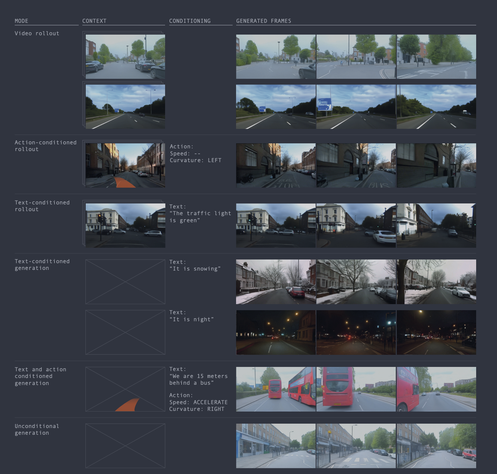

> **이미지 설명:** GAIA-1의 핵심 입력과 출력을 한 장으로 보여주는 overview이다. 과거 주행 video, text condition, ego action을 조건으로 받아 미래 driving video를 생성한다는 전체 문제 설정을 압축해서 보여준다.

---

## 1. GAIA-1은 어떤 문제를 풀려고 했나?

### 1.1 이 논문이 풀려고 한 문제

자율주행에서 어려운 점은 단순히 현재 장면을 인식하는 것이 아니다. 핵심은 다음 질문이다.

> **현재 도로 상황에서 내 차가 특정 행동을 하면, 앞으로 어떤 미래들이 가능할까?**

수식으로 쓰면 다음과 같다.

$$
p(x_{t+1:t+H} \mid x_{\leq t}, a_{t:t+H}, c)
$$

| 기호 | 의미 |
|---|---|
| $x_{\leq t}$ | 지금까지 본 주행 비디오 |
| $a_{t:t+H}$ | 앞으로 ego-vehicle이 취할 action, 예: speed, curvature |
| $c$ | text condition, 예: rainy night, red traffic light |
| $x_{t+1:t+H}$ | 앞으로 생성될 미래 주행 비디오 |

즉 GAIA-1의 목표는 단순한 video generation이 아니라, **action과 text에 의해 조절되는 미래 driving scenario 생성**이다.

---

### 1.2 기존 접근의 한계

| 기존 흐름                           | 장점                                       | 한계                                                             |
| ------------------------------- | ---------------------------------------- | -------------------------------------------------------------- |
| 기존 world model / model-based RL | 행동에 따른 미래 예측, planning에 유리               | 보통 low-dimensional latent 중심이라 고화질 주행 비디오 생성이 약함               |
| 기존 video generation             | 시각적으로 그럴듯한 비디오 생성                        | action-conditioned dynamics, 즉 “내가 이렇게 운전하면 미래가 어떻게 달라지나?”가 약함 |

GAIA-1은 이 둘을 합치려 한다.

```text
World Model의 장점: 행동에 따른 미래 예측
+
Generative Video Model의 장점: 현실적인 비디오 생성
=
GAIA-1: Generative World Model for Autonomous Driving
```

---

### 1.3 핵심 아이디어

GAIA-1은 world modeling 문제를 다음처럼 바꾼다.

```text
미래 비디오 예측 문제
→ discrete image token sequence 예측 문제
→ next-token prediction 문제
```

즉, 언어모델이 다음 단어를 예측하듯이 GAIA-1은 다음 image token을 예측한다.

$$
p_\theta(z_{1:N} \mid c)
= \prod_{i=1}^{N} p_\theta(z_i \mid z_{<i}, c)
$$

여기서:

| 기호 | 의미 |
|---|---|
| $z_i$ | image token |
| $z_{<i}$ | 이전 image token들 |
| $c$ | video context, action, text condition |


> **GAIA-1은 자율주행 세계를 GPT가 읽을 수 있는 token sequence로 바꾼 뒤, 다음 token을 예측하게 만든 모델이다.**

---

## 2. 자율주행 세계를 token sequence로 바꾸자: Methods

### 2.1 전체 구조


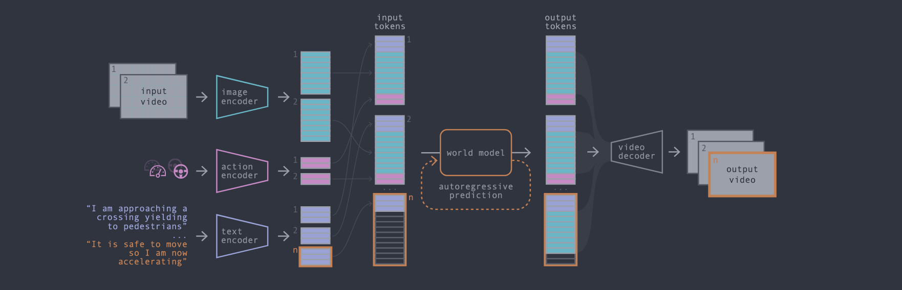
> **Keyword:** Tokenizer, Autoregressive Transformer, Diffusion Decoder
>
> **이미지 설명:** GAIA-1의 전체 pipeline은 세 단계로 읽으면 된다. 먼저 video, text, action을 token sequence로 바꾸고, autoregressive Transformer가 미래 image token을 예측한다. 마지막으로 diffusion decoder가 예측된 token을 사람이 볼 수 있는 주행 비디오로 복원한다.


GAIA-1은 크게 3단계로 이해하면 된다.

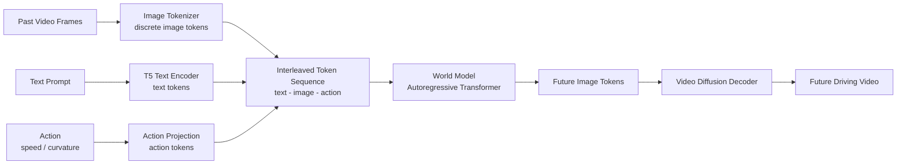

핵심은 이거다.

| 구성요소 | 역할 | 리뷰 우선순위 |
|---|---|---|
| Image tokenizer | 주행 이미지를 discrete token으로 압축 | A |
| Text encoder | 텍스트 조건을 token으로 변환 | B |
| Action encoder | speed, curvature를 token representation으로 변환 | A |
| Autoregressive Transformer | 과거 token을 보고 다음 image token 예측 | A |
| Video diffusion decoder | 예측된 token을 고화질 비디오로 복원 | B |

---

### 2.2 Image Tokenizer

이미지를 픽셀 그대로 예측하면 너무 크고 복잡하다. 그래서 GAIA-1은 이미지를 discrete token으로 바꾼다.

```text
Raw image
→ image tokenizer
→ [token_1, token_2, token_3, ...]
```

언어 모델과 비교하면 다음과 같다.

| Language Model    | GAIA-1                |
| ----------------- | --------------------- |
| 문장을 단어/token으로 나눔 | 이미지를 image token으로 나눔 |
| 다음 단어 예측          | 다음 image token 예측     |
| 문장 생성             | 미래 주행 비디오 생성          |

중요한 점은 image token이 단순한 픽셀 조각이 아니라, **차량, 도로, 하늘, 차선 같은 semantic structure를 담도록 유도**된다는 점이다. GAIA-1은 DINO feature distillation을 사용해 token이 더 semantic한 정보를 담도록 만든다.

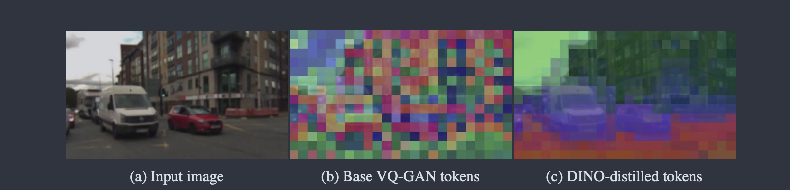
> **Keyword:** Discrete Image Token, DINO Distillation, Semantic Representation
>
> **이미지 설명:** 원본 이미지를 픽셀 그대로 예측하지 않고 discrete image token으로 압축하는 과정을 보여준다. DINO feature distillation을 통해 token이 단순한 색·질감보다 장면의 의미 구조를 더 잘 담도록 만든다.


---

### 2.3 Action-Conditioned Generation

GAIA-1이 단순 video generation과 다른 이유는 **action condition**이 들어간다는 점이다.

```text
현재 장면 + 행동 → 행동에 맞는 미래 장면
```

자율주행에서 action은 보통 다음과 같이 해석할 수 있다.

| Action    | 의미                                  |
| --------- | ----------------------------------- |
| speed     | ego-vehicle의 속도                     |
| curvature | ego-vehicle이 얼마나 휘어서 이동하는지, 즉 조향 방향 |

예시:

| 같은 현재 장면  | action | 생성되어야 하는 미래     |
| --------- | ------ | --------------- |
| 로터리에 접근 중 | 직진     | 로터리를 지나 직진하는 영상 |
| 로터리에 접근 중 | 우회전    | 오른쪽 도로로 진입하는 영상 |
| 앞차에 접근 중  | 감속     | 앞차와 거리 유지       |
| 앞차에 접근 중  | 가속     | 앞차와 가까워짐        |

이 개념이 world model과 연결된다.

> **World model의 핵심은 “미래가 어떻게 될까?”가 아니라 “내가 이 행동을 하면 미래가 어떻게 될까?”이다.**

---

### 2.4 Autoregressive Transformer

GAIA-1의 world model은 autoregressive Transformer다.

직관적으로 보면:

```text
이전 token들 → 다음 token 예측
```

GAIA-1에서는:

```text
과거 image token + text token + action token
→ 다음 image token
```

수식으로 단순화하면:

$$
\mathcal{L}_{WM}
= - \sum_i \log p_\theta(z_i^{img} \mid z_{<i}^{img}, z_{\leq i}^{text}, z_{\leq i}^{act})
$$

| 항목 | 의미 |
|---|---|
| $z_i^{img}$ | 예측해야 하는 현재 image token |
| $z_{<i}^{img}$ | 이전 image token들 |
| $z_{\leq i}^{text}$ | text condition |
| $z_{\leq i}^{act}$ | action condition |
| $\mathcal{L}_{WM}$ | 실제 다음 image token의 likelihood를 높이는 loss |


> **실제 주행 데이터에서 다음 image token을 잘 맞히도록 학습한다.**

---

### 2.5 Video Diffusion Decoder

Transformer가 예측하는 것은 사람이 볼 수 있는 비디오가 아니라 image token이다.

```text
[134, 22, 991, 7, ...]
```

이 token을 실제 비디오로 복원하기 위해 diffusion decoder를 사용한다.

```text
future image tokens
→ video diffusion decoder
→ high-quality future driving video
```

Diffusion decoder는 노이즈를 점점 제거하면서 비디오를 복원하는 모델이라고 이해하면 된다.

간단한 diffusion training objective는 다음처럼 볼 수 있다.

$$
\mathcal{L}_{dec}
= \mathbb{E}_{x, \epsilon, \tau}
\left[\lVert \epsilon - \epsilon_\phi(x_\tau, \tau, z) \rVert^2 \right]
$$

| 기호 | 의미 |
|---|---|
| $x$ | 실제 비디오 frame sequence |
| $\epsilon$ | 추가한 노이즈 |
| $x_\tau$ | 노이즈가 섞인 비디오 |
| $z$ | image token condition |
| $\epsilon_\phi$ | decoder가 예측한 노이즈 |


> **Transformer는 미래의 구조를 예측하고, diffusion decoder는 그 구조를 실제처럼 보이는 비디오로 렌더링한다.**


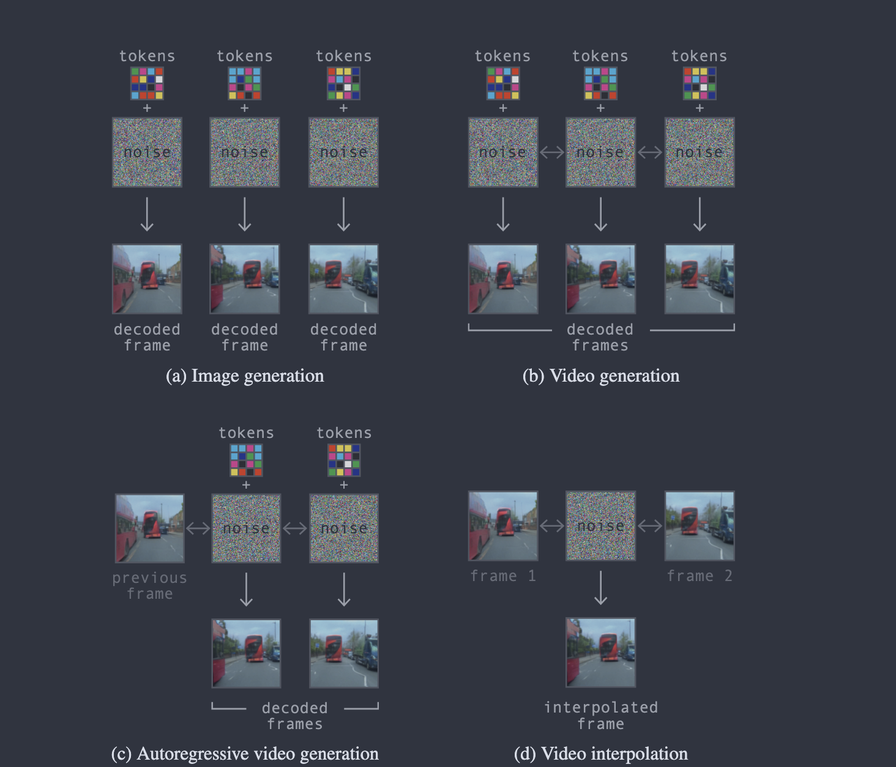
> **Keyword:** Video Diffusion Decoder, Reconstruction, High-quality Rendering
>
> **이미지 설명:** decoder가 image token 조건을 받아 실제 비디오 frame sequence를 복원하도록 학습되는 방식을 보여준다. Transformer가 예측한 구조를 diffusion decoder가 시각적으로 자연스러운 주행 영상으로 렌더링하는 단계다.


### 2.6 GAIA-1 알고리즘 형태

```text
Algorithm: GAIA-1 Future Video Generation

Input:
  - context video frames x_{≤t}
  - optional text prompt c
  - future ego actions a_{t:t+H}

Step 1. Video frames를 image tokenizer로 discrete image tokens로 변환한다.
Step 2. Text prompt를 text tokens로 변환한다.
Step 3. Speed / curvature action을 action tokens로 변환한다.
Step 4. text - image - action 순서로 token sequence를 구성한다.
Step 5. Autoregressive Transformer가 다음 image token을 순서대로 예측한다.
Step 6. Top-k sampling으로 다양성과 안정성의 균형을 맞춘다.
Step 7. Video diffusion decoder가 예측된 image tokens를 pixel-space video로 복원한다.
Output:
  - action/text 조건에 맞는 future driving video
```

---

## 3. 이전 world model / 생성형 모델 계열과의 연결

### Dreamer 계열과 연결

Dreamer는 world model 안에서 imagined trajectory를 만들고, 그 상상 속 trajectory로 actor-critic을 학습한다.

| 비교 | Dreamer 계열 | GAIA-1 |
|---|---|---|
| 핵심 질문 | 상상 속에서 어떻게 더 좋은 행동을 배울까? | 행동 조건을 넣으면 어떤 미래 비디오가 생성될까? |
| world model 출력 | latent state, reward, continuation | future image tokens / video |
| 학습 목적 | policy improvement | controllable future video generation |
| planning/control | actor-critic 학습에 직접 연결 | neural simulator 가능성은 있지만 policy 학습은 직접 수행하지 않음 |
| 관측 복원 | representation 학습 신호로 사용 | 최종 결과물로 realistic video 생성 |

정리:

> **Dreamer는 “상상해서 행동을 배우는 모델”이고, GAIA-1은 “행동 조건을 넣어 미래 장면을 생성하는 모델”이다.**

---

### Trajectory Transformer 계열과 연결

Trajectory Transformer는 RL을 state/action/reward의 sequence modeling 문제로 본다.

```text
Trajectory Transformer:
(s_t, a_t, r_t, s_{t+1}, a_{t+1}, r_{t+1}, ...)
→ sequence modeling
```

GAIA-1도 유사하게 world modeling을 sequence modeling으로 바꾼다.

```text
GAIA-1:
(text token, image token, action token, ...)
→ next image token prediction
```

| 비교 | Trajectory Transformer | GAIA-1 |
|---|---|---|
| 데이터 단위 | state, action, reward trajectory | video, text, action tokens |
| 모델 | Transformer | Autoregressive Transformer |
| 생성 대상 | reward가 높은 trajectory | plausible future driving video |
| decoding | beam search planning | top-k sampling, text guidance, diffusion decoding |
| 핵심 연결 | RL을 sequence modeling으로 재해석 | world modeling을 next-token prediction으로 재해석 |

정리:

> **Trajectory Transformer가 “강화학습을 하나의 sequence modeling 문제로 보자”였다면, GAIA-1은 “자율주행 세계를 multimodal token sequence로 보자”이다.**

---

### JEPA 계열과 연결

JEPA 계열은 pixel을 직접 예측하기보다 **representation space에서 미래 또는 가려진 부분을 예측**하는 방향이다.

| 비교 | JEPA / V-JEPA | GAIA-1 |
|---|---|---|
| 핵심 철학 | pixel detail보다 abstract representation 예측 | raw pixel 대신 discrete image token 예측 |
| 생성형 여부 | 대체로 non-generative representation learning | generative video world model |
| 예측 공간 | learned representation / embedding space | discrete image token space + pixel video decoding |
| 장점 | semantic representation, sample efficiency | controllable future video generation |
| 공통점 | 픽셀을 직접 맞히는 부담을 줄임 | 픽셀 대신 압축 representation을 예측 |

정리:

> **JEPA는 “픽셀 말고 의미 표현을 예측하자”이고, GAIA-1은 “미래를 pixel이 아니라 discrete image token으로 예측한 뒤 diffusion으로 복원하자”이다.**

---

## 4. 이 논문의 기여는 무엇인가?

### 4.1 핵심 기여

| 번호 | 기여 | 의미 |
|---:|---|---|
| 1 | 자율주행 world modeling을 next-token prediction으로 재정의 | LLM식 scaling과 training objective를 자율주행 비디오에 적용 |
| 2 | video, text, action을 통합한 multimodal world model | 현재 장면뿐 아니라 action과 language로 미래를 제어 |
| 3 | autoregressive Transformer + video diffusion decoder 결합 | high-level dynamics와 high-quality rendering을 분리 |
| 4 | 대규모 실제 주행 데이터 기반 학습 | London driving data 4,700시간, 약 420M images 규모 |
| 5 | neural simulator 가능성 제시 | synthetic data, adversarial scenarios, validation에 활용 가능 |

---

### 4.2 이 논문이 새롭게 보여준 관점

기존에는 world model을 주로 이렇게 생각했다.

```text
현재 latent state + action
→ 다음 latent state / reward
→ planning or policy learning
```

GAIA-1은 관점을 바꾼다.

```text
현재 video + action + text
→ 미래 image tokens
→ future driving video
→ neural simulator
```

이 전환이 중요한 이유는 다음과 같다.

| 관점 | 기존 world model | GAIA-1 |
|---|---|---|
| 목표 | control / planning | realistic future generation |
| 표현 | compact latent | discrete image tokens |
| 결과물 | policy 학습에 필요한 내부 상태 | 사람이 볼 수 있는 driving video |
| 평가 | reward, return, success rate | realism, controllability, scaling, qualitative capability |

## 5. Experiment

### 5.1 GAIA-1의 실험은 benchmark보다 capability 중심이다

GAIA-1의 실험은 RL benchmark 점수보다 **주행 세계를 얼마나 그럴듯하게 예측하고 조작할 수 있는지**를 보여주는 데 초점이 있다.

섹션 5는 세 가지 축으로 읽으면 된다.

- **Data:** 2019~2023년 런던 데이터로 충분히 크게 학습했는가?
- **Scaling:** next-token prediction world model에서도 scaling trend가 보이는가?
- **Capabilities:** long rollout, multiple futures, text/action control이 실제로 나타나는가?


---

### 5.2 Data Sampling

GAIA-1의 데이터 설정은 다음처럼 요약할 수 있다.

- **데이터:** 2019~2023년 런던 데이터
- **규모:** 약 4,700시간, 약 420M unique images
- **입력:** 25Hz 주행 비디오
- **검증:** 400시간 validation data + geofenced validation region

핵심은 데이터를 많이 쓰는 것만이 아니라, **sampling distribution을 조절했다는 점**이다. 논문은 latitude, longitude, weather category, steering behavior, speed behavior 등을 기준으로 sampling을 조정한다. 특정 지역이나 특정 날씨에 치우치면 모델이 주행 규칙을 배운 것이 아니라 자주 본 장면을 외울 수 있기 때문이다.

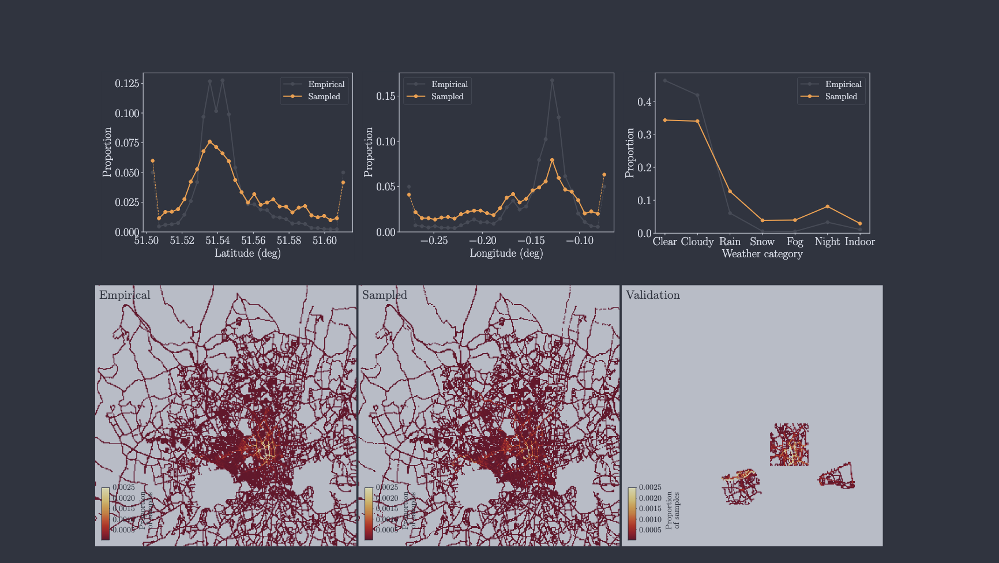
> **Figure 설명:** 논문 Figure 5의 data sampling 그림이다. 위쪽은 latitude, longitude, weather에 대해 실제 데이터 분포와 sampling 후 분포를 비교하고, 아래쪽은 empirical / sampled / validation 좌표 heatmap을 보여준다. 즉, 학습 데이터의 지역·날씨 편향을 줄이고 geofenced validation을 따로 둔 설정을 보여준다.

---

### 5.3 Sampling Strategy와 Scaling

GAIA-1은 image token을 autoregressive하게 생성한다. 따라서 token을 어떻게 뽑는지가 중요하다.

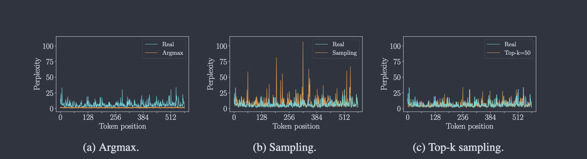
> **Figure 설명:** 논문 Figure 6의 sampling strategy 비교다. Argmax는 perplexity가 너무 낮아 다양성이 사라지고, 전체 distribution에서 sampling하면 unreliable tail 때문에 perplexity spike가 생긴다. Top-k sampling은 real token과 더 비슷한 perplexity 분포를 만들어, 다양성과 안정성의 균형을 맞춘다.

Scaling 분석도 같은 맥락에서 읽으면 된다. GAIA-1은 future prediction을 discrete image token의 next-token prediction 문제로 바꾸었기 때문에, validation cross-entropy로 모델 크기에 따른 성능 변화를 볼 수 있다.

주의할 점은 이 지표가 driving score가 아니라는 것이다. Cross-entropy가 낮다는 것은 다음 image token을 더 잘 예측한다는 뜻이지, 곧바로 안전한 driving decision을 보장한다는 뜻은 아니다.

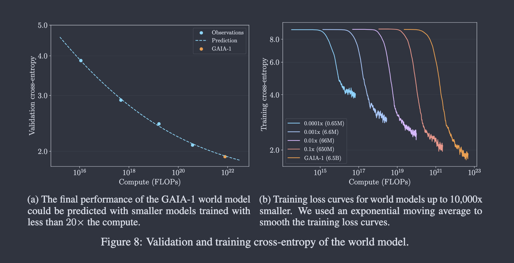
> **Figure 설명:** 논문 Figure 8의 scaling 분석이다. 작은 모델들의 validation cross-entropy를 power-law로 맞추어 6.5B 규모 GAIA-1 world model의 최종 loss를 예측한다. 오른쪽은 모델 규모별 training cross-entropy curve를 보여준다.

---

### 5.4 Qualitative Capabilities: 생성 결과에서 확인한 능력

GAIA-1의 qualitative experiment는 모델이 단순히 그럴듯한 frame을 만드는지보다, **주행 세계의 구조와 동역학을 어느 정도 담고 있는지**를 보여준다.

**Long driving scenario.**  
짧은 clip이 아니라 몇 분 길이의 imagined driving video를 생성한다. 도로 구조, 차량 위치, 건물 같은 요소가 시간에 따라 유지되는지가 핵심이다.

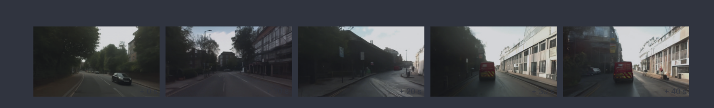
> **Figure 설명:** GAIA-1이 완전히 상상한 주행 장면을 긴 시간 동안 이어서 생성하는 예시다. 장기 rollout에서 장면의 구조와 움직임이 크게 무너지지 않는지를 확인하는 Figure다.

**Multiple plausible futures.**  
같은 초기 context에서도 여러 미래가 가능하다. GAIA-1은 repeated sampling으로 하나의 정답 미래가 아니라 가능한 미래들의 분포를 생성한다.

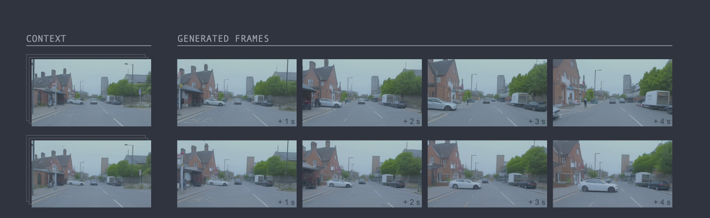
> **Figure 설명:** 같은 context에서 서로 다른 plausible future가 생성되는 예시다. 이 Figure는 GAIA-1이 deterministic predictor가 아니라 multimodal future를 다루는 generative world model이라는 점을 보여준다.

**Text-conditioned generation.**  
Text prompt로 날씨, 조명, 장면 속성을 바꾼다. 이는 GAIA-1이 language condition을 통해 scene attribute를 제어할 수 있음을 보여준다.

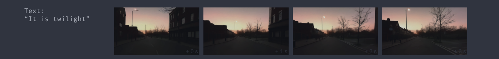
> **Figure 설명:** text prompt를 바꾸어 weather와 illumination 같은 scene attribute를 조절하는 예시다. 주행 맥락은 유지하면서 시각적 조건을 바꿀 수 있는지를 보여준다.

**Action-conditioned generation.**  
Speed와 curvature 같은 ego action 조건을 바꾸면 미래 장면도 달라진다. 이 부분이 GAIA-1을 일반 video generation이 아니라 world model에 가깝게 만든다.

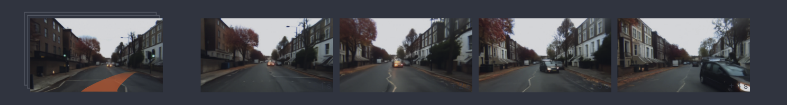
> **Figure 설명:** ego vehicle의 steering/action 조건을 바꾸면 생성되는 미래도 달라지는 예시다. 논문은 out-of-distribution 행동에서도 도로 geometry와 주변 차량의 반응이 비교적 일관되게 나타나는 사례를 보여준다.

---

## 6. 결론과 한계

### 6.1 논문 결론

GAIA-1의 결론은 다음과 같이 정리할 수 있다.

> **자율주행 world model을 LLM식 next-token prediction 문제로 바꾸고, diffusion decoder를 결합하면, action과 text로 제어 가능한 realistic driving video simulator를 만들 수 있다.**

---

### 6.2 이 논문에서 가져갈 핵심 메시지

| 핵심 메시지 | 설명 |
|---|---|
| World model의 범위가 넓어지고 있다 | 이제 world model은 reward/state 예측뿐 아니라 realistic video generation까지 포함 |
| 생성형 모델과 RL/world model이 만난다 | next-token prediction, Transformer, diffusion이 자율주행 world model에 사용됨 |
| action conditioning이 중요하다 | 그냥 그럴듯한 영상이 아니라 “행동에 따른 미래”를 생성해야 world model에 가까움 |
| representation choice가 중요하다 | pixel을 직접 예측하지 않고 discrete token을 예측함 |
| 아직 policy 논문은 아니다 | neural simulator 가능성을 보여주지만 closed-loop agent는 아님 |

---

### 6.3 한계

| 한계 | 설명 |
|---|---|
| Real-time inference 아님 | autoregressive generation이 계산량이 큼 |
| Closed-loop policy evaluation 부족 | 실제 driving decision 성능과 직접 연결되지는 않음 |
| Single-camera 중심 | 완전한 surround multi-camera simulator는 아님 |
| 정량 safety metric 부족 | 생성 품질이 안전성으로 이어지는지 별도 검증 필요 |
| 학습 데이터 편향 가능성 | London driving data 중심이므로 지역 일반화는 추가 검증 필요 |

---

## 7. 최종 요약표

| 항목 | 정리 |
|---|---|
| 논문 한 문장 | GAIA-1은 video/text/action 조건으로 미래 주행 비디오를 생성하는 generative world model이다. |
| 문제 | 자율주행에서는 ego action에 따라 달라지는 여러 가능한 미래를 예측해야 한다. |
| 해결 | image tokenization + autoregressive Transformer + video diffusion decoder |
| 핵심 수식 | $p(x_{t+1:t+H} \mid x_{\leq t}, a_{t:t+H}, c)$ |
| Dreamer 연결 | world model 기반 imagination이지만, policy learning이 아니라 video generation 중심 |
| Trajectory Transformer 연결 | RL/world modeling을 sequence modeling 문제로 바꾸는 흐름 |
| JEPA 연결 | pixel 대신 representation/token을 예측한다는 철학 |
| 실험 성격 | scaling + qualitative capabilities 중심 |
| 기여 | 자율주행 world model을 multimodal next-token prediction + video diffusion으로 구현 |
| 한계 | real-time 아님, closed-loop policy 검증 부족, safety metric 부족 |

---

## 8. 후속 흐름: GAIA-2와 GAIA-3는 무엇이 다르고, 왜 달라졌나?

>
> 핵심은 **GAIA-2 = 더 잘 제어되는 multi-camera synthetic world**, 
> **GAIA-3 = 안전성 평가/검증에 쓸 수 있는 repeatable world**로 기억하면 된다.

---

### 8.1 한 줄 흐름

```text
GAIA-1
video + text + action으로 미래 주행 비디오를 생성할 수 있음을 보여줌

        ↓

GAIA-2
multi-camera, structured conditioning, latent diffusion으로
더 현실적이고 제어 가능한 주행 시뮬레이션을 만듦

        ↓

GAIA-3
생성된 세계를 단순 합성 데이터가 아니라
자율주행 모델의 safety evaluation / what-if test에 사용
```


> **GAIA-2는 “자율주행용 영상을 더 잘 만들자”이고, GAIA-3는 “그 생성 세계로 자율주행 모델을 더 잘 시험하자”이다.**

---

### 8.2 GAIA-2: 더 제어 가능한 multi-camera world model

GAIA-1은 action/text-conditioned future video generation의 가능성을 보여줬지만, 실제 자율주행 시스템에 바로 쓰기에는 몇 가지 한계가 있었다. 실제 차량은 single-camera가 아니라 여러 카메라를 동시에 사용하고, 장기 생성에서는 temporal smoothness가 중요하며, 도로 구조·agent·날씨·지역 같은 조건을 더 세밀하게 제어해야 한다.

그래서 GAIA-2는 GAIA-1의 **AR discrete image token + diffusion decoder** 흐름에서, **continuous video latent + latent diffusion world model** 쪽으로 이동한다. 핵심은 단순히 더 예쁜 비디오를 만드는 것이 아니라, 자율주행 모델 학습과 검증에 필요한 조건을 구조적으로 바꿀 수 있는 synthetic scenario generator를 만드는 것이다.

정리하면 GAIA-2의 변화는 다음 세 가지다.

- **표현:** discrete image token 중심에서 continuous video latent로 이동한다.
- **시야:** single/few-view 중심에서 multi-camera generation으로 확장한다.
- **조건 제어:** text/action뿐 아니라 ego dynamics, 3D agents, road semantics, weather, time, region, camera geometry를 더 명시적으로 다룬다.

---

### 8.3 GAIA-3: 생성 세계를 평가 도구로 바꾸기

GAIA-2가 “더 잘 제어되는 synthetic driving world를 만들자”에 가까웠다면, GAIA-3는 목적을 더 실용적인 방향으로 옮긴다. 핵심은 생성형 world model을 **offline safety evaluation suite**로 사용하는 것이다.

자율주행 평가는 어렵다. 실제 도로 테스트는 필요하지만 위험 상황은 드물고, rare safety case를 의도적으로 재현하기도 어렵다. GAIA-3는 같은 실제 주행 seed scene을 유지한 채 ego trajectory나 visual condition을 바꾸어, **what-if / counterfactual test**를 반복 가능하게 만들려 한다.

GAIA-3에서 중요한 기능은 다음처럼 요약할 수 있다.

- **Safety-critical scenario generation:** 충돌, near-miss, 차선 이탈 같은 위험 상황을 생성한다.
- **World-on-rails evaluation:** 원본 장면의 구조를 유지하면서 ego 행동만 바꾸어 비교한다.
- **Embodiment transfer:** 같은 장면을 다른 차량 또는 카메라 rig 관점으로 다시 렌더링한다.
- **Controlled visual diversity:** motion과 구조는 유지하고 날씨, 조명, 텍스처를 바꾸어 robustness를 본다.

즉 GAIA-3는 “아무 장면이나 생성하는 모델”보다, **자율주행 모델을 반복 가능하게 시험하기 위한 통제된 world model**에 가깝다.


---

### 8.4 GAIA-1 → GAIA-2 → GAIA-3 발전 방향

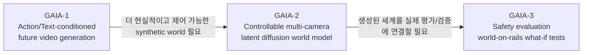

| 전환              | 달라진 점                                                                 | 왜 달라졌나?                                                                            |
| --------------- | --------------------------------------------------------------------- | ---------------------------------------------------------------------------------- |
| GAIA-1 → GAIA-2 | AR discrete token 중심에서 continuous latent diffusion + multi-camera로 이동 | 실제 자율주행 입력은 multi-camera이고, 장기 생성의 temporal smoothness와 조건 제어가 중요하기 때문             |
| GAIA-2 → GAIA-3 | synthetic scenario generation에서 structured offline evaluation으로 이동    | 자율주행 모델이 좋아질수록 실제 도로에서 의미 있는 failure를 찾기 어렵고, rare safety case를 반복 가능하게 시험해야 하기 때문 |

---

## 참고문헌 / 출처

1. Anthony Hu et al., **GAIA-1: A Generative World Model for Autonomous Driving**, arXiv:2309.17080, 2023.  
   https://arxiv.org/abs/2309.17080

2. ar5iv HTML version of **GAIA-1: A Generative World Model for Autonomous Driving**.  
   https://ar5iv.labs.arxiv.org/html/2309.17080

3. Jingtao Ding et al., **Understanding World or Predicting Future? A Comprehensive Survey of World Models**, arXiv:2411.14499, 2024.  
   https://arxiv.org/abs/2411.14499

4. Zheng Zhu et al., **Is Sora a World Simulator? A Comprehensive Survey on General World Models and Beyond**, arXiv:2405.03520, 2024.  
   https://arxiv.org/abs/2405.03520

5. Wayve, **Scaling GAIA-1: 9-billion parameter generative world model for autonomous driving**, 2023.  
   https://wayve.ai/thinking/scaling-gaia-1/

6. Danijar Hafner et al., **Mastering Diverse Domains through World Models**, arXiv:2301.04104, 2023.  
   https://arxiv.org/abs/2301.04104

7. Michael Janner, Qiyang Li, Sergey Levine, **Offline Reinforcement Learning as One Big Sequence Modeling Problem**, arXiv:2106.02039, 2021.  
   https://arxiv.org/abs/2106.02039

8. Mahmoud Assran et al., **Self-Supervised Learning from Images with a Joint-Embedding Predictive Architecture**, arXiv:2301.08243, 2023.  
   https://arxiv.org/abs/2301.08243

9. Meta AI, **V-JEPA: The next step toward advanced machine intelligence**, 2024.  
   https://ai.meta.com/blog/v-jepa-yann-lecun-ai-model-video-joint-embedding-predictive-architecture/

10. Lloyd Russell et al., **GAIA-2: A Controllable Multi-View Generative World Model for Autonomous Driving**, arXiv:2503.20523, 2025.  
   https://arxiv.org/abs/2503.20523

11. ar5iv HTML version of **GAIA-2: A Controllable Multi-View Generative World Model for Autonomous Driving**.  
   https://ar5iv.labs.arxiv.org/html/2503.20523v1

12. Wayve, **GAIA-2: Pushing the Boundaries of Video Generative Models for Safer Assisted and Automated Driving**, 2025.  
    https://wayve.ai/thinking/gaia-2/

13. Wayve, **GAIA-3: Scaling World Models to Power Safety and Evaluation**, 2025.  
    https://wayve.ai/thinking/gaia-3/

14. Wayve, **Wayve launches GAIA-3, advancing world models from simulation to evaluation**, 2025.  
    https://wayve.ai/press/wayve-launches-gaia3/
