# Genie: Generative Interactive Environments

!!! info "Information"
    - **Title:** Genie: Generative Interactive Environments
    - **Venue:** ICML 2024
    - **Paper:** [arXiv](https://arxiv.org/abs/2402.15391)
    - **Homepage:** [Genie](https://sites.google.com/view/genie-2024/home)
    - **Presenter:** 이재호
    - **Last updated:** 2026-07-19

## Introduction

Genie는 라벨이 없는 비디오 데이터만으로 **generative interactive environment**를 학습한 모델이다. Generative interactive environment란 사용자의 action으로 제어할 수 있는 가상 세계를 생성하는 환경을 말한다.

Genie는 다양한 이미지를 prompt로 받아 interactive하고 playable한 환경을 만든다.

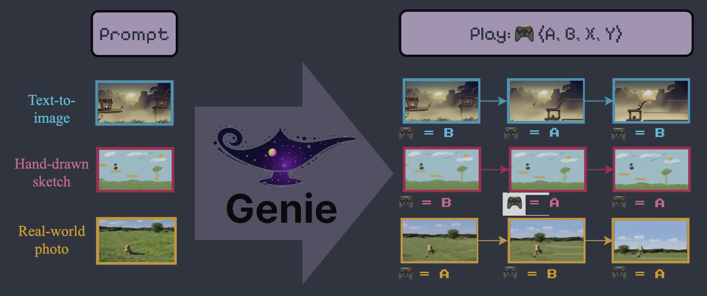

Genie는 총 11B parameters 규모이며, 저자는 이를 **foundation world model**로 볼 수 있다고 설명한다.

기존 world model과 달리 학습할 때 action label이 필요하지 않다는 것도 중요한 장점이다. Genie는 unsupervised learning으로 비디오의 프레임 변화를 설명하는 latent action token을 학습한다.

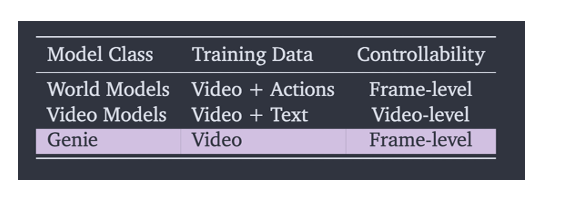

## Method

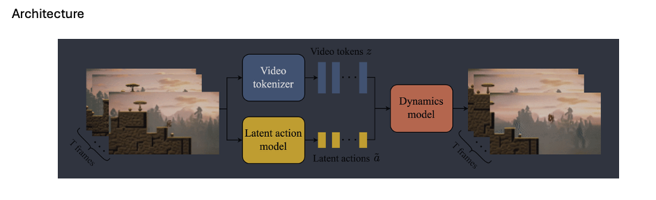

Genie는 다음 세 구성 요소로 이루어진다.

1. **Video tokenizer:** 비디오를 discrete video token $z$로 압축한다.
2. **Latent action model (LAM):** 연속한 프레임 사이의 변화를 discrete latent action token $a$로 추론한다.
3. **Dynamics model:** 이전 video token과 latent action token을 이용해 다음 프레임의 video token을 예측한다.

세 모델에 사용된 핵심 구조는 다음과 같다.

| 구성 요소 | 구조와 역할 |
|---|---|
| Video tokenizer | VQ-VAE 구조로 비디오를 discrete token으로 변환하며, encoder와 decoder에 ST-Transformer를 사용한다. |
| Latent action model | VQ-VAE 구조로 프레임 사이의 변화를 discrete action으로 압축한다. |
| Dynamics model | Decoder-only ST-Transformer와 MaskGIT을 사용해 다음 프레임 token을 예측한다. |

### ST-Transformer

ST-Transformer는 기존 Transformer의 attention을 spatial attention과 temporal attention으로 분리해 메모리 사용량을 줄인다. 모든 시공간 token에 한 번에 attention하는 방식은 계산 복잡도가 프레임 수의 제곱에 비례하지만, 분리된 spatial-temporal attention은 프레임 수에 대해 선형으로 증가한다.

또한 temporal attention에 causal mask를 사용하므로 학습할 때 전체 video sequence를 한 번에 입력해도 각 시점은 미래 프레임의 정보를 볼 수 없다.

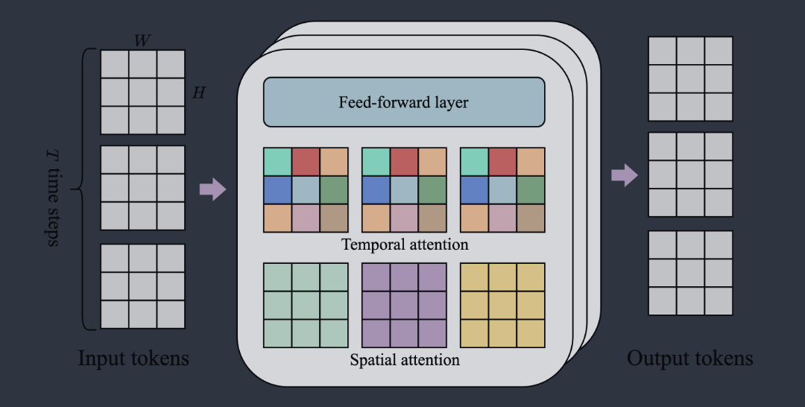

### VQ-VAE

VQ-VAE는 연속적인 feature vector를 미리 정해진 codebook의 discrete token으로 바꾸는 모델이다.

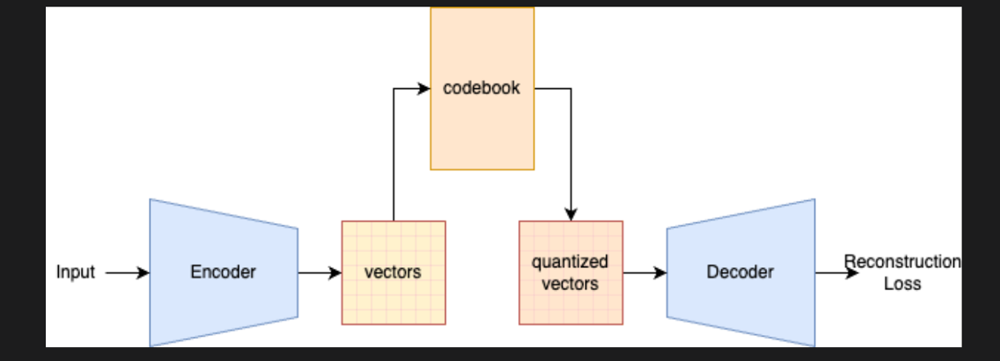

Video tokenizer가 VQ-VAE를 사용하는 이유는 Transformer가 언어 모델처럼 discrete token을 예측해 비디오를 생성할 수 있도록 하기 위해서다. LAM에서는 행동 공간의 크기를 정하고, 연속 벡터보다 다루기 쉬운 discrete action token을 만들기 위해 사용한다.

### MaskGIT

MaskGIT은 token 일부를 masking한 뒤 가려진 token을 병렬로 예측하고, 이 과정을 반복하며 전체 결과를 복원하는 생성 방식이다.

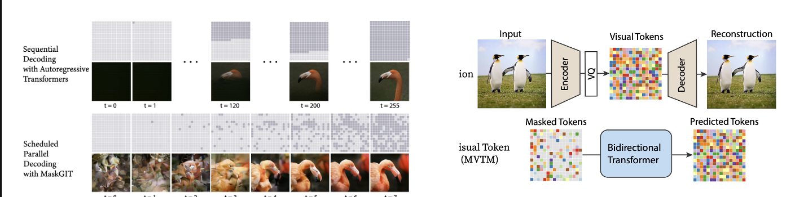

## Training

학습은 크게 두 단계로 진행된다.

1. Video tokenizer를 먼저 학습한다.
2. LAM과 dynamics model을 함께 학습한다.

### 1. Video tokenizer

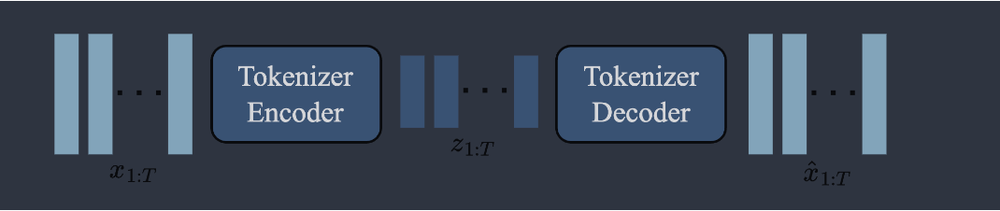

입력 비디오 $x_{1:T}$를 작은 크기의 discrete video token $z_{1:T}$로 압축하고, decoder는 이 token을 다시 pixel frame으로 복원한다.

Encoder와 decoder 모두 ST-Transformer를 사용하므로 공간 정보뿐 아니라 이전 프레임의 시간적 변화도 token에 담을 수 있다. Dynamics model은 고차원 pixel 대신 압축된 token을 예측하므로 계산량을 줄이면서 비디오 생성 품질을 높일 수 있다. Video tokenizer의 codebook은 1,024개의 video code로 구성된다.

### 2. Latent action model

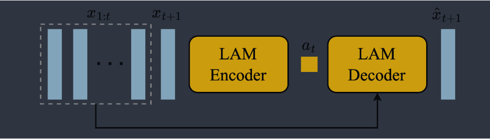

LAM의 encoder와 decoder는 다음과 같이 동작한다.

**Encoder**

- 입력: 이전 프레임 $x_{1:t}=(x_1,\ldots,x_t)$와 다음 프레임 $x_{t+1}$
- 출력: 각 프레임의 변화를 나타내는 연속 latent action $\tilde{a}_{1:t}=(\tilde{a}_1,\ldots,\tilde{a}_t)$

**Decoder**

- 입력: 이전 프레임 $x_{1:t}$와 encoder가 추론한 latent action $\tilde{a}_{1:t}$
- 출력: 예측한 다음 프레임 $\hat{x}_{t+1}$

이 구조는 실제 action label 없이도 프레임 사이의 변화를 action으로 학습하기 위해 사용한다.

Encoder는 다음 프레임까지 보고 변화에 해당하는 latent action을 찾고, decoder는 그 action으로 다음 프레임을 복원한다.

이 과정을 통해 latent action에는 미래 프레임을 예측하는 데 필요한 정보가 담긴다.

학습이 끝나면 추론 과정에서는 LAM을 사용하지 않고 사용자의 입력으로 대체한다. 사용자가 고른 0부터 7까지의 값은 VQ codebook을 통해 8개의 action token 중 하나로 변환된다.

Video tokenizer와 LAM은 VQ-VAE objective를 사용해 학습한다.

### 3. Dynamics model

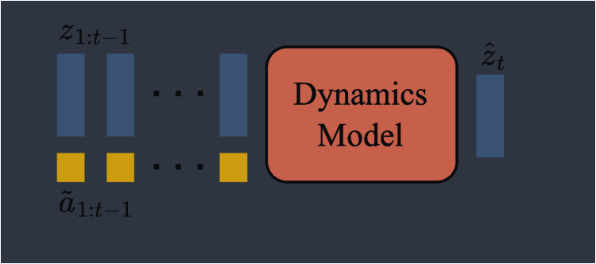

Dynamics model은 ST-Transformer block으로 구성된 decoder-only MaskGIT Transformer다.

**Spatial and temporal prediction**

시간축에서는 이전 프레임과 행동을 바탕으로 다음 프레임을 autoregressive하게 생성한다. 반면 한 프레임 안에서는 masking된 여러 video token을 MaskGIT 방식으로 병렬 예측하고, 여러 단계에 걸쳐 반복적으로 보완한다.

**Stop-gradient**

각 시점 $t$의 입력은 이전 video token $z_{1:t-1}$과 잠재 행동 $\operatorname{stopgrad}(\tilde{a}_{1:t-1})$이고, 출력은 다음 프레임 token $\hat{z}_t$이다. Stop-gradient를 적용하므로 dynamics model의 loss gradient는 이 입력을 통해 LAM으로 역전파되지 않는다.

**Additive embedding**

Latent action은 video token에 concatenate하지 않고, 같은 시점의 action embedding을 video token embedding에 더한다. 논문은 additive embedding을 사용했을 때 생성 결과의 controllability가 향상되었다고 설명한다.

**Causal mask**

학습 시에는 causal mask를 사용해 전체 입력 $z_{1:T-1}$과 $\operatorname{stopgrad}(\tilde{a}_{1:T-1})$을 한 번에 처리하고, 모든 다음 프레임 $\hat{z}_{2:T}$를 예측한다. 각 예측은 미래 프레임의 정보를 볼 수 없으므로 미래 정보가 유출되지 않는다.

**Loss function**

Loss function은 예측 token $\hat{z}_{2:T}$와 ground-truth token $z_{2:T}$ 사이의 cross-entropy다.

**Masking**

학습할 때는 먼저 0.5와 1 사이에서 masking 비율을 무작위로 정한다. 그런 다음 각 입력 token $z_{2:T-1}$을 해당 확률로 독립적으로 masking하고, dynamics model이 보이는 video token과 action token을 이용해 가려진 token을 복원하도록 학습한다.

이 과정을 통해 서로 다른 정도로 가려진 프레임을 복원하는 방법을 익히며, 추론 시 MaskGIT의 반복적인 token 예측에 활용한다.

## Inference

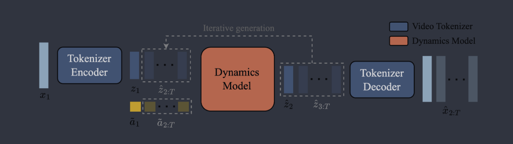

추론은 다음 순서로 진행된다.

1. 입력 이미지 $x_1$은 video tokenizer encoder를 거쳐 video token $z$가 된다.
2. 사용자의 0부터 7까지의 입력은 VQ codebook의 index가 되어 action token $a$로 바뀐다.
3. 두 token의 embedding을 더해 dynamics model에 입력한다.
4. Dynamics model은 다음 프레임의 masking된 video token을 temperature 2의 random sampling과 25회의 MaskGIT step으로 반복해서 보완한다.
5. 이 과정을 프레임마다 autoregressive하게 반복해 video token $\hat{z}$를 생성한다.
6. Video tokenizer decoder가 video token을 실제 이미지로 복원하고, 각 프레임을 이어 비디오를 완성한다.

## Experiments

### Dataset

2D platformer 게임 영상을 데이터셋으로 사용했다. 먼저 55M개의 16초 video clip을 수집했으며, 각 clip은 10 FPS와 $160 \times 90$ 해상도로 구성된다. 필터링을 거친 최종 데이터셋은 6.8M개의 16초 video clip, 약 30,000시간 분량이다.

### Scaling

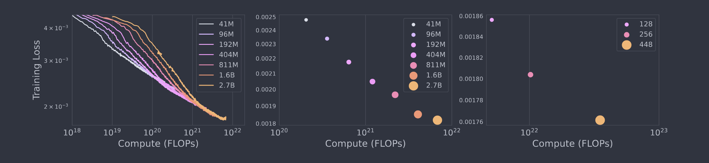

위 그림의 첫 번째와 두 번째 결과는 model size에 따른 training curve와 final training loss를 보여주고, 세 번째 결과는 batch size에 따른 2.3B model의 final training loss를 보여준다. 모델과 batch size가 커질수록 loss가 낮아지는 scaling 경향을 확인할 수 있다.

### Metrics

모델은 video fidelity와 controllability를 기준으로 평가했다.

- **FVD (Fréchet Video Distance):** 생성한 비디오의 품질을 평가한다.
- **PSNR (Peak Signal-to-Noise Ratio):** latent action이 비디오 생성 결과에 얼마나 일관되게 반영되는지 평가한다.

### Model Size

Video tokenizer는 200M parameters, LAM은 300M parameters, dynamics model은 10.1B parameters 규모다.

### Results

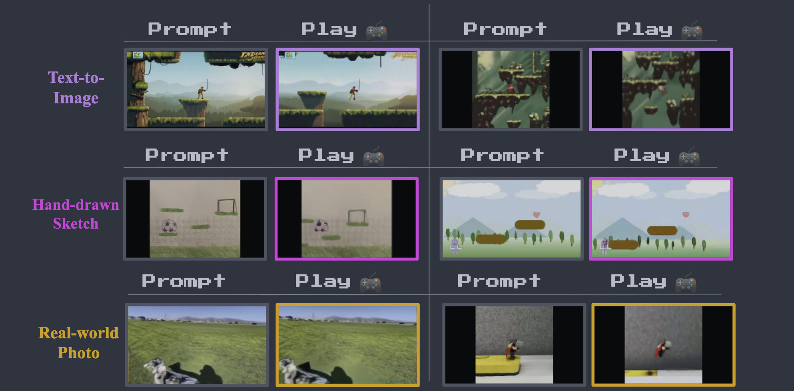

학습 분포 밖의 이미지가 prompt로 주어져도 다음 프레임을 생성하고 사용자의 action에 반응하는 모습을 볼 수 있다.

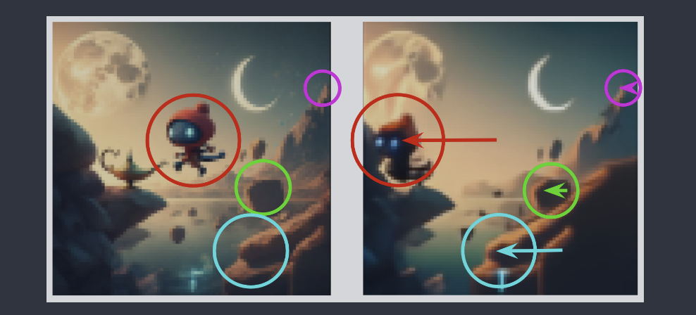

Genie는 배경이 얼마나 멀리 있는지에 따라 움직임의 크기를 다르게 표현한다. 이를 통해 생성된 환경에서 parallax와 같은 시각적 효과가 나타난다.

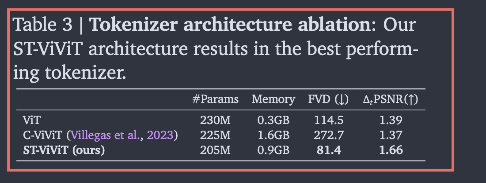

ST-Transformer는 모델 성능을 유지하면서 시공간 attention의 메모리 사용량을 줄이는 데 기여한다.

## Limitations

Genie는 autoregressive Transformer의 한계를 이어받아 긴 sequence에서 생성 결과가 불안정해지거나 hallucination이 발생할 수 있다. 또한 생성 속도가 1 FPS에 불과해 실시간 상호작용을 위해서는 frame rate를 개선해야 한다.

## Discussion

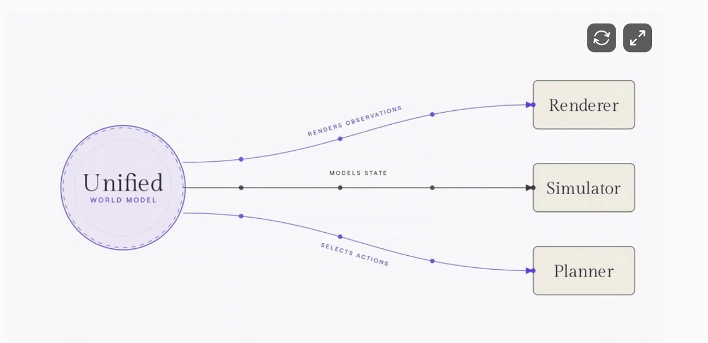

World Labs는 이미지넷을 만든 스탠포드 교수 페이페이 리가 창업한 기업이다.

World Labs의 world model taxonomy는 world model의 기능을 renderer, simulator, planner로 구분한다.

- **Renderer:** Action을 조건으로 사람이 볼 observation, 즉 pixel을 생성한다.
- **Simulator:** 기하·물리·동역학적으로 일관된 world state를 생성한다.
- **Planner:** Observation과 goal을 받아 다음 action을 결정한다.

이 관점에서 Genie는 사용자의 latent action을 조건으로 다음 video frame을 생성하므로 주로 **renderer**에 해당한다.

## 참고문헌

- [Genie: Generative Interactive Environments](https://arxiv.org/abs/2402.15391)
- [Genie project page](https://sites.google.com/view/genie-2024/home)
- [A Functional Taxonomy of World Models](https://www.worldlabs.ai/blog/taxonomy-of-world-models)
