# Mastering Atari, Go, Chess and Shogi by Planning with a Learned Model (MuZero)

!!! info "Information"
    - **Title:** Mastering Atari, Go, Chess and Shogi by Planning with a Learned Model (MuZero)
    - **Venue:** Nature 2020
    - **Paper:** [arXiv](https://arxiv.org/abs/1911.08265)
    - **Presenter:** 이재호
    - **Last updated:** 2026-07-13

## Introduction

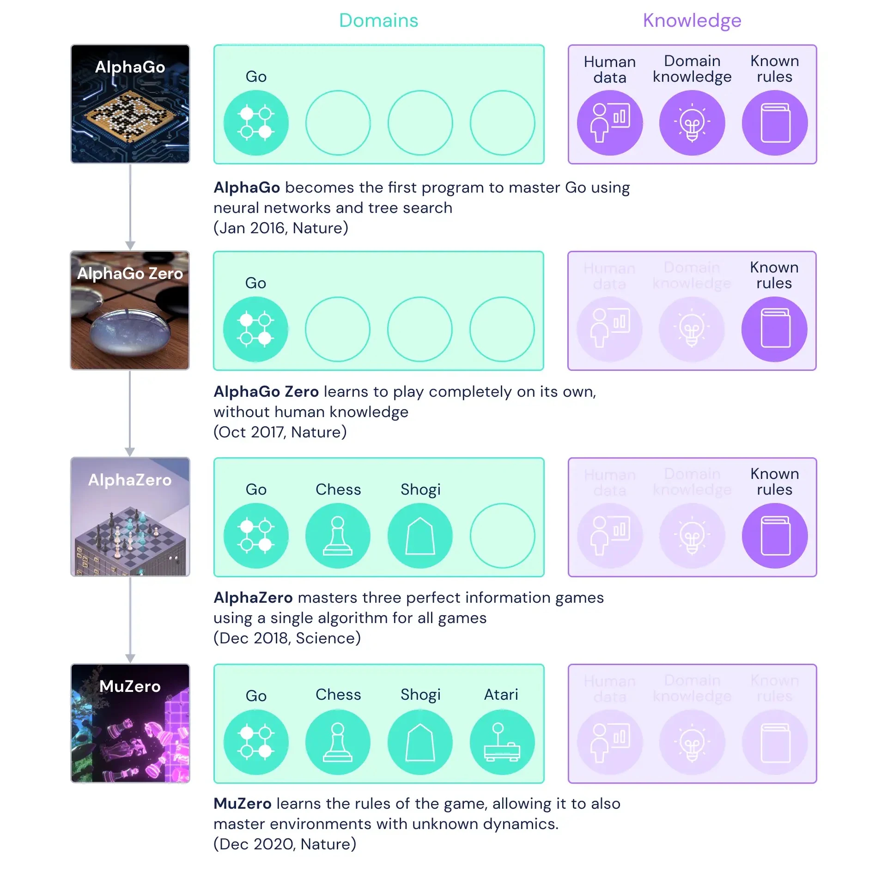{ width="473" }

MuZero는 AlphaGo → AlphaGo Zero → AlphaZero → MuZero 순서로 개선된 모델이다.

그림에서 볼 수 있듯이 모델이 개선되면서 더 많은 도메인에 적용할 수 있게 되었으며, 모델이 필요로 하는 사전 지식은 줄어들었다.

MuZero의 기여는 복잡한 게임 화면으로 구성된 Atari 게임 도메인에서 SOTA 성능을 달성했고, 게임 규칙에 대한 정보 없이 학습된 모델로 문제를 해결했다는 점이다.

## Methods

MuZero의 방법론은 AlphaZero에서 사용된 Monte Carlo Tree Search(MCTS)와 model-based reinforcement learning(MBRL)의 결합이다.

### 1. MBRL

모델은 세 가지 함수로 구현되며 세 가지 요소를 예측한다.

**구성 요소**

1. Representation function $h$
2. Dynamics function $g$
3. Prediction function $f$

**예측 요소**

1. Policy
2. Value
3. Reward

#### MuZero 알고리즘

MuZero는 planning → acting → training 과정을 반복한다.

- **Planning:** MCTS를 이용해 가상의 simulation을 수행한다.
- **Acting:** Planning에서 가장 많이 방문한 루트 노드의 action $a_{t+1}$을 선택해 실제 환경에 적용한다. 이후 보상 $u_{t+1}$과 다음 observation $o_{t+1}$을 받아 replay buffer에 저장한다.
- **Training:** Replay buffer에서 trajectory를 가져와 model을 학습한다.

Planning과 acting은 실제 환경에서 진행하고, 여기서 얻은 trajectory로 training을 진행한다.

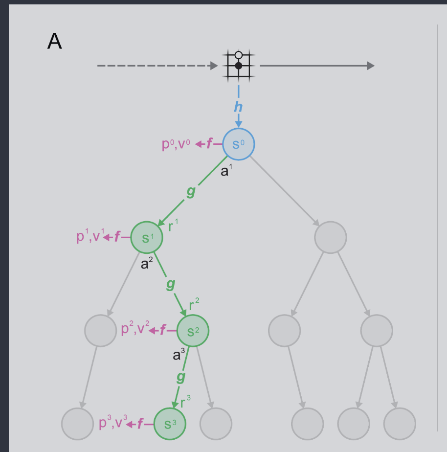

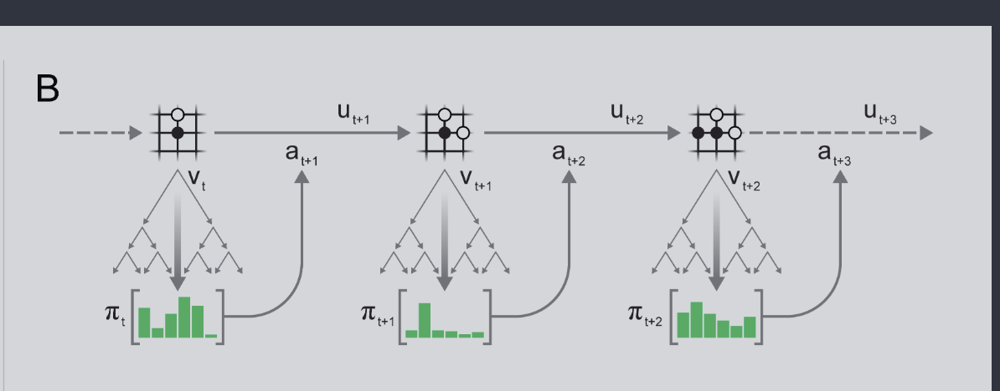

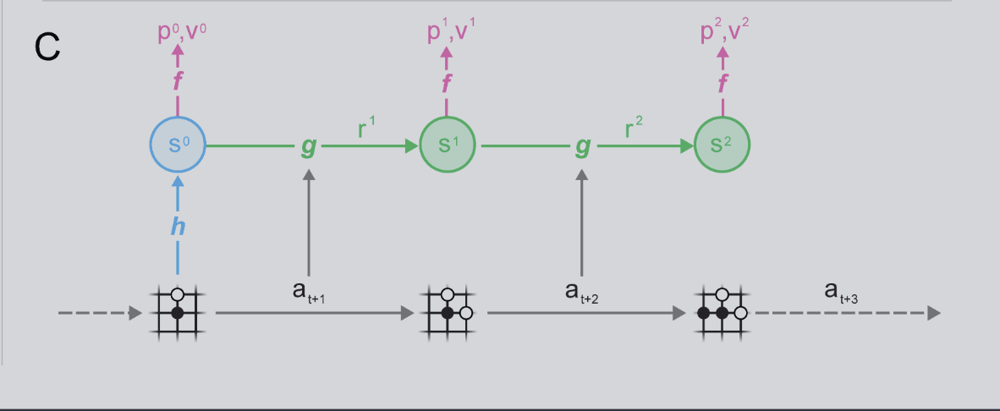

#### 함수 설명

1. Representation function $h$는 과거 observation을 hidden state $s^0$으로 바꾼다.

    $$
    s^0 = h_\theta(o^1, \ldots, o^t)
    $$

2. Prediction function $f$는 현재 hidden state $s^0$을 이용해 policy $p^0$와 value $v^0$을 구한다.
3. Dynamics function $g$는 현재 hidden state $s^0$과 action $a^1$을 이용해 next hidden state $s^1$과 reward $r^1$을 구한다.

Representation function의 특징은 현재 환경에 대한 정보, 즉 현재 화면에 무엇이 있는지를 모두 담는 대신 미래 예측에 필요한 정보(policy, value, reward)를 담는다는 점이다.

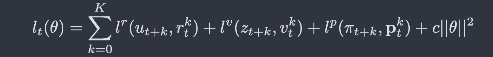

$l^r$, $l^v$, $l^p$는 각각 reward, value, policy에 대한 loss function이다. 손실 함수 안의 왼쪽 항과 오른쪽 항은 각각 예측값과 실제 관측값이다. 전체 손실 함수는 이 세 가지 예측값에 대한 loss로 구성된다.

### 2. MCTS

MCTS는 네 가지 과정을 통해 수행된다.

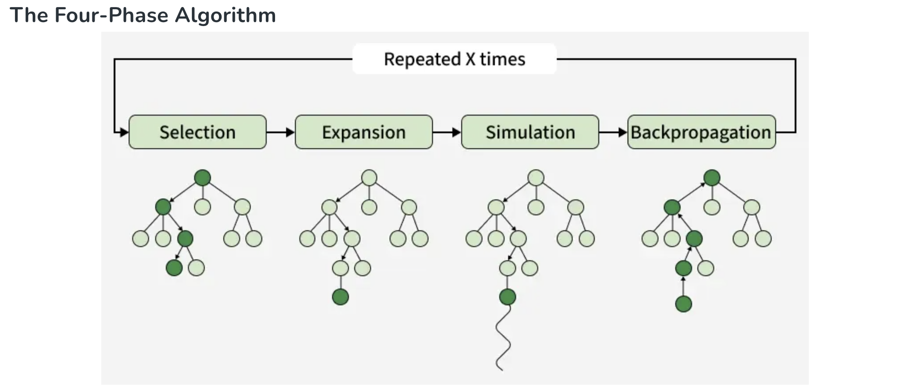{ width="578" }

1. **Selection:** Terminal node가 아닌 leaf node를 선택한다. 이때 UCT 규칙을 사용한다.
2. **Expansion:** Leaf node 아래에 child node를 생성한다.
3. **Simulation:** 확장된 child node에서 simulation을 시작해 terminal node까지 진행한다. 이때 random action을 사용한다.
4. **Backpropagation:** Simulation 결과를 지금까지 지나온 모든 node에 업데이트한다.

UCT는 Upper Confidence Bounds for Trees의 약자다. UCB(Upper Confidence Bound)는 exploration-exploitation dilemma를 고려한 식이다.

$$
UCB1(i) = \bar{X}_i + c\sqrt{\frac{\ln N}{n_i}}
$$

- $\bar{X}_i$: 노드의 평균 보상으로, exploitation에 해당한다.
- $c\sqrt{\frac{\ln N}{n_i}}$: $N$은 부모 노드의 총 방문 횟수이고 $n_i$는 현재 노드의 방문 횟수다. 부모 노드의 자식 중 방문이 적은 노드가 높은 값을 받도록 하며, exploration에 해당한다.

더 자세한 내용과 예시는 [Monte Carlo Tree Search (MCTS) in Machine Learning](https://www.geeksforgeeks.org/machine-learning/monte-carlo-tree-search-mcts-in-machine-learning/)에서 확인할 수 있다.

## Results

MuZero는 바둑, 체스, 쇼기, Atari 게임의 네 가지 환경에서 실험을 진행했다.

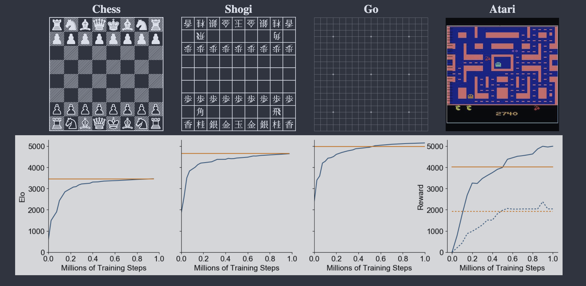

바둑, 체스, 쇼기에서 MuZero는 AlphaZero보다 더 높은 Elo를 보였고, Atari 게임에서는 model-free 모델인 R2D2보다 좋은 성능을 냈다.

MuZero에는 Reanalyze 기법을 사용한 버전도 있으며, 이 버전은 더 높은 sample efficiency를 보인다.

Reanalyze는 replay buffer의 과거 데이터에 현재의 발전된 모델로 MCTS를 다시 수행해 오래된 policy target과 value target을 더 좋은 target으로 교체하는 기법이다. 초기 MCTS에서 얻은 policy에 비해 모델이 개선된 후 다시 MCTS를 수행하면 더 좋은 policy를 얻을 수 있다.

예를 들어 policy가 $(0.6, 0.3, 0.1)$에서 $(0.1, 0.8, 0.1)$로 바뀔 수 있다. 환경과 추가로 상호작용하지 않고도 기존 데이터를 재사용해 더 좋은 target을 얻을 수 있으므로 sample efficiency가 높다.

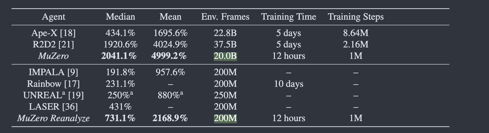

MuZero Reanalyze는 당시 SOTA model-free 기법과 비교해 준수한 성능을 보였다.

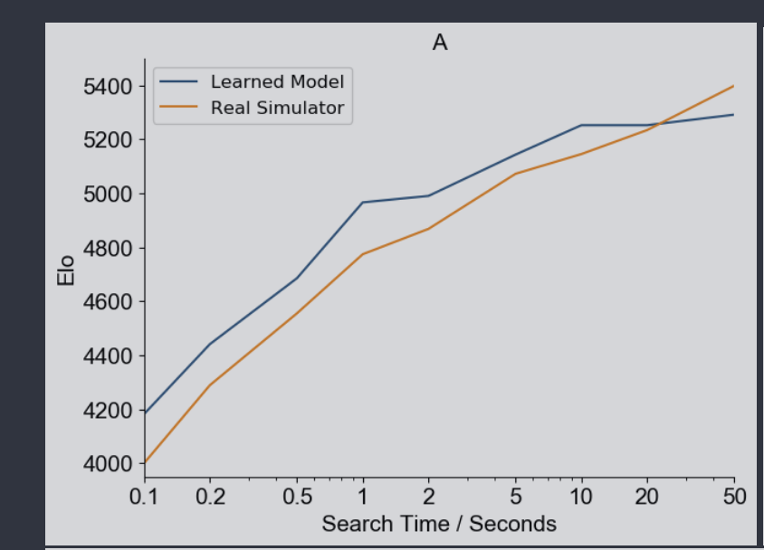

MCTS simulation 수, 즉 search time을 늘렸을 때 learned model을 사용하는 MuZero의 성능도 향상된다.

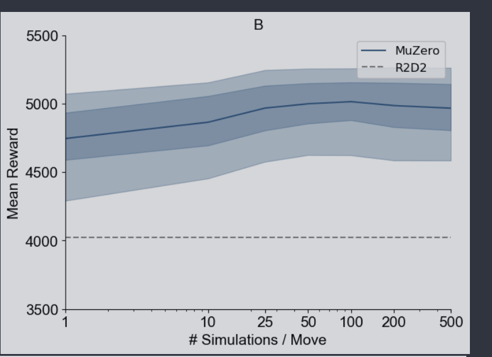{ width="388" }

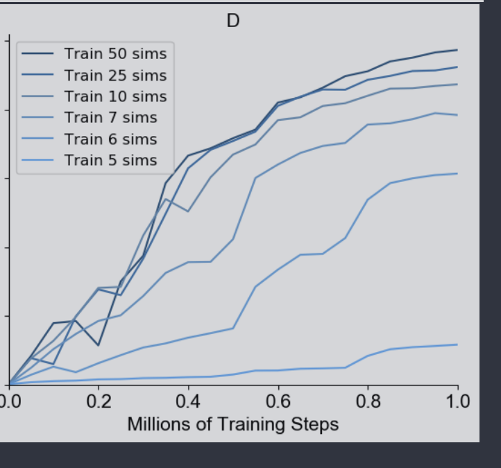{ width="416" }

Simulation 수를 늘리면 성능이 좋아지는 것을 확인할 수 있다.

## 결론

MuZero는 AlphaZero를 계승한 모델로, 시각적으로 복잡한 Atari 게임까지 도메인을 확장했다. 또한 게임 규칙을 모르는 상태에서 학습된 모델을 사용한다. 핵심 방법론으로 MCTS와 MBRL을 결합했다.

## 참고문헌

- [Mastering Atari, Go, Chess and Shogi by Planning with a Learned Model](https://arxiv.org/abs/1911.08265)
- [Monte Carlo Tree Search (MCTS) in Machine Learning](https://www.geeksforgeeks.org/machine-learning/monte-carlo-tree-search-mcts-in-machine-learning/)
