# Learning Latent Dynamics for Planning from Pixels (PlaNet)

!!! info "Information"
    - **Title:** Learning Latent Dynamics for Planning from Pixels (PlaNet)
    - **Venue:** ICML 2019
    - **Paper:** [arXiv](https://arxiv.org/abs/1811.04551)
    - **Code:** [Github](https://github.com/google-research/planet)
    - **Presenter:** 이재호
    - **Last updated:** 2026-05-26


## 0. Summary


PlaNet은 **pixel observation**만으로 **latent dynamics model**을 학습하고, 그 **latent space** 안에서 **planning**을 수행하는 **model-based reinforcement learning agent**이다.

**핵심 방법론**

1. **Latent space planning**  
   고차원 이미지를 직접 예측하며 planning하지 않고, compact한 latent state 안에서 미래 reward를 예측하고 action sequence를 평가한다.

2. **RSSM 구조**  
   deterministic state와 stochastic state를 함께 사용해 장기 기억과 미래의 불확실성을 동시에 다룬다.

3. **CEM 기반 action search**  
   학습된 latent dynamics model 안에서 여러 action sequence를 평가하고, CEM으로 좋은 action sequence를 반복적으로 개선한다.

**보조 아이디어**

- **Latent overshooting**: multi-step prediction 성능을 높이기 위해 latent space에서 여러 step 뒤의 예측도 함께 학습하려는 시도다.

**핵심 기여**

1. **이미지 기반 연속 제어에서 model-based planning이 가능함을 보였다.**  
   PlaNet은 pixel observation만으로 6가지 continuous control task를 학습했다. 이 task들은 contact dynamics, partial observability, sparse reward를 포함한다.

2. **높은 sample efficiency를 보였다.**  
   PlaNet은 model-free baseline보다 훨씬 적은 episode로 비슷하거나 더 좋은 성능을 달성했다.

---

## 1. PlaNet은 어떤 문제를 풀려고 했나?

PlaNet이 풀려는 문제는 두 가지로 먼저 정리할 수 있다.

첫째, **planning이 가능할 정도로 정확한 latent dynamics model을 학습하는 것**이다.  
둘째, **그 문제를 고차원 이미지 환경에서 해결하는 것**이다.


즉 PlaNet의 목표는 다음과 같다.

> **이미지를 compact한 latent state로 압축하자.  
> 그리고 그 latent dynamics 안에서 미래 state와 reward를 예측해 빠르게 행동을 고르자.**

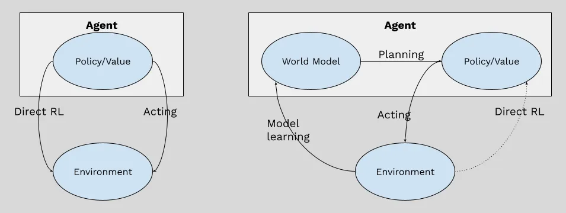

*왼쪽은 model-free 방식이고, 오른쪽은 learned model을 사용하는 model-based 방식이다.*

### 1.1 Model-based planning

Planning은 dynamics가 알려진 환경에서는 매우 효과적으로 작동한다. 

> 예를 들어 게임이나 시뮬레이터를 생각해보자.
> “이 행동을 하면 다음 상태가 어떻게 변하는지”를 알고 있는 상황이다.
> 그러면 여러 미래 행동을 시뮬레이션해보고, 그중 가장 좋은 행동을 선택할 수 있다.

하지만 dynamics가 알려져 있지 않은 환경에서는 agent가 직접 환경 모델을 학습해야한다.


이때 어려움은 크게 네 가지다.

첫째, **모델이 부정확할 수 있다.**

둘째, **여러 step을 예측할수록 오차가 누적된다.**

셋째, **미래가 하나로 정해져 있지 않을 수 있다.**  
이때 모델이 여러 가능한 미래를 잘 표현하지 못할 수 있다.

넷째, **학습 데이터 밖의 상황에서 모델이 지나치게 확신하는 예측을 할 수 있다.**

그럼에도 모델을 사용하는 model-based planning은 model-free 강화학습에 비해 중요한 장점이 있다.

1. **학습 신호가 풍부하다.**

    Model-free 방식은 주로 reward를 통해 학습한다.  
    PlaNet 같은 model-based 방식은 observation, reward, transition을 모두 학습 신호로 사용할 수 있다.
    
2. **Bellman backup에만 의존하지 않아도 된다.**

    Model-free value learning에서는 reward 정보를 여러 step에 걸쳐 Bellman backup으로 전파해야 한다.  
    반면 model-based planning은 학습된 모델 안에서 미래를 직접 rollout한다.  
    그래서 행동을 더 직접적으로 평가할 수 있다.
    
3. **계산량을 늘려 성능을 높일 수 있다.**

    더 많은 action sequence를 평가하거나 planning iteration을 늘릴 수 있다.  
    그러면 같은 모델로도 더 좋은 행동을 찾을 가능성이 생긴다.  
    논문도 이 점을 강조한다.  
    action search에 더 많은 computation budget을 투입하면 성능 향상을 기대할 수 있다는 것이다.
    

<figure markdown="span">
  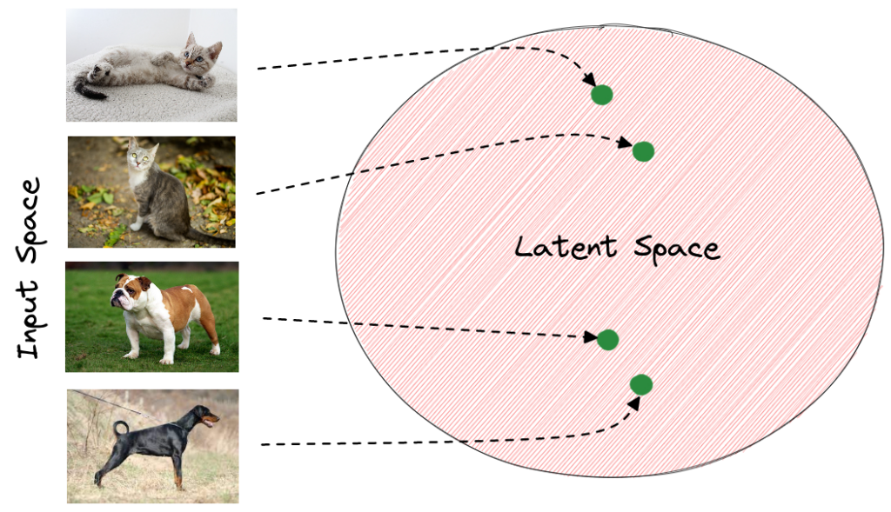{ width="760" }
  <figcaption>고차원 이미지를 그대로 다루지 않고, compact한 latent space로 옮겨 planning에 필요한 정보를 처리한다.</figcaption>
</figure>

### 1.2 Latent space planning

PlaNet이 특히 어려운 이유는 이 문제를 **고차원 이미지 환경**에서 다루기 때문이다. 
픽셀은 차원이 매우 크고, 실제 제어에 필요한 정보는 그중 일부에 불과하다.

따라서 픽셀 공간에서 직접 미래 이미지를 생성하면서 planning하면 계산량이 너무 커진다. 
PlaNet은 이 문제를 **latent space planning**으로 해결한다. 

즉, 이미지를 compact한 잠재 상태로 압축하고, 그 잠재 상태 안에서 미래 state와 reward를 예측한다.

이 접근은 확장 가능성도 보여준다.

더 큰 상태 공간, 더 큰 행동 공간, 긴 planning horizon, sparse reward가 있는 환경으로 나아갈 수 있다는 것이다.

논문은 기존 latent planning 방법들이 비교적 단순한 task에 제한되었다고 설명한다.

예를 들어 cartpole이나 2-link arm 같은 환경이다.

PlaNet은 여기서 더 나아가 image-based continuous control task를 다룬다.

---

## 2. 픽셀이 아닌 잠재 공간에서 계획하자: Latent Space Planning

### Algorithm 1: PlaNet 알고리즘

PlaNet의 전체 흐름은 크게 두 부분으로 나뉜다.

<figure markdown="span" style="margin: 0;">
  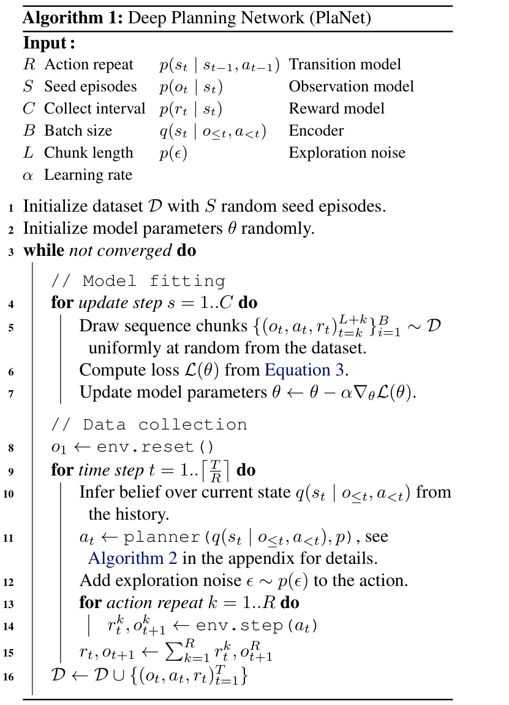{ width="620" }
  <figcaption>Algorithm 1. Deep Planning Network (PlaNet)</figcaption>
</figure>

Algorithm 1에 나오는 주요 용어는 다음처럼 읽으면 된다.

|기호 / 용어|의미|
|---|---|
|\(R\)|같은 action을 실제 환경에서 몇 step 반복할지 정하는 값|
|\(S\)|처음에 random action으로 모으는 seed episode 수|
|\(C\)|새 데이터를 모으기 전, 모델을 몇 번 update할지 정하는 collect interval|
|\(B\)|한 번의 update에 사용하는 batch size|
|\(L\)|dataset에서 잘라 쓰는 sequence chunk 길이|
|\(\alpha\)|모델 parameter를 업데이트할 때 사용하는 learning rate|
|\(p(s_t \mid s_{t-1}, a_{t-1})\)|이전 latent state와 action으로 다음 latent state를 예측하는 transition model|
|\(p(o_t \mid s_t)\)|latent state에서 image observation을 복원하는 observation model|
|\(p(r_t \mid s_t)\)|latent state에서 reward를 예측하는 reward model|
|\(q(s_t \mid o_{\leq t}, a_{<t})\)|지금까지의 observation과 action history로 현재 latent state를 추론하는 encoder|
|\(p(\epsilon)\)|실제 환경에서 action을 실행할 때 더하는 exploration noise|
|\(\mathcal{D}\)|agent가 지금까지 모은 episode dataset|

**1. 전체 알고리즘 흐름**

Algorithm 1은 seed episode 수집으로 시작해 **모델 학습**과 **데이터 수집**을 반복하는 구조다.

Dataset에서 sequence chunk를 뽑아 latent dynamics model(transition, observation, reward model)을 학습하고, 학습된 모델로 latent space planning을 수행한다.

Planner가 고른 action을 실제 환경에서 실행하면 새 observation과 reward가 dataset에 추가되고, 이 데이터로 다시 모델을 학습한다.

> **seed episode 수집 → 모델 학습 → latent planning → 실제 환경에서 데이터 수집 → 다시 모델 학습 (online planning)**

**2. Observation model의 역할**

Observation model은 planning에 직접 쓰이기보다, latent state가 실제 이미지를 잘 설명하도록 만드는 **학습용 신호**에 가깝다.

Planning 단계에서는 미래 이미지를 생성하지 않고, transition model로 미래 latent state를 rollout한 뒤 reward model로 보상을 예측한다.

따라서 planner는 **고차원 이미지 공간을 거치지 않고** compact한 latent space에서 많은 action sequence를 빠르게 평가할 수 있다.

### Algorithm 2: CEM을 이용한 planning

PlaNet의 planning은 **CEM, Cross-Entropy Method**로 수행된다.

CEM은 한 step의 action이 아니라 planning horizon 길이의 **action sequence** 분포를 반복적으로 개선한다.

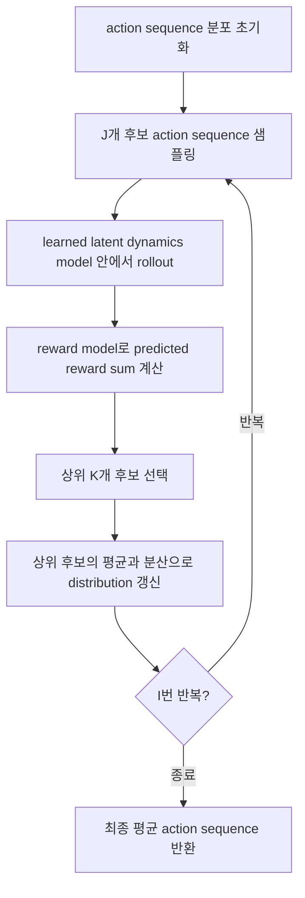

|기호|의미|값|
|---|---|---|
|$H$|planning horizon|12|
|$I$|CEM optimization iteration|10|
|$J$|candidate action sequence 수|1000|
|$K$|elite candidate 수|100|

MPC, Model Predictive Control은 긴 action sequence를 계획하더라도, 실제 환경에는 첫 번째 action만 실행하고 다음 step에서 다시 planning하는 방식이다.

PlaNet에서는 CEM이 최종적으로 얻은 평균 action sequence 중 첫 번째 action, 즉 $\mu_t$만 실행한 뒤 다음 observation을 받아 belief state를 갱신하고 다시 CEM planning을 수행한다.

---

## 3. 결정론적이면서 확률론적인 모델 구조: RSSM

### 3.1 RSSM 구조

PlaNet의 핵심 모델은 **RSSM, Recurrent State Space Model**이다.

논문은 세 가지 모델 구조를 비교한다.

<figure markdown="span">
  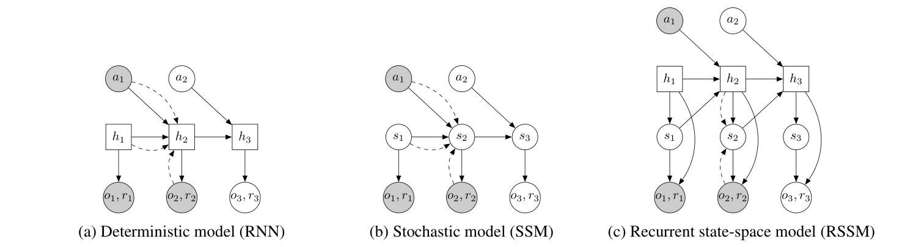{ width="760" }
  <figcaption>RSSM은 hidden state와 stochastic state를 함께 사용하는 구조다.</figcaption>
</figure>

첫째, **RNN / GRU 같은 결정론적 모델**이다.  
결정론적 모델은 hidden state가 하나의 값으로 정해진다. 과거 정보를 기억하는 데는 강하다.

하지만 여러 가능한 미래를 표현하기 어렵다.

미래가 불확실한 환경에서 “하나의 미래”만 예측하면, planner가 모델의 오류를 계속 이용하기가 쉬워진다.

둘째, **SSM, State Space Model 같은 확률론적 모델**이다.  
SSM은 stochastic state를 사용하므로 여러 가능한 미래를 표현할 수 있다.

하지만 순수하게 확률적인 transition만 사용하면 긴 시간 동안 정보를 안정적으로 기억하기 어렵다.

셋째, PlaNet이 사용하는 **RSSM**이다.  
RSSM은 결정론적 상태와 확률론적 상태를 함께 사용한다.

결정론적 상태 $h_t$는 RNN처럼 과거 정보를 누적해서 기억한다.

확률론적 상태 $s_t$는 불확실성과 여러 가능한 미래를 표현한다.

논문에서 RSSM은 다음처럼 정의된다.

$$ 
h_t = f(h_{t-1}, s_{t-1}, a_{t-1})  
$$

$$  
s_t \sim p(s_t \mid h_t)  
$$

$$ 
o_t \sim p(o_t \mid h_t, s_t)  
$$

$$ 
r_t \sim p(r_t \mid h_t, s_t)  
$$

각 항은 다음처럼 정리할 수 있다.

|항|의미|역할|
|---|---|---|
|$h_t$|deterministic state|RNN처럼 과거 정보를 누적해서 기억한다.|
|$s_t$|stochastic state|불확실성과 여러 가능한 미래를 표현한다.|
|$a_{t-1}$|이전 action|다음 상태를 예측할 때 함께 사용된다.|
|$o_t$|observation|latent state가 실제 이미지를 설명하는지 학습하는 신호다.|
|$r_t$|reward|planning에서 action sequence를 평가하는 기준이 된다.|

즉 RSSM은 상태를 deterministic part와 stochastic part로 나누고, 이 둘을 함께 사용해 observation과 reward를 예측한다.

### 3.2 Objective Function

PlaNet은 latent dynamics model을 학습하기 위해 variational objective를 사용한다.

여기서 variational objective는 **직접 관측할 수 없는 latent state를 학습하기 위한 목적함수**라고 이해하면 된다.

PlaNet이 실제로 받는 것은 pixel observation이다. latent state $s_t$는 환경이 주는 정답 값이 아니라, 모델 내부에서 추론해야 하는 숨은 상태다.

그래서 encoder $q(s_t \mid o_{\leq t}, a_{<t})$가 observation history를 보고 현재 latent state를 근사적으로 추론한다.

이렇게 추론한 latent state를 이용해 observation과 reward를 설명하고, transition model의 예측도 함께 맞춘다.


모델은 두 가지를 동시에 잘해야 한다.

첫째, **reconstruction term과 reward term**을 통해 latent state가 observation과 reward를 잘 설명해야 한다.  
둘째, **KL term**을 통해 transition model이 이전 latent state와 action만으로 다음 latent state를 잘 예측해야 한다.

(아래 식에는 reward loss가 생략되어 있으며, reconstruction term과 같은 방식으로 추가된다.) 

기본 형태는 다음과 같다.

$$
\begin{aligned}
\ln p(o_{1:T} \mid a_{1:T})  
&\ge  
\sum_{t=1}^{T}  
\Big(  
\mathbb{E}_{q(s_t \mid o_{\leq t}, a_{<t})}  
\left[\ln p(o_t \mid s_t)\right] \\
&\quad -
\mathbb{E}_{q(s_{t-1} \mid o_{\leq t-1}, a_{<t-1})}  
\left[  
\mathrm{KL}  
\left(  
q(s_t \mid o_{\leq t}, a_{<t})  
\,\|\,  
p(s_t \mid s_{t-1}, a_{t-1})  
\right)  
\right]  
\Big)
\end{aligned}
$$

이 수식은 크게 두 부분으로 나눌 수 있다.

**Reconstruction term**

$$
\mathbb{E}_{q(s_t \mid o_{\leq t}, a_{<t})}  
[\ln p(o_t \mid s_t)]  
$$

이 항은 현재 latent state $s_t$가 observation $o_t$를 잘 설명하는지 평가한다.

직관적으로 말하면 다음과 같다.

> encoder가 이미지를 보고 latent state를 추론했다.  
> 그렇다면 그 latent state에서 다시 이미지를 복원했을 때 원래 observation과 비슷해야 한다.

매 time step의 image를 통해 latent state가 환경 정보를 담도록 학습된다.

**KL term / Complexity term**

$$
\mathrm{KL}  
(  
q(s_t \mid o_{\leq t}, a_{<t})  
|  
p(s_t \mid s_{t-1}, a_{t-1})  
)  
$$

이 항은 posterior $q$와 prior $p$가 얼마나 다른지 측정한다.

|분포|어떻게 얻는가|의미|
|---|---|---|
|posterior $q$|encoder가 실제 observation을 보고 추론한다.|현재 이미지를 봤을 때 latent state가 어디에 있을지 나타낸다.|
|prior $p$|transition model이 이전 latent state와 action만으로 예측한다.|observation 없이 다음 latent state가 어디로 갈지 나타낸다.|

따라서 KL term은 다음과 같은 역할을 한다.

> observation을 보고 추론한 상태 $q$와  
> 모델이 미리 예측한 상태 $p$가 가까워지도록 만든다.

planning은 실제 행동을 실행하기 전에 미래를 가상으로 평가하는 단계이므로, 아직 미래 observation이 존재하지 않는다.

따라서 agent는 현재 latent state와 action sequence만으로 미래 latent state를 예측해야 한다.

따라서 transition model $p(s_t \mid s_{t-1}, a_{t-1})$의 예측이 posterior $q$와 가까워지는 것이 중요하다.

정리하면 PlaNet의 학습 loss는 다음과 같이 이해할 수 있다.

```text
전체 loss
= image reconstruction loss
+ reward prediction loss
+ transition prior와 posterior 사이의 KL loss
```

---

## 4. 잠재공간에서 미래를 어떻게 예상할까?: Latent Overshooting

<figure markdown="span">
  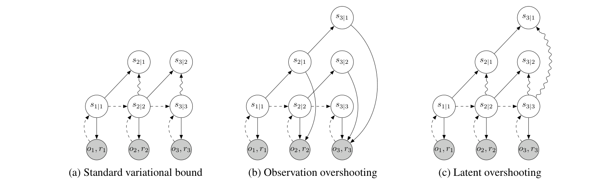{ width="760" }
  <figcaption>Latent overshooting은 여러 step 뒤의 latent prediction도 posterior와 가까워지도록 학습하는 방법이다.</figcaption>
</figure>

표준 variational objective는 기본적으로 다음과 같은 **one-step prediction**을 학습한다.

$$
p(s_t \mid s_{t-1}, a_{t-1})  
$$

하지만 planning에서는 한 step만 예측하지 않고, horizon만큼 transition model을 반복해서 rollout한다.

예를 들어 horizon이 12라면 다음과 같은 자기 예측을 이어가야 한다.

$$
s_t \rightarrow s_{t+1} \rightarrow s_{t+2} \rightarrow \cdots \rightarrow s_{t+12}
$$

문제는 one-step prediction의 작은 오차가 여러 step 동안 반복되면서 누적될 수 있다는 점이다.

또한 학습에서는 stochastic transition이 주로 one-step KL regularizer로만 맞춰지기 때문에, 긴 transition chain 전체를 직접 훈련하기 어렵다.

Latent overshooting은 이 문제를 해결하기 위해 등장한다. 핵심 아이디어는 다음과 같다.

> 한 step 예측만 맞추지 말고, 여러 step 뒤의 latent state도 맞추도록 학습하자.

**Figure 3(c) 예시**

시간 1에서 posterior $s_{1|1}$을 얻었다고 하자.

Latent overshooting은 실제 observation $o_2, o_3$를 보지 않은 채 transition model만으로 $s_{2|1}$, $s_{3|1}$을 rollout한다.

그리고 이렇게 예측한 $s_{3|1}$이, 실제 observation까지 보고 추론한 posterior $s_{3|3}$과 가까워지도록 학습한다.

즉 one-step 예측뿐 아니라, 여러 step 뒤까지 latent prediction이 맞도록 transition model을 압박한다.

### 4.1 Multi-step prediction

논문은 먼저 $d$-step prediction을 정의한다.

$$
\begin{aligned}
p(s_t \mid s_{t-d})
&= \int
\prod_{\tau=t-d+1}^{t}
p(s_{\tau} \mid s_{\tau-1})
\, ds_{t-d+1:t-1}
\end{aligned}
$$

이 수식은 어렵게 보이지만 의미는 단순하다.

$s_{t-d}$에서 시작해서 transition model을 $d$번 반복하면 $s_t$에 도달한다.

그런데 중간 상태들 $s_{t-d+1}, \dots, s_{t-1}$는 확률 변수다.

따라서 가능한 중간 경로들을 모두 고려해야 한다.

그래서 적분이 들어간다.

특히 $d=1$이면 다음과 같다.

$$
p(s_t \mid s_{t-1})  
$$

즉 기존 one-step transition과 동일해진다.

논문도 $d=1$인 경우 원래 모델의 one-step transition을 회복한다고 설명한다.

### 4.2 Fixed distance $d$에 대한 objective

그다음 논문은 fixed distance $d$에 대해 multi-step predictive distribution을 학습하는 variational bound를 만든다.

$$
\begin{aligned}
\ln p_d(o_{1:T})
&\ge
\sum_{t=1}^{T}
\Bigg(
\mathbb{E}_{q(s_t \mid o_{\leq t})}
\left[
\ln p(o_t \mid s_t)
\right] \\
&\quad -
\mathbb{E}_{\substack{
p(s_{t-1} \mid s_{t-d}) \\
q(s_{t-d} \mid o_{\leq t-d})
}}
\left[
D_{\mathrm{KL}}
\left(
q(s_t \mid o_{\leq t})
\,\|\, 
p(s_t \mid s_{t-1})
\right)
\right]
\Bigg)
\end{aligned}
$$

이 수식의 핵심은 KL term이다.

표준 objective에서는 $s_{t-1}$에서 $s_t$를 한 step 예측하고, 그것을 posterior와 비교한다.

반면 latent overshooting에서는 $s_{t-d}$에서 시작해 모델을 여러 step rollout한다.

그 rollout을 통해 $s_{t-1}$까지 도달한 뒤, 마지막으로 $s_t$를 예측한다.

그리고 이 예측을 실제 observation을 보고 추론한 posterior $q(s_t \mid o_{\leq t})$와 비교한다.

즉 다음과 같은 구조다.

```text
posterior at t-d
      ↓
model rollout
      ↓
multi-step prior near t
      ↓
posterior at t와 KL로 비교
```

이렇게 하면 모델은 단순히 “바로 다음 상태”만 맞추지 않는다.

여러 step 동안 자기 예측만으로 굴러간 뒤에도 올바른 latent state에 도달하는지를 함께 학습한다.

### 4.3 모든 거리 $1 \le d \le D$에 대한 Latent Overshooting

fixed distance $d$만 사용하면 특정 거리의 예측만 좋아질 수 있다.

하지만 planning에서는 horizon 안의 모든 거리에서 예측이 좋아야 한다.

그래서 논문은 $d=1$부터 $D$까지 모든 거리에 대한 objective를 평균낸다.

$$
\begin{aligned}
\frac{1}{D}
\sum_{d=1}^{D}
\ln p_d(o_{1:T})
&\ge
\sum_{t=1}^{T}
\Bigg(
\mathbb{E}_{q(s_t \mid o_{\leq t})}
\left[
\ln p(o_t \mid s_t)
\right] \\
&\quad -
\frac{1}{D}
\sum_{d=1}^{D}
\beta_d
\mathbb{E}_{\substack{
p(s_{t-1} \mid s_{t-d}) \\
q(s_{t-d} \mid o_{\leq t-d})
}}
\left[
D_{\mathrm{KL}}
\left(
q(s_t \mid o_{\leq t})
\,\|\, 
p(s_t \mid s_{t-1})
\right)
\right]
\Bigg)
\end{aligned}
$$

여기서 $\beta_d$는 각 overshooting distance에 얼마나 가중치를 줄지 정하는 계수다.

이 수식은 한마디로 다음과 같다.

> $1$-step, $2$-step, ..., $D$-step prediction을 모두 latent space에서 훈련하자.

중요한 점은 이 비교가 observation space가 아니라 **latent space**에서 이루어진다는 것이다.

이미지를 매번 생성해 reconstruction loss를 거는 대신, PlaNet은 multi-step prior와 posterior를 latent space에서 KL로 비교한다.

그래서 observation overshooting보다 훨씬 가볍게 multi-step regularization을 적용할 수 있다.

> observation overshooting은 여러 step 뒤의 prediction을 image observation까지 복원해서 맞추는 방식이다.

다만 최종 RSSM agent에서는 latent overshooting이 꼭 필요하지 않았고, RSSM에서는 오히려 약간 성능이 낮아졌다고 보고된다.

따라서 이 논문에서 latent overshooting은 최종 성능의 핵심 요소라기보다, **latent sequence model을 multi-step prediction에 맞게 학습시키려는 보조 아이디어**에 가깝다.

---

## 5. 6가지 Task에서 4가지 중요 지점 살펴보기: Experiment

PlaNet은 DeepMind Control Suite의 여섯 가지 image-based continuous control task에서 평가된다.

모든 task에서 agent가 받는 관측은 $64 \times 64 \times 3$ 크기의 third-person camera image뿐이다.

즉 agent는 simulator의 true state를 직접 받지 않는다.

### 5.1 실험에 사용된 6가지 task

**1. Cartpole Swing Up**

{ width="260" }

Cartpole Swing Up은 pole을 위로 세우는 task다. 이 task는 긴 planning horizon이 필요하다.

pole을 바로 세울 수 없기 때문에 먼저 swing motion을 만들어야 한다.

또한 camera가 고정되어 있어 cart가 화면 밖으로 나갈 수 있다.

따라서 agent는 보이지 않는 cart의 위치를 latent state 안에 기억해야 한다.

**2. Reacher Easy**

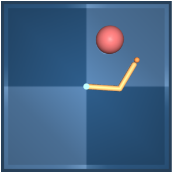{ width="260" }

Reacher Easy는 로봇 팔의 손끝을 목표 위치로 이동시키는 task다.

reward가 dense하게 계속 주어지는 것이 아니다.

hand와 goal area가 겹칠 때 sparse reward가 주어진다.

따라서 단순히 가까워지는 모든 순간에 보상을 받는 환경보다 탐색이 더 어렵다.

**3. Cheetah Run**

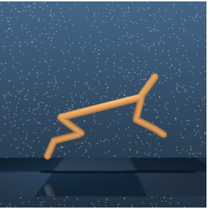{ width="260" }

Cheetah Run은 cheetah 형태의 agent가 앞으로 달리는 task다.

이 task는 action space와 state space가 더 크다.

또한 달리는 과정에서 contact dynamics가 포함된다. 따라서 단순한 균형 잡기보다 dynamics 예측이 더 어렵다.

**4. Finger Spin**

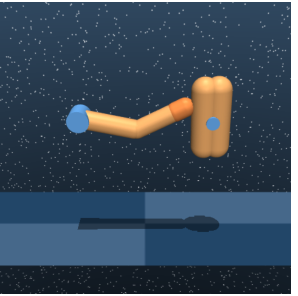{ width="260" }

Finger Spin은 손가락 모양의 agent가 물체를 회전시키는 task다.

finger와 object 사이의 접촉이 중요하므로 contact dynamics를 잘 예측해야 한다.

작은 접촉 차이가 미래 상태를 크게 바꿀 수 있기 때문에 모델 기반 planning에 까다로운 환경이다.

**5. Cup Catch**

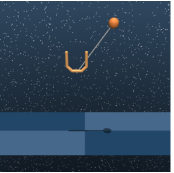{ width="260" }

Cup Catch는 컵으로 공을 받는 task다.

reward는 공을 잡았을 때만 주어지는 sparse reward다.

따라서 agent는 reward가 거의 없는 구간에서도 미래의 성공 가능성을 latent dynamics로 예측해야 한다.

**6. Walker Walk**

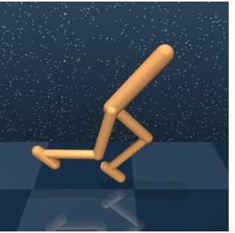{ width="260" }

Walker Walk는 walker가 먼저 일어서고, 그다음 걸어야 하는 task다.

처음에는 바닥에 누워 있는 상태에서 시작할 수 있고, ground와의 충돌을 예측해야 한다.

따라서 균형, 접촉, 긴 horizon의 문제가 함께 들어 있다.

---

### 5.2 실험 1: PlaNet과 model-free 알고리즘 비교

**Figure 4는 PlaNet을 model-free 알고리즘인 A3C, D4PG와 비교한다.**

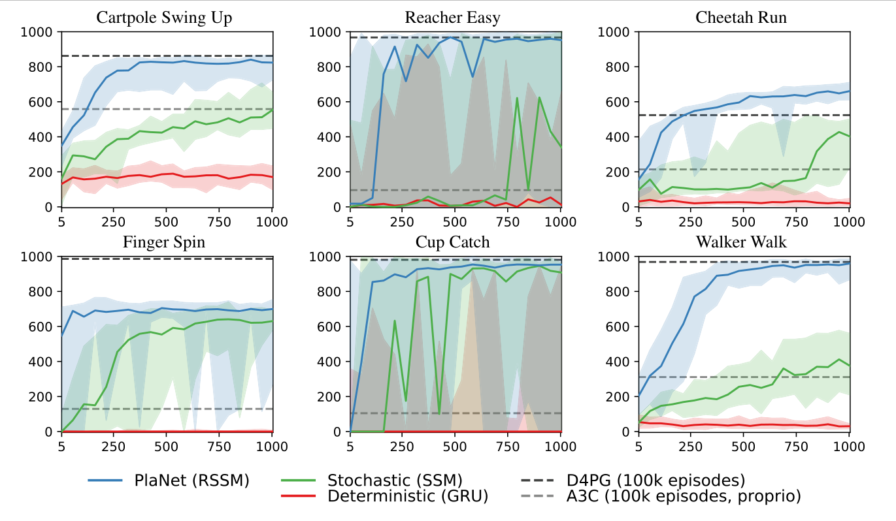{ width="760" }

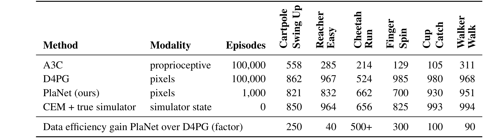{ width="760" }

여기서 중요한 점은 PlaNet이 **true state가 아니라 pixel observation만 사용한다는 것**이다.

그럼에도 PlaNet은 훨씬 적은 episode로 model-free 알고리즘과 비슷하거나 더 좋은 성능을 보인다.

> PlaNet은 model-free 방식보다 훨씬 적은 interaction으로도 강한 성능을 낼 수 있다.

Table 1에서도 PlaNet은 1,000 episode만으로 여러 task에서 D4PG에 가까운 성능을 낸다.

특히 Cheetah Run에서는 D4PG보다 높은 점수를 기록하지만, Finger Spin에서는 D4PG가 더 강하다.

즉 이 실험은 PlaNet이 pixel observation만으로도 model-based RL의 장점인 **sample efficiency**를 잘 보여준다는 점을 강조한다.

---

### 5.3 실험 2: RSSM, SSM, GRU 모델 구조 비교

Figure 4는 PlaNet의 RSSM 구조를 다른 dynamics model과도 비교한다.

{ width="760" }

비교 대상은 다음과 같다.

|Model|특징|
|---|---|
|RSSM|deterministic path + stochastic state|
|SSM|purely stochastic state-space model|
|GRU|purely deterministic recurrent model|

이 실험은 단순한 deterministic model이나 purely stochastic model보다 RSSM이 더 안정적으로 학습된다는 점을 보여준다.

논문은 transition function 안의 deterministic element와 stochastic element가 모두 중요하다고 보고한다.

특히 stochastic component가 없으면 agent가 제대로 학습하지 못했다.

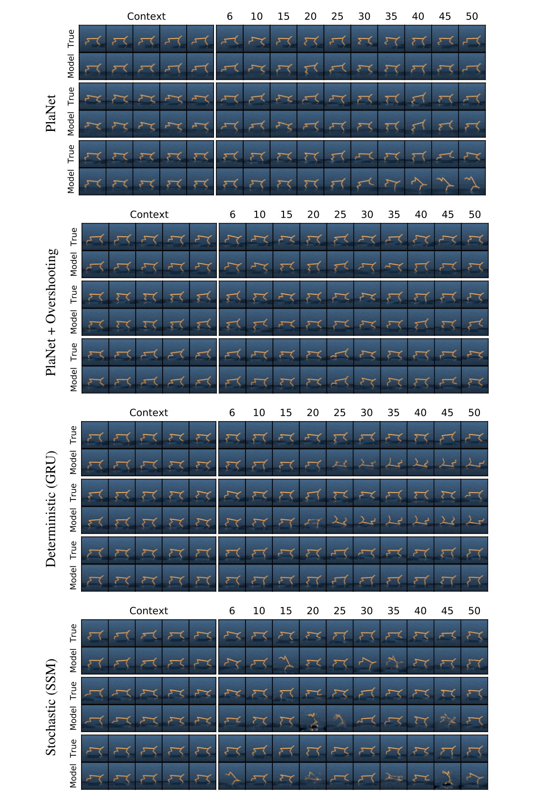{ width="720" }

Figure 10은 test episode에서 open-loop video prediction을 보여준다.

앞의 몇 frame은 context로 주어지고, 이후 frame은 모델이 스스로 예측한다.

논문은 RSSM이 Cheetah 환경에서 50 step 미래까지 pixel-level로 정확한 예측을 달성했다고 설명한다.

반면 SSM과 GRU는 긴 open-loop prediction에서 예측이 빠르게 부정확해진다.

SSM은 장기 정보를 안정적으로 유지하기 어렵고, GRU는 stochastic한 미래를 표현하기 어렵기 때문이다.

이 실험의 핵심 메시지는 다음과 같다.

> Planning을 위해서는 단순히 이미지를 잘 복원하는 모델만으로 부족하다.  
> 긴 horizon 동안 안정적으로 미래를 예측할 수 있는 latent dynamics model이 필요하다.  
> RSSM은 기억을 담당하는 deterministic path와 불확실성을 담당하는 stochastic state를 결합해 이 문제를 해결한다.

---

### 5.4 실험 3: Planning을 하지 않는 방식과 비교

**Figure 5는 PlaNet을 두 가지 약화된 agent design과 비교한다.**

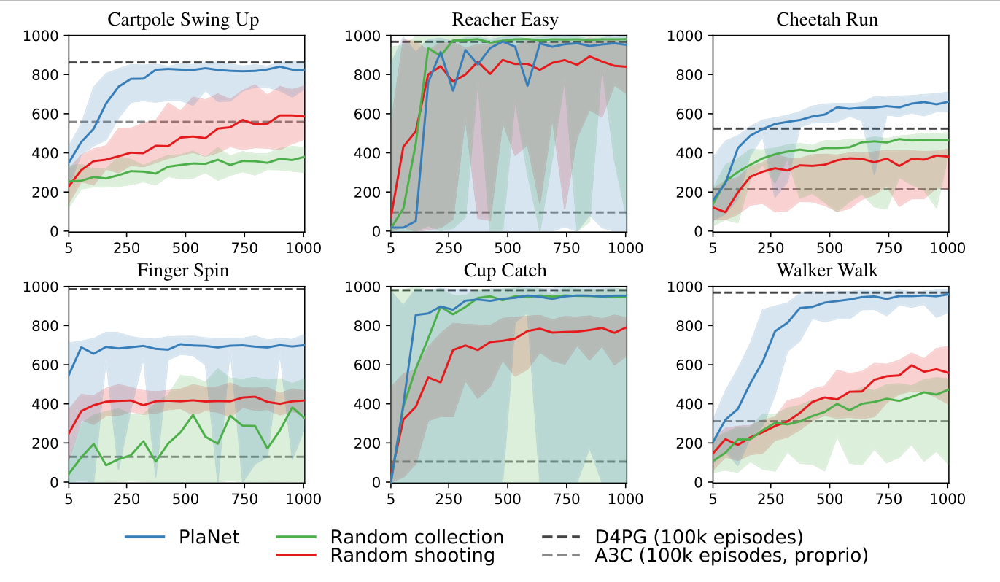{ width="760" }

비교 대상은 다음과 같다.

|Agent design|설명|
|---|---|
|PlaNet|planning으로 데이터를 수집하고, CEM으로 action sequence를 반복 개선|
|Random collection|데이터를 random action으로 수집|
|Random shooting|CEM 없이 1000개 action sequence 중 가장 좋은 것을 바로 선택|

**Random collection**

Random collection은 새로운 episode를 수집할 때 planning 없이 random action만 사용하는 방식이다.

이 방식은 task 해결에 필요한 상태 공간을 충분히 방문하지 못할 수 있다.

예를 들어 Cartpole에서 pole을 세우거나, Walker가 일어나 걷거나, Finger가 물체를 안정적으로 돌리는 행동은 random action만으로 자주 나오기 어렵다.

그러면 모델은 중요한 상태 전이를 배우지 못하고, 그 모델을 사용한 planning도 좋아지기 어렵다.

PlaNet은 현재까지 학습한 모델로 planning한 뒤 실제 환경에서 데이터를 모으기 때문에, 시간이 지날수록 task-relevant한 영역의 데이터를 더 많이 수집할 수 있다.

**Random shooting**

Random shooting은 CEM 없이 매 step 1000개의 action sequence를 한 번 샘플링하고, 그중 reward가 가장 높게 예측되는 후보를 선택한다.

겉으로는 planning처럼 보이지만, 후보를 한 번 뽑고 끝난다는 점에서 CEM과 다르다.

CEM은 좋은 후보들을 고른 뒤, 그 후보들의 평균과 분산으로 action distribution을 다시 맞춘다.

그리고 새 distribution에서 다시 후보를 뽑으며 action search를 반복적으로 개선한다.

논문은 이러한 iterative search가 모든 task에서 성능을 향상시켰다고 보고한다.

이 실험의 핵심 메시지는 다음과 같다.

> PlaNet의 성능은 단순히 모델을 학습했기 때문에 나온 것이 아니다.  
> 좋은 데이터를 모으는 online collection과, action sequence를 반복 개선하는 CEM planning이 함께 필요하다.

---

### 5.5 실험 4: Single agent와 Individual agents 비교

**Figure 6과 Figure 7은 하나의 PlaNet agent를 여섯 task에 모두 학습시킨 경우와, task별로 따로 학습한 agent들을 비교한다.**

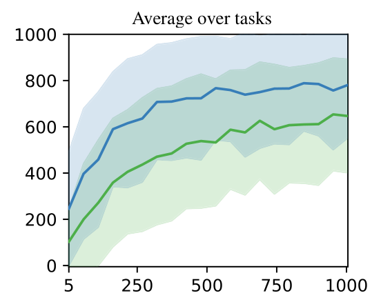{ width="420" }

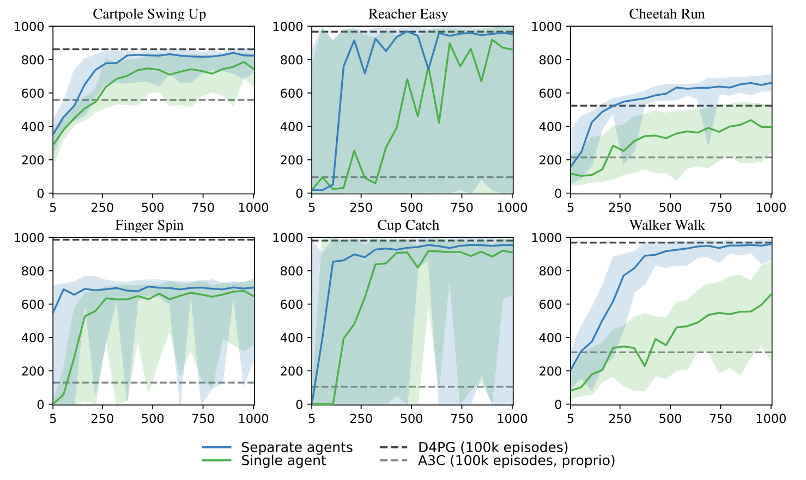{ width="760" }

하나의 PlaNet agent는 task별 individual agents보다 느리게 학습하지만, 결국 여섯 task를 모두 해결할 수 있다.

실험 설정은 간단하다.

일반적인 실험에서는 task마다 별도의 agent를 학습하지만, single agent 실험에서는 하나의 agent가 여섯 task를 모두 학습한다.

agent는 task id를 따로 받지 않고, image observation만 보고 현재 task를 추론해야 한다.

task마다 action space 크기가 다르기 때문에, 논문에서는 action space를 padding해서 맞춘다.

Figure 6과 Figure 7은 single agent가 느리지만 모든 task를 학습할 수 있음을 보여준다.

이 실험의 핵심 메시지는 다음과 같다.

> 하나의 latent dynamics model이 시각적으로 서로 다른 여러 domain의 dynamics를 함께 학습할 수 있다.

이것은 PlaNet이 단일 task용 모델을 넘어, 여러 task에서 공유 가능한 world model의 가능성을 가진다는 점을 보여준다.

---

## 6. 결론

논문에서 중요한 기여는 세 가지로 정리할 수 있다.

- **Latent space planning**
  - 고차원 픽셀 공간이 아니라 compact한 latent space에서 planning한다.
  - 매번 미래 이미지를 생성하지 않고도 더 긴 horizon을 다룰 수 있게 했다.

- **RSSM 구조**
  - deterministic path로 장기 정보를 기억한다.
  - stochastic state로 불확실성과 multiple futures를 표현한다.

- **Latent overshooting**
  - one-step objective를 넘어 multi-step prediction을 latent space에서 훈련하는 방법을 제안했다.
  - 최종 RSSM agent에서는 반드시 필요하지 않았지만, latent sequence model을 planning에 맞게 훈련하려는 시도였다.

**한계**

- 매 step마다 CEM planning을 수행해야 하므로 계산 비용이 크다.
- observation reconstruction 중심의 representation이 복잡한 현실 환경에서 항상 최선은 아닐 수 있다.

**앞으로의 개선 방향**

- temporal abstraction으로 더 긴 horizon을 효율적으로 다룬다.
- value function으로 planning horizon 이후의 reward를 추정한다.
- gradient-based planning이나 reconstruction 없는 representation learning을 탐색한다.
- Dreamer 계열처럼 latent dynamics 안에서 policy와 value를 직접 학습하는 방향으로 발전한다.

한 문장으로 마무리하면 다음과 같다.

> **PlaNet은 픽셀 세계를 그대로 예측하려 한 모델이 아니다.  
> 행동 선택에 필요한 미래를 latent space 안에서 예측하고, 그 예측 위에서 planning을 수행한 모델이다.**
