# Hello, World Models: 지난 시즌 리뷰

!!! info "Information"
    - **Title:** Hello, World Models: 지난 시즌 리뷰 (핵심 논문 다시 보기)
    - **Session:** Season 2 오리엔테이션 (2026-10-07)
    - **Papers:** [World Models](world-models.md), [PlaNet](planet.md), [Dreamer](dreamer.md), [DreamerV2](dreamer-v2.md), [DreamerV3](dreamer-v3.md), I-JEPA, [V-JEPA](v-jepa.md), [V-JEPA 2](v-jepa-2.md), [Genie](genie.md), [Cosmos](cosmos.md)
    - **Presenter:** [유정화](https://github.com/jeongHwarr)
    - **Last updated:** 2026-10-08

## 0. Summary

**월드 모델은 세상이 어떻게 변할지 내부에서 시뮬레이션하는 모델이다.** 지난 시즌에는 최신 월드 모델 논문의 바탕이 되는 논문들을 읽었다. 이 문서는 시즌 2를 시작하기 전에 그 내용을 계열별로 한 번에 정리한다.

**지난 시즌에 본 계열과 논문**

- **Model-Based RL:** 월드 모델 안에서 상상한 경험으로 행동을 배운다. World Models, RSSM(PlaNet), Dreamer V1~V3
- **JEPA (Predictive):** 픽셀 대신 가려진 부분의 표현을 예측한다. I-JEPA, V-JEPA, V-JEPA 2
- **Generative Interactive:** 사용자 입력에 반응하는 환경을 영상으로 생성한다. Genie
- **Foundation:** 대규모로 사전학습한 뒤 여러 도메인에 맞춰 후학습한다. Cosmos

**공통 흐름:** 월드 모델 연구는 Model-Based RL에서 출발해 표현 예측(JEPA)과 대규모 영상 생성(Genie, Cosmos)으로 갈라졌다. 지금은 V-JEPA 2와 Cosmos처럼 행동 조건을 다시 붙이는 쪽으로 모이고 있다.

**글의 구성**

- 1절: 월드 모델의 정의와 기존 생성형 AI와의 차이
- 2절: 월드 모델의 활용 분야와 연구 갈래
- 3절: Model-Based RL 계열 (World Models, RSSM, 상상 속 Actor-Critic, Dreamer V1~V3)
- 4절: JEPA 계열 (I-JEPA, V-JEPA, V-JEPA 2)
- 5절: Generative와 Foundation 계열 (Genie, Cosmos)
- 6절: 여섯 모델 비교와 계열별 한 줄 요약

---

## 1. 월드 모델이란

### 세 단계: 관찰, 시뮬레이션, 행동

**월드 모델은 관측을 잠재 상태로 압축하고, 잠재 상태와 행동으로 다음 상태를 예측한다.** 예측한 결과를 바탕으로 행동을 고르는 단계가 붙기도 한다.

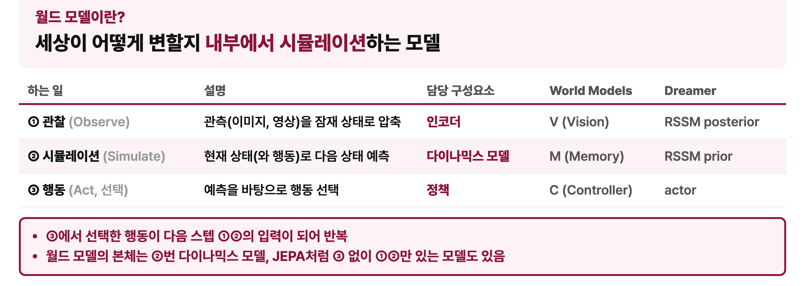

!!! example "비유: 공을 던지기 전에 떠올리는 궤적"
    사람은 공을 실제로 던져 보지 않아도 공이 어디로 날아갈지 머릿속으로 그려 볼 수 있다. 머릿속에 세상이 어떻게 움직이는지에 대한 모델이 있기 때문이다. 월드 모델은 이 능력을 AI에게 주려는 시도다.

월드 모델이 하는 일은 세 단계로 나눌 수 있다.

1. **관찰 (Observe)**  
   이미지나 영상처럼 크고 복잡한 관측을 잠재 상태로 압축한다. 인코더가 이 단계를 맡는다. World Models에서는 V(Vision), Dreamer에서는 RSSM의 posterior가 여기에 해당한다.
2. **시뮬레이션 (Simulate)**  
   현재 상태와 행동을 입력으로 받아 다음 상태를 예측한다. 다이나믹스 모델이 이 단계를 맡는다. World Models에서는 M(Memory), Dreamer에서는 RSSM의 prior가 여기에 해당한다.
3. **행동 (Act)**  
   예측한 결과를 바탕으로 어떤 행동을 할지 고른다. 정책이 이 단계를 맡는다. World Models에서는 C(Controller), Dreamer에서는 actor가 여기에 해당한다.

3단계에서 고른 행동은 다음 스텝의 1, 2단계 입력이 되고, 이 과정이 반복된다. **월드 모델의 본체는 2단계인 다이나믹스 모델이다.** 모든 월드 모델이 세 단계를 다 갖지는 않는다. JEPA처럼 행동 단계 없이 1, 2단계만 하는 모델도 있다.

### 기존 생성형 AI와의 차이

**기존 생성형 AI는 무엇을 그럴듯하게 만들지에 집중하고, 월드 모델은 세상이 어떻게 변하는지에 집중한다.** 월드 모델의 핵심 입력은 지금 상태와 행동이고, 핵심 출력은 다음 상태다.

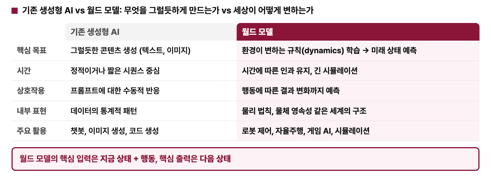

| 기준 | 기존 생성형 AI | 월드 모델 |
|:---|:---|:---|
| 핵심 목표 | 텍스트, 이미지 같은 그럴듯한 콘텐츠 생성 | 환경이 변하는 규칙(dynamics)을 배워 미래 상태 예측 |
| 시간 | 정적이거나 짧은 시퀀스 | 시간에 따른 인과를 유지하는 긴 시뮬레이션 |
| 상호작용 | 프롬프트에 수동적으로 반응 | 행동에 따라 결과가 어떻게 바뀌는지까지 예측 |
| 내부 표현 | 데이터의 통계적 패턴 | 물리 법칙, 물체 영속성 같은 세계의 구조 |
| 주요 활용 | 챗봇, 이미지 생성, 코드 생성 | 로봇 제어, 자율주행, 게임 AI, 시뮬레이션 |

---

## 2. 활용 분야와 연구 갈래

### 게임: 에이전트가 배우는 환경이자 사람이 플레이하는 환경

**게임에서 월드 모델은 에이전트가 학습하는 환경이 되기도 하고, 사람이 직접 플레이하는 환경이 되기도 한다.**

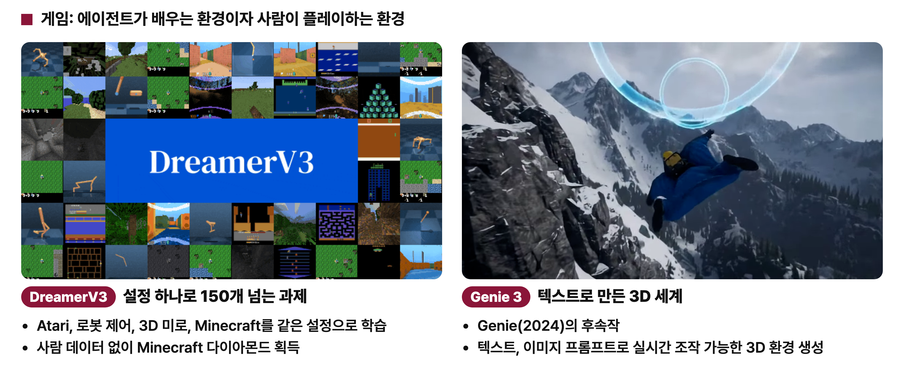

- **DreamerV3:** 하이퍼파라미터 설정 하나로 150개가 넘는 과제를 학습한다. Atari, 로봇 제어, 3D 미로, Minecraft를 같은 설정으로 학습해 좋은 성능을 보였다. Minecraft에서 다이아몬드를 캐려면 긴 행동 시퀀스가 필요해 강화학습에서 어려운 과제로 알려져 있는데, DreamerV3는 사람 데이터 없이 다이아몬드를 획득했다.
- **Genie 3:** Genie(2024)의 후속작이다. 텍스트나 이미지 프롬프트로 사용자가 실시간으로 조작할 수 있는 3D 환경을 만든다.

### 로보틱스와 자율주행: 모으기 어려운 데이터를 월드 모델로 대체

**로보틱스와 자율주행은 데이터를 모으기 어렵고 위험하다는 공통점이 있고, 월드 모델이 이 문제를 줄이는 데 쓰인다.**

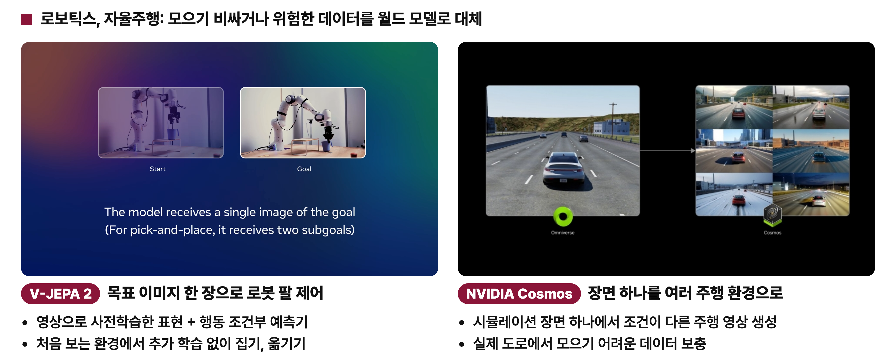

- **V-JEPA 2:** 목표 이미지 한 장만 주면 로봇 팔이 그 상태가 되도록 움직인다. 영상으로 사전학습한 표현에 행동 조건부 예측기를 붙였기 때문에, 처음 보는 환경에서도 추가 학습 없이 물체를 집고 옮길 수 있다.
- **NVIDIA Cosmos:** 시뮬레이션 장면 하나를 조건이 다른 여러 주행 영상으로 만든다. 실제 도로에서 모으기 어려운 데이터를 보충하는 데 쓸 수 있다.

### 월드 모델 연구의 6갈래

**지난 시즌을 준비하며 월드 모델 연구를 여섯 갈래로 나눴다.** 공식 분류는 아니므로 정확하지 않은 부분이 있을 수 있다.

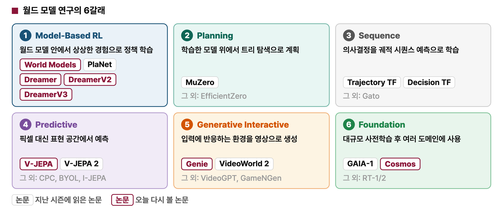

| 갈래 | 핵심 아이디어 | 지난 시즌에 읽은 논문 |
|:---|:---|:---|
| 1. Model-Based RL | 월드 모델 안에서 상상한 경험으로 정책 학습 | World Models, PlaNet, Dreamer, DreamerV2, DreamerV3 |
| 2. Planning | 학습한 모델 위에서 트리 탐색으로 계획 | MuZero |
| 3. Sequence | 의사결정을 상태, 행동, 보상 시퀀스 예측 문제로 바꿔 Transformer로 학습 | Trajectory Transformer, Decision Transformer |
| 4. Predictive | 픽셀 대신 표현 공간에서 예측 | V-JEPA, V-JEPA 2 |
| 5. Generative Interactive | 사용자 입력에 반응하는 환경을 영상으로 생성 | Genie, VideoWorld 2 |
| 6. Foundation | 대규모 사전학습 후 여러 도메인에 맞춰 사용 | GAIA-1, Cosmos |

!!! example "비유: 바둑을 배우는 방법"
    실제로 대국을 두며 경험으로 실력을 쌓을 수도 있고, 머릿속에서 대국을 상상하며 실력을 쌓을 수도 있다. Model-Based RL은 후자다. 상상 속에서 충분히 연습한 뒤 실제 대국에서는 익힌 감각대로 둔다. Planning은 바둑에서 여러 수를 미리 읽어 보는 방식에 가깝다.

이 문서는 그중 Model-Based RL, Predictive(JEPA), Generative Interactive, Foundation 계열의 핵심 논문을 다시 본다.

---

## 3. Model-Based RL 계열

**Model-Based RL은 환경 모델, 즉 월드 모델을 먼저 배우고 그 안에서 상상한 경험으로 행동을 배우는 강화학습이다.** 실제 환경에서 시행착오를 반복하는 대신 월드 모델 안에서 연습한다. 이 절에서 볼 모델은 모두 관측을 잠재 상태로 압축하고 그 잠재 공간에서 상상한다.

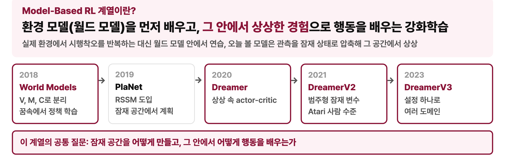

1. **World Models (2018):** 월드 모델이라는 개념과 이름을 널리 알렸다. 에이전트를 V, M, C로 나누고 꿈속에서 정책을 학습했다.
2. **PlaNet (2019):** RSSM이라는 잠재 다이나믹스 모델을 도입하고 잠재 공간에서 계획했다.
3. **Dreamer (2020):** 상상 속에서 actor-critic을 학습했다.
4. **DreamerV2 (2021):** 범주형 잠재 변수를 써서 Atari에서 사람 수준에 도달했다.
5. **DreamerV3 (2023):** 설정 하나로 여러 도메인을 학습했다.

이 계열의 공통 질문은 두 가지다. **잠재 공간을 어떻게 만들 것인가, 그리고 그 안에서 행동을 어떻게 배울 것인가.**

### 3-1. World Models: 보는 부분, 상상하는 부분, 판단하는 부분

**World Models는 에이전트를 보는 부분(V), 상상하는 부분(M), 판단하는 부분(C)으로 나눴다.** 환경을 학습하고 그 안에서 행동을 배운다는 아이디어는 이전부터 있었지만, 이 논문이 딥러닝으로 구현하고 월드 모델이라는 이름을 널리 알렸다. 세 부분은 1절의 관찰, 시뮬레이션, 행동과 그대로 이어진다.

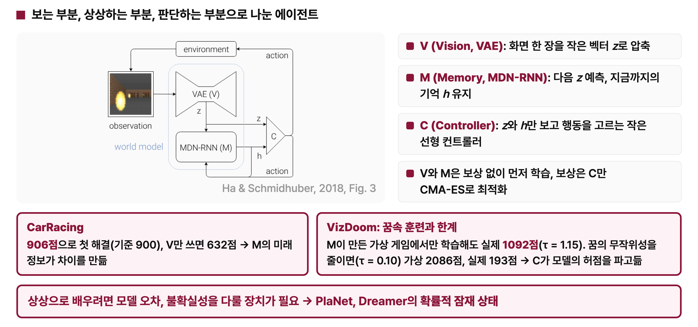

- **V (Vision, VAE):** 화면 한 장을 작은 잠재 벡터 $z$로 압축한다.
- **M (Memory, MDN-RNN):** 지금까지 본 장면을 기억 $h$로 유지하면서 다음 $z$를 예측한다.
- **C (Controller):** $z$와 $h$만 보고 행동을 고르는 작은 선형 컨트롤러다.

**V와 M은 보상 없이 먼저 학습하고, 보상은 C에만 쓴다.** C는 CMA-ES로 최적화한다. 세상을 이해하는 큰 모델과 행동을 고르는 작은 컨트롤러를 분리한 구조다.

**결과: M이 주는 미래 정보가 성능 차이를 만든다.** CarRacing에서 906점을 받아 처음으로 과제를 해결했다(기준 900점). V만 쓰고 M을 빼면 632점으로 크게 떨어진다.

**한계: 꿈속 훈련은 모델의 허점을 파고들 수 있다.** VizDoom에서는 M이 만든 가상 게임 안에서만 컨트롤러를 학습한 뒤 실제 게임에 옮겼다.

- 꿈의 무작위성을 일부러 키웠을 때(τ = 1.15): 실제 게임에서 1092점
- 꿈의 무작위성을 줄였을 때(τ = 0.10): 가상 게임에서 2086점, 실제 게임에서 193점

무작위성을 줄이면 컨트롤러가 실제 게임을 잘하게 된 것이 아니라 모델이 만든 꿈의 허점을 파고들어 가상 점수만 올렸다. 상상으로 배우려면 모델의 오차와 불확실성을 다룰 장치가 필요하고, PlaNet과 Dreamer는 확률적 잠재 상태로 이 문제를 풀었다.

### 3-2. RSSM: VAE로 장면을 압축하고 RNN으로 시간을 잇는다

**RSSM(Recurrent State-Space Model)은 PlaNet에서 처음 제안되어 Dreamer 시리즈의 뼈대가 된 월드 모델이다.** VAE로 장면을 압축하고 RNN으로 시간을 이어 가는 구조로, World Models의 V와 M을 하나의 모델로 엮었다고 볼 수 있다.

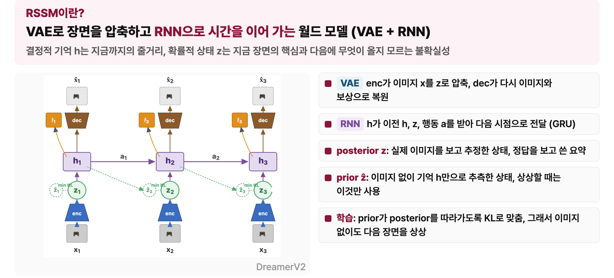

**RSSM은 잠재 상태를 결정적 기억 $h$와 확률적 상태 $z$로 나눈다.**

- **결정적 기억 $h$:** 지금까지의 줄거리에 해당한다.
- **확률적 상태 $z$:** 지금 장면의 핵심과 다음에 무엇이 올지 모르는 불확실성을 담는다.

두 상태를 함께 두면 줄거리는 확실하게 이어 가면서 다음 장면에는 여러 가능성을 열어 둘 수 있다. World Models에서 필요하다고 했던 불확실성을 다루는 장치가 바로 확률적 상태 $z$다.

!!! example "비유: 드라마의 지난 회 요약"
    $h$는 지난 회까지의 내용을 요약한 줄거리다. $z$는 지금 장면의 요약이며, 다음 장면이 어떻게 전개될지는 확률로 열어 둔다.

구성요소의 역할은 다음과 같다.

- **인코더(enc):** 픽셀 공간의 이미지 $x$를 저차원 잠재 공간의 $z$로 압축한다. 계산 효율이 올라간다.
- **디코더(dec):** 잠재 상태 $h$와 $z$로 이미지를 복원한다. 이미지를 복원할 수 있어야 하므로 잠재 상태에 장면의 중요한 정보가 빠지지 않고 담긴다.
- **보상 헤드:** 같은 잠재 상태로 보상을 예측한다.
- **RNN(GRU):** 이전 $h$, 이전 $z$, 행동 $a$를 받아 다음 시점의 $h$를 만든다.

### Posterior와 prior

**RSSM에서 가장 중요한 개념은 posterior와 prior다.**

- **Posterior $z$:** 실제 이미지를 보고 추정한 상태다. 정답을 보고 쓴 요약에 해당한다.
- **Prior $\hat{z}$:** 이미지를 보지 않고 기억 $h$만으로 추측한 상태다. 현실을 보지 않고 꿈으로 추정하는 것에 해당한다.

**RSSM은 prior가 posterior에 가까워지도록 KL divergence로 학습한다.** 학습이 잘 되면 prior만으로 실제 이미지 없이 다음 장면을 상상할 수 있다. 정리하면 RSSM의 역할은 장면을 압축하고, 압축된 공간에서 다음 시간을 예측하는 것이다.

### 3-3. 상상 속 Actor-Critic

**RSSM으로 상상하는 능력을 얻으면, 그 상상으로 행동을 배운다.** Dreamer는 실제 환경 대신 월드 모델이 상상한 궤적으로 actor와 critic을 학습한다.

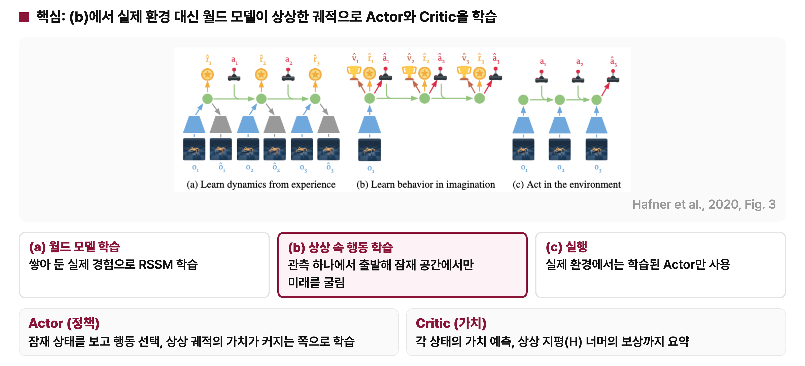

Dreamer의 학습은 세 단계로 나뉜다.

1. **(a) 월드 모델 학습**  
   쌓아 둔 실제 경험으로 RSSM을 학습한다. Prior가 posterior와 비슷해지도록 학습한다.
2. **(b) 상상 속 행동 학습**  
   실제 관측으로는 출발 이미지 하나만 들어온다. 그 뒤로는 이미지를 보지 않고 RSSM으로 잠재 공간에서 미래를 계속 예측하며, 상상한 궤적으로 actor와 critic을 학습한다.
3. **(c) 실행**  
   실제 환경에서는 학습한 actor만 써서 행동한다.

(b)에서 학습하는 두 모델의 역할은 다음과 같다.

- **Actor (정책):** 잠재 상태를 보고 행동을 고른다. 상상한 궤적의 가치가 커지는 쪽으로 학습한다.
- **Critic (가치):** 각 상태가 앞으로 얼마나 좋을지 예측한다. 상상은 정해진 길이까지만 하므로, 그 뒤에 받을 보상은 critic이 요약해서 알려 준다.

### 3-4. Dreamer V1, V2, V3

**세 버전은 RSSM과 상상 속 actor-critic이라는 뼈대가 같고, 버전마다 바꾼 부분만 다르다.**

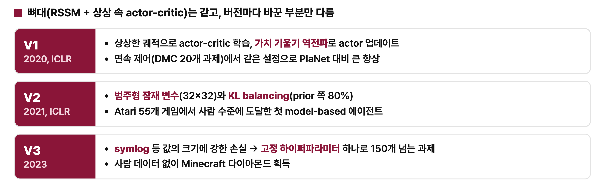

| 버전 | 바꾼 부분 | 결과 |
|:---|:---|:---|
| V1 (2020, ICLR) | 상상한 궤적으로 actor-critic 학습, 가치 기울기 역전파로 actor 업데이트 | 연속 제어(DMC 20개 과제)에서 같은 설정으로 PlaNet 대비 큰 향상 |
| V2 (2021, ICLR) | 범주형 잠재 변수(32×32), KL balancing(prior 쪽 80%) | Atari 55개 게임에서 사람 수준에 도달한 첫 model-based 에이전트 |
| V3 (2023) | symlog처럼 값의 크기에 강한 손실 | 고정 하이퍼파라미터 하나로 150개가 넘는 과제, 사람 데이터 없이 Minecraft 다이아몬드 획득 |

V2까지는 도메인마다 보상과 관측값의 크기가 달라 하이퍼파라미터를 다시 맞춰야 했다. V3는 이 문제를 해결해 설정 하나로 여러 도메인을 학습한다. 자세한 내용은 [Dreamer](dreamer.md), [DreamerV2](dreamer-v2.md), [DreamerV3](dreamer-v3.md) 리뷰를 참고한다.

---

## 4. JEPA 계열

**JEPA(Joint-Embedding Predictive Architecture)는 보이는 부분으로 가려진 부분을 예측하되, 픽셀이 아니라 표현을 예측한다.** 표현 공간에서 예측하면 예측할 수 없는 디테일은 버리고 예측 가능한 구조만 학습할 수 있다. Yann LeCun이 제안한 월드 모델 구조의 핵심 부품이며 지금도 활발히 연구되고 있다.

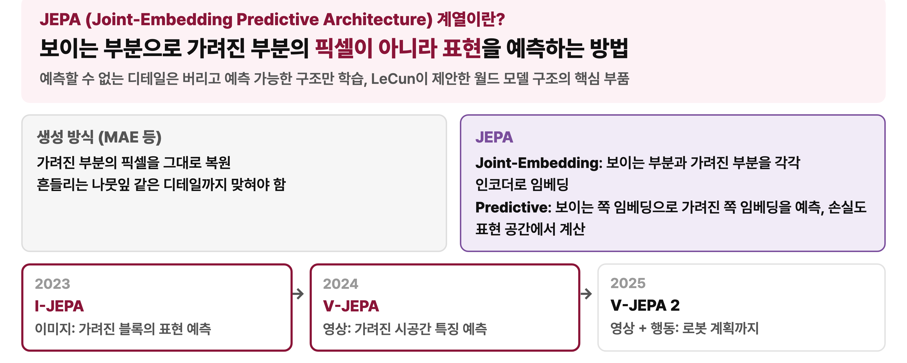

**MAE 같은 생성 방식은 가려진 부분의 픽셀을 그대로 복원한다.** 그래서 바람에 흔들리는 나뭇잎의 정확한 모양처럼 원래 예측할 수 없는 디테일까지 맞혀야 하는 부담이 있다.

**JEPA는 이름에 방법이 담겨 있다.**

- **Joint-Embedding:** 보이는 부분과 가려진 부분을 각각 인코더로 임베딩한다.
- **Predictive:** 보이는 쪽의 임베딩으로 가려진 쪽의 임베딩을 예측한다.

손실도 픽셀 공간이 아니라 표현 공간에서 계산한다. 이 계열에는 I-JEPA(2023, 이미지), V-JEPA(2024, 영상), V-JEPA 2(2025, 영상과 행동)가 있다.

### 4-1. I-JEPA: 세 가지 자기지도 학습 구조

**I-JEPA는 JEPA를 이미지에 적용한 논문이며, 세 가지 자기지도 학습 구조 중 (c)에 해당한다.**

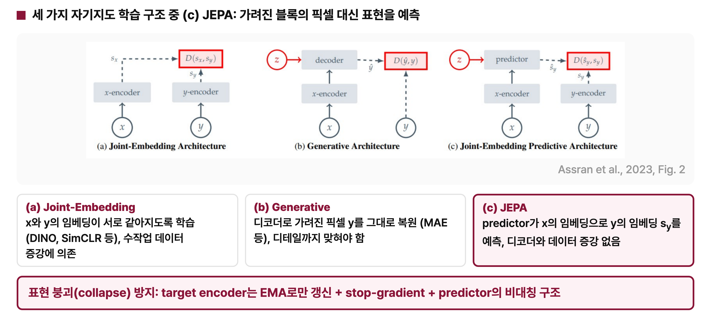

- **(a) Joint-Embedding Architecture:** $x$와 $y$의 임베딩이 같아지도록 학습한다. DINO, SimCLR가 이 구조다. 같은 사진을 자르거나 색을 바꿔 두 장을 만들고 두 임베딩을 맞춘다. 두 장이 같은 것을 본다고 알려 주려면 사람이 어떤 augmentation을 쓸지 직접 설계해야 한다.
- **(b) Generative Architecture:** 디코더로 가려진 픽셀 $y$를 그대로 복원한다. MAE가 이 구조이며, 디테일까지 맞혀야 한다는 부담이 있다.
- **(c) Joint-Embedding Predictive Architecture:** predictor가 $x$의 임베딩으로 $y$의 임베딩 $s_y$를 예측한다. 픽셀을 복원하는 디코더도 없고, 사람이 설계한 augmentation으로 입력을 두 장 만들 필요도 없다.

**주의할 점은 표현 붕괴(collapse)다.** 임베딩끼리 맞추는 데만 집중하면 모든 입력에 같은 값을 내놓아도 손실이 0이 된다. JEPA는 target encoder를 EMA로만 갱신하고, stop-gradient와 predictor의 비대칭 구조를 써서 표현 붕괴를 막는다.

### 4-2. I-JEPA의 구조와 마스킹 전략

**I-JEPA는 컨텍스트 블록 하나로 큼직한 타깃 블록 4개의 표현을 예측한다.**

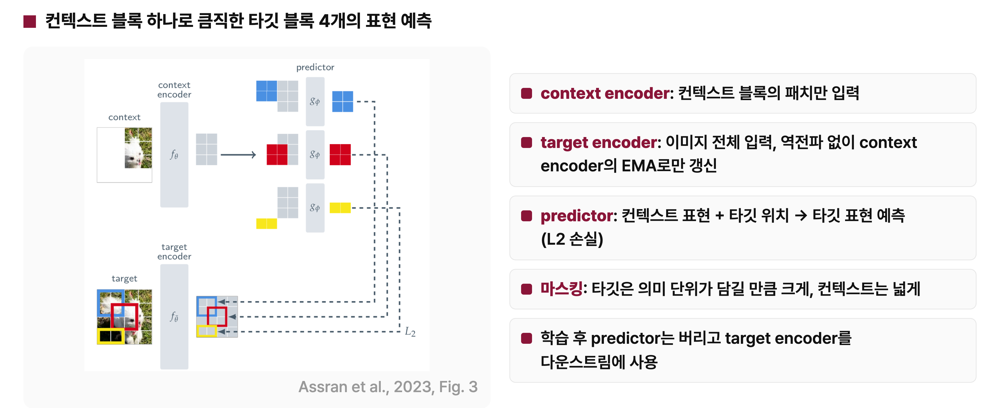

- **Context encoder:** 컨텍스트 블록의 패치만 입력으로 받는다.
- **Target encoder:** 이미지 전체를 입력으로 받는다. 역전파 없이 context encoder의 EMA로만 갱신한다. 두 인코더는 같은 ViT 구조를 쓰지만 역할과 갱신 방식이 다르다.
- **Predictor:** 컨텍스트 표현과 타깃 위치를 받아 그 위치의 타깃 표현을 예측한다. 예측한 표현과 target encoder가 만든 실제 표현의 차이를 L2 손실로 줄인다.

**마스킹 전략이 I-JEPA에서 가장 중요한 설계다.** 타깃은 의미 단위가 담길 만큼 크게, 컨텍스트는 이미지 곳곳을 볼 수 있을 만큼 넓게 잡는다. 타깃이 너무 작으면 주변 픽셀의 질감만 보고도 맞힐 수 있어 의미 수준의 표현을 배우기 어렵다. 강아지 머리처럼 큰 덩어리를 맞히려면 모델이 몸통과 다리를 보고 그곳에 머리가 있다고 추론해야 한다.

**학습이 끝나면 predictor는 버리고 target encoder를 다운스트림 과제에 쓴다.** I-JEPA의 목적은 라벨 없이 이미지의 의미를 담은 표현을 배우는 것이다. Predictor와 마스킹은 이 연습을 위한 장치다. 월드 모델 관점에서 I-JEPA는 같은 이미지 안에서 보이는 일부로 보이지 않는 나머지를 추상적인 표현 수준에서 예측하는 능력을 기른다.

### 4-3. V-JEPA와 V-JEPA 2

**V-JEPA는 I-JEPA를 영상으로 확장해, 가려진 시공간 영역의 특징을 예측하며 움직임까지 학습한다.** 이미지에 시간 축을 더하면 월드 모델의 속성을 더 많이 갖게 된다.

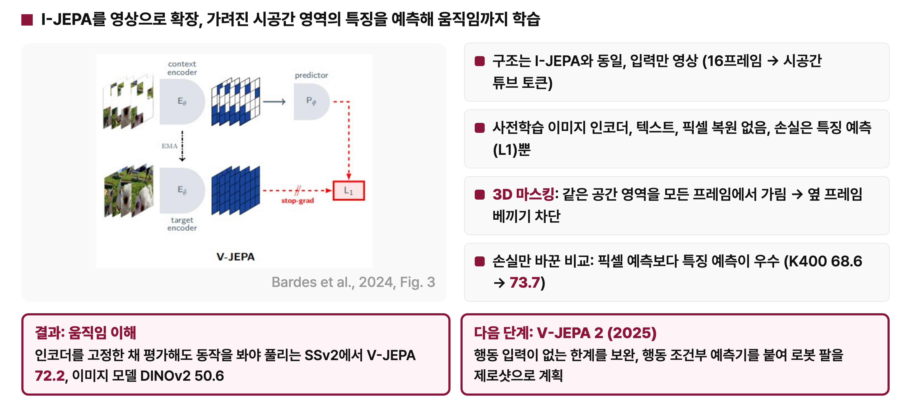

- **입력:** 구조는 I-JEPA와 같고 입력만 영상이다. 16프레임을 시간과 공간 방향으로 함께 잘라 시공간 튜브 토큰으로 바꾼다.
- **학습 신호:** 사전학습한 이미지 인코더, 텍스트, 픽셀 복원을 쓰지 않는다. 손실은 특징 예측(L1)뿐이다.
- **3D 마스킹:** 같은 공간 영역을 모든 프레임에서 가린다. 옆 프레임을 베껴 맞히는 것을 막기 위해서다.
- **손실 비교:** 손실만 바꿔 비교하면 픽셀 예측보다 특징 예측이 낫다(K400 68.6 → 73.7).

**결과: 이미지 모델은 무엇이 있는지 알지만 어떻게 움직이는지는 모른다.** 인코더를 고정한 채 평가할 때, 실제 동작을 봐야 정답을 알 수 있는 SSv2에서 V-JEPA는 72.2, DINOv2는 50.6을 기록했다. V-JEPA는 영상에서 움직임을 배웠다.

**V-JEPA 2 (2025)는 여기에 행동 조건부 예측기를 붙였다.** 처음 보는 환경에서도 추가 학습 없이 로봇 팔을 zero-shot으로 계획할 수 있다. 자세한 내용은 [V-JEPA](v-jepa.md), [V-JEPA 2](v-jepa-2.md) 리뷰를 참고한다.

---

## 5. Generative와 Foundation 계열

**두 계열은 과거 프레임과 조건을 받아 다음 영상 프레임을 생성한다는 공통점이 있고, 생성 결과가 곧 영상 시뮬레이터가 된다.** 과거 프레임과 행동, 텍스트, 궤적 같은 조건을 월드 모델에 넣으면 다음 프레임이 나오고, 이 프레임이 다시 입력으로 들어가며 반복된다. JEPA가 표현만 예측했다면 이 계열들은 실제 화면을 그려 낸다.

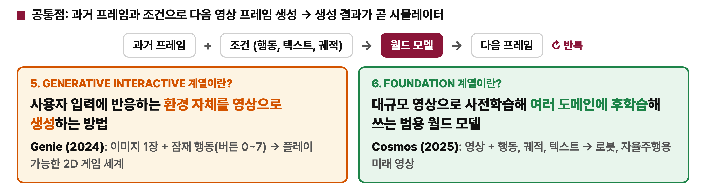

- **Generative Interactive:** 사용자 입력에 반응하는 환경 자체를 영상으로 생성한다. 대표 모델인 Genie(2024)는 이미지 한 장과 잠재 행동(버튼 0~7)으로 플레이할 수 있는 2D 게임 세계를 만든다. 사람이 직접 조작하는 세계를 만드는 데 초점을 둔다.
- **Foundation:** 대규모 영상으로 사전학습한 뒤 여러 도메인에 맞춰 후학습해 쓰는 범용 월드 모델이다. 대표 모델인 Cosmos(2025)는 영상과 행동, 궤적, 텍스트를 받아 로봇과 자율주행에 쓸 미래 영상을 만든다. 여러 산업 분야가 가져다 쓰는 기반 모델을 만드는 데 초점을 둔다.

### 5-1. Genie: 비디오에서 다이나믹스와 행동을 배운다

**Genie는 비디오에서 dynamics와 action을 배워 조작 가능한 세계를 생성한다.** 손으로 그린 이미지 한 장이 실제로 플레이할 수 있는 게임이 된다.

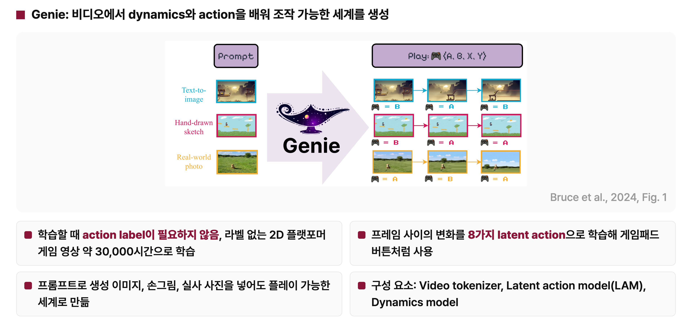

- **Action label이 필요 없다.** 기존 월드 모델은 영상과 함께 그 순간 어떤 버튼을 눌렀는지 기록한 행동 데이터가 필요했다. Genie는 라벨 없는 2D 플랫포머 게임 영상 약 30,000시간으로 학습한다.
- **행동을 스스로 만든다.** 프레임 사이의 변화를 8가지 latent action으로 학습하고, 이것을 게임패드 버튼처럼 쓴다.
- **프롬프트가 다양하다.** 생성 이미지, 손그림, 실사 사진을 넣어도 플레이할 수 있는 세계로 만든다.

### Genie의 구성 요소

**Genie는 Video tokenizer, Latent action model(LAM), Dynamics model로 이루어진다.**

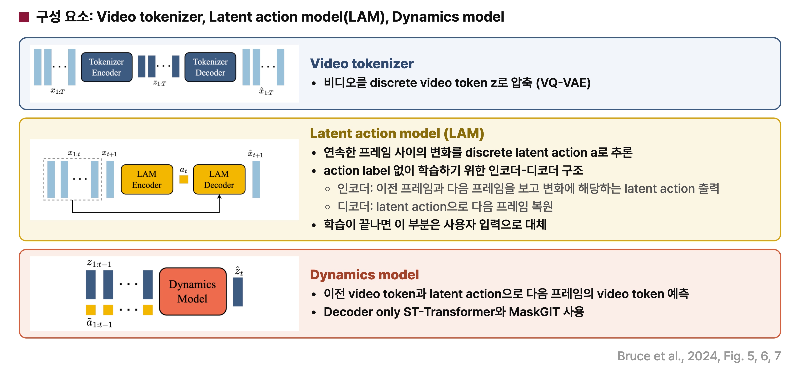

1. **Video tokenizer**  
   비디오를 discrete video token $z$로 압축한다. VQ-VAE 구조를 쓰며, 영상의 각 프레임을 미리 정해진 사전의 단어들로 바꾸는 것에 해당한다. 픽셀보다 훨씬 적은 수의 토큰을 다루므로 계산 효율이 올라간다.
2. **Latent action model (LAM)**  
   연속한 프레임 사이의 변화를 discrete latent action $a$로 추론한다. 행동 라벨이 없으므로 인코더-디코더 구조로 학습한다.
    - 인코더는 이전 프레임들과 다음 프레임을 함께 보고 그 사이의 변화에 해당하는 latent action을 출력한다.
    - 디코더는 이전 프레임들과 latent action으로 다음 프레임 $x_{t+1}$을 복원해야 한다. 잘 복원하려면 latent action 안에 화면이 어떻게 바뀌었는지가 담겨야 한다.
    - Latent action은 8가지 중 하나만 고를 수 있다. 세세한 변화는 담지 못하고, 캐릭터가 점프했는지 오른쪽으로 갔는지 같은 핵심 변화만 담는다. 그래서 latent action 하나하나가 게임패드 버튼처럼 의미 있는 행동이 된다.
    - LAM은 학습할 때만 쓰고, 학습이 끝나면 그 자리를 사용자 입력이 대신한다.
3. **Dynamics model**  
   이전 video token과 latent action으로 다음 프레임의 video token을 예측한다. Decoder-only ST-Transformer와 MaskGIT를 쓴다.

### Genie의 추론

**추론할 때는 LAM을 빼고, 그 자리를 사용자가 고른 버튼이 대신한다.**

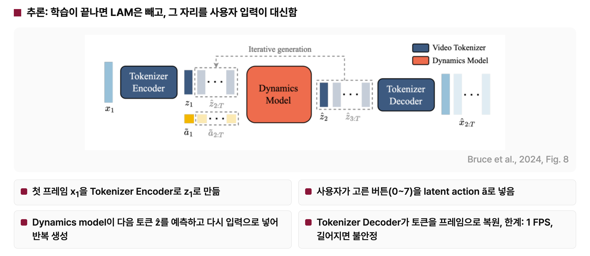

1. 첫 프레임 $x_1$을 tokenizer encoder에 넣어 토큰 $z_1$로 만든다.
2. 사용자가 0~7 중 하나의 버튼을 고르면 그 버튼이 latent action $\tilde{a}$로 들어간다.
3. Dynamics model이 지금까지의 토큰과 사용자가 넣은 행동으로 다음 토큰 $\hat{z}$를 예측하고, 예측한 토큰을 다시 입력으로 넣어 반복 생성한다.
4. Tokenizer decoder가 토큰을 사람이 볼 수 있는 프레임으로 복원한다.

**한계:** 생성 속도가 초당 1프레임 정도로 느리고, 영상이 길어지면 화면이 불안정해진다. 자세한 내용은 [Genie](genie.md) 리뷰를 참고한다.

### 5-2. Cosmos: 월드 모델을 만드는 도구 전체를 공개한 플랫폼

**Cosmos는 하나의 모델이라기보다, 각자 자기 로봇이나 차량용 월드 모델을 만들 수 있도록 도구 전체를 공개한 플랫폼이다.** 사전학습한 월드 모델 하나가 각자의 데이터로 후학습되어 자동차, 로봇 팔, 사족 보행 로봇, 휴머노이드용 월드 모델로 갈라진다.

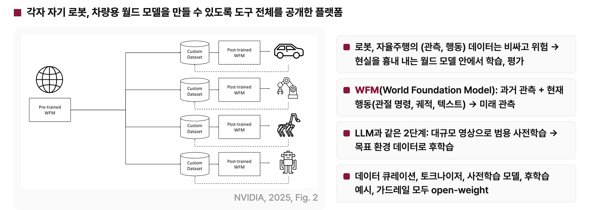

- **동기:** 로봇과 자율주행의 관측, 행동 데이터는 비싸고 위험하다. 그래서 현실을 흉내 내는 월드 모델 안에서 학습하고 평가할 수 있는 플랫폼을 제공한다.
- **WFM (World Foundation Model):** 과거 관측과 현재 행동을 받아 미래 관측을 생성한다. 행동은 로봇 관절 명령, 차량 궤적, 텍스트 등이 될 수 있다.
- **LLM과 같은 2단계:** 대규모 영상으로 범용 사전학습을 한 뒤 목표 환경 데이터로 후학습한다. GPT를 크게 학습한 뒤 특정 업무에 맞춰 미세 조정하는 것과 같은 구조다.
- **공개 범위:** 데이터 큐레이션, 토크나이저, 사전학습 모델, 후학습 예시, 가드레일을 모두 open-weight로 공개했다. Cosmos를 플랫폼이라고 부르는 이유다.

### Cosmos의 내부 구조

**토크나이저 하나가 연속 토큰과 이산 토큰을 모두 만들고, 그 위에 Diffusion과 Autoregressive 두 종류의 월드 모델이 올라간다.**

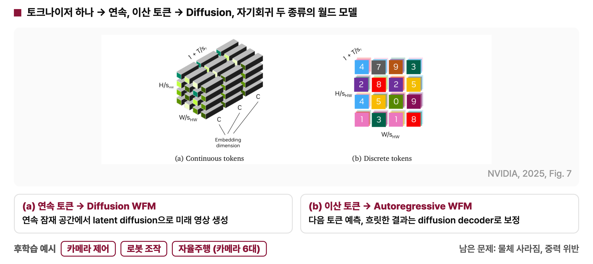

- **(a) 연속 토큰 → Diffusion WFM:** 각 위치가 실수 벡터로 표현된다. 연속 잠재 공간에서 latent diffusion으로 미래 영상을 생성한다.
- **(b) 이산 토큰 → Autoregressive WFM:** 각 위치가 정수 번호 하나로 표현된다. LLM이 다음 단어를 예측하듯 다음 토큰을 예측하고, 흐릿한 결과는 diffusion decoder로 보정해 선명하게 만든다.

후학습 예시로 카메라 제어, 로봇 조작, 자율주행(카메라 6대)을 보였고, 후학습한 모델도 함께 공개했다. 물체가 갑자기 사라지거나 중력을 위반하는 장면이 생성되는 한계는 남아 있다. 자세한 내용은 [Cosmos](cosmos.md) 리뷰를 참고한다.

---

## 6. 정리

### 여섯 모델 비교

**비교 기준은 무엇을 예측하는가, 그리고 행동을 어떻게 다루는가다.**

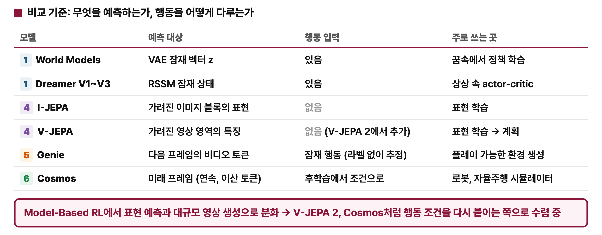

| 모델 | 예측 대상 | 행동 입력 | 주로 쓰는 곳 |
|:---|:---|:---|:---|
| World Models | VAE 잠재 벡터 $z$ | 있음 | 꿈속에서 정책 학습 |
| Dreamer V1~V3 | RSSM 잠재 상태 | 있음 | 상상 속 actor-critic |
| I-JEPA | 가려진 이미지 블록의 표현 | 없음 | 표현 학습 |
| V-JEPA | 가려진 영상 영역의 특징 | 없음 (V-JEPA 2에서 추가) | 표현 학습, V-JEPA 2에서 계획 |
| Genie | 다음 프레임의 비디오 토큰 | 잠재 행동 (라벨 없이 추정) | 플레이 가능한 환경 생성 |
| Cosmos | 미래 프레임 (연속, 이산 토큰) | 후학습에서 조건으로 | 로봇, 자율주행 시뮬레이터 |

### 계열별 한 줄 요약

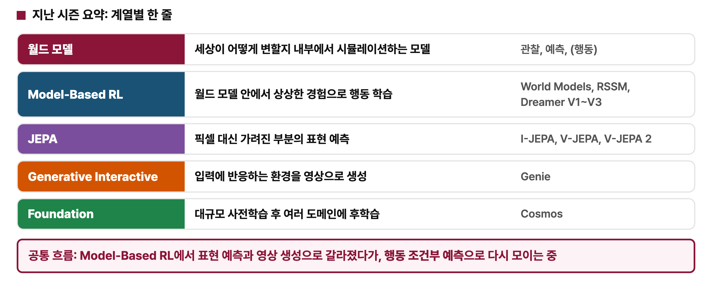

| 계열 | 한 줄 요약 | 대표 논문 |
|:---|:---|:---|
| 월드 모델 | 세상이 어떻게 변할지 내부에서 시뮬레이션하는 모델 | 관찰, 예측, (행동) |
| Model-Based RL | 월드 모델 안에서 상상한 경험으로 행동 학습 | World Models, RSSM, Dreamer V1~V3 |
| JEPA | 픽셀 대신 가려진 부분의 표현 예측 | I-JEPA, V-JEPA, V-JEPA 2 |
| Generative Interactive | 입력에 반응하는 환경을 영상으로 생성 | Genie |
| Foundation | 대규모 사전학습 후 여러 도메인에 후학습 | Cosmos |

**공통 흐름:** 초기 월드 모델은 Model-Based RL에서 출발해 표현 예측과 대규모 영상 생성으로 갈라졌다. 지금은 V-JEPA 2와 Cosmos처럼 행동 조건을 다시 붙이는 쪽으로 모이고 있다.
