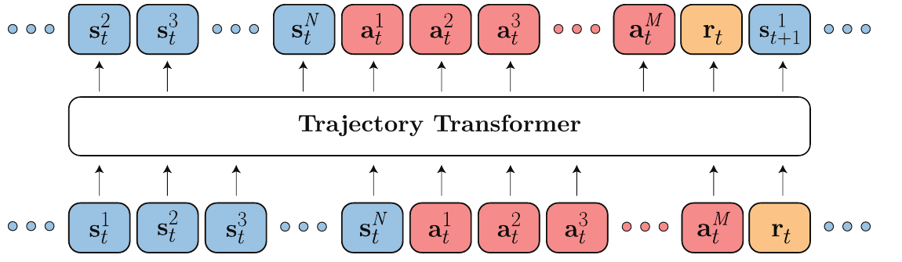
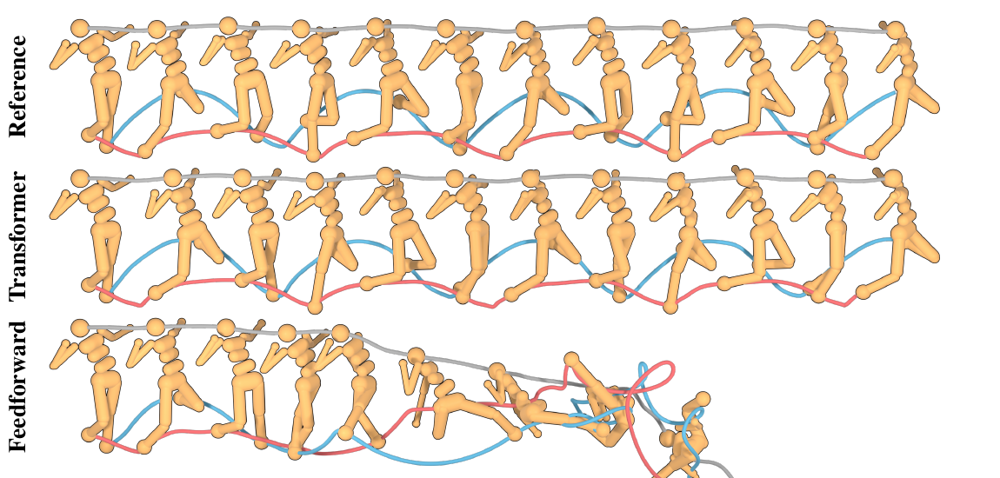
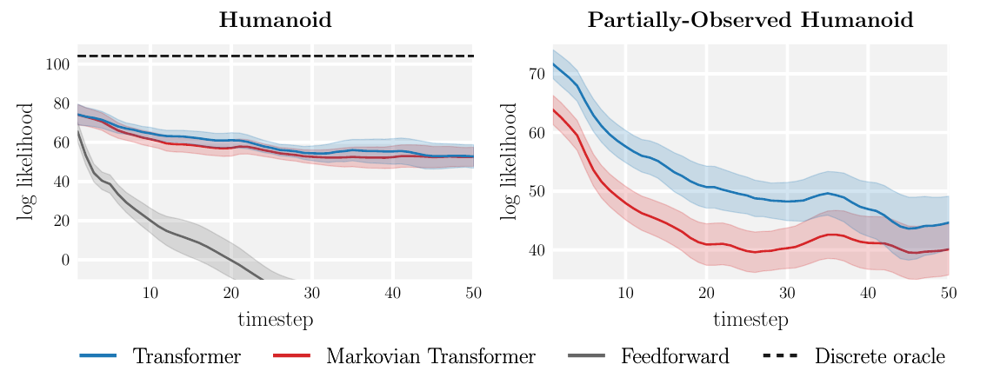
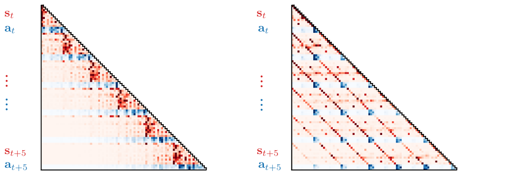
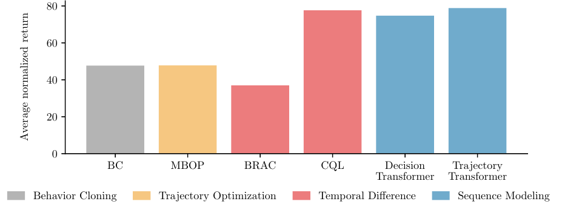
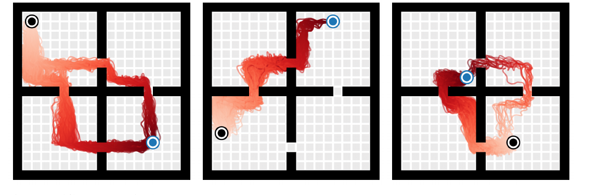

# Offline Reinforcement Learning as One Big Sequence Modeling Problem (Trajectory Transformer)

!!! info "Information"
    - **Title:** Offline Reinforcement Learning as One Big Sequence Modeling Problem (Trajectory Transformer)
    - **Venue:** NeurIPS 2021
    - **Paper:** [arXiv](https://arxiv.org/abs/2106.02039)
    - **Code:** [GitHub](https://github.com/jannerm/trajectory-transformer) / [Project page](https://trajectory-transformer.github.io)
    - **Presenter:** Boa Jang
    - **Last updated:** 2026-10-04

## 0. Summary

**Trajectory Transformer(TT)는 강화학습을 "궤적이라는 문장을 생성하는 문제"로 바꿔 푼다.** 상태(state), 행동(action), 보상(reward)을 차원별로 이산화해 하나의 토큰 시퀀스로 늘어놓고, GPT와 같은 구조의 Transformer로 다음 토큰을 예측하도록 학습한다. 행동을 고를 때는 언어 모델의 디코딩 기법인 **beam search**를 planning 알고리즘으로 쓴다.

**문제: 강화학습은 여러 부품을 따로 만들어 조립한다**

기존 강화학습은 Markov 성질을 이용해 긴 문제를 한 step짜리 작은 문제로 쪼갠다. 그래서 actor, critic, dynamics model, behavior policy처럼 각기 다른 분포를 추정하는 부품을 따로 설계하고 튜닝해야 한다. Offline RL에서는 여기에 데이터에 없는 행동(out-of-distribution action)을 막는 장치까지 더해진다.

**해결: 하나의 시퀀스 모델과 하나의 디코딩 알고리즘**

1. **궤적 전체를 한 시퀀스로 모델링**  
   상태·행동·보상의 결합 분포를 Transformer 하나로 학습한다. 이 모델이 dynamics model, behavior policy, (reward-to-go를 통해) value 추정기 역할을 모두 맡는다.
2. **Beam search로 planning**  
   디코딩 기준만 바꾸면 같은 모델로 imitation learning, goal-conditioned RL, offline RL을 모두 풀 수 있다.

**결과**

- **장기 예측:** humanoid에서 100 step을 예측해도 실제 궤적과 눈으로 구분되지 않는다. 같은 데이터로 학습한 feedforward 모델(PETS)은 수십 step 만에 무너진다.
- **D4RL locomotion:** 평균 78.9점(quantile 이산화)으로 CQL(77.6), Decision Transformer(74.7)와 비슷하거나 조금 높다.
- **AntMaze (sparse reward):** IQL의 Q-function을 beam search의 가이드로 쓰면 평균 84.0점으로, 비교한 모든 방법(IQL 63.2, CQL 44.9, DT 11.8)을 앞선다.

**글의 구성**

- 1절: 왜 강화학습을 시퀀스 모델링으로 보려 하는지
- 2~3절: 궤적을 토큰화하고 Transformer로 학습하는 방법
- 4절: Beam search를 세 가지 문제 설정에 맞게 바꾸는 방법
- 5~6절: 모델 분석(장기 예측, attention)과 제어 실험 결과
- 7~8절: Decision Transformer와의 비교, 한계와 의의

---

## 1. Motivation: 강화학습을 하나의 큰 시퀀스 모델링 문제로

**강화학습은 "보상이 높아지는 행동 시퀀스를 생성하는 문제"로 볼 수도 있다.** 이렇게 보면 자연어처리에서 잘 작동한 대용량 시퀀스 모델과 디코딩 기법을 강화학습에 그대로 가져올 수 있는지 묻게 된다. 이 논문은 이 비유를 극단까지 밀어붙여, 시퀀스 모델링 도구만으로 쓸 만한 강화학습 알고리즘이 되는지 확인한다.

### 기존 강화학습은 문제를 작게 쪼갠다

| 접근 | 문제를 쪼개는 방식 | 필요한 부품 | 어려운 점 |
|------|------------------|-----------|----------|
| Model-free | Bellman 재귀 (principle of optimality) | Actor, critic | 부품마다 따로 설계·튜닝 |
| Model-based | 한 step짜리 dynamics model | Dynamics model, planner (또는 policy) | 예측 오차가 step마다 누적 (compounding error) |
| Offline RL | 위 방식 + 보수적 제약 | Behavior policy 추정, 정칙화 | 데이터에 없는 행동을 막는 장치가 별도로 필요 |
| **Trajectory Transformer** | **쪼개지 않음** | **시퀀스 모델 하나** | — |

논문은 이 부품들이 결국 모두 어떤 분포를 추정하고 있다고 본다. Actor와 behavior policy는 행동의 분포를, dynamics model은 다음 상태의 분포를 추정한다. Value function도 control-as-inference 관점에서는 미래 보상의 분포를 추정하는 것으로 해석할 수 있다(Levine, 2018). 그렇다면 상태·행동·보상을 하나의 데이터 흐름으로 보고 결합 분포를 한 모델로 배우면 된다.

!!! example "비유: 부품을 조립하는 대신 문장을 쓰는 작가"
    기존 강화학습은 "다음 장면 예측기", "행동 선택기", "점수 평가기"를 따로 만든 뒤 조립한다. TT는 수많은 플레이 기록을 읽은 작가 한 명에게 "이 장면 다음에 이어질 가장 그럴듯하고 결말이 좋은 이야기"를 쓰게 한다. 이야기 속에는 다음 장면도, 주인공의 행동도, 점수도 함께 들어 있다.

### 이 논문이 노리는 것

관련 연구들도 LSTM이나 Transformer를 policy, value function, model 같은 **부품 하나**를 표현하는 데 써 왔다. 하지만 성능은 여전히 강화학습 알고리즘 쪽 기법에 기대고 있었다. TT는 반대로 **강화학습 파이프라인을 최대한 시퀀스 모델링으로 대체**하고, 성능이 알고리즘의 정교함이 아니라 시퀀스 모델의 표현력에서 나오게 하는 것을 목표로 한다.

---

## 2. 궤적을 토큰 시퀀스로 바꾸기

<figure markdown="span">
  { width="700" }
  <figcaption>Figure 1. 상태·행동·보상을 차원 단위 토큰으로 늘어놓고, 언어 모델처럼 다음 토큰을 예측한다. (source: 논문 Figure 1)</figcaption>
</figure>

### 차원 하나가 토큰 하나

길이 $T$인 궤적은 상태, 행동, 스칼라 보상의 나열이다.

$$
\tau = (\mathbf{s}_1, \mathbf{a}_1, r_1, \mathbf{s}_2, \mathbf{a}_2, r_2, \ldots, \mathbf{s}_T, \mathbf{a}_T, r_T)
$$

**TT는 벡터를 통째로 하나의 토큰으로 쓰지 않고, 각 차원을 따로 이산화해 하나씩 토큰으로 만든다.** 상태가 $N$차원, 행동이 $M$차원이면 timestep 하나가 $N + M + 1$개 토큰이 되고, 궤적 전체는 길이 $T(N + M + 1)$의 시퀀스가 된다.

$$
\tau = (\ldots, s_t^1, s_t^2, \ldots, s_t^N, a_t^1, a_t^2, \ldots, a_t^M, r_t, \ldots), \quad t = 1, \ldots, T
$$

아래첨자는 timestep, 위첨자는 차원이다. 예를 들어 $s_t^i$는 시점 $t$ 상태의 $i$번째 차원이다.

```text
예: HalfCheetah (state 17차원, action 6차원)
timestep 하나 = 17 + 6 + 1(reward) = 24개 토큰
         (offline RL에서는 reward-to-go 토큰 1개가 더 붙어 25개)
```

**비효율적으로 보이지만, 이렇게 하면 분포에 대한 가정을 하지 않아도 된다.** 기존 dynamics model은 다음 상태를 대각 공분산 Gaussian으로 가정하는 경우가 많다. TT는 차원마다 앞 차원에 조건부인 categorical 분포를 예측하므로, 여러 봉우리를 가진 분포나 차원 사이의 상관관계도 표현할 수 있다.

### 연속값을 이산화하는 두 가지 방법

각 차원을 $V$개의 구간(bin)으로 나눈다. 논문에서는 $V = 100$을 썼다.

| 방법 | 구간을 나누는 기준 | 장점 | 단점 |
|------|-----------------|------|------|
| **Uniform** | 값의 범위를 같은 폭으로 분할: 폭 $= (\max s^i - \min s^i)/V$ | 원래 공간의 거리 정보가 유지된다 | 이상치 때문에 범위가 넓어지면, 데이터가 하나도 없는 구간이 많이 생긴다 |
| **Quantile** | 각 구간에 데이터가 같은 개수만큼 들어가게 분할 | 모든 토큰이 데이터에 등장한다 | 원래 공간의 거리 정보가 왜곡된다 |

실험에서 두 방법은 대부분 비슷했다. 차이가 크게 난 곳은 **HalfCheetah Medium-Expert** 하나다. 속도 값의 범위가 넓어서 uniform 이산화로는 expert 행동에 필요한 정밀한 제어를 재현하지 못했고, quantile(95.0)이 uniform(40.8)의 두 배 이상을 기록했다.

---

## 3. 모델과 학습

**모델은 GPT와 같은 decoder-only Transformer다.** 대규모 언어 모델보다 훨씬 작게, 4개 layer와 4개 self-attention head로 구성했다. 구현도 minGPT를 기반으로 한다. 논문이 강조하듯 모델 구조와 탐색 전략은 자연어처리에서 쓰던 것과 거의 같고, 새로 고민한 부분은 **궤적 데이터를 어떻게 토큰으로 표현할지**다.

### 학습 목적 함수: 다음 토큰 예측

학습은 언어 모델과 똑같이 teacher forcing으로 다음 토큰의 log-likelihood를 최대화한다.

$$
\mathcal{L}(\tau) = \sum_{t=1}^{T} \Bigg( \sum_{i=1}^{N} \log P_\theta\big(s_t^i \mid \mathbf{s}_t^{<i}, \tau_{<t}\big) + \sum_{j=1}^{M} \log P_\theta\big(a_t^j \mid \mathbf{a}_t^{<j}, \mathbf{s}_t, \tau_{<t}\big) + \log P_\theta\big(r_t \mid \mathbf{a}_t, \mathbf{s}_t, \tau_{<t}\big) \Bigg)
$$

세 항은 각각 다음과 같이 해석할 수 있다.

- **상태 항:** 과거 궤적과 같은 시점의 앞 차원들을 보고 다음 상태 차원을 예측한다. **Dynamics model** 역할이다.
- **행동 항:** 현재 상태와 앞 행동 차원들을 보고 행동 차원을 예측한다. 데이터를 모은 **behavior policy** 역할이다.
- **보상 항:** 상태와 행동을 보고 보상을 예측한다. **Reward model** 역할이다.

여기서 $\tau_{<t}$는 시점 $t$ 이전까지의 궤적, $\mathbf{s}_t^{<i}$는 시점 $t$ 상태의 $i$번째 이전 차원들이다.

??? note "세부 설정 (Appendix A)"
    - 입력 vocabulary 크기는 $V \times (N + M + 2)$다. 상태, 행동, 보상, reward-to-go가 차원마다 별도의 토큰 집합을 가진다.
    - 출력 layer는 크기 $V$인 logit만 낸다. 시퀀스에서의 위치로 어느 차원의 토큰인지가 정해지므로 구분할 수 있다.
    - Token embedding 128차원, dropout 0.1, batch size 256
    - 학습률은 처음 2,000 update 동안 0에서 $2.5 \times 10^{-4}$까지 선형으로 올린다(GPT 스케줄). Optimizer는 Adam.
    - V100 GPU 1장에서 80 epoch, 데이터셋 크기에 따라 모델 하나당 6~12시간

---

## 4. Beam Search로 Planning하기

**TT는 학습한 시퀀스 모델에서 "좋은 궤적"을 디코딩한 뒤, 그 궤적의 첫 행동만 실행하고 다음 step에서 다시 계획한다.** 이는 model predictive control(MPC)의 receding-horizon 방식과 같다. 디코딩에는 자연어처리에서 흔히 쓰는 beam search를 쓴다.

### 기본 beam search (Algorithm 1)

Beam search는 매 step 모든 후보를 한 토큰씩 늘린 뒤, 점수가 가장 높은 $B$개(beam width)만 남기는 과정을 반복한다.

1. 빈 시퀀스 하나에서 시작한다.
2. 남아 있는 각 시퀀스 뒤에 vocabulary의 모든 토큰을 하나씩 붙여 후보를 만든다.
3. 후보 중 $\log P_\theta(\mathbf{y} \mid \mathbf{x})$가 가장 높은 $B$개만 남긴다.
4. 원하는 길이가 될 때까지 2~3을 반복하고, 가장 점수가 높은 시퀀스를 반환한다.

**문제 설정마다 바뀌는 것은 "무엇을 조건으로 줄지"와 "무엇을 점수로 쓸지"뿐이다.** 아래 세 설정은 표준 언어 모델 디코딩에서 수정할 부분이 적은 순서다.

| 설정 | 조건 (conditioning) | Beam search의 점수 | 추가로 필요한 것 |
|------|-------------------|------------------|----------------|
| Imitation learning | 현재 상태 (+ 과거 궤적) | 궤적의 likelihood | 없음 |
| Goal-conditioned RL | 현재 상태 + **목표 상태** | 궤적의 likelihood | 목표 상태를 시퀀스 맨 앞에 붙이기 |
| Offline RL | 현재 상태 (+ 과거 궤적) | **누적 보상 + reward-to-go** | Reward-to-go 토큰 |

### 4.1 Imitation learning: 그대로 디코딩

**학습 데이터의 궤적 분포를 재현하는 것이 목표라면, 언어 모델 디코딩을 수정 없이 쓰면 된다.** 현재 상태 $\mathbf{s}_t$를 조건으로 넣고 likelihood가 높은 궤적을 찾은 뒤, 첫 행동 $\mathbf{a}_t$를 실행한다.

이 방식은 행동 하나가 아니라 궤적 전체를 참조 행동에 맞추는, 장기 시야를 가진 model-based behavior cloning으로 볼 수 있다. 예측 길이를 행동 차원 수로 줄이면, 즉 행동 토큰만 디코딩하면 autoregressive policy를 쓰는 가장 단순한 behavior cloning과 정확히 같아진다.

### 4.2 Goal-conditioned RL: 목표를 맨 앞에 붙이기

**Transformer의 causal mask는 미래 토큰을 볼 수 없게 하지만, 미래를 조건으로 과거를 예측하는 확률 자체는 잘 정의된다.** 그래서 이미 관측한 과거뿐 아니라 "일어나기를 바라는 미래"도 조건으로 줄 수 있다. 마지막 상태를 목표 $\mathbf{s}_T$로 조건화하면 다음 확률로 디코딩하게 된다.

$$
P_\theta\big(s_t^i \mid \mathbf{s}_t^{<i}, \tau_{<t}, \mathbf{s}_T\big)
$$

구현은 간단하다. 목표 상태를 시퀀스 맨 앞으로 옮겨 $\{\mathbf{s}_T, \mathbf{s}_1, \mathbf{s}_2, \ldots, \mathbf{s}_{T-1}\}$로 바꾸면 된다. 그러면 attention mask를 고치지 않아도 모든 예측이 목표를 참조할 수 있다.

```text
[ s_T (목표) ] [ s_1  a_1  r_1 ] [ s_2  a_2  r_2 ] ...
      ↑
  맨 앞에 두면 causal mask를 그대로 둬도 뒤의 모든 토큰이 목표를 볼 수 있다
```

학습할 때 각 궤적의 실제 마지막 상태를 목표로 붙이므로, 이는 model-free RL의 goal relabeling(hindsight experience replay)과 닮았다. 보상이나 reward shaping은 전혀 필요 없다. 논문의 표현대로, 이는 시퀀스 모델링의 표준 작업인 **"주어진 증거에서 가장 그럴듯한 시퀀스 추론"**과 같다.

### 4.3 Offline RL: likelihood 대신 보상으로 고르기

**보상을 최대화하려면 beam search의 점수를 log-probability에서 예측 보상으로 바꾸면 된다.** Control-as-inference 관점에서는 전이의 log-probability를 "최적일 log-probability"로 바꾸는 것으로 해석할 수 있다.

#### Reward-to-go로 근시안을 막는다

계획 구간(horizon) 안의 보상만 더하면 당장 보상이 큰 쪽만 고르는 근시안적 행동이 나올 수 있다. 그래서 학습 데이터의 각 전이에 **reward-to-go**를 추가 토큰으로 붙인다.

$$
R_t = \sum_{t'=t}^{T} \gamma^{t'-t} r_{t'}
$$

$R_t$도 다른 값과 같은 방식으로 이산화해, 보상 $r_t$ 다음에 예측하도록 학습한다. Planning할 때는 계획 구간 안의 누적 보상에 마지막 시점의 $R_t$를 더해 그 뒤의 가치까지 반영한다.

!!! warning "주의: reward-to-go는 학습 데이터를 모은 정책의 가치다"
    $R_t$는 데이터를 수집한 behavior policy의 Monte Carlo 가치 추정이다. TT가 만들어 내는 더 나은 정책의 가치와는 일반적으로 다르다. 그래도 TT는 이 값을 행동을 직접 고르는 데 쓰지 않고 **beam search의 휴리스틱으로만** 쓰기 때문에, value 추정이 아주 정확할 필요는 없다. Bellman update 없이 Monte Carlo로 바로 학습할 수 있다는 장점도 있다. 다만 sparse reward 같은 어려운 문제에서는 이 추정이 너무 부정확해진다(6.3절).

#### 실제 탐색 절차

보상과 reward-to-go는 $N + M + 1$개 토큰마다 한 번씩만 나온다. 그래서 탐색은 두 단계로 나뉜다.

1. **전이 하나를 샘플링:** 상태·행동·보상·reward-to-go 토큰은 likelihood를 기준으로 디코딩한다. 관측 토큰은 top-1(greedy)로, 행동 토큰은 상위 20개 후보 중에서 샘플링한다($k_\text{obs}=1$, $k_\text{act}=20$).
2. **전이 단위로 걸러내기:** 이렇게 만든 전이 $(\mathbf{s}_t, \mathbf{a}_t, r_t, R_t)$ 전체를 하나의 "단어"처럼 취급하고, 매 step **누적 보상 + reward-to-go**가 가장 높은 $B$개 궤적만 남긴다.

```python
# Offline RL용 beam search의 개념적인 흐름 (실제 구현은 토큰 단위로 동작)
def plan(model, context, beam_width=256, horizon=15):
    beams = [context] * beam_width
    for _ in range(horizon):
        # 1. 각 beam을 전이 하나만큼 확장 (s는 greedy, a는 top-20에서 샘플링, r·R도 디코딩)
        candidates = [extend_one_transition(model, b) for b in beams for _ in range(expand)]
        # 2. 지금까지의 누적 보상 + 마지막 reward-to-go로 점수를 매겨 상위 B개만 유지
        candidates.sort(key=lambda c: sum(c.rewards) + c.reward_to_go[-1], reverse=True)
        beams = candidates[:beam_width]
    return beams[0].actions[0]  # 가장 좋은 궤적의 첫 행동만 실행 (MPC)
```

| Hyperparameter | 의미 | 값 |
|---------------|------|----|
| Beam width | beam search에서 유지하는 후보 수 | 256 |
| Planning horizon | 한 번 계획할 때 예측하는 전이 수 | 15 |
| Vocabulary size | 차원당 이산화 구간 수 | 100 |
| Context size | 입력으로 넣는 과거 전이 $(\mathbf{s}_t, \mathbf{a}_t, r_t, R_t)$ 수 | 5 |
| $k_\text{obs}$ | 관측을 샘플링하는 top-$k$ | 1 |
| $k_\text{act}$ | 행동을 샘플링하는 top-$k$ | 20 |

### 4.4 기존 model-based planning과 무엇이 다른가

**겉으로 보면 TT는 "행동 시퀀스를 샘플링하고, 모델로 결과를 예측하고, 보상이 가장 높은 궤적을 고르는" 평범한 model-based planner다.** 결정적인 차이는 **행동도 상태와 같은 모델에서 샘플링한다**는 점이다.

- **기존 방식:** 행동 시퀀스를 상태와 무관한 최적화 변수로 두고 보상을 최대화한다. 학습한 모델이 데이터에서 본 적 없는 행동에 대해 터무니없이 좋은 결과를 예측하면, optimizer가 그 허점을 파고든다. 분류기에 대한 adversarial example을 찾는 것과 비슷한 문제다.
- **TT:** 행동이 데이터 분포에서 그럴듯한 범위 안에서만 샘플링되므로, 모델이 분포 밖 행동으로 질의되는 일이 줄어든다. 그래서 offline RL에서 흔히 쓰는 명시적인 pessimism이나 policy constraint 없이도 비슷한 효과를 얻는다.

---

## 5. 모델 분석

### 5.1 장기 예측: 100 step을 예측해도 무너지지 않는다

<figure markdown="span">
  { width="700" }
  <figcaption>Figure 2. 위부터 실제 궤적(Reference), TT 예측, feedforward Gaussian 모델(PETS) 예측. 길이 100의 궤적이며, 발과 머리의 경로를 선으로 표시했다. (source: 논문 Figure 2)</figcaption>
</figure>

**같은 humanoid 데이터로 학습해도, TT는 100 step 뒤까지 실제와 구분되지 않는 궤적을 예측하지만 feedforward 모델은 중간에 넘어진다.** 비교 대상은 PETS의 probabilistic ensemble이다. 저자들은 ensemble 크기, layer 수와 크기를 튜닝했지만 수십 step 넘게 정확한 모델을 만들지 못했다. 이전 model-based 연구들이 humanoid에서 예측 구간을 일부러 짧게 잡은 이유도 이 오차 누적 때문이다.

TT의 예측은 policy 없이 이루어진다는 점도 다르다. 보통은 single-step 모델에 policy가 고른 행동을 넣어 rollout하지만, TT는 행동도 상태와 함께 모델링하므로 행동까지 스스로 예측한다.

### 5.2 오차 누적: 무엇이 정확도를 만들었나

<figure markdown="span">
  { width="700" }
  <figcaption>Figure 3. 예측 구간에 따른 실제 상태의 log-likelihood. 높을수록 정확하다. 점선(discrete oracle)은 uniform 이산화에서 이론적으로 얻을 수 있는 최댓값이다. (source: 논문 Figure 3)</figcaption>
</figure>

**측정 방법:** 같은 시작점에서 궤적을 1,000개 샘플링해 각 시점의 상태 분포를 추정한 뒤, held-out 실제 궤적의 상태가 그 분포에서 얼마나 그럴듯한지(log-likelihood)를 잰다. 이산 모델에서는 각 구간을 그 범위 안의 uniform 분포로 취급한다.

이 실험에는 **Markovian Transformer**라는 ablation이 들어 있다. 구조는 TT와 같지만, context를 직전 timestep 하나로 잘라 그보다 먼 과거를 볼 수 없게 만든 모델이다.

- **완전 관측 humanoid (왼쪽):** Markovian Transformer도 TT와 거의 비슷하게 정확하다. 즉 정확도의 대부분은 **긴 context가 아니라 Transformer 구조와 차원별 autoregressive 이산화가 주는 표현력**에서 나온다.
- **부분 관측 humanoid (오른쪽):** 상태의 각 차원을 50% 확률로 가린 환경이다. 여기서는 TT가 Markovian Transformer보다 확실히 정확하다. 현재 관측만으로 상태를 알 수 없을 때 긴 context가 도움이 된다.

!!! warning "오해 주의: self-attention이 긴 과거를 봐서 오차 누적이 해결된 것은 아니다"
    완전 관측 환경에서는 한 step만 보는 Markovian Transformer도 비슷하게 정확했다. 장기 예측이 좋아진 주된 이유는 Gaussian 가정 없이 차원별로 분포를 표현하는 모델 구조다. 긴 context의 효과는 부분 관측 환경에서 드러난다.

### 5.3 Attention 패턴: 스스로 찾은 두 가지 전략

<figure markdown="span">
  { width="700" }
  <figcaption>Figure 4. Hopper에서 예측할 때의 attention map. 왼쪽은 1번째 layer, 오른쪽은 3번째 layer의 head다. 빨간색은 상태, 파란색은 행동이며 보상 차원은 생략했다. (source: 논문 Figure 4)</figcaption>
</figure>

- **Markovian 패턴 (왼쪽):** 상태와 행동 모두 직전 전이에 집중한다. 모델이 Markov 성질을 스스로 발견한 셈이다.
- **줄무늬(striated) 패턴 (오른쪽):** 상태의 각 차원이 여러 과거 시점의 **같은 차원**을 참조한다.

**행동은 과거 상태보다 과거 행동을 더 많이 참조한다.** 행동이 과거 상태만의 함수라는 일반적인 behavior cloning 가정과는 다르다. 오히려 일부 planning 알고리즘에서 행동 시퀀스를 부드럽게 만들려고 쓰는 action filtering(smoothing)과 닮았다.

---

## 6. 제어 실험 결과

### 6.1 Offline RL: D4RL locomotion

**TT는 D4RL locomotion(v2)에서 기존 최고 수준의 offline RL 알고리즘과 같거나 더 좋은 성능을 낸다.** 비교 대상은 접근 방식별로 다음과 같다.

- **BC:** 순수 모방(behavior cloning)
- **MBOP:** 기존 offline trajectory optimization 중 가장 좋은 방법
- **BRAC, CQL:** model-free offline RL의 대표 방법 (temporal difference)
- **DT:** 같은 시기에 나온 시퀀스 모델링 방법. Planning 대신 return conditioning을 쓴다.

| Dataset | Environment | BC | MBOP | BRAC | CQL | DT | TT (uniform) | TT (quantile) |
|---------|-------------|---:|-----:|-----:|----:|---:|-------------:|--------------:|
| Med-Expert | HalfCheetah | 59.9 | **105.9** | 41.9 | 91.6 | 86.8 | 40.8 ±2.3 | 95.0 ±0.2 |
| Med-Expert | Hopper | 79.6 | 55.1 | 0.9 | 105.4 | 107.6 | 106.0 ±0.28 | **110.0** ±2.7 |
| Med-Expert | Walker2d | 36.6 | 70.2 | 81.6 | **108.8** | 108.1 | 91.0 ±2.8 | 101.9 ±6.8 |
| Medium | HalfCheetah | 43.1 | 44.6 | 46.3 | 44.0 | 42.6 | 44.0 ±0.31 | **46.9** ±0.4 |
| Medium | Hopper | 63.9 | 48.8 | 31.3 | 58.5 | **67.6** | 67.4 ±2.9 | 61.1 ±3.6 |
| Medium | Walker2d | 77.3 | 41.0 | 81.1 | 72.5 | 74.0 | **81.3** ±2.1 | 79.0 ±2.8 |
| Med-Replay | HalfCheetah | 4.3 | 42.3 | **47.7** | 45.5 | 36.6 | 44.1 ±0.9 | 41.9 ±2.5 |
| Med-Replay | Hopper | 27.6 | 12.4 | 0.6 | 95.0 | 82.7 | **99.4** ±3.2 | 91.5 ±3.6 |
| Med-Replay | Walker2d | 36.9 | 9.7 | 0.9 | 77.2 | 66.6 | 79.4 ±3.3 | **82.6** ±6.9 |
| **Average** | | 47.7 | 47.8 | 36.9 | 77.6 | 74.7 | 72.6 | **78.9** |

*Table 1. D4RL locomotion 정규화 점수. TT는 15개 seed(독립 학습한 Transformer 5개 × 모델당 궤적 3개)의 평균과 표준오차다. 각 행의 최고 점수를 굵게 표시했다. (source: 논문 Table 1)*

<figure markdown="span">
  { width="600" }
  <figcaption>Figure 5. Table 1의 알고리즘별 평균. 색은 접근 방식을 나타내며, Trajectory Transformer는 quantile 이산화 결과다. (source: 논문 Figure 5)</figcaption>
</figure>

읽을 때 짚어 둘 점은 다음과 같다.

- **평균으로 보면 TT(quantile) 78.9, CQL 77.6, DT 74.7로 상위권이 촘촘하다.** 개별 데이터셋에서는 TT가 항상 1등은 아니다. 논문도 "on par with or better"라고 표현한다.
- **Uniform과 quantile은 HalfCheetah Medium-Expert를 빼면 비슷하다.** 이 데이터셋 하나에서 40.8 대 95.0으로 갈린 것이 평균 차이(72.6 대 78.9)의 대부분을 만든다.
- **Med-Replay처럼 데이터 품질이 섞인 경우에도 BC보다 훨씬 높다.** 단순 모방이 아니라 보상을 보고 궤적을 고르고 있다는 뜻이다.

### 6.2 Imitation learning과 goal-reaching

**Imitation:** expert 데이터로 학습한 뒤 likelihood 기준 beam search를 receding-horizon controller로 쓰면, Hopper에서 104%, Walker2d에서 109%의 정규화 점수를 얻는다. 표준 feedforward behavior cloning으로도 expert를 재현할 수 있으므로 놀라운 결과는 아니다. 하지만 언어 모델의 디코딩 알고리즘을 그대로 제어에 쓸 수 있다는 점을 보여 준다.

<figure markdown="span">
  { width="700" }
  <figcaption>Figure 6. 연속 공간 four rooms 환경에서 목표 상태를 조건으로 준 TT의 실제 궤적. 검은 원이 시작, 파란 원이 목표이며 시간이 지날수록 색이 진해진다. (source: 논문 Figure 6)</figcaption>
</figure>

**Goal-reaching:** 무작위 시작·목표로 수집한 goal-reaching agent의 궤적으로 학습한 뒤, 목표 상태를 시퀀스 앞에 붙여 계획한다. 보상이나 reward shaping 없이 goal relabeling만으로 방을 돌아 목표에 도달한다. 그림의 선은 모델이 상상한 시퀀스가 아니라 controller가 실제로 움직인 궤적이다.

Appendix F에서는 같은 방법을 매 episode마다 지도가 바뀌는 MiniGrid-MultiRoom으로 확장한다. 지도 이미지를 작은 CNN으로 embedding해 position embedding처럼 토큰 embedding에 더하는 것만 바꿨고, 처음 보는 지도에서 목표의 94%에 도달했다.

### 6.3 Q-function과 결합: sparse reward AntMaze

**보상이 목표에 도달할 때만 주어지는 AntMaze에서는 Monte Carlo reward-to-go가 거의 정보를 주지 못한다.** 데이터셋에는 목표까지 완주한 궤적이 드물고, 보상이 0인 궤적 여러 개를 이어 붙여야(stitching) 목표에 갈 수 있다. 이런 시간적 조합(temporal compositionality)에는 dynamic programming이 필요하다.

그래서 TT의 reward-to-go 대신, **IQL로 학습한 Q-function을 beam search의 휴리스틱으로** 쓴다. 이 변형을 TT (+Q)라고 부른다.

| Dataset | BC | CQL | IQL | DT | TT (+Q) |
|---------|---:|----:|----:|---:|--------:|
| Umaze | 54.6 | 74.0 | 87.5 | 59.2 | **100.0** ±0.0 |
| Medium-Play | 0.0 | 61.2 | 71.2 | 0.0 | **93.3** ±6.4 |
| Medium-Diverse | 0.0 | 53.7 | 70.0 | 0.0 | **100.0** ±0.0 |
| Large-Play | 0.0 | 15.8 | 39.6 | 0.0 | **66.7** ±12.2 |
| Large-Diverse | 0.0 | 14.9 | 47.5 | 0.0 | **60.0** ±12.7 |
| **Average** | 10.9 | 44.9 | 63.2 | 11.8 | **84.0** |

*Table 2. AntMaze(v0) 성공률. TT (+Q)는 15개 seed의 평균과 표준오차이며, baseline 결과는 IQL 논문(Kostrikov et al., 2021)에서 가져왔다. (source: 논문 Table 2)*

- **TT (+Q)는 Q-function을 빌려 온 IQL보다도 높다.** 같은 Q-function이라도 policy를 추출하는 데 쓰는 것보다 탐색의 휴리스틱으로 쓰는 편이 Q-function의 오차에 덜 민감하다는 해석이다.
- **DT는 Medium·Large에서 0점이다.** Return conditioning은 데이터에 목표까지 가는 완전한 시연이 있어야 잘 작동하는데, AntMaze 데이터셋에는 그런 궤적이 부족하다. TT (+Q)는 dynamic programming(Q-function)과 planning 양쪽에서 조합 능력을 얻는다.

---

## 7. Trajectory Transformer vs Decision Transformer

**두 논문은 2021년 6월 거의 동시에 나왔고, 둘 다 "강화학습을 시퀀스 모델링으로 풀 수 있다"는 같은 질문에 답한다.** 차이는 학습한 시퀀스 모델로 행동을 고르는 방식에 있다.

| 구분 | Trajectory Transformer | Decision Transformer |
|------|------------------------|----------------------|
| 입력 시퀀스 | 상태·행동·보상·reward-to-go의 **차원별 토큰** | (return-to-go, 상태, 행동)을 **timestep당 3개 토큰**으로 |
| 연속값 처리 | 차원마다 이산화 → categorical 분포 | 선형 embedding으로 연속값을 직접 입력 |
| 예측 대상 | 상태·행동·보상을 **모두** 예측 (world model 역할 포함) | **행동만** 예측 |
| 행동 선택 | **Beam search로 planning** (MPC) | 원하는 return을 조건으로 주고 한 번에 행동 생성 |
| 보상 최대화 방식 | 탐색할 때 누적 보상 + 가치로 궤적을 고른다 | 높은 목표 return을 조건으로 준다 |
| Dynamic programming과 결합 | Q-function을 탐색 휴리스틱으로 바로 대체 가능 (TT +Q) | 구조상 바로 끼워 넣기 어렵다 |
| 장점 | 하나의 모델로 여러 설정 처리, 장기 예측 정확 | 단순하고 빠르다 |
| 단점 | Planning이 느리다 | 완전한 시연이 부족하면 약하다 (AntMaze) |

**World model 관점에서 보면 TT는 "환경과 정책을 함께 시뮬레이션하는 모델"이고, DT는 "조건부 정책"이다.** TT가 이 스터디의 world model 계보에 들어오는 이유도 상태를 예측하는 dynamics model을 품고 있기 때문이다.

---

## 8. Discussion

### Strengths

- **부품의 통합:** Policy, dynamics model, value 추정기를 하나의 시퀀스 모델로 대체해, 따로 설계·튜닝할 부품이 줄었다.
- **정확한 장기 예측:** Gaussian 가정 없는 차원별 autoregressive 모델링으로, humanoid에서 100 step 예측이 가능했다.
- **분포 밖 행동을 자연스럽게 억제:** 행동을 데이터 분포에서 샘플링하므로, offline RL에서 별도의 보수적 제약 없이도 모델 exploitation이 줄어든다.
- **유연성:** 같은 모델에 디코딩 기준만 바꿔 imitation, goal-reaching, offline RL을 처리한다.
- **Dynamic programming과의 결합:** Q-function을 휴리스틱으로 끼워 넣어 sparse reward 문제에서 큰 향상을 얻었다.

### Limitations (논문이 밝힌 한계)

- **느린 planning:** Context가 길어지면 행동 하나를 고르는 데 수 초가 걸려 대부분의 실시간 제어에는 쓰기 어렵다. 이 때문에 online RL 실험도 사실상 어렵다. 효율적인 Transformer 구조를 쓰면 줄일 수 있을 것으로 본다.
- **이산화의 정밀도 상한:** 연속값을 구간으로 나누므로 예측 정밀도에 원리적인 상한이 있다. HalfCheetah Medium-Expert에서 uniform 이산화가 실패한 것도 같은 맥락이다.
- **순수 시퀀스 모델링만으로는 부족한 경우:** Sparse reward처럼 어려운 문제에서는 결국 dynamic programming(Q-function)의 도움이 필요했다. 저자들도 가장 실용적인 형태는 dynamic programming과의 결합일 수 있다고 정리한다.

### 리뷰어 코멘트

- **고차원 관측:** 실험은 대부분 저차원 proprioceptive 상태에서 이루어졌다. 차원마다 토큰을 하나씩 만들기 때문에, 이미지처럼 차원이 큰 관측에 그대로 적용하면 시퀀스 길이가 감당하기 어렵게 길어진다. MiniGrid 실험에서도 지도 이미지는 토큰이 아니라 별도의 CNN embedding으로 넣었다.
- **Context 길이:** 실제 설정에서 context는 과거 전이 5개다. 긴 기억이 필요한 환경에서의 효과는 부분 관측 humanoid 예측 실험 정도로만 확인되었다.
- **후속 연구로의 연결:** "궤적을 토큰으로 보고 Transformer로 world model을 학습한다"는 발상은 이후 IRIS, TWM처럼 Transformer를 world model로 쓰는 연구로 이어진다. Decision Transformer와 함께 강화학습을 대규모 시퀀스 모델링으로 보는 흐름의 출발점이 되었다.

### World model 계보에서의 위치

| 방법 | 모델이 예측하는 것 | 행동을 고르는 방법 | 핵심 차별점 |
|------|----------------|----------------|-----------|
| World Models (2018) | 잠재 상태 (VAE + MDN-RNN) | 작은 controller를 CMA-ES로 학습 | 꿈속에서 학습 |
| PlaNet (2019) | 잠재 상태 (RSSM) | CEM planning | 잠재 공간에서 planning |
| Dreamer (2020) | 잠재 상태 (RSSM) | 상상 속 actor-critic | 가치 gradient로 정책 학습 |
| MuZero (2020) | 가치·정책·보상 (관측 재구성 없음) | MCTS | 계획에 필요한 것만 예측 |
| **Trajectory Transformer (2021)** | **상태·행동·보상 시퀀스 전체** | **Beam search** | **강화학습 = 시퀀스 모델링** |
| Decision Transformer (2021) | Return 조건부 행동 | 조건부 생성 (planning 없음) | Return conditioning |

---

## 참고 자료

- 논문: [Offline Reinforcement Learning as One Big Sequence Modeling Problem](https://arxiv.org/abs/2106.02039)
- 코드: [jannerm/trajectory-transformer](https://github.com/jannerm/trajectory-transformer)
- 프로젝트 페이지 (attention 시각화 포함): [trajectory-transformer.github.io](https://trajectory-transformer.github.io)
- Decision Transformer: [arXiv:2106.01345](https://arxiv.org/abs/2106.01345)
- D4RL 벤치마크: [arXiv:2004.07219](https://arxiv.org/abs/2004.07219)
- IQL (Implicit Q-Learning): [arXiv:2110.06169](https://arxiv.org/abs/2110.06169)
- PETS: [arXiv:1805.12114](https://arxiv.org/abs/1805.12114)
- Control as inference: [Levine, 2018 (arXiv:1805.00909)](https://arxiv.org/abs/1805.00909)
