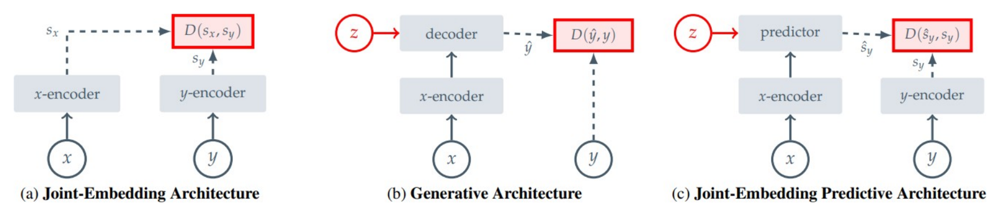
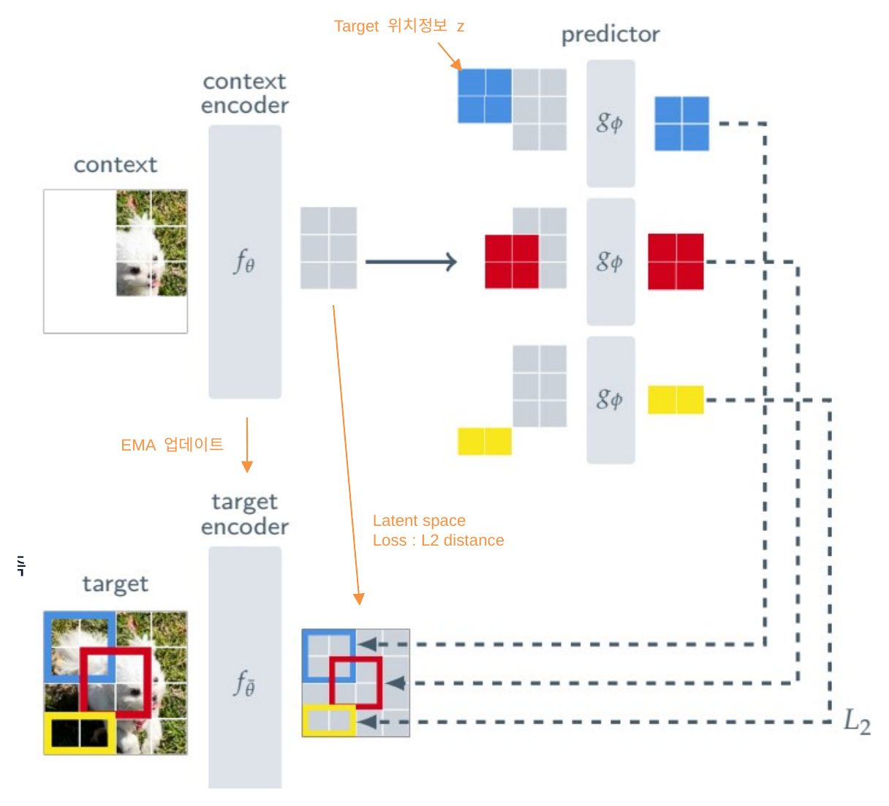
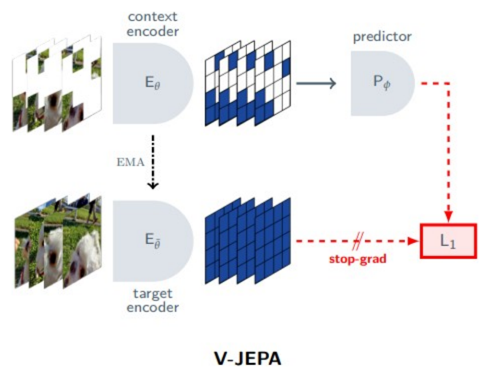
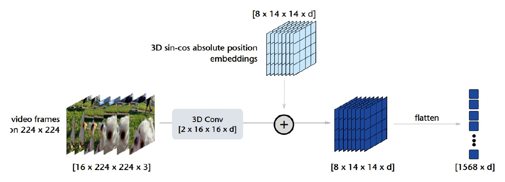
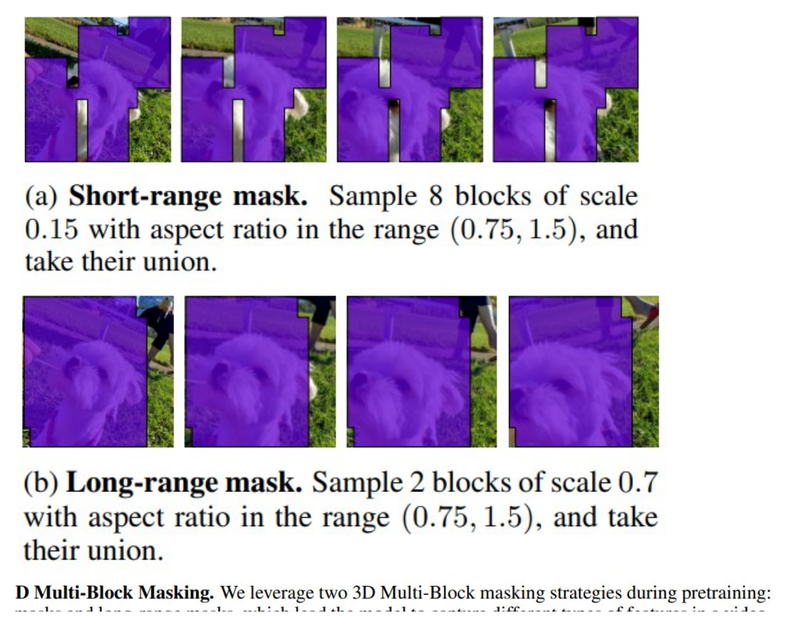

# V-JEPA: Video Joint Embedding Predictive Architecture

!!! info "Information"
    - **Title:** V-JEPA: Video Joint Embedding Predictive Architecture (Revisiting Feature Prediction for Learning Visual Representations from Video)
    - **Venue:** arXiv 2023
    - **Paper:** [arXiv](https://arxiv.org/abs/2404.08471)
    - **Code:** [GitHub](https://github.com/facebookresearch/jepa)
    - **Blog:** [Meta AI](https://ai.meta.com/blog/v-jepa-yann-lecun-ai-model-video-joint-embedding-predictive-architecture/)
    - **Presenter:** 유지형
    - **Last updated:** 2026-08-02

## Introduction

V-JEPA(Video Joint-Embedding Predictive Architecture)는 라벨 없이 비디오만으로 시공간 표현을 학습하는 self-supervised 모델이다. 핵심 아이디어는 **가려진 영역의 픽셀을 복원하지 않고, representation space(표현 공간)에서 가려진 영역의 표현을 예측**하는 것이다. Meta의 FAIR가 발표했으며, I-JEPA(이미지)를 비디오로 확장한 후속 연구다.

기존 self-supervised learning(SSL)은 크게 두 갈래로 나눌 수 있다.

- **Invariance-based method** (SimCLR, SimSiam, BYOL): 같은 이미지에서 나온 여러 augmentation view의 표현이 비슷해지도록 학습한다. 분류에는 강력하지만 augmentation에 대한 강한 사전 지식에 의존하고, 다른 modality나 task로 확장하기 어렵다.
- **Generative method** (MAE, BEiT): 입력의 일부를 가린 뒤 원본 픽셀을 복원하도록 학습한다. 사전 지식이 덜 필요하고 modality에 유연하지만, 조명·텍스처·노이즈 같은 **의미와 무관한 저수준 디테일까지 복원**하느라 모델 용량을 낭비한다.

V-JEPA가 속한 JEPA 계열은 이 둘의 중간 지점에서 출발한다. 세상을 이해하는 데 필요한 것은 모든 픽셀이 아니라 **의미(semantics)** 라는 관점에서, 중요한 정보만 담은 표현 공간에서 예측을 수행한다.

## 배경: JEPA와 I-JEPA

### Energy-Based 관점에서 본 세 가지 구조

SSL은 입력 쌍 $(x, y)$가 의미적으로 유사할 때 낮은 energy를, 유사하지 않을 때 높은 energy를 할당하도록 학습하는 energy-based model로 통합해 설명할 수 있다. 이 관점에서 표현 학습 구조는 세 가지로 구분된다.

<figure markdown="span">
  
  <figcaption>I-JEPA, Figure 2</figcaption>
</figure>

- **(a) Joint-Embedding Architecture (JEA):** 유사한 입력 $x, y$에는 비슷한 embedding을, 유사하지 않은 입력에는 서로 다른 embedding을 출력하도록 학습한다. 이미지에서는 동일 이미지에 hand-crafted augmentation을 적용해 유사한 쌍을 만든다(= invariance-based method).
- **(b) Generative Architecture:** decoder 네트워크가 $x$로부터 $y$를 픽셀·토큰 공간에서 직접 재구성한다. 추가 조건 변수 $z$(예: position embedding)가 어떤 부분을 복원할지 지시한다.
- **(c) Joint-Embedding Predictive Architecture (JEPA):** 직접 재구성하는 대신, 관측된 context $x$의 표현을 바탕으로 target $y$의 표현을 **predictor network로 예측**한다. loss는 입력 공간이 아니라 **representation space에서 계산**되므로, 픽셀·토큰 수준의 세부 복원보다 더 추상적이고 의미적인 정보를 학습하도록 유도한다.

JEPA도 JEA처럼 표현이 상수로 뭉개지는 representation collapse 문제가 있어, 비대칭적인 encoder 구조 등으로 이를 방지한다. 결과적으로 JEPA는 불변성 기반 방법과 생성 기반 방법의 중간 지점에서 의미 중심의 표현 학습을 목표로 한다.

### I-JEPA

I-JEPA는 이미지에 JEPA를 적용한 모델로, V-JEPA의 직접적인 출발점이다. 세 가지 모듈로 구성된다.

<figure markdown="span">
  { width="620" }
  <figcaption>I-JEPA, Figure 3</figcaption>
</figure>

- **Context Encoder $f_\theta$:** context 이미지를 입력받아 patch 단위 표현을 만든다.
- **Target Encoder $f_{\bar\theta}$:** 전체 이미지를 입력받아 target 표현을 만든다. 예측 대상은 원본 픽셀이 아니라 이 표현이다.
- **Predictor $g_\phi$:** context 표현과 예측할 위치 정보(mask token)를 입력받아 target 영역의 표현을 예측한다. loss는 예측 표현과 target 표현 사이의 표현 공간 거리다.

Encoder가 모든 입력에 상수를 출력하면 loss가 0이 되는 trivial solution이 존재한다. I-JEPA는 이를 막기 위해 **Target Encoder를 stop-gradient로 고정하고, Context Encoder의 EMA(Exponential Moving Average)로 갱신**한다. EMA는 새로 학습된 가중치로 바로 덮어쓰는 대신 이전 가중치와 서서히 섞는 방식으로, target을 천천히 움직이는 안정적인 목표로 만들어 준다.

I-JEPA는 augmentation, negative sample, pixel reconstruction 없이도 **feature prediction만으로 강력한 이미지 표현을 학습**할 수 있음을 보였다. V-JEPA는 이 결과를 비디오로 확장한다.

## Image에서 Video로의 확장

비디오는 이미지보다 훨씬 풍부한 시공간 정보를 담고 있어 표현 학습의 잠재력이 크다. 하지만 두 가지 어려움이 있다.

- **시공간 redundancy가 크다.** 한 프레임의 일부를 가려도 인접 패치나 앞뒤 프레임으로 쉽게 추측할 수 있어, 마스킹·예측 과제가 너무 쉬워지고 학습 신호가 약해진다.
- **모션 이해가 필요하다.** 물체가 어떻게 움직이는지는 정적 이미지만으로는 절대 학습할 수 없다.

V-JEPA는 이 문제를 **3D tube masking**으로 푼다. 공간 블록을 시간 축 전체로 늘려 가리면 앞뒤 프레임을 참고해 손쉽게 채우는 지름길이 막히고, 그 위에서 feature prediction을 비디오로 확장한다. 그 덕분에 인터넷 스케일 이미지로 학습한 대형 모델조차 힘겨워하는 **모션 이해(SSv2)**에서 이미지 기반 모델을 큰 차이로 앞선다.

## Method

### 전체 구조

V-JEPA는 I-JEPA와 동일하게 Context Encoder $E_\theta$, EMA로 갱신되는 Target Encoder $\overline{E}_\theta$, Predictor $P_\phi$의 세 모듈로 구성된다. I-JEPA 구조를 비디오에 맞춰 정리하면 각 모듈의 역할은 다음과 같다.

<figure markdown="span">
  { width="640" }
  <figcaption>V-JEPA, Figure 3</figcaption>
</figure>

- **Context Encoder $E_\theta$:** 마스킹 후 남은(가시) 비디오 토큰을 입력받아 patch 단위 표현을 만든다. 표준 ViT를 사용한다.
- **Target Encoder $\overline{E}_\theta$:** 마스킹하지 않은 전체 비디오를 입력받아 target 표현을 만든다. 예측 대상은 원본 픽셀이 아니라 이 표현이며, 역시 표준 ViT다. Context Encoder의 EMA로 갱신된다.
- **Predictor $P_\phi$:** Context 표현과, 예측할 위치를 알려 주는 mask token(위치 정보 포함)을 입력받아 가려진 영역의 target 표현을 예측한다. encoder보다 훨씬 작은 narrow ViT를 사용한다.

학습 안정성을 높이고 representation collapse를 방지하기 위해, Target Encoder는 **stop-gradient로 고정하고 Context Encoder의 EMA(Exponential Moving Average)로 갱신**한다. EMA는 새로 학습한 가중치로 바로 덮어쓰는 대신 이전 가중치와 서서히 섞는 방식으로, target을 천천히 움직이는 안정적인 목표로 만들어 준다.

I-JEPA와 비교했을 때 핵심 변화는 세 가지다.

- **입력:** 정적 이미지 → 비디오 클립(16 frames × 224 × 224)
- **토큰:** 2D patch → 3D tubelet (2 frames × 16 × 16)
- **마스킹:** 2D multi-block → 3D tube multi-block (short-range + long-range)

여기에 loss를 L2에서 L1으로 바꾼다.

### 3D Tubelet 토큰화

ViT는 1D 토큰 시퀀스를 입력으로 받으므로 비디오를 토큰화해야 한다. V-JEPA는 3D convolution 기반 토크나이저를 사용한다.

<figure markdown="span">
  { width="720" }
  <figcaption>V-JEPA, Figure 7</figcaption>
</figure>

- **입력:** $16 \times 224 \times 224 \times 3$ (16 프레임, 224×224 해상도, RGB)
- **3D Conv 필터:** $2 \times 16 \times 16$, temporal stride 2, spatial stride 16
- **결과:** $8 \times 14 \times 14 = 1568$개 토큰, 각 토큰에 3D sin-cos positional embedding을 더한다.

즉 하나의 토큰(**tubelet**)은 2개 프레임에 걸친 16×16 픽셀 블록으로, 이미지의 2D patch를 시간 축으로 확장한 형태다. 처음부터 시공간 정보가 결합된 표현 단위를 형성한다.

### 3D Multi-block Tube Masking

비디오의 시공간 redundancy 때문에 마스킹 설계가 학습 신호의 질을 좌우한다. 한 프레임 일부만 가리면 인접 패치로 추측할 수 있고(공간 누설), 한 프레임만 가리면 앞뒤 프레임으로 보간할 수 있다(시간 누설). 예측 과제가 너무 쉬워지면 의미 있는 표현을 학습하지 못한다.

해결책은 **tube 형태 + multi-block 마스킹**이다. 공간 블록을 시간 축 전체로 확장한 "비디오를 관통하는 튜브"를 두 종류로 사용한다.

<figure markdown="span">
  { width="470" }
  <figcaption>V-JEPA, Figure 2</figcaption>
</figure>

- **Short-range mask:** scale 0.15의 작은 블록 8개의 합집합 → 세밀한 지역적 예측 능력
- **Long-range mask:** scale 0.7의 큰 블록 2개의 합집합 → 전역적·맥락적 예측 능력

두 마스크 모두 시간 축 전체로 확장하므로 평균 마스킹 비율이 약 90%에 이른다. short-range와 long-range는 서로 다른 종류의 특징을 포착하도록 유도하는 상호 보완적(complementary) 과제를 형성한다.

### 학습 목표와 표현 붕괴 방지

가장 단순한 학습 목표는 예측된 표현과 target 표현의 거리를 줄이는 것이다.

$$
\min_{\theta,\phi}\; \big\lVert P_\phi\big(E_\theta(x),\,\Delta_y\big) - E_\theta(y) \big\rVert_1
$$

여기서 $x$는 마스킹된(관측된) 비디오, $y$는 예측 대상 영역, $\Delta_y$는 예측할 위치를 알려 주는 mask token의 위치 정보, $E_\theta$는 Context Encoder, $P_\phi$는 Predictor다. 그러나 이 목표에는 **representation collapse**라는 함정이 있다. $E_\theta$가 모든 입력에 대해 같은 상수를 출력하면 loss가 0이 되어, 표현이 아무 정보도 담지 않게 된다.

V-JEPA는 두 가지 장치로 이를 막는다. target 쪽 encoder를 별도의 **Target Encoder $\overline{E}_\theta$** 로 두고, 여기에 **stop-gradient $\operatorname{sg}(\cdot)$** 를 적용해 gradient 흐름을 차단한다. 그리고 $\overline{E}_\theta$를 Context Encoder $E_\theta$의 **EMA**로 갱신한다(momentum 0.998 → 1.0). 최종 목표는 다음과 같다.

$$
\min_{\theta,\phi}\; \big\lVert P_\phi\big(E_\theta(x),\,\Delta_y\big) - \operatorname{sg}\big(\overline{E}_\theta(y)\big) \big\rVert_1
$$

target을 천천히 움직이는 고정점처럼 취급함으로써, encoder가 상수 해로 무너지지 않고 유의미한 표현을 학습하도록 만든다.

**L2 대신 L1 사용 이유.** L1 loss의 optimal predictor는 조건부 중앙값(conditional median)이다.

$$
P^\star\big(E_\theta(x)\big) = \arg\min_{P} \big\lVert P\big(E_\theta(x)\big) - Y \big\rVert_1 = \operatorname{median}\big(Y \mid E_\theta(x)\big)
$$

여기서 $Y$는 target 표현이다. L1을 최소화하는 것은 곧 MAD(Median Absolute Deviation)를 줄이는 방향이며, 이는 encoder가 비디오 정보를 최대한 담도록 유도한다. 저자들은 실험적으로도 L1이 L2보다 안정적이었다고 보고한다.

### 네트워크 구성

- **Encoders:** Context Encoder와 Target Encoder 모두 표준 ViT를 사용한다. ViT-L/16(200M), ViT-H/16(630M), ViT-H/16₃₈₄(630M, 해상도 384)의 세 모델을 학습한다.
- **Predictor:** narrow ViT로, transformer block 12개에 embedding dim 384다. Context Encoder(ViT-H의 dim=1280)보다 훨씬 작다. predictor가 너무 크면 encoder가 좋은 표현을 만들지 않으므로, **표현 학습의 부담을 encoder가 지도록 predictor를 의도적으로 작게 유지**한다.
- **Mask token:** 모든 mask token은 하나의 공유 learnable vector에 3D sin-cos positional embedding을 더해, 위치만으로 서로 구분된다.

## Pretraining

**Pretraining Data: VideoMix2M.** 약 200만 개 비디오를 결합한 사전학습 데이터셋이다.

- **HowTo100M (HT):** 약 100만 개 instructional 비디오 — 다양한 시각적 맥락
- **Kinetics-400/600/700 (K710):** 행동 인식 비디오(중복 제거) — 외형(appearance)
- **Something-Something-v2 (SSv2):** 물체 상호작용 중심 모션 비디오 — 모션(motion)

외형(K710)·모션(SSv2)·맥락(HT)을 보완적으로 결합한 구성이다.

**학습 설정.** 입력은 16 frames에 frame skip 4(약 3초), 해상도 224(ViT-L/H) 또는 384(ViT-H₃₈₄)다. batch size는 3072(ViT-L/H) 또는 2400(ViT-H₃₈₄), 총 90K iteration을 AdamW + cosine LR로 학습한다.

**두 가지 평가 프로토콜.** 표현 자체의 품질과 task 특화 성능을 나눠서 본다.

- **Frozen Evaluation:** encoder 가중치를 고정하고 가벼운 probe만 학습한다. 표현 자체의 품질을 본다.
- **End-to-end Fine-tuning:** encoder까지 모두 업데이트한다. task 특화 성능의 상한선을 본다.

**평가 task.** 비디오는 Kinetics-400(외형 기반), SSv2(모션 기반), AVA(spatio-temporal action detection)를, 이미지는 ImageNet-1K, Places205, iNaturalist 2021을 사용한다. 이미지 task에서는 한 프레임을 16번 복제해 정적 비디오 클립으로 만들어 입력한다.

## Experiments

### Feature vs Pixel Prediction

가장 중요한 질문은 "feature space 예측이 정말 pixel space 예측보다 좋은가?"이다. 동일한 ViT-L/16, 동일한 VideoMix2M, 동일한 90K iteration, multi-block masking에서 **loss만 바꿔** 비교한다. 픽셀 예측은 MAE, feature 예측은 V-JEPA에 해당한다.

| Target | Arch. | K400 (frozen) | SSv2 (frozen) | IN1K (frozen) | K400-ft |
|---|---|:--:|:--:|:--:|:--:|
| Pixels | ViT-L/16 | 68.6 | 66.0 | 73.3 | 85.4 |
| **Features** | ViT-L/16 | **73.7** | **66.2** | **74.8** | **85.6** |

*Table 1. Pixels vs. Featurized Targets — frozen backbone + attentive probe, K400-ft는 fine-tuning. (source: V-JEPA, Table 1)*

Frozen 평가에서 모든 비디오·이미지 task에 대해 feature 예측이 우세하며, K400 기준 68.6 → 73.7로 **+5.1점** 향상된다. Fine-tuning에서는 격차가 좁혀지는데, 표현 자체의 품질 차이는 frozen에서 가장 잘 드러나기 때문이다. pixel 복원은 의미와 무관한 저수준 정보까지 학습하느라 용량을 낭비하는 반면, feature 예측은 encoder가 표현에 담을 정보를 스스로 선택하므로 의미 있는 정보만 남긴다.

### Pretraining Data Distribution

데이터의 양과 다양성이 표현 품질에 어떤 영향을 주는지, compute budget을 고정(90K iter, batch 3072)한 채 데이터 구성만 바꿔 비교한다.

| Arch. | Data | #Samples | K400 | SSv2 | IN1K | Avg. |
|---|---|:--:|:--:|:--:|:--:|:--:|
| ViT-L/16 | K710 | 700K | 75.8 | 63.2 | 73.7 | 70.9 |
| ViT-L/16 | K710+SSv2 | 900K | 72.9 | 67.4 | 72.8 | 71.0 |
| ViT-L/16 | K710+HT | 1900K | 74.5 | 64.2 | 74.8 | 71.1 |
| ViT-L/16 | VideoMix2M | 2000K | 73.7 | 66.2 | 74.8 | 71.5 |
| ViT-H/16 | K710+SSv2 | 900K | 75.7 | 66.8 | 73.7 | 72.0 |
| ViT-H/16 | VideoMix2M | 2000K | 74.0 | 68.5 | 75.9 | 72.8 |

*Table 2. Pretraining Data Distribution — frozen backbone + attentive probe, Avg.는 task 평균. (source: V-JEPA, Table 2)*

V-JEPA도 SSL의 일반적 경향처럼 데이터 스케일링 효과를 보인다(평균 성능이 데이터가 커질수록 상승). 다만 특정 task에 특화하려면 관련 데이터가 필요하다 — 예컨대 모션 중심 SSv2 성능은 SSv2를 포함할 때 크게 오른다. 다양성과 특화 사이의 trade-off가 존재한다.

### Attentive Probing

V-JEPA encoder 출력은 1568개 토큰 시퀀스라서, 분류를 위해 하나의 벡터로 풀링(pooling)해야 한다. 풀링 방식이 성능을 좌우한다.

| Method | Arch. | K400 (Avg) | K400 (Att) | SSv2 (Avg) | SSv2 (Att) |
|---|---|:--:|:--:|:--:|:--:|
| V-JEPA | ViT-L/16 | 56.7 | **73.7** | 50.1 | **66.2** |

*Table 3. Average Pooling vs. Attentive Pooling — frozen evaluation. (source: V-JEPA, Table 3)*

Attentive pooling(learnable query + cross-attention으로 중요한 토큰에 가중치 부여)이 average pooling 대비 K400 **+17.3점**, SSv2 **+16.1점** 향상된다. JEPA loss는 unnormalized라서 encoder 출력이 선형 분리 가능하다는 보장이 없기 때문이다. 즉 표현 자체의 품질 문제가 아니라 표현을 어떻게 활용하느냐의 문제이며, attentive probing은 DINOv2·OpenCLIP 등 다른 모델에서도 성능을 높인다(V-JEPA에만 한정되지 않는다).

### Masking 전략

무엇을(target) 어떻게 가리고 무엇으로(context) 예측할지가 학습에 미치는 영향을 본다.

| Masking | K400 | SSv2 | IN1K |
|---|:--:|:--:|:--:|
| random-tube[0.9] | 51.5 | 46.4 | 55.6 |
| causal multi-block[6] | 61.3 | 49.8 | 66.9 |
| causal multi-block[12] | 71.9 | 63.6 | 72.2 |
| **multi-block (제안)** | **72.9** | **67.4** | **72.8** |

*Table 4. Ablating Prediction Task — ViT-L/16, frozen evaluation. (source: V-JEPA, Table 4)*

- **random-tube[0.9]:** 무작위 tube 90% 마스킹 → 인접 정보로 쉽게 복원 가능(정보 누설)
- **causal multi-block[p]:** 앞쪽 $p$ 프레임만 context로 사용 → 시간 범위 제한
- **multi-block(제안):** 전체 시간 축 + 크고 연속적인 블록 마스킹(short + long range)

제안한 multi-block 방식이 모든 방식보다 우수하다. 큰 연속 블록을 시간 축 전체로 확장해야 정보 누설을 차단할 수 있다. **"무엇을 가릴지"가 학습 신호의 질을 결정한다**는 것이 feature prediction의 핵심 설계 포인트다.

## Discussion

V-JEPA는 self-supervised feature prediction만을 **단일 목표(stand-alone objective)** 로 사용해 비디오 표현을 학습한다. 사전학습된 encoder, 텍스트, negative sample, pixel reconstruction 같은 부가 신호가 전혀 필요 없다.

- **범용 표현:** 모델 파라미터 수정 없이(frozen) 다양한 이미지·비디오 다운스트림 task를 해결하며, action recognition, spatio-temporal action detection, image classification에서 기존 video representation 방법들을 능가한다.
- **모션 이해의 우위:** 인터넷 스케일 이미지로 학습한 대형 모델조차 모션 task에서는 한계를 보이는 반면, V-JEPA는 세밀한 모션 이해가 필요한 task에서 특히 강하다.
- **Label efficiency:** 적은 라벨로도 다운스트림 성능을 잘 유지해, 라벨이 부족한 실제 응용 환경에서도 강력한 사전학습 기반을 제공한다.

## 참고문헌

- [V-JEPA: Revisiting Feature Prediction for Learning Visual Representations from Video (arXiv)](https://arxiv.org/abs/2404.08471)
- [I-JEPA: Self-Supervised Learning from Images with a Joint-Embedding Predictive Architecture (arXiv)](https://arxiv.org/abs/2301.08243)
- [V-JEPA code (GitHub)](https://github.com/facebookresearch/jepa)
- [V-JEPA: The next step toward advanced machine intelligence (Meta AI Blog)](https://ai.meta.com/blog/v-jepa-yann-lecun-ai-model-video-joint-embedding-predictive-architecture/)
