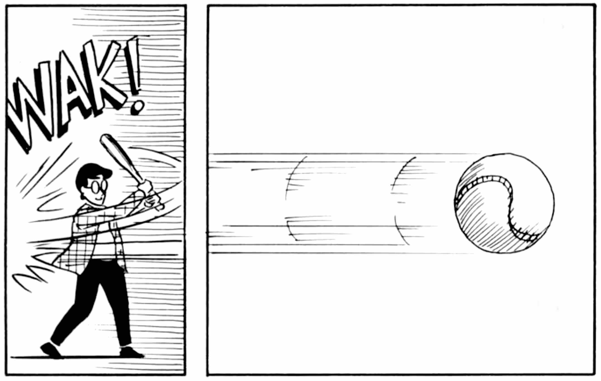
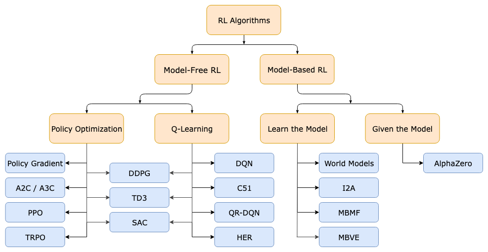
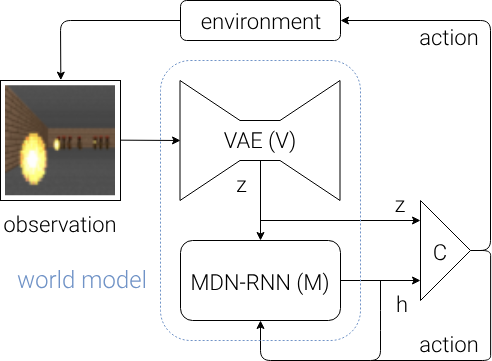
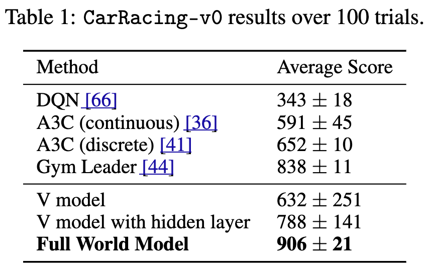
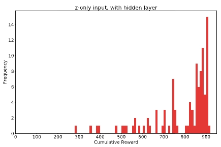
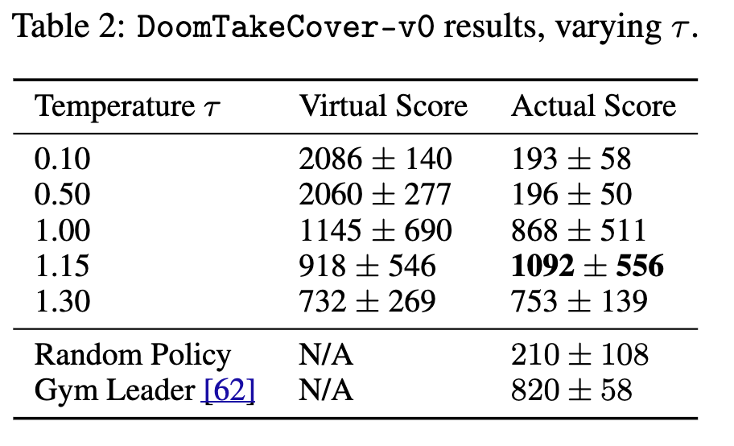

# World Models

!!! info "Information"
    - **Title:** World Models
    - **Venue:** NeurIPS 2018
    - **Paper:** [arXiv](https://arxiv.org/abs/1803.10122) | [NeurIPS](https://papers.nips.cc/paper_files/paper/2018/hash/2de5d16682c3c35007e4e92982f1a2ba-Abstract.html)
    - **Code:** [Github](https://github.com/hardmaru/WorldModelsExperiments)
    - **Homepage:** [Homepage](https://worldmodels.github.io/)
    - **Presenter:** Boa Jang
    - **Last updated:** 2026-03-25

--- 
## Summary
인간의 인지 시스템에서 영감을 받아, RL 에이전트에게 **환경의 압축된 시공간 표현(World Model)**을 학습시키는 프레임워크를 제안한다.

에이전트는 **V(Vision)** + **M(Memory)** + **C(Controller)** 3개 모듈로 구성되며, V와 M이 비지도 학습으로 환경이 어떻게 작동하는지 먼저 배운 후, C는 진화 전략(CMA-ES)으로 최적화된다.

핵심적으로, 에이전트를 자신의 world model 내부(꿈속)에서만 훈련시킨 후 실제 환경으로 정책을 이전(transfer)할 수 있음을 실증하였다.

CarRacing-v0를 최초로 해결(906점)하고, VizDoom에서 꿈속 훈련만으로 1092점을 달성했다.

## 0. Background: 강화 학습 기초
### 강화학습이란?

강화학습(Reinforcement Learning, RL)은 **시행착오를 통해 스스로 배우는 학습 방법**이다.

지도학습처럼 정답을 알려주는 사람이 없다. 그냥 해보고, 결과가 좋으면 그 행동을 더 하고, 나쁘면 덜 하도록 스스로 조정한다. 마치 아이가 자전거 타는 법을 넘어지면서 배우는 것과 같다.

### 두 등장인물

강화학습에는 딱 두 가지만 있다.

```python
  에이전트 (Agent)   ←→      환경 (Environment)
  "결정하는 주체"          "에이전트가 살고 있는 세계"
```

**에이전트(Agent)**: 관찰하고, 행동을 선택하고, 보상을 받는 주체. AI가 여기에 해당한다.

**환경(Environment)**: 에이전트의 행동에 반응하는 세계 전체. 게임 엔진, 로봇 시뮬레이터, 심지어 현실 세계도 환경이 될 수 있다.

### 핵심 루프

강화학습은 이 사이클의 무한 반복이다.

```python
① 환경이 현재 상태(관찰)를 에이전트에게 준다
        ↓
② 에이전트가 관찰을 보고 행동을 선택한다
        ↓
③ 환경이 행동에 반응해 상태를 바꾸고
   에이전트에게 보상을 돌려준다
        ↓
④ ①로 돌아간다
        ↓
   (에피소드가 끝날 때까지 반복)
        ↓
   누적 보상을 합산 → 이게 그 에피소드의 점수
```

게임으로 비유하면 다음과 같다.

| RL 용어 | 게임 비유 |
| --- | --- |
| 에이전트 | 플레이어 |
| 환경 | 게임 엔진 전체 |
| 관찰 (Observation) | 현재 게임 화면 |
| 행동 (Action) | 버튼 입력 |
| 보상 (Reward) | 점수 변화 |
| 에피소드 (Episode) | 게임 한 판 |

### 보상(Reward)과 점수(Score)

에이전트의 목표는 단 하나다.

> **에피소드(Episode) 동안 받는 보상의 합(누적 보상)을 최대화하는 것**
> 

보상은 환경마다 다르게 설계된다.

| 환경 | 보상 기준 | 최대값 |
| --- | --- | --- |
| CarRacing-v0 | 트랙 타일 밟을 때마다 +1, 매 타임스텝 -0.1 | 약 1000점 |
| DoomTakeCover-v0 | 살아있는 매 타임스텝마다 +1 | 2100점 |
| Atari Breakout | 벽돌 깰 때마다 +점수 | 게임마다 다름 |

그래서 뒤에 결과표에 나오는 숫자는 **100번의 에피소드 동안 받은 누적 보상의 평균값**이다. 환경마다 단위가 다르기 때문에 같은 환경 안에서만 방법끼리 비교가 의미있다.

### 정책(Policy)

에이전트가 "어떤 상황에서 어떤 행동을 할지"를 결정하는 규칙을 **정책(Policy)** 이라고 한다.

강화학습의 목표를 다시 표현하면 이렇다.

> **최대한 높은 보상을 얻을 수 있는 정책을 찾는 것**
> 

처음엔 랜덤하게 행동하다가, 경험이 쌓일수록 좋은 행동을 더 자주 선택하도록 정책이 개선된다.

### OpenAI Gym

이 논문에서 사용한 환경들은 모두 **OpenAI Gym**이라는 프레임워크에서 제공한다.

Gym은 **2016년 OpenAI가 공개한 강화학습 환경 모음집**이다. 카트폴(막대 세우기)처럼 단순한 것부터 Atari 게임, CarRacing, VizDoom까지 다양한 환경이 들어있다.

```python
## 예시 코드 > 최신 기준으로 작동하는 코드 
import gymnasium as gym

env = gym.make("CarRacing-v3", render_mode="human")
obs, info = env.reset()

for _ in range(10):
    action = env.action_space.sample()
    obs, reward, terminated, truncated, info = env.step(action)
    
    if terminated or truncated: 
        obs, info = env.reset()
env.close()
```

가장 큰 장점은 **모든 환경이 동일한 인터페이스로 작동한다**는 것이다. 덕분에 연구자들이 같은 환경에서 서로 다른 알고리즘을 공정하게 비교할 수 있다. World Models 논문이 DQN, A3C와 결과를 비교할 수 있는 것도 모두 같은 Gym 환경을 사용했기 때문이다.

## 1. Motivation

### **인간은 어떻게 빠르게 판단할까?**

야구 타자를 생각해보자. 투수가 던진 공이 타자에게 도달하는 시간은 약 0.4초, 그런데 시각 정보가 눈에서 뇌까지 전달되는 데만 0.1초가 걸린다. 계산상 타자는 공을 보고 판단하고 배트를 휘두를 시간이 없다.

그런데도 우리는 공을 친다. 어떻게?



> 뇌가 공의 궤적을 **미리 예측**하고, 그 예측에 맞춰 **반사적으로** 몸을 움직이기 때문이다.
> 

우리 뇌에는 세상이 어떻게 돌아가는지에 대한 **내부 모델(mental model)** 이 있다. 이 모델 덕분에 우리는 매 순간 의식적으로 생각하지 않아도 빠르게 행동할 수 있다.

> *"The image of the world around us, which we carry in our head, is just a model."*
— Jay Wright Forrester (1971)
> 

**그렇다면 AI도 이런 내부 모델을 가질 수 있을까?**

### [강화 학습 (RL)](https://dalpo0814.tistory.com/52)의 두 가지 접근법



- **대표 알고리즘**
    1. Q-learning: 각 상태-행동 쌍의 가치를 테이블로 저장
    2. DQN (Deep Q-Network): 딥러닝을 활용한 Q-learning 확장 버전
        - [DQN](https://arxiv.org/abs/1312.5602): CNN으로 게임 화면(픽셀)을 직접 보고, Q-learning으로 행동을 학습하는 첫 번째 딥러닝 RL 모델
    3. PPO, A3C, DDPG 등: 고급 알고리즘으로 성능 향상 가능

강화학습에는 크게 두 가지 방식이 있다.

#### **Model-Free RL (모델 없는 강화학습)**

**환경이 어떻게 작동하는지 이해하려 하지 않는다.** 그냥 수많은 시행착오를 통해 "이 상황에서 이 행동을 하면 좋은 결과가 나온다"는 패턴을 직접 외운다.

Model-Free RL은 On-policy 방법인 Policy Optimizatioin, 그리고 Off-policy 방법인 Q-learning 두 가지로 구분

```
Learning은 Environment의 Model은 모르지만 interaction을 통해 문제를 푸는 것을 말한다.
```

- 장점: 구현이 간단하고, 환경 모델을 따로 만들 필요가 없다
- 단점: 엄청난 양의 시행착오가 필요하다. 현재 딥러닝 기반 model-free RL은 대개 수천만 번의 상호작용을 요구한다
- 대표 알고리즘: DQN, A3C 등

#### **Model-Based RL (모델 기반 강화학습)**

**환경이 어떻게 돌아가는지 먼저 배운다.** "내가 이 행동을 하면 다음 상태는 어떻게 될까?"를 예측할 수 있는 모델을 만들고, 그 모델을 활용해 더 효율적으로 학습한다.

```
Planning은 Environment의 Model을 어느정도 알거나 주어진 상태에서 문제를 푸는 것을 말한다. 즉 어떤 action에 있어 좋은 reward를 받게 끔 policy를 improve한다.
```

- 장점: 훨씬 적은 실제 경험으로도 좋은 정책을 만들 수 있다
- 단점: 세계 모델이 틀리면 오히려 방해가 된다. 그래서 기존 model-based 연구 대부분은 세계 모델을 참고용으로만 쓰고, 실제 훈련은 여전히 실제 환경에서 한다

### Model-Free의 핵심 병목: Credit Assignment Problem

Model-free RL이 많은 시행착오를 필요로 하는 데에는 구조적인 이유가 있다.

게임에서 최종 점수는 수백 번의 행동이 모여 결정된다. 그런데 결과(보상)는 맨 마지막에야 주어진다. 그렇다면 그 결과에 기여한 건 어떤 행동이었을까?

> **어떤 행동이 좋은 결과를 만들었는지 알아내는 문제** — 이것을 Credit Assignment Problem이라고 한다.
> 

이 문제 때문에 파라미터 수가 많은 대형 신경망을 model-free 방식으로 훈련하기가 매우 어렵다. 그래서 실제로는 파라미터 수를 적게 유지한 소형 네트워크만 쓰게 되고, 그만큼 표현력도 제한된다.

실제로 이런 비용이 따른다.

- **로봇**: 수백만 번 넘어지고 일어나야 한다
- **게임**: 하나를 배우는 데 인간 시간으로 수천 시간 분량의 플레이가 필요하다
- **현실 세계**: 자율주행, 의료 등에서는 실수가 허용되지 않는다

---

### 이 논문의 해법

> **큰 세계 모델(V+M)은 보상 없이 비지도로 먼저 학습하고, 작은 컨트롤러(C)만 보상을 보며 최적화한다.**
> 

세계 모델은 "이 게임이 어떻게 돌아가는지"를 이미지만 보고 스스로 익힌다. 보상이 얼마인지는 관심 없다. 복잡한 credit assignment 문제를 수백만 파라미터짜리 네트워크에서 풀 필요가 없어진다.

컨트롤러(C)는 파라미터가 겨우 867개(CarRacing 기준)에 불과하다. 파라미터가 적으니 credit assignment 문제도 훨씬 쉽게 풀 수 있고, 진화 전략(CMA-ES)처럼 더 단순한 최적화 방법도 쓸 수 있다.

### 핵심 질문

> **AI가 실제 환경 대신 자신이 상상한 세계 안에서 연습할 수 있다면?**
> 

마치 운동선수가 잠들기 전 머릿속으로 경기를 시뮬레이션하듯, AI도 스스로 만든 "꿈" 속에서 훈련하고 그 실력을 현실로 가져올 수 있다면 훨씬 효율적일 것이다.

이것이 이 논문의 출발점이다.

## 2. **Agent Model — V · M · C**

### Proposed Method 한 줄 요약

> 에이전트가 스스로 만든 가상 환경(꿈) 안에서 학습하고, 그 정책을 실제 환경으로 가져온다.
> 

### Overview


Agent Model: V, M, C components

이 논문의 에이전트는 인간의 인지 시스템에서 영감을 받아 세 파트로 나뉜다.

| 컴포넌트 | 이름 | 역할 | 인간 비유 |
| --- | --- | --- | --- |
| **V** | Vision | 이미지 → 잠재 벡터 $z$ | 눈과 감각 |
| **M** | Memory | 과거+현재 → 미래 $z$ 예측 | 기억과 상상 |
| **C** | Controller | $z$, $h$ → 행동 ($a$) 결정 | 반사적 판단 |


### V — Variational Autoencoder (VAE) → 눈의 역할


VAE Architecture 


**목적**: 고해상도 이미지를 작은 숫자 묶음(잠재 벡터 $z$)으로 압축한다.

사람으로 치면 눈으로 본 장면을 뇌가 "도로 + 커브 + 속도감" 같은 핵심 정보로 요약하는 과정이다.

- 입력: 64×64 픽셀 RGB 이미지
- 출력: 32차원(CarRacing) 또는 64차원(Doom) 숫자 벡터 $z$
- 학습 방식: 압축했다가 다시 복원해보면서 스스로 학습 (비지도)
- Epoch: 1
- 보상 신호 없이 작동한다

> VAE는 랜덤 플레이로 수집한 수백만 장의 64×64 이미지를 1 epoch 동안 학습하며, 재구성 손실 ($L^2$ distance)과 KL divergence를 동시에 최소화해서 이미지를 z로 압축하는 방법을 익힌다.

### M — MDN-RNN (Mixture Density Network + RNN) → 기억과 예측의 역할


MDN-RNN Architecture

**목적**: "지금까지 이런 상황이었고, 이런 행동을 했으니 다음엔 이렇게 될 것이다"를 예측한다.

모델링 대상: $P(z_{t+1} | a_t, z_t, h_t)$

F1 드라이버가 코너를 보기 전에 이미 핸들을 꺾는 것처럼, 현재 상태에서 미래를 내다보는 역할이다.

- 입력: 현재 행동 $a$, 현재 $z$, 이전 은닉 상태 $h$
- 출력: 다음 $z$의 확률 분포 $P(z_{t+1} | a_t, z_t, h_t)$
- 핵심: 하나의 정답을 예측하는 게 아니라 **확률 분포**를 출력한다

**온도 파라미터** $\tau$ — 예측의 불확실성을 조절하는 손잡이

- 가상환경 난이도 조절 → 꿈의 선명도
- $\tau$ 낮음: 거의 결정론적, 예측이 정확하지만 가상 환경에서 치팅이 발생할 수 있다
- $\tau$ 높음: 더 불확실하고 어려운 환경이 만들어지지만, 실제 환경에서 더 잘 작동한다

#### Implementation

- Trained for 20 epochs on the data
- LSTM hidden units: Car racing task 256; Doom task 512
- 5 Gaussian mixture
    - MDN은 다음 z의 확률 분포를 **5개의 가우시안을 섞어서** 표현

#### Mixture Density Network combined with a RNN (MDN-RNN)

**RNN — 기억을 가진 신경망**

일반적인 신경망은 입력을 받아 출력을 내고 끝이다. 이전에 무엇을 봤는지 기억하지 못한다. 반면 RNN은 **은닉 상태(hidden state)** $h$ 라는 일종의 메모리를 갖는다. 매 시점마다 새 입력을 받으면서 이 메모리를 업데이트하고, 다음 시점에 그 메모리를 다시 참고한다.

**MDN — 하나의 답 대신 확률 분포를 출력하는 신경망**

일반 신경망은 입력에 대해 하나의 정답을 출력한다. 그런데 현실의 많은 상황은 **결과가 하나로 정해지지 않는다.** 어떤 행동을 취하든 그 결과에는 본질적인 불확실성이 있다.

이런 상황에서 하나의 값만 예측하면 틀릴 수밖에 없다. MDN은 이 문제를 다르게 접근한다.

> **하나의 정답 대신, 가능한 결과들의 확률 분포를 출력한다.**
> 

구체적으로는 여러 개의 가우시안(정규분포)을 섞어서 복잡한 분포를 표현한다. 이것을 **Mixture of Gaussians** 라고 한다.

**MDN + RNN = MDN-RNN**

이 두 가지를 합치면 **"시간의 흐름을 기억하면서, 미래를 확률 분포로 예측하는"** 모델이 된다.

<!--  -->

### C — Linear Controller → 판단의 역할

$$
a_t = W_c[z_t \ h_t] + b_c
$$

**목적**: V와 M이 만든 표현을 보고 행동을 결정한다. 그냥 입력을 선형으로 변환해서 행동을 출력하는 가장 단순한 모델이다. 가장 단순한 형태인 fully connected layer 하나

**왜 이렇게 단순하게 만들었나?**

- 복잡한 판단 능력은 이미 V와 M이 담당한다
- C가 단순할수록 학습이 빠르고, 진화 전략(CMA-ES)으로 최적화하기 좋다

#### Implementation

- C의 출력은 tanh 함수로 -1 ~ 1 사이로 제한한 뒤 각 행동의 범위에 맞게 변환

#### CovarianceMatrix Adaptation Evolution Strategy (CMA-ES)

**진화 전략**

일반적인 딥러닝은 경사하강법(gradient descent)으로 학습한다. 손실 함수를 미분해서 "어느 방향으로 파라미터를 바꾸면 더 좋아지는가"를 계산하고 조금씩 수정한다.

**경사하강법의 한계**

- 미분 가능한 손실 함수가 있어야 한다
- 중간 과정의 정보가 필요하다 (어느 행동이 좋았는가?)
- Credit Assignment Problem이 심할수록 학습이 불안정해진다

강화학습에서 컨트롤러를 학습할 때는 "100번의 행동 끝에 누적 보상이 얼마였다"는 결과만 주어진다. 어느 행동이 좋았는지 중간 정보가 없다. 이런 상황에서는 경사하강법보다 진화 전략이 훨씬 자연스럽다.

**CMA-ES의 작동 원리**

**"어떤 방향으로 파라미터를 바꿨을 때 성능이 좋아졌는가"를 기억하고, 그 방향으로 탐색을 집중한다.**

### Training Procedure



Flow diagram of Agent model. 

```python
def rollout(controller):
  ''' env, rnn, vae are '''
  ''' global variables  '''
  obs = env.reset() # 환경 초기화 → 첫 번째 게임 화면(이미지) 받음
  h = rnn.initial_state() # M의 메모리(은닉 상태 h)를 0으로 초기화
  done = False
  cumulative_reward = 0
  
  while not done:
    z = vae.encode(obs) # V: 이미지 → 잠재 벡터 z로 압축
    a = controller.action([z, h]) # C: z와 h를 보고 행동 a 결정
    obs, reward, done = env.step(a) # 환경: 행동 실행 → 다음 화면 + 보상 반환
    cumulative_reward += reward # 보상 누적
    h = rnn.forward([a, z, h]) # M: 방금의 행동·상태로 메모리 h 업데이트
  return cumulative_reward # 한 판의 총 점수 반환
```
## 3. Car Racing Experiment ([Github](https://github.com/AGiannoutsos/car_racer_gym))

https://worldmodels.github.io/assets/mp4/carracing_mistake_short.mp4

### 실험 설정 [CarRacing-v0]

- 환경: 매 시도마다 다르게 생성되는 트랙에서 탑뷰 레이싱
- 행동: 좌/우 조향, 가속, 브레이크 (연속 3가지)
- 해결 기준: 100회 연속 평균 **900점 이상**
- 당시 기준으로 이 기준을 달성한 방법이 없었음 — 이 논문이 처음

### Procedure

To summarize the Car Racing experiment, below are the steps taken:

1. Collect 10,000 rollouts from a random policy.
    1. rollouts: 에이전트가 환경에서 게임 한 판을 처음부터 끝까지 플레이 하는 것 
2. Train VAE (V) to encode each frame into a latent vector $z\in R^{32}$.
3. Train MDN-RNN (M) to model $P(z_{t+1} | a_t, z_t, h_t)$ → 
    1. $z_t$ 32차원
    2. $h_t$ 256차원 
4. Evolve Controller (C) to maximize the expected cumulative reward of a rollout.

| Model | Parameter Count |
| --- | --- |
| VAE | 4,348,547 |
| MDN-RNN | 422,368 |
| Controller | 867 |

### Experiment Results

| **Method** | **Average Score** |
| --- | --- |
| DQN[[ref](https://gist.github.com/lmclupr/b35c89b2f8f81b443166e88b787b03ab)] | 343 ± 18 |
| A3C (continuous)[[ref](https://www.notion.so/World-Models-32d56f2fd633802caf0ce77557958c32?pvs=21)] | 591 ± 45 |
| A3C (discrete) | 652 ± 10 |
| Gym Leader (hand-engineered) | 838 ± 11 |
| V only | 632 ± 251 |
| V + hidden layer | 788 ± 141 |
| **Full World Model (V+M+C)** | **906 ± 21** |



- **CarRacing-v0의 보상 계산 방식**
    
    매 타임스텝마다 보상이 쌓인다.
    
    - 트랙 타일을 밟을 때마다 **+1점** (전체 트랙을 다 밟으면 총 약 1000점)
    - 매 타임스텝마다 **0.1점** 패널티 (시간을 낭비하면 손해)
    - 트랙을 벗어나면 추가 패널티

#### 왜 M이 중요한가?

**V만 있을 때**: 현재 순간의 스냅샷만 봄 → 코너에서 미리 준비 불가 → 흔들리는 주행

**V + M**: $h_t$에는 미래 확률 분포 정보가 내재 → F1 드라이버처럼 코너를 미리 예측 → 반사적 대응

> M은 단순 예측기가 아니라 **암묵적 미래 표현**을 제공한다
> 

#### [*Evolving Stable Strategies](https://blog.otoro.net/2017/11/12/evolving-stable-strategies/): (World Models 저자가 직접 쓴 블로그 포스트)*

**주제**: CMA-ES 같은 진화 전략을 RL 문제에 적용할 때 어떻게 하면 **안정적이고 강건한(stable & robust) 정책**을 찾을 수 있는가.

**핵심 아이디어**: 랜덤 환경에서 에이전트를 평가할 때 운이 좋아서 좋은 점수를 받은 건지, 진짜 실력이 좋아서 좋은 점수를 받은 건지 구분해야 한다.

예를 들어 CarRacing처럼 트랙이 매번 랜덤으로 생성되는 환경에서는 이런 문제가 생긴다.

```python
후보 A: 쉬운 트랙을 만나서 950점 → 운이 좋았을 수도 있음
후보 B: 어려운 트랙을 만나서 850점 → 실제로는 더 잘하는 에이전트일 수도 있음
```

**해결책**: 한 에이전트를 **16가지 서로 다른 랜덤 시드**로 16번 실행하고, 그 **평균 보상을 fitness**로 사용한다.

```python
후보 하나의 fitness
  = 랜덤 시드 1로 rollout → 보상
  + 랜덤 시드 2로 rollout → 보상
  + ...
  + 랜덤 시드 16으로 rollout → 보상
  ÷ 16
  = 평균 누적 보상`
```

**그래프 해석**

후보 (population) 64개; 각 후보를 16번씩만 돌린 결과 (population size of 64, and had each agent perform the task 16 times with different initial random seeds.)

파란선: 64개 후보 전체의 **평균** 점수

주황선: 64개 후보 중 **최하위** 점수

초록선: 64개 후보 중 **최상위** 점수

빨간선: 최우수 에이전트를 **1024번** 테스트한 점수


CarRacing training curves & histogram

#### 그래프 해석 2

- we plot the results of same agent evaluated over 100 rollouts
- $h_t$는 MDN-RNN이 지금까지의 모든 흐름을 압축한 은닉 상태 (256차원)
- hidden layer는 C 내부의 구조를 복잡하게 설계했다는 것 → add a hidden layer with 40 tanh activations

|  | Figure 26 | Figure 27 | Figure 25 |
| --- | --- | --- | --- |
| 입력 | z만 | z만 | z + h |
| C 구조 | 선형 레이어 1층 | 선형 + Hidden layer | 선형 1층  |
| C 파라미터 | 867개 | 1443개 | 867개 |
| 평균 점수 | 632 ± 251 | 788 ± 141 | **906 ± 21** |
| 분포 형태 | 넓게 퍼짐 | 중간 | 오른쪽에 집중 |


V only: 632점



V + Hidden Layer: 788점


Full Model: 906점

## **4. VizDoom Experiment**

https://worldmodels.github.io/assets/mp4/doom_lazy_small.mp4

### 실험 설정 [DoomTakeCover-v0]

- 환경: 방 안에서 몬스터의 파이어볼 피하기
- 보상: 생존 시간 (최대 2100 스텝)
- 해결 기준: 100회 연속 평균 **750 스텝 이상**
- **핵심 차이**: 에이전트를 실제 환경이 아닌 **가상 환경(DoomRNN)에서만** 학습

### Procedure

To summarize the *Take Cover* experiment, below are the steps taken:

1. Collect 10,000 rollouts from a random policy.
2. Train VAE (V) to encode each frame into a latent vector $z \in R^{64}$, and use V to convert the images collected from (1) into the latent space representation.
3. Train MDN-RNN (M) to model $P(z_t+1,d_t+1∣a_t,z_t,h_t)$
4. Evolve Controller (C) to maximize the expected survival time inside the virtual environment.
5. Use learned policy from (4) on actual Gym environment.

| Model | Parameter Count |
| --- | --- |
| VAE | 4,446,915 |
| MDN-RNN | 1,678,785 |
| Controller | 1,088 |

### Experiment Results

에이전트를 **world model 내부(꿈속)에서만 학습** 후 실제 환경으로 전이.



#### $\tau$ 역할

- $\tau$ 낮음 (≈ 0.1)
    
    → 항상 가장 확률 높은 값만 뽑음
    
    → 가상 환경이 예측 가능하고 단순해짐
    
    → C가 허점을 쉽게 발견 → 치팅
    
- $\tau$ 높음 (≈ 1.15)
    
    → 다양한 값을 뽑음
    
    → 가상 환경이 불확실하고 어려워짐
    
    → C가 허점을 찾기 어려움 → 진짜 실력을 키워야 함
    
- **DoomTakeCover-v0의 보상 계산 방식**
    
    매 타임스텝마다 보상이 쌓인다.
    
    - 살아있는 매 타임스텝마다 **+1점**
    - 파이어볼에 맞으면 즉시 **에피소드 종료** (추가 패널티 없음)
    - 최대 **2100 스텝**까지 생존 가능 (약 60초)
    - 해결 기준: 100회 연속 평균 **750 스텝 이상**

#### Cheating the World Model

https://worldmodels.github.io/assets/mp4/doom_adversarial.mp4

**무슨 일이 일어났나? (**$\tau$ **= 0.1)**

M이 거의 결정론적으로 작동하면서 몬스터가 파이어볼을 아예 안 쏘는 상태로 고착된다. C는 이 허점을 발견해 가상에서 2100점 만점을 달성하지만, 실제 환경에서는 랜덤 정책(210점)보다도 낮은 193점을 기록한다.

**왜 이런 일이?**

C는 M의 모든 내부 은닉 상태에 접근 가능하다. 게임 엔진 내부를 해킹하는 것과 같다.

**해결책**: $\tau$를 높여 가상 환경을 일부러 더 어렵고 불확실하게 만든다. 노이즈가 많은 환경에서 살아남은 정책이 실제 환경에서도 잘 작동한다.

#### DoomRNN

- 가상환경에 붙인 이름, hallucinated Doom environment
- DoomRNN에서만 훈련한 에이전트를 실제 VisDoom 에서 100번 테스트한 결과


VizDoom actual results histogram

**Key Findings:**

- $\tau$ 낮으면 가상에서만 잘 함 → 실제 실패 (치팅)
- $\tau$ = 1.15에서 기존 최고(820점)를 크게 웃도는 1092점 달성
- V가 몬스터 수를 정확히 재현 못해도 정책 이전은 성공


## 5. Discussion

### Strengths

- **샘플 효율성**: 실제 환경 상호작용을 최소화(랜덤 10,000회)하고 이후 훈련은 전부 가상에서 진행
- **최초 해결**: CarRacing-v0를 당시 기준으로 처음 해결 (906점), 기존 SOTA(838점) 대비 압도적
- **모듈식 설계**: V, M, C를 분리해 학습 → 각각 독립적으로 교체·재사용 가능
- **확장성**: 세계 모델이 완성되면 에이전트를 무제한으로 가상 훈련 가능 → 계산 비용 절감
- **불확실성 모델링**: MDN으로 확률 분포를 출력해 결정론적 모델보다 강건하고 치팅 방지 가능
- **심리·뇌과학적 연결**: V/M/C 구조가 인간 인지 시스템(감각-기억-판단)과 대응 → 해석 가능성 높음

### Weaknesses

- **비지도 V의 한계**: VAE가 태스크와 무관한 특징도 학습 → 보상과 연관된 중요한 정보를 놓칠 수 있음
- **단순 환경에만 검증**: 랜덤 정책 데이터로 세계 모델을 충분히 학습할 수 있는 단순한 환경에서만 작동
- **치팅 문제**: C가 M의 내부 상태 전체에 접근 가능 → 가상에서만 통하는 적대적 정책 학습 위험
- **모델 용량 한계**: LSTM 기반 M은 복잡한 환경을 장기적으로 기억하기 어렵고 catastrophic forgetting 발생
- **일회성 데이터 수집**: 랜덤 정책으로 한 번만 수집 → 에이전트가 탐험하면서 개선하는 반복 학습 없음
- **τ 튜닝 필요**: 온도 파라미터를 환경마다 수동으로 조정해야 함 → 자동화 방법 없음

### Future Impact

**반복적 학습 (Iterative Training)**

```python
1. M, C 랜덤 초기화
2. 실제 환경 N번 롤아웃 → 데이터 수집
3. M 재학습 + C를 M 안에서 최적화
4. 완료 전까지 2로 돌아감
```

**인공 호기심 (Artificial Curiosity)**

M이 잘 예측하지 못하는 상황 = 아직 모르는 영역. 이를 보상으로 활용하면 에이전트가 스스로 낯선 곳을 탐험하도록 유도할 수 있다.

**더 큰 모델로의 확장**

이 논문 이후 Dreamer, DreamerV2, DreamerV3 등의 후속 연구로 이어졌고, 모델 크기와 성능이 크게 향상됐다.

---

## 6. 마무리

### 핵심 요약

| 구성 | 역할 | 인간 비유 |
| --- | --- | --- |
| V (VAE) | 이미지 → 핵심 표현 z | 눈과 감각 |
| M (MDN-RNN) | 현재 + 과거 → 미래 예측 | 기억과 상상 |
| C (Linear) | z + h → 행동 | 반사적 판단 |
| τ (온도) | 가상 환경 난이도 조절 | 꿈의 선명도 |

### **이 논문의 의의**

- 실제 환경과의 상호작용을 최소화하면서 효율적인 학습 가능
- 세계 모델 기반 RL 연구의 중요한 이정표
- Dreamer 시리즈 등 이후 연구의 직접적 기반

## 7. Reference

- 인터랙티브 논문: [https://worldmodels.github.io](https://worldmodels.github.io/)
- arXiv: https://arxiv.org/abs/1803.10122
- NeurIPS 2018: https://papers.nips.cc/paper/7512
- 발표 영상: https://youtu.be/HzA8LRqhujk
- 공식 코드: https://github.com/hardmaru/WorldModels

<!-- ## Key Contributions

## Method

## Results

## Discussion -->
