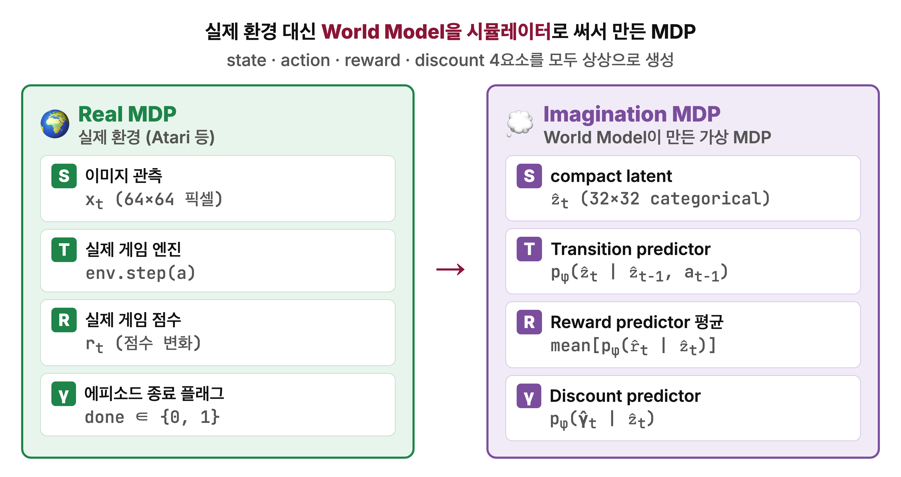
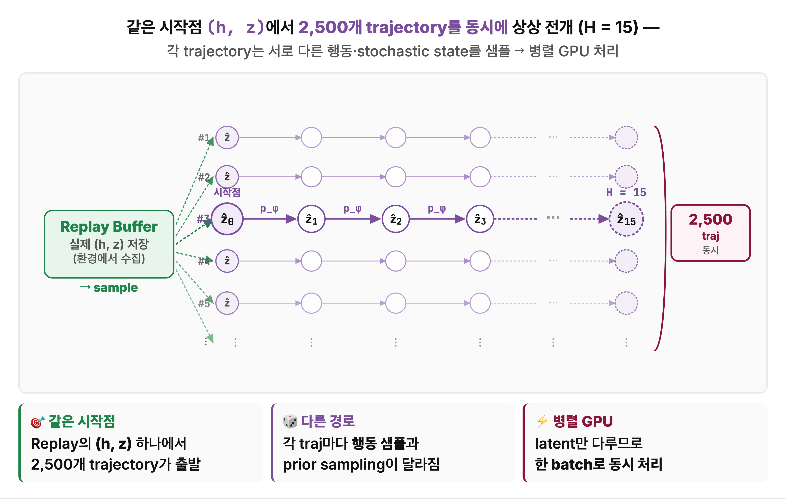
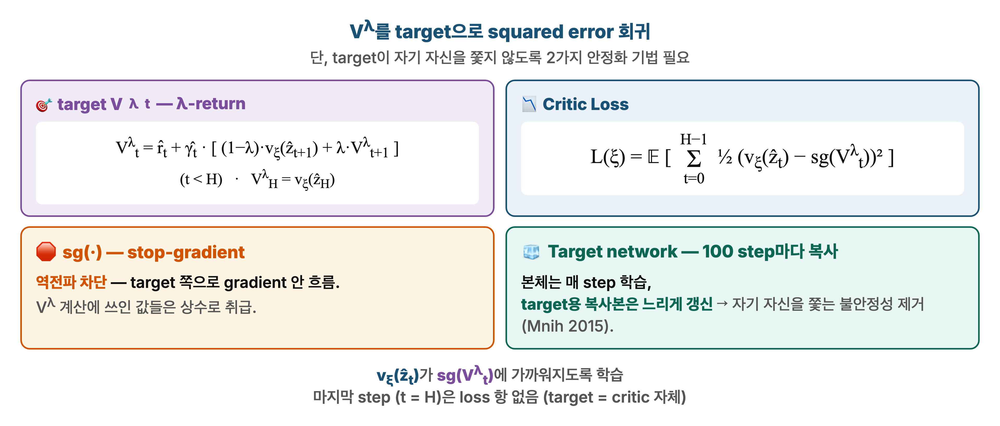

<!--
  build_pptx.py 입력 파일 예시.
  문법은 Marp 스타일을 따르지만 Marp CLI는 사용하지 않음 — python-pptx가 직접 파싱.
  수식($$...$$)은 matplotlib가 PNG로 렌더해서 삽입함.
-->

# 논문 제목 — 한 줄 부제

**발표자**: 이름 · **논문**: Authors (Venue, Year) · **링크**: [arXiv](https://arxiv.org/abs/XXXX.XXXXX)

---

# 한눈에 보기
<!-- _class: small -->

- **배경**
  - 기존 접근의 한계 …
- **이 논문의 핵심 아이디어**
  - 무엇을 새롭게 제안했는가 …
- **결과**
  - 주요 지표 / 벤치마크 …

---

# 목차

**1. 배경** — 왜 이 문제가 어려운가
**2. 핵심 아이디어** — 제안 방법의 요체
**3. 자세한 구조** — 모델 · 학습 방식
**4. 실험 결과** — 벤치마크 · ablation
**5. 결론** — 의의 및 한계

---

# 1. 배경 — 문제 설정
<!-- _class: small -->

---

# 2. 핵심 아이디어 (타임라인)
<!-- _class: small -->

---

# 3. 구조 — 손실함수와 안정화
<!-- _class: small -->

핵심 수식:

$$ \mathcal{L}(\xi) = \mathbb{E}\left[\sum_{t=0}^{H-1} \tfrac{1}{2} (v_\xi(\hat{z}_t) - \mathrm{sg}(V_t^\lambda))^2\right] $$

- `sg(·)` — stop-gradient로 target 고정
- Target network — 느린 복사본으로 수렴 안정화

---

# 4. 실험 결과
<!-- _class: small -->

| 모델 | 지표 A | 지표 B | 지표 C |
|:---|:---:|:---:|:---:|
| **Ours** | **2.15** | **11.33** | **0.28** |
| Baseline 1 | 1.29 | 8.85 | 0.21 |
| Baseline 2 | 1.47 | 9.12 | 0.17 |

- 모든 지표에서 기존 대비 우위
- 특히 지표 C에서 큰 격차

---

# 5. 결론

- **기여**
  - 첫 번째 기여 …
  - 두 번째 기여 …
- **한계**
  - 아직 해결되지 않은 점 …
- **후속 연구 방향**
  - …

---

# 참고 자료

- 논문: [arXiv](https://arxiv.org/abs/XXXX.XXXXX)
- 코드: [GitHub](https://github.com/example/repo)
- 관련 블로그 / 요약 글 …

질문 환영합니다 🙌
